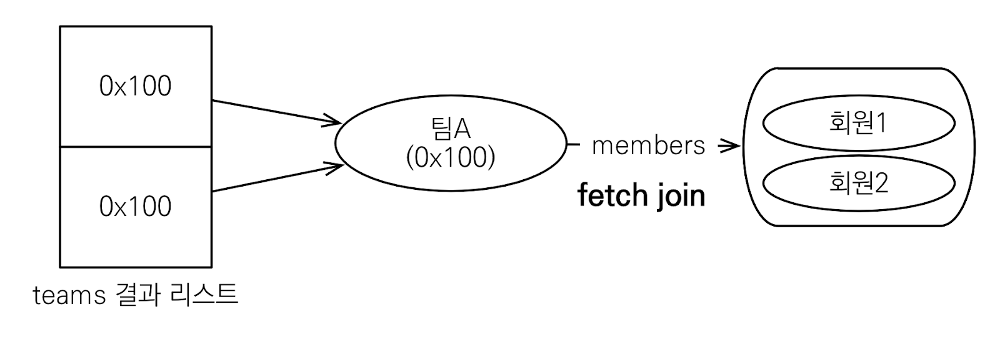

### 1) 경로 표현식

경로 표현식은 .(점)을 찍어 객체 그래프를 탐색하는 것이다.  
이를 통해 JPQL 내에서도 자바 코드에서 처럼 객체 그래프를 탐색하는 것이 가능하다.

```sql
select m.username  -- 상태 필드
    from Member m
        join m.team t  -- 단일 값 연관 필드
        join m.orders o  -- 컬렉션 값 연관 필드
where t.name = '팀A'
```

먼저 상태 필드(state field)는 단순히 엔티티의 필드를 탐색하기 위해 사용한다. (ex - m.username)  
이 때 상태 필드의 경우 경로 탐색의 종료 지점이기 때문에, 더이상 탐색이 불가능하다. (m.username.??? 불가능)

```sql
-- JPQL
select m.username, m.age from Member m
-- SQL
select m.username, m.age from Member m
```

연관 필드(association field)는 연관 엔티티 탐색을 위한 필드이다.  
단일 값 연관 필드는 @ManyToOne, @OneToOne 으로 맺어진 연결에 대한 연관 필드이며, 대상이 엔티티이다.(ex - m.team)  
단일 값 연관 경로를 사용할 경우 묵시적으로 내부 조인(inner join)이 발생하며, 추가 탐색이 가능하다. (m.team.name : 가능)

```java
String query = "select m.team from Member m";
List<Team> result = em.createQuery(query, Team.class).getResultList();
```

```sql
select
    -- Team의 필드가 나열됨
    team1_.TEAM_ID as TEAM_ID1_9_,
    team1_.name as name6_9_
    …
from
    Member member0_
inner join   -- 묵시적 내부 조인
    Team team1_
        on member0_.TEAM_ID=team1_.TEAM_ID
```

단일값 연관 필드는 다음과 같이 추가로 연관 객체 필드를 탐색하는 것이 가능하다.  
`select o.member.team from Order o`  
다만 위 경우에 조인이 2번 일어나는데, 무분별하게 사용할 경우 위와 같이 조인이 일어나는 포인트를 예측하기가 어렵다는 문제가 있다.

컬렉션 값 연관 필드는 @OneToMany, @ManyToMany으로 맺어진 연결에 대한 연관 필드이며, 탐색 대상이 컬렉션이다.(ex: m.orders)  
컬렉션 값 연관 필드를 사용하면 마찬가지로 묵시적 내부 조인이 발생하며, 추가 탐색은 불가능하다. (t.members.??? 불가능)

```java
String query = "select t.members from Team t";
Collection result = em.createQuery(query, Collection.class).getResultList();
```

```sql
select
    members1_.MEMBER_ID as MEMBER_I1_4_,
    …
from
    Team team0_
inner join  -- 묵시적 내부 조인
    Member members1_
        on team0_.TEAM_ID=members1_.TEAM_ID
```

묵시적 조인을 사용할 경우에는 항상 내부 조인으로 수행된다.  
경로 탐색은 주로 SELECT, WHERE 절에서 사용되는 반면, 묵시적 조인으로 인해 SQL의 FROM (JOIN) 절에 영향을 주게 된다.

실무에서는 가급적 묵시적 조인 대신에 명시적 조인을 사용하는게 적절하다.  
예상치 못한 JOIN이 발생해서 성능에 영향을 줄 수도 있고, 쿼리 관리 측면에서도 명시적 조인을 사용하는게 좋다.  
조인은 SQL 튜닝에 중요 포인트이기 때문에, 조인이 일어나는 상황을 한눈에 파악하기 위해서는 명시적으로 조인을 사용해야 한다.

명시적 조인은 다음과 같이 직접 join 키워드를 사용해서 구성한다.  
FROM 절에서 명시적으로 조인하여 별칭을 지정하면, 별칭을 통해서 해당 값들을 추가 탐색하는게 가능하다.

```java
// t.members m 으로 별칭을 등록해서 m.username으로 접근 가능
String query = "select m.username from Team t join t.members m";
Integer result = em.createQuery(query, Integer.class).getSingleResult();
```

```sql
select
    members1_.USERNAME as col_0_0_
from
    Team team0_
inner join  -- 명시적 조인
    Member members1_
        on team0_.TEAM_ID=members1_.TEAM_ID
```

### 2) 페치 조인1 - 기본

페치 조인(fetch join)은 SQL 조인 종류에 포함되지 않는, JPQL에서 성능 최적화를 위해 제공하는 기능이다.  
연관된 엔티티나 컬렉션을 SQL 한 번에 함께 조회할 수 있도록 지원한다.

`[ LEFT [OUTER] | INNER ] JOIN FETCH 조인경로`

예를 들어 회원을 조회하면서 연관된 팀도 SQL 한 번에 함께 조회한다고 가정해보자.  
다음과 같이 작성하면 회원 뿐만 아니라 팀(T.\*)도 함께 SELECT 한다.

```sql
-- JPQL
select m from Member m join fetch m.team

-- SQL
SELECT M.*, T.* FROM MEMBER M INNER JOIN TEAM T ON M.TEAM_ID=T.ID
```

예를 들어 다음과 같은 테이블 간 연관관계가 존재한다고 하자.


최종적으로 조인된 테이블의 원하는 형태는 다음과 같다.


객체 관점에서는 다음과 같이 5개의 객체를 조회해야 한다.


먼저 페치 조인을 사용하지 않고 JPQL을 작성해보자.

```java
String query = "select m from Member m";
List<Member> result = em.createQuery(query, Member.class).getResultList();
for (Member member : result) {
    System.out.println("member = " + member.getUsername() + ", " + member.getTeam().getName());
}
```

```sql
-- MEMBER SELECT (전체 조회)
select
    member0_.MEMBER_ID as MEMBER_I1_4_,
    …
from
    Member member0_

-- TEAM SELECT (Team1) - 지연로딩
select
    team0_.TEAM_ID as TEAM_ID1_9_0_,
    …
from
    Team team0_
where
    team0_.TEAM_ID=?
member = 회원1, 팀A
member = 회원2, 팀A

-- TEAM SELECT (Team2) - 지연로딩
    select
        team0_.TEAM_ID as TEAM_ID1_9_0_,
        …
    from
        Team team0_
    where
        team0_.TEAM_ID=?
member = 회원3, 팀B
```

위 예시에서는 지연 로딩이 발생하여, 연관된 Team 테이블을 각각 조회해오는 N+1 문제가 발생했다.  
member1을 조회하는 시점에 팀A를 조회하고, member3을 조회할 때 팀B를 조회하고 있다.  
데이터를 조회하기 위해 너무 많은 쿼리를 날리고 있다.

fetch join을 사용하면 다음과 같이 한 번에 연관된 객체를 함께 조회할 수 있다.

```java
String query = "select m from Member m join fetch m.team";
List<Member> result = em.createQuery(query, Member.class).getResultList();
for (Member member : result) {
    System.out.println("member = " + member.getUsername() + ", " + member.getTeam().getName());
}
```

```sql
-- MEMBER, TEAM JOIN SELECT
select
    member0_.MEMBER_ID as MEMBER_I1_4_0_,
    team1_.TEAM_ID as TEAM_ID1_9_1_,
    member0_.age as age2_4_0_,
    …
    team1_.createdBy as createdB2_9_1_,
    team1_.name as name6_9_1_
    …
from
    Member member0_
inner join
    Team team1_
        on member0_.TEAM_ID=team1_.TEAM_ID
member = 회원1, 팀A
member = 회원2, 팀A
member = 회원3, 팀B
```

최초 조회 시점에 연관된 객체를 함께 조회하기 때문에, N+1 문제가 발생하지 않는다.

일대다 관계에서는 컬렉션 페치 조인을 사용할 수 있다.  
예를 들어 다음과 같이 하나의 TEAM 로우에 연관된 두개의 MEMBER 로우가 존재한다고 하자.


이 때 팀 이름이 'teamA'인 팀 목록을 collection fetch join으로 조회하는 코드를 다음과 같이 작성할 수 있다.

```java
String jpql = "select t from Team t join fetch t.members where t.name = 'teamA'"
List<Team> teams = em.createQuery(jpql, Team.class).getResultList();
for(Team team : teams) {
    System.out.println("teamname = " + team.getName() + ", team = " + team);
    for (Member member : team.getMembers()) {
        System.out.println("-> username = " + member.getUsername()+ ", member = " + member);
    }
}
```

이 때 조인된 테이블은 다음과 같다.  
TEAM 테이블 입장에서는 데이터가 하나이지만, 여기에 속한 멤버는 2명이기 때문에 조인 시 2개의 row가 조회된다.


따라서 조회한 결과 컬렉션에는 똑같이 teamA를 가리키는 동일한 데이터 2개 들어있게 된다.  
두 데이터 모두 team.members에는 동일하게 2명의 회원이 연결되어 있다.

```bash
SELECT
    T.*, M.*
FROM TEAM T
INNER JOIN MEMBER M
    ON T.ID=M.TEAM_ID
WHERE T.NAME = '팀A'

teamname = 팀A, team = Team@0x100
→ username = 회원1, member = Member@0x200
→ username = 회원2, member = Member@0x300
teamname = 팀A, team = Team@0x100
→ username = 회원1, member = Member@0x200
→ username = 회원2, member = Member@0x300

```

사실상 불필요하게 중복된 데이터가 포함되었다고 할 수 있다.



이러한 중복을 해결하기 위해 DISTINCT 사용을 고려할 수 있다.
SQL의 DISTINCT는 중복된 결과를 제거하는 명령어이다.  
JPQL 작성시 DISTINCT를 포함해서 작성하면 SQL에 DISTINCT를 추가하는 동시에, 엔티티의 중복도 함께 제거해준다.

예를 들어 아까의 예시에서 다음과 같이 distinct 키워드를 추가해서 JPQL을 작성해보자.

```sql
select distinct t
  from Team t join fetch t.members
  where t.name = ‘팀A’
```

이를 통해 전달되는 SQL에 DISTINCT가 추가되긴 하지만, SQL 결과 자체에서는 중복이 제거되지 않는다.
DB의 distict는 조인된 member 데이터까지 완전히 동일해야 중복을 제거하기 때문에 그대로 2개의 row가 조회된다.


JPQL의 DISTINCT는 받아온 데이터를 바탕으로 애플리케이션에서 추가로 중복 제거를 시도하게 되고, 이 시점에 같은 식별자를 가진 Team 엔티티가 제거된다.


결과 출력에서도 다음과 같이 하나의 팀만 조회된다.

```bash
teamname = 팀A, team = Team@0x100
→  username = 회원1, member = Member@0x200
→  username = 회원2, member = Member@0x300
```

이제 페치 조인과 일반 조인의 차이에 대해서 알아보자.  
일반 조인 실행시에는 연관된 엔티티를 함께 조회하지 않는다.

```sql
-- JPQL
select t
  from Team t join t.members m
  where t.name = '팀A'

-- SQL
SELECT T.*   -- M.*이 추가되지 않음
  FROM TEAM T INNER JOIN MEMBER M ON T.ID=M.TEAM_ID
  WHERE T.NAME = '팀A'
```

일반 조인을 사용하면 결과를 반환할 때 연관관계를 고려하지 않는다.  
단지 지정한 연관관계를 바탕으로 JOIN 해올 뿐이기 때문에, SELECT 절에는 조인된 엔티티가 추가되지 않는다.  
따라서 위 예시에서는 팀 엔티티만 조회하고, 회원 엔티티는 조회되지 않는다.  
추후에 team의 members에 접근하면 지연 로딩을 통한 추가 조회가 발생한다.

이와 달리 페치 조인을 사용하면 연관된 엔티티도 함께 조회된다.  
페치 조인을 사용하면 객체 그래프를 고려하여 SQL 한번에 조회한다.  
즉시 로딩이 되는 개념이기 때문에, 추후에 team.members에 접근해도 조회 쿼리가 발생하지 않는다.

```sql
-- JPQL
select t
  from Team t join fetch t.members
  where t.name = '팀A'
-- SQL
SELECT T.*, M.*  -- M.*이 추가됨
  FROM TEAM T INNER JOIN MEMBER M ON T.ID=M.TEAM_ID
  WHERE T.NAME = '팀A'
```

### 3) 페치조인2 - 한계

위와 같이 페치 조인에는 여러 장점이 있지만, 한계점도 있다.

#### 별칭 부여 불가

먼저 페치 조인 대상에는 별칭을 줄 수 없다.  
(하이버네이트는 이를 지원하긴 하지만, 가급적 사용하지 않는게 좋다.)

페치 조인은 연관된 데이터를 모두 가져오는 것이기 때문에, 데이터의 일부만 가져오면 객체 그래프에 맞지 않는 결과가 나온다.  
예를 들어 다음과 같이 team, member를 페치 조인하는 JPQL을 작성했다고 하자.

```sql
select t
  from Team t join fetch t.members m
  where m.age > 30
```

위와 같이 m.age > 30으로 멤버 데이터 중 일부만 가져오면, team.members를 통해서는 해당 조건에 해당하는 member만 접근 가능해진다.  
이렇게 되면 실행한 쿼리에 따라서 객체 그래프가 달라지는 문제가 생긴다.  
JPA의 영속성 컨텍스트는 기본적으로 연관된 모든 데이터를 들고온다고 가정하고 설게가 되어있기 때문에, 별칭을 사용해서 조건을 추가하는 작업은 해선 안된다.  
필요하다면 해당 조건을 적용한 JPQL을 별도로 작성하는 식으로 해결해야 한다.

#### 둘 이상의 컬렉션은 페치 조인 불가

또한 둘 이상의 컬렉션은 페치 조인 할 수 없다.  
만약 1:N:N의 관계에 대해서 fetch join하게 되면, 쿼리가 어마어마하게 뻥튀기 될 수 있기 때문에 라이브러리 차원에서 막고 있다.

#### 페이징 API 사용 불가

일대일, 다대일 같은 단일 값 연관 필드들은 페치 조인해도 페이징 API(setFirstResult, setMaxResults)를 사용 가능하다.  
하지만 컬렉션을 페치 조인하면 페이징 API를 사용할 수 없다.
하이버네이트는 경고 로그를 남기고 메모리에서 페이징하는 식으로 동작은 하는데, 이는 잘못 사용하면 매우 위험하다.

```java
String query = "select t from Team t join fetch t.members m";
List<Team> result = em.createQuery(query, Team.class)
    .setFirstResult(0)
    .setMaxResults(1)
    .getResultList();
```

```bash
firstResult/maxResults specified with collection fetch; applying in memory!

Hibernate:
    select
        team0_.id as team_id1_8_1_,
        member1_.id as id1_6_0_,
        ...
    from
        team team0_
    left outer join
        member member1_
            on team0_.id=member_0.team_id
```

위에서 출력된 쿼리를 보면 limit 조건이 쿼리에 걸리지 않은 것을 확인할 수 있다.  
연관된 데이터 전체를 조인해서 가져온 것인데, 패치조인을 하면 기본으로 데이터가 뻥튀기되기 때문에 예상치 못하게 큰 쿼리가 발생할 수 있다.  
또한 JPA의 영속성 관리 측면에서도 왜곡된 상태의 데이터를 조회하는 것이기 때문에 정상 동작하지 못할 가능성이 크다.

이 경우에는 일대다 관계를 다대일 관계로 뒤집어서 페치 조인문을 작성하는 방식으로 해결할 수 있다.

```java
String query = "select m from Member m join fetch m.team m t";
List<Member> result = em.createQuery(query, Member.class)
    .setFirstResult(0)
    .setMaxResults(1)
    .getResultList();
```

다만 원하는 동작 방식이 원하는 특정 몇 개의 team을 members와 조인해서 들고 오는 것이라면 위 방식은 맞지 않는다.

만약 페치 조인을 사용하는 이유가 성능 최적화라면, 페치 조인을 사용하지 않고 지연로딩 자체를 최적화해서 사용할 수도 있다.  
@BatchSize를 엔티티의 컬럼에 지정하면, 지연로딩 시 지정한 사이즈만큼 IN 쿼리를 사용해서 조회할 수 있다.  
위 예시에서는 Team 컬렉션의 members에 다음과 같이 @BatchSize를 지정해야 한다.

```java
@Entity
public class Team {
    ...
    @BatchSize(size = 100)
    @OneToMany(mappedBy = "team")
    private List<Member> members = new ArrayList<>();
}
```

그리고 쿼리에서 다음과 같이 fetch join 구문을 삭제하고 페이징을 적용시킬 수 있다.

```java
String query = "select t from Team t";
List<Member> result = em.createQuery(query, Team.class)
    .setFirstResult(0)
    .setMaxResults(2)
    .getResultList();

for(Team team : teams) {
    System.out.println("teamname = " + team.getName() + ", team = " + team);
    for (Member member : team.getMembers()) {
        System.out.println("-> username = " + member.getUsername()+ ", member = " + member);
    }
}
```

이렇게 실행시키면 다음과 같이 Team 조회시 정상적으로 limit가 적용되고, members에 대해서는 IN 쿼리를 사용해서 한 번에 쿼리가 나간 것을 확인할 수 있다.  
이를 통해 앞서 조회한 teams에 포함된 두 팀에 대해서 모두 한 번에 지연로딩이 된 것이다.

```bash
Hibernate:
    select
        team0_.id as team_id1_8_1_,
        member1_.id as id1_6_0_,
        ...
    from
        team team0_ limit ? # limit가 적용됨

Hibernate:
    select
        member0_.id as id1_7_1_,
        ...
    from
        member member0_
    where
        member0_.team_id in (
            ?, ?
        )
```

이와 같은 BatchSize를 global로 적용하기 위해서 persistence.xml에 등록할 수 있다.

```xml
<properties>
    ...
    <property name="hibernate.jdbc.batch_size" value="100"/>
</properties>
```

보통 DB에서 한번에 끌어올 수 있는 쿼리가 1000개 이므로, 이를 넘지 않게 지정해주면 된다.  
실무에서는 위와 같이 global로 설정해서 사용하는 경우가 많다.

페치 조인은 객체 그래프를 그대로 유지할 때 사용하면 효과적으로 쿼리 성능을 개선할 수 있다.  
다만 여러 테이블을 조인해야 하는 상황에서, 연관된 객체 전체를 불러오는 식이 아니라 필터링 등을 해서 사용하는 경우라면 DTO를 이용해서 조회하는 것이 낫다.  
직접 DTO를 적용해서 프로젝션해서 조회해오거나, 조회한 데이터를 조합하여 DTO로 변환해서 반환하는 방식을 사용하면 된다.

### 4) 다형성 쿼리

상속 관계를 매핑한 엔티티를 조회할 때 다형성 쿼리를 사용할 수 있다.  
다음과 같이 Item을 상속받은 Album, Movie, Book 엔티티가 존재한다고 하자.


TYPE 함수를 이용하면 조회 대상을 특정 자식으로 한정해서 조회하는 식으로 쿼리를 작성할 수 있다.  
예를 들어 Item 중에 Book, Movie를 조회하는 쿼리를 다음과 같이 작성할 수 있다.

```sql
-- JPQL
select i from Item i
  where type(i) IN (Book, Movie)

-- SQL (테이블 전략에 따라 쿼리는 달라짐)
select i from i
  where i.DTYPE in ('B', 'M')
```

TREAT를 이용하면 상속 구조에서 부모 타입을 특정 자식 타입으로 다룰 수 있다.  
자바의 타입 캐스팅과 유사한 개념으로 이해할 수 있다.  
FROM, WHERE, SELECT 절에서 사용할 수 있다.

예를 들어 Item 엔티티에서 author(Book의 속성)가 'kim'인 데이터를 조회하고 싶다고 하자.

```sql
-- JPQL
select i from Item i
  where treat(i as Book).auther = 'kim'

-- SQL (테이블 전략에 따라 쿼리는 달라짐)
select i.* from Item i
  where i.DTYPE = 'B' and i.auther = 'kim'
```

### 5) 엔티티 직접 사용

JPQL에서 엔티티를 직접 사용하면, SQL에서 해당 엔티티의 기본 키 값을 사용하게 된다.  
다음의 예시에서는 `count(m)`을 통해 Member 엔티티의 id의 개수를 조회하고 있다.

```sql
-- JPQL
select count(m.id) from Member m  -- 엔티티의 id를 사용
select count(m) from Member m  -- 엔티티를 직접 사용

-- SQL
select count(m.id) as cnt from Member m
```

다음은 엔티티를 파라미터 바인딩 시 전달해서, 기본키를 통해 where 조건을 적용하는 예시이다.  
엔티티를 전달하는 식으로 쿼리를 작성하거나, 또는 식별자를 직접 전달해서 쿼리를 작성해도 동일한 SQL을 얻게 된다.

```java
// 엔티티 사용
String jpql = "select m from Member m where m = :member";
List resultList = em.createQuery(jpql)
        .setParameter("member", member)
        .getResultList();

// 외래키 값으로 직접 비교
String jpql = "select m from Member m where m.id = :memberId";
List resultList = em.createQuery(jpql)
        .setParameter("memberId", memberId)
        .getResultList();
```

두 경우 모두 실행된 SQL은 다음과 같다.

```sql
select m.* from Member m where m.id=?
```

연관관계 엔티티를 JQPL에 전달하면 외래 키 값으로 비교하는데 사용할 수 있다.

```java
// 엔티티 사용
Team team = em.find(Team.class, 1L);
String qlString = "select m from Member m where m.team = :team";
List resultList = em.createQuery(qlString)
        .setParameter("team", team)
        .getResultList();

// 외래키 값으로 직접 비교
String qlString = "select m from Member m where m.team.id = :teamId";
List resultList = em.createQuery(qlString)
        .setParameter("teamId", teamId)
        .getResultList();
```

실행된 SQL은 다음과 같다.

```sql
select m.* from Member m where m.team_id=?
```
