### 강좌 소개

객체와 테이블을 올바르게 설계하고 매핑하는 게 중요하다.  
기본키와 외래키 매핑, 1:N, N:1, N:M 매핑 등 다양한 관계를 매핑하는 방법과, 실무 노하우 + 성능까지 고려하는 방법에 대해서 설명할 것이다.  
 → 복잡한 시스템도 JPA로 설계 가능

JPA의 내부 동작방식을 이해하는 것도 필요하다.  
JPA가 어떤 SQL을 만들어내고, 언제 SQL을 실행하는지 이해해야 한다.

빠른 미래에 JPA가 MyBatis를 대체할 가능성이 높다.  
전세계적으로는 이미 JPA를 많이 사용하고 있는 추세이고, 우리나라도 거의 바뀌고 있다.  
조 단위의 거래금액이 발생하는 다양한 서비스에서 이미 사용되고, 검증된 기술이다.  
자바 개발자에게 이제 JPA는 기본 기술이다.

단순 SQL작성으로 시간을 낭비하지 말자!  
그 대신 더 많이 설계를 고민하고, 테스트를 진행하자.

### SQL 중심적인 개발의 문제점

객체를 영구 보관하는데에는 다양한 저장소를 사용할 수 있다. (RDB, NoSQL, File, …)  
하지만 현실적으로 대부분의 상황에서 사용하는 것은 관계형 데이터베이스이다.

- 개발의 주요 트렌드: 객체 지향 개발  
- 데이터베이스의 헤게모니: 관계형 DB (Oracle, MySQL, …)  

-> 따라서 지금 시대의 추세는, 객체를 관계형 DB에 저장하고 관리하는 것

문제는 DB가 SQL만 이해할 수 있기 때문에, 과거에는 일일이 SQL을 작성해야 했다.  
CRUD 쿼리를 작성하고, 자바 객체를 SQL로 변경하고, 또 SQL을 자바 객체로 변경하고…

또한 기존에 작성했던 코드에 필드를 추가하려고 하면, 관련된 SQL을 모두 변경해야 했다.  
그러다 보니 일부 SQL이 누락되는 상황도 많이 발생했다.

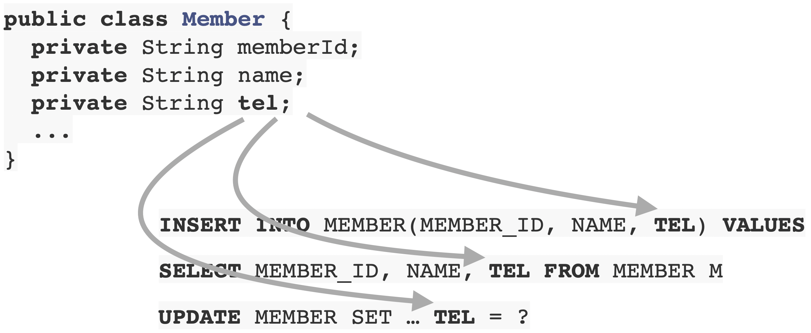

**패러다임의 불일치**라는 문제도 있다.  
관계형 db는 데이터를 정교화해서 보관을 하는게 목표고, 객체는 속성과 기능을 잘 캡슐화해서 사용하는게 목표다.

결국 RDB를 사용하려면 객체를 SQL로 변환해야 하는데, 두 패러다임의 간극을 해결하는 건 개발자의 몫이 되었다.

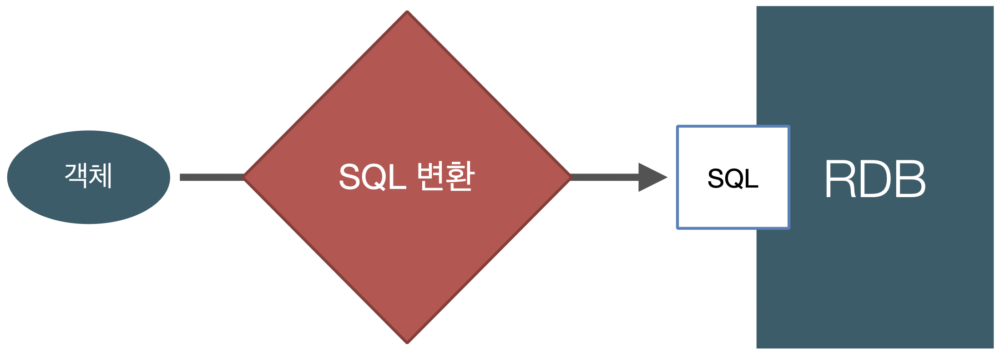

#### 객체와 관계형 데이터베이스의 차이

`1. 상속`, `2. 연관관계`, `3. 데이터 저장/조회 방법`, `4. 객체 그래프 탐색`, `5. 엔티티 신뢰문제`, `6. 엔티티 간의 비교`

###### 1. 상속

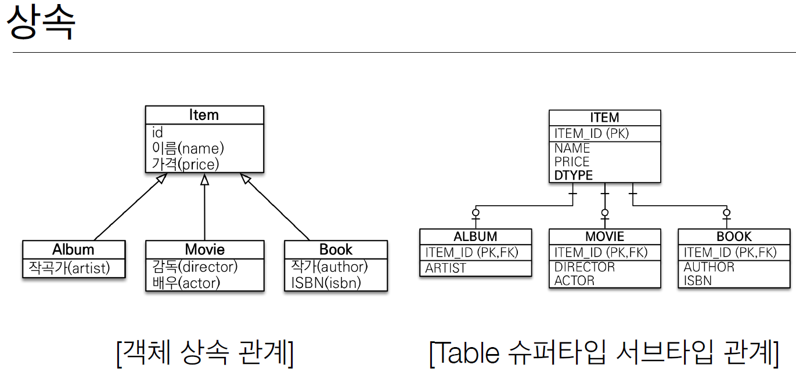

객체의 상속과 그나마 유사한 개념은 데이터베이스의 supertype - subtype 개념이다.  
그러나 둘 간의 변환을 위해서는 다음과 같은 작업이 필요했다.

- sql에서 Album 저장: Album 객체 분해 -> INSERT INTO ITEM + INSERT INTO ALBUM
- sql에서 Album 조회: ITEM, ALBUM 테이블에 대한 JOIN 쿼리 실행 -> 조회 결과를 바탕으로 Album 객체 생성

위와 같이 상속을 테이블에 직접 매핑하는 것은 매우 복잡하다.  
그래서 DB에 저장할 객체에는 상속 관계를 아예 안 쓰는 경우가 많았다.

만약 DB가 아닌 자바 컬렉션을 사용했다면 다음과 같이 상속을 간단하고 유연하게 사용 가능하다.

```java
// 자바 컬렉션에 Album 저장
list.add(album);

// 자바 컬렉션에 Album 조회
Album album = list.get(albumId);
Item item = list.get(albumId); // 부모 타입으로 조회 (다형성 활용)
```

###### 2. 연관관계

- 객체는 참조를 사용: member.getTeam()
- 테이블은 외래 키를 사용: JOIN ON M.TEAM_ID = T.TEAM_ID

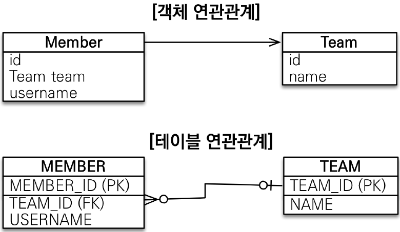

객체는 Team에서 Member로 갈 수 없지만(단방향), 테이블에서는 양방향으로 갈 수 있다(양방향).

###### 3. 데이터 저장/조회

db와의 매핑을 위해 어쩔 수 없이 객체를 테이블에 맞추어 모델링하는 경우가 많았다.

```java
class Member {
    Long id;          // MEMBER_ID PK
    Long teamId;      // TEAM_ID FK
    String username;  // USERNAME 컬럼
}

class Team {
    Long id;        // TEAM_ID PK
    String name;    // NAME 컬럼
}
```

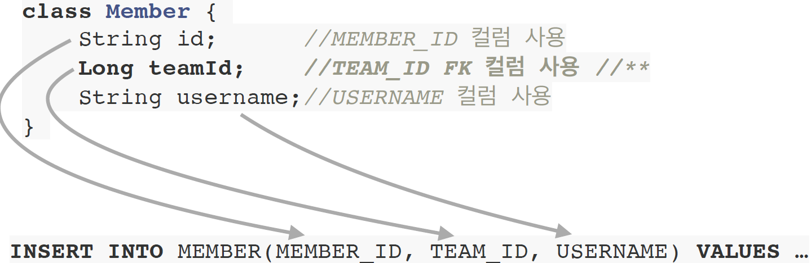

객체다운 모델링을 위해선 연관 객체인 team의 id가 저장되는게 아니라, 그 참조가 저장되어야 한다.

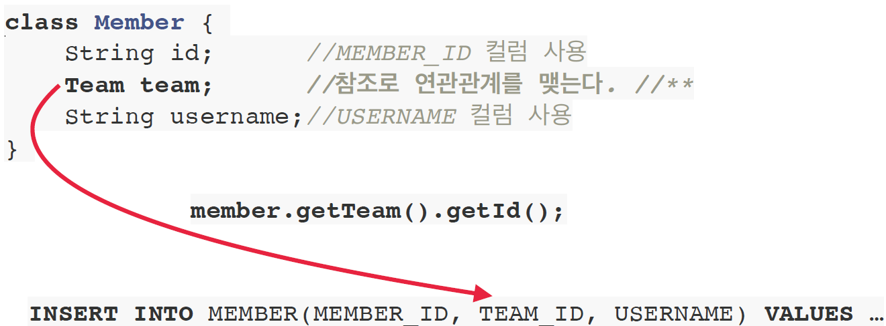

→ db 저장 시에는 연관관계를 외래키로 저장해야 하기 때문에, 연관관계에 있는 객체의 id를 참조하기 위해 member.getTeam().getId()로 id를 꺼내야 한다.

```java
class Member {
    String id;         // MEMBER_ID 컬럼
    Team team;         // 참조를 통한 연관관계
    String username;   // USERNAME 컬럼

    Team getTeam() {
        return team;
    }
}
```

그러나 이렇게 모델링 할 경우 조회할 때 매핑 작업이 너무 복잡해진다.  
먼저 쿼리의 경우 MEMBER, TEAM을 JOIN해서 데이터를 조회해야 한다.  
조회한 정보를 바탕으로 Member, Team 객체를 각각 생성한 다음, 회원-팀 관계를 설정해야 Member 엔티티 조회가 끝난다.

```java
SELECT M.*, T.*  FROM MEMBER M
  JOIN TEAM T ON M.TEAM_ID = T.TEAM_ID

public Member find(String memberId) {
    // SQL 실행 ...
    Member member = new Member();
    // db에서 조회한 회원 관련 정보를 모두 입력
    Team team = new Team();
    // db에서 조회한 팀 관련 정보를 모두 입력

    member.setTeam(team);   // 회원과 팀 관계 설정
    return member;
}
```

이전에는 이러한 작업이 번잡하다 보니 MemberAndTeam 거대 클래스를 만들어서 Member와 Team 관련 데이터를 다 집어넣었다.

이와 달리 자바 컬렉션에서의 데이터 조회는 매우 단순하다.  
컬렉션에 멤버를 넣고, 멤버가 필요하면 식별자를 바탕으로 멤버를 꺼낸다.  
연관관계에 있는 객체의 경우 Member.getTeam()과 같이 getter를 통해 꺼낼 수 있다.

```java
list.add(member);

Member member = list.get(memberId);
Team team = member.getTeam();
```

##### 4. 객체 그래프 탐색

객체는 자유롭게 객체 그래프를 탐색할 수 있어야 한다.  
member.getTeam(), member.getOrder() 등의 메서드를 통해 서로 간 탐색이 가능해야 한다.

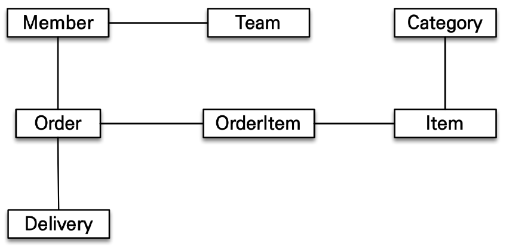

하지만, 현실에서는 처음 실행하는 SQL에 따라 탐색 범위가 결정된다.

```java
SELECT M.*, T.*  FROM MEMBER M
JOIN TEAM T ON M.TEAM_ID = T.TEAM_ID.  // member와 team만 join해서 가져옴

member.getTeam(); // OK
member.getOrder(); // null

// → sql을 작성할 때 member와 team만 조인해서 가져왔다면, order는 가져올 수 없다.
```

##### 5. 엔티티 신뢰문제

다른 개발자가 데이터를 조회 및 수정하는 memberDAO를 개발했다고 하자.

```java
class MemberService {
    ...
    public void process() {
        Member member = memberDAO.find(memberId);
        member.getTeam();  // ???
        member.getOrder().getDelivery(); // ???
    }
}
```

멤버 객체를 불러올 때, 관련된 모든 객체의 정보를 불러온다는 보장은 없다.  
memberDAO에서 어떤 쿼리가 날라갔고, 어떤 객체 데이터와 조립했는지 알지 못하면
getTeam(), getOrder().getDelivery()를 통해 반환된 객체를 믿고 사용할 수 없다.  
하지만 그렇다고 연관 관계에 있는 모든 객체를 미리 로딩할 수는 없기 때문에, 결국 여러 상황에 대처하기 위한 각각의 조회 메서드를 따로 작성하게 된다.

```java
memberDAO.getMember();  // Member만 조회
memberDAO.getMemberWithTeam();  // Member, Team 조회
memberDAO.getMemberWithOrderWithDelivery();  // Member, Order, Delivery 조회
```

layered architecture(계층형 아케틱처)는 이전 계층에서 전달한 데이터를 그 다음 계층에서 신뢰하고 사용할 수 있어야 한다.  
하지만 위와 같은 상황에서는 엔티티 신뢰문제가 발생할 수밖에 없고, memberDAO의 코드를 까보지 않고서는 신뢰하고 사용할 수 없다.  
따라서 물리적으로는 서비스와 DAO로 계층이 나뉘어져 있을 수 있지만, 논리적으로는 강하게 결합되어 있기 때문에 진정한 의미의 계층 분할이 불가능하다.

##### 6. 엔티티 간의 비교

동일한 데이터를 두 번 조회해서 비교해보는 로직을 작성해보자.

```java
String memberId = "100";
Member member1 = memberDAO.getMember(memberId);
Member member2 = memberDAO.getMember(memberId);

member1 == member2;  // false

class MemberDAO {
    public Member getMember(String memberId) {
        String sql = "SELECT * FROM MEMBER WHERE MEMBER_ID = ?";
        ...
        //JDBC API, SQL 실행
        return new Member(...);
    }
}
```

같은 메서드로 member1과 member2를 조회했는데도, 둘을 비교하면 다르다고 나온다.  
memberDAO에서는 쿼리를 각각 실행하고 객체를 따로 만들어 반환하기 때문에, 둘의 참조를 비교하면 다를 수밖에 없다.

하지만 자바컬렉션에서 조회했을 때에는 같게 나온다.

```java
String memberId = "100";
Member member1 = list.get(memberId);
Member member2 = list.get(memberId);
member1 == member2;   // true
```

위와 같이 자바 컬렉션에서 데이터를 다룰 때와 sql에서 데이터를 다룰 때 mismatch가 많이 발생한다!  
객체답게 모델링 할수록, 매핑 작업만 점점 늘어난다.
객체를 자바 컬렉션에 저장 하듯이 DB에 저장할 수는 없을까? - 그 고민의 결과가 JPA이다.

### JPA 소개

: Java Persistence API, 자바 진영의 ORM 기술 표준

ORM : Object-relational mapping(객체 관계 매핑)
객체는 객체대로 설계하고, RDB는 RDB대로 설계 → ORM 프레임워크가 중간에서 매핑

JPA는 애플리케이션과 JDBC 사이에서 동작한다.  
JPA가 JDBC API를 통해 SQL을 만들어서, DB에 보내고, 결과를 받아온다.

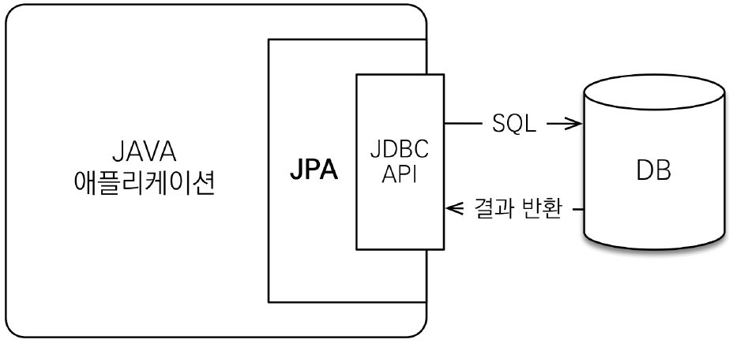

MemberDAO에서 객체를 저장하고 싶은 경우, JPA에 맴버 객체를 넘기게 된다.  
JPA에서 전달 받은 멤버 객체를 분석해서 적절한 INSERT 쿼리를 생성하고, 쿼리를 DB에 보내고, 결과를 받는다.

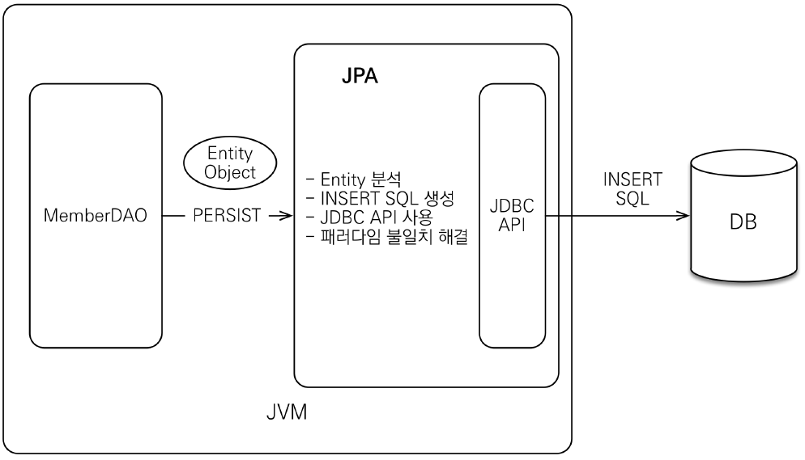

데이터 조회시에는 MemberDAO가 JPA에 식별자를 넘기고, JPA는 조회 대상이 되는 맴버 객체를 보고 적절한 SELECT 쿼리를 만든다.  
JDBC API를 사용해서 DB에 쿼리를 보내고 결과를 받은 다음에, ResultSet으로 객체에 매핑해서 반환한다.

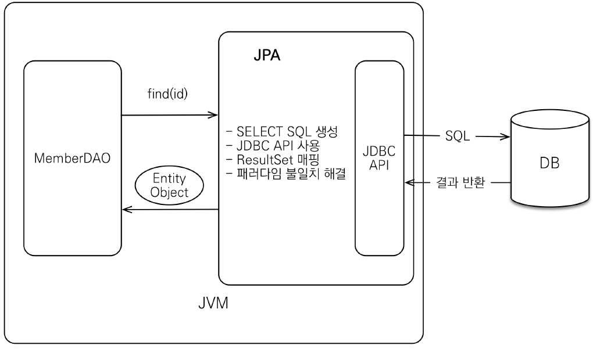

처음에는 EJB를 자바표준으로 만들어서 사용했는데, 기술적으로 너무 허술했다.  
결국 한 개발자가 총대를 메고 오픈소스를 열어서 하이버네이트를 만들었다.  
결국 자바 진영에서 EJB에 대해서 반성하고, 하이버네이트의 개발자를 모셔와서 거의 복제하여 만든게 JPA다.

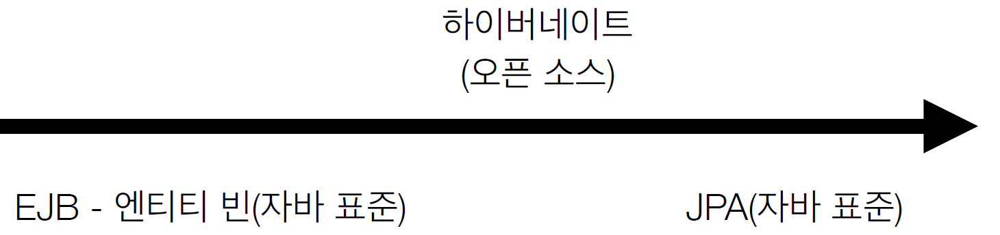

JPA는 표준 명세로써 인터페이스의 모음에 불과하다.  
JPA 2.1 표준 명세를 구현한 3가지 구현체가 존재한다. - 하이버네이트, EclipseLink, DataNucleus  
최근 개발자들은 거의 하이버네이트를 사용한다.

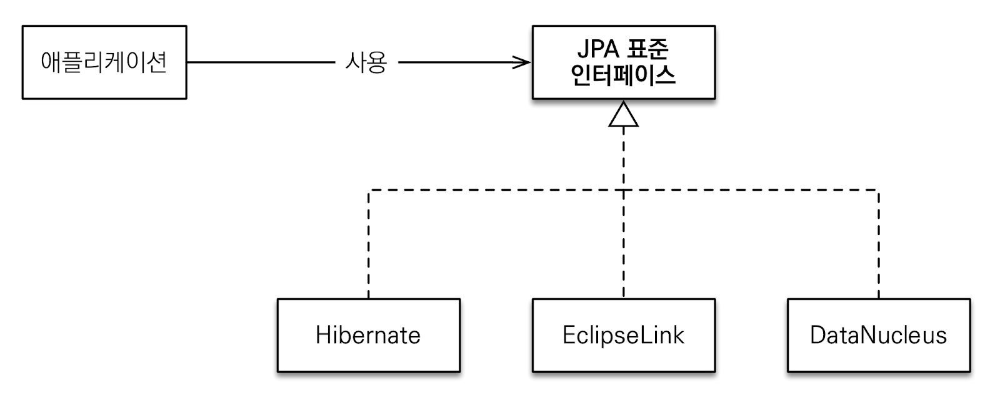

#### JPA를 왜 사용해야 하는가?

- `SQL 중심 개발 → 객체 중심 개발`, `생산성`, `유지보수`, `패러다임의 불일치 해결`, `성능`, `데이터 접근 추상화와 벤더 독립성`, `표준`

##### 1. 생산성 - JPA와 CRUD

• 저장: jpa.persist(member)  
• 조회: Member member = jpa.find(memberId)  
• 수정: member.setName(“변경할 이름”)  
 // 꺼낸 객체를 내가 원하는 값으로 수정하기만 하면, DB에 insert쿼리가 전송된다!  
• 삭제: jpa.remove(member)

→ 마치 java collection에 데이터를 넣고 빼는 것처럼 사용 가능!

##### 2. 유지보수

- 기존: 필드 변경시 모든 SQL 수정
- JPA: 필드만 추가하면 됨, SQL은 JPA가 처리

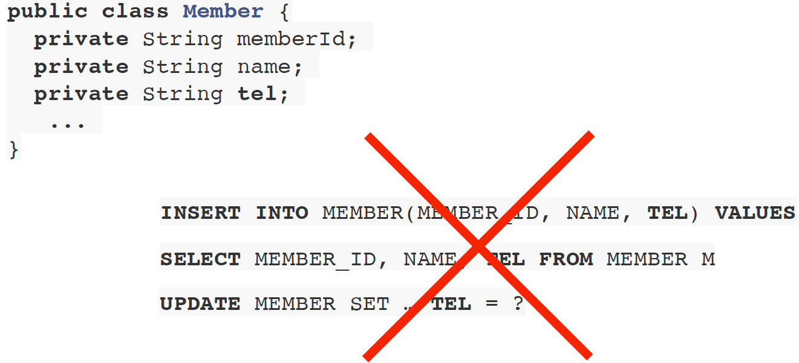

##### 3. JPA와 패러다임의 불일치 해결

**상속**

```java
// album 저장
jpa.persist(album);
-> INSERT INTO ITEM ...
   INSERT INTO ALBUM ...

// album 조회
Album album = jpa.find(Album.class, albumId);
-> SELECT I._, A._ FROM ITEM I
    JOIN ALBUM A ON I.ITEM_ID = A.ITEM_ID
```

**JPA에서의 연관관계, 객체 그래프 탐색**

```java
// 연관관계 저장
member.setTeam(team);
jpa.persist(member);

// 객체 그래프 탐색
Member member = jpa.find(Member.class, memberId);
Team team = member.getTeam();

```

-> 그냥 getTeam()으로 member로부터 team을 꺼내올 수 있다, 마치 java collection에서 꺼내오는 것처럼

**신뢰할 수 있는 엔티티, 계층**

```java
class MemberService {
...
    public void process() {
        Member member = memberDAO.find(memberId);
        // 자유로운 객체 그래프 탐색
        member.getTeam();
        member.getOrder().getDelivery();
    }
}
```

JPA에는 지연로딩 기능이 있어서, 이 객체를 조회해서 실제로 사용하는 시점에 쿼리가 전송된다.  
따라서 자유롭게 연관 객체를 탐색할 수 있다.

**비교하기**

```java
String memberId = "100";
Member member1 = jpa.find(Member.class, memberId);
Member member2 = jpa.find(Member.class, memberId);
member1 == member2; // true
```

→ 동일한 트랜잭션에서 조회한 엔티티는 같음을 보장

#### JPA의 성능 최적화 기능

- 1차 캐시와 동일성(identity) 보장
- 트랜잭션을 지원하는 쓰기 지연(transactional write-behind)
- 지연 로딩(Lazy Loading)

JPA는 buffer로써 작동하기 때문에, 잘 활용하면 오히려 성능을 더 끌어올릴 수 있다.

**1차 캐시와 동일성 보장**

같은 트랜잭션 안에서는 같은 엔티티를 반환 - 조회 성능 향상(약간만)
DB Isolation Level이 Read Commit이어도 애플리케이션에서 Repeatable Read 보장

```java
String memberId = "100";
Member m1 = jpa.find(Member.class, memberId);   // SQL 쿼리를 보냄
Member m2 = jpa.find(Member.class, memberId);   // 캐시를 가져옴
println(m1 == m2)   // true

// →  SQL 1번만 실행
```

**트랜잭션을 지원하는 쓰기 지연 - INSERT**

1. 트랜잭션을 커밋할 때까지 INSERT SQL을 모은다
2. JDBC BATCH SQL 기능을 사용해서 한번에 SQL 전송

```java
transaction.begin();   // [트랜잭션] 시작
em.persist(memberA);
em.persist(memberB);
em.persist(memberC);
// 여기까지는 INSERT SQL을 데이터베이스에 보내지 않는다.

// 커밋하는 순간 데이터베이스에 INSERT SQL을 모아서 보낸다.
transaction.commit();   // [트랜잭션] 커밋

// → 개발자가 복잡한 걸 생각할 필요가 없다. 옵션만 키면 됨!
```

**트랜잭션을 지원하는 쓰기 지연 - UPDATE**

- UPDATE, DELETE로 인한 로우(ROW)락 시간 최소화
- 트랜잭션 커밋 시 UPDATE, DELETE SQL 실행하고, 바로 커밋

```java
transaction.begin(); // [트랜잭션] 시작
changeMember(memberA);
deleteMember(memberB);
비즈니스_로직_수행(); // 비즈니스 로직 수행 동안 DB row lock이 걸리지 않는다.

// 커밋하는 순간 데이터베이스에 UPDATE, DELETE SQL을 보낸다.
transaction.commit(); // [트랜잭션] 커밋

```

**지연 로딩과 즉시 로딩**

• 지연 로딩: 객체가 실제 사용될 때 로딩
• 즉시 로딩: JOIN SQL로 한번에 연관된 객체까지 미리 조회

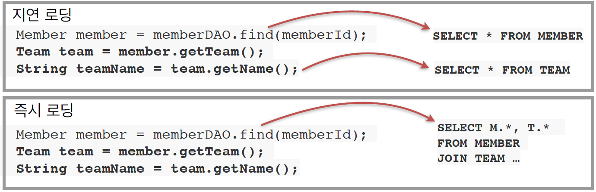

→ 지연로딩의 경우, 실제로 teamName을 조회해서 해당 데이터가 필요해질 때, 그에 대한 쿼리를 작성  
그러나 member를 가져올 때 거의 대부분 team을 사용하는 경우, 지연로딩은 2번 쿼리를 보내야 하기 때문에
성능상 좋지 않을 수 있다.  
이 때에는 즉시로딩하도록 옵션을 설정할 수 있다.  
(member를 가져올 때는 무조건 team도 같이 가져옴)

**ORM은 객체와 RDB 두 기둥 위에 있는 기술**  
: 결국엔 JPA와 RDB를 모두 잘 해야 한다.  
결국에는 관계형 데이터베이스에 대한 공부가 필요하다!
