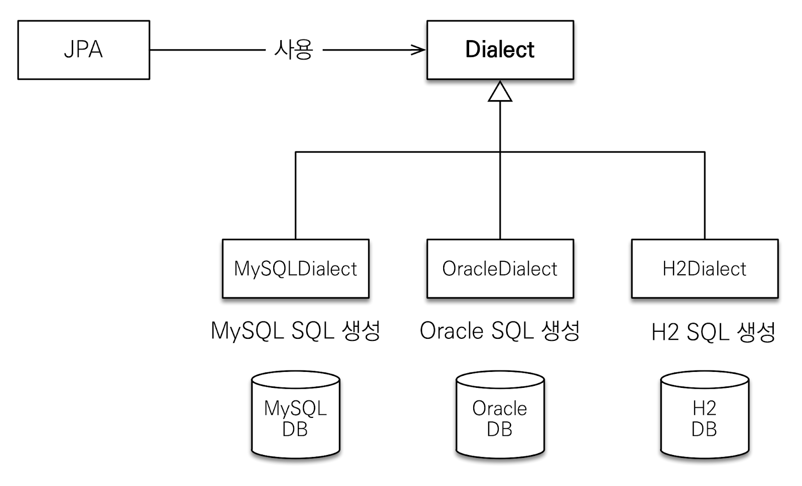
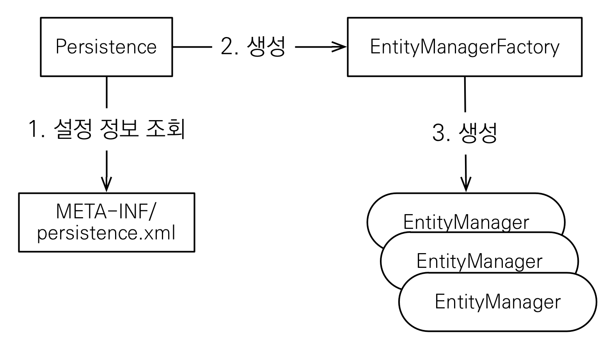

### 프로젝트 생성

JPA를 사용할 때 persistence.xml 파일을 작성하여 설정할 수 있다.

```xml
<?xml version="1.0" encoding="UTF-8"?>
<persistence version="2.2"
             xmlns="http://xmlns.jcp.org/xml/ns/persistence" xmlns:xsi="http://www.w3.org/2001/XMLSchema-instance"
             xsi:schemaLocation="http://xmlns.jcp.org/xml/ns/persistence http://xmlns.jcp.org/xml/ns/persistence/persistence_2_2.xsd">
    <persistence-unit name="hello">  <!--persistence unit 이름-->
        <properties>
            <property name="javax.persistence.jdbc.driver" value="org.h2.Driver"/>
            <property name="javax.persistence.jdbc.user" value="sa"/>
            <property name="javax.persistence.jdbc.password" value=""/>
            <property name="javax.persistence.jdbc.url" value="jdbc:h2:tcp://localhost/~/test"/>
            <property name="hibernate.dialect" value="org.hibernate.dialect.H2Dialect"/>
            <!-- 옵션 -->
            <property name="hibernate.show_sql" value="true"/>  <!-- db에 나가는 쿼리를 보여줌 -->
            <property name="hibernate.format_sql" value="true"/>
            <property name="hibernate.use_sql_comments" value="true"/>
            <!--<property name="hibernate.hbm2ddl.auto" value="create" />-->
        </properties>
    </persistence-unit>
</persistence>
```

#### 데이터베이스 방언 (dialect)

• 방언: SQL 표준을 지키지 않는 특정 데이터베이스만의 고유한 기능  
-> 각각의 데이터베이스가 제공하는 SQL 문법과 함수는 조금씩 다름

- 가변 문자: MySQL은 VARCHAR, Oracle은 VARCHAR2
- 페이징: MySQL은 LIMIT , Oracle은 ROWNUM
- 문자열을 자르는 함수: SQL 표준은 SUBSTRING(), Oracle은 SUBSTR()

하지만 JPA는 특정 데이터베이스에 종속되지 않음
→ <property name="hibernate.dialect" value="org.hibernate.dialect.H2Dialect"/>
hibernate.dialect 속성에 지정 시 알아서 해당하는 db의 방언에 맞춰서 바꿔줌


하이버네이트는 40가지 이상의 데이터베이스 방언 지원

- H2 : `org.hibernate.dialect.H2Dialect`
- Oracle 10g : `org.hibernate.dialect.Oracle10gDialect`
- MySQL : `org.hibernate.dialect.MySQL5InnoDBDialect`

### 애플리케이션 개발



Persistence는 persistence.xml에 작성한 설정정보를 조회해서, EntityManagerFactory를 생성한다.  
해당 Facotry에서 EntityManager를 생성해서 빈으로 등록하게 되고, 개발자는 이 EntityManager를 주입받아서 사용하게 된다.

먼저 다음의 sql 문으로 테이블을 생성한다.

```sql
create table Member (
  id bigint not null,
  name varchar(255),
  primary key (id)
);
```

이제 엔티티 객체를 정의해서 객체와 테이블을 매핑한다.

```java
// src/main/java/hellojpa/Member
@Entity
// @Table("Member") : 기본 설정됨, Member 테이블에 매핑
public class Member {
  @Id
  private Long id;

// @Column(name="name")  : 기본 설정됨, name column에 매핑
  private String name;

  public Member() {   // JPA에서는 기본 생성자 작성이 필요함
  }

  public Member(Long id, String name) {
      this.id = id;
      this.name = name;
  }
  public void setId(Long id) { this.id = id; }
  public void setName(String name) { this.name = name; }
  public Long getId() { return id; }
  public String getName() { return name; }
}
```

실습 - 회원 저장

```java
// src/main/java/hellojpa/JpaMain

public class JpaMain {
    public static void main(String[] args) {
        // EntityManagerFactory는 애플리케이션 로딩시점에 하나만 만듦
        // 읽어올 설정정보(persistence-unit)를 지정해서 생성
        EntityManagerFactory emf = Persistence.createEntityManagerFactory("hello");

        // EntityManager는 하나의 Transaction마다 새롭게 생성되어야 한다
        // 결국 고객의 요청이 올 때마다 생성 필요
        EntityManager em = emf.createEntityManager();

        // 모든 데이터 변경은 Transaction 안에서!
        EntityTransaction tx = em.getTransaction();
        tx.begin();  // db transaction 시작

        try {
            /** 회원 등록 */
            Member member = new Member();
            member.setId(1L);
            member.setName("helloA");
            em.persist(member);

            /** 회원 조회 */
            Member findMember = em.find(Member.class, 1L);
            System.out.println("findMember.id = " + findMember.getId());
            System.out.println("findMember.name = " + findMember.getName());

            /** 회원 삭제 */
            em.remove(findMember);

            /** 회원 수정 */
            Member findMember = em.find(Member.class, 1L);
            // findMember는 JPA를 통해 가져왔으므로, JPA에서 findMember를 관리한다
            findMember.setName("helloJPA");

            // JPA에서 변경이 됐는지를 commit시점에서 체크하고, 변경이 있으면 update 뭐리를 날린다.
            tx.commit();

        } catch(Exception e) {
            tx.rollback();
        } finally {
            // entity manager 사용 후 close해야 db connection이 끊어진다.
            em.close();
        }
        emf.close();
    }
}
```

**주의점**

- EntityManagerFactory는 하나만 생성해서 애플리케이션 전체에서 공유
- EntityManager는 thread 간에 공유X (사용하고 버려야 한다).
- JPA의 모든 데이터 변경은 트랜잭션 안에서 실행

**JPQL 소개**

JPA를 사용하면 엔티티 객체를 중심으로 개발하게 된다.
이 때 검색 쿼리를 작성하는 것이 문제가 되는데, 검색을 할 때도 테이블이 아닌 엔티티 객체를 대상으로 검색을 하는 것이 적절하다.  
하지만 필요한 데이터를 DB에서 불러오려면, 결국 검색 조건이 포함된 SQL이 필요하다.

ex: 나이가 18살 이상인 회원을 모두 검색하고 싶다면?  
여러 테이블을 조인하고, 원하는 데이터를 최적화해서 가져오고,
필요하면 통계성 쿼리를 날리고… 이런 작업을 하는데 사용하는게 jpql이다.

```java
※ src/main/java/hellojpa/JpaMain
public class JpaMain {
    public static void main(String[] args) {
        try {
            // JPA에서는 테이블을 대상으로 쿼리를 짜지 않는다.
            // Member 엔티티 객체를 대상으로 쿼리를 구성한다.
            List<Member> result = em.createQuery("select m from Member as m", Member.class).getResultList();
            for(Member member: result) {
                System.out.println("member.name = " + member.getName());
            }
            tx.commit();
        } catch(Exception e) {
            tx.rollback();
        } finally {
            em.close();
        }
    }
}

```

JPA는 SQL을 추상화한 JPQL이라는 객체 지향 쿼리 언어 제공한다.  
SQL과 문법이 유사하고 SELECT, FROM, WHERE, GROUP BY, HAVING, JOIN을 지원한다.

JPQL은 테이블이 아닌 객체를 대상으로 검색하는 객체 지향 쿼리(객체 지향 SQL)
→ SQL을 추상화했기 때문에 특정 데이터베이스의 SQL에 의존하지 않는다!
JPQL 입력시 해당 데이터베이스의 방언에 맞게 변형되어 쿼리가 작성된다.
