### 영속성 컨텍스트

JPA에서 가장 중요한 2가지는 다음과 같다.

- 객체와 관계형 데이터베이스 매핑하기(Object Relational Mapping) : 정적인 설계 관점
- 영속성 컨텍스트 : 실제 동작하는 메커니즘 관점

먼저 영속성 컨텍스트를 알아보면서 JPA의 실제 동작 매커니즘을 이해해보자.

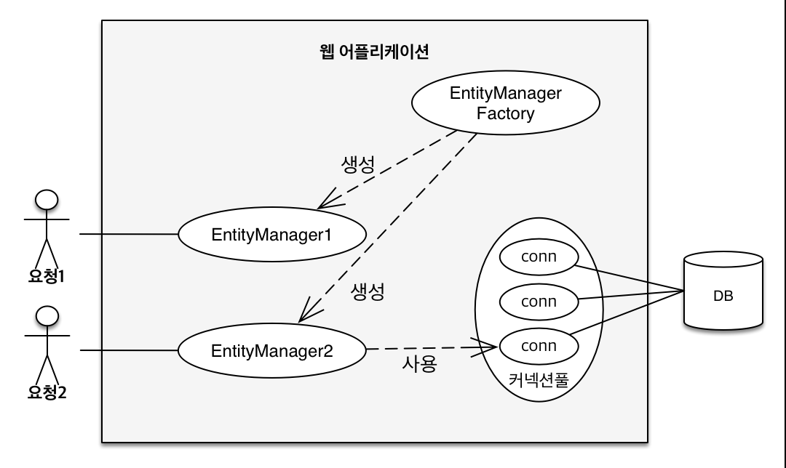

앞서 살펴봤듯이 고객의 요청이 들어올 때마다 EntityManagerFactory에서 EntityManager를 생성하게 된다.  
EntityManager는 내부적으로 커넥션 풀의 db connection을 통해 db 작업을 수행한다.

#### 영속성 컨텍스트

영속성 컨텍스트는 "엔티티를 영구 저장하는 환경"이라는 뜻  
`EntityManager.persist(entity);` → 엔티티를 영속성 컨텍스트에 저장하는 것.  
영속성 컨텍스트는 논리적인 개념으로, 엔티티 매니저를 통해서만 영속성 컨텍스트에 접근 가능하다.

J2SE 환경 : 엔티티 매니저와 영속성 컨텍스트가 1:1
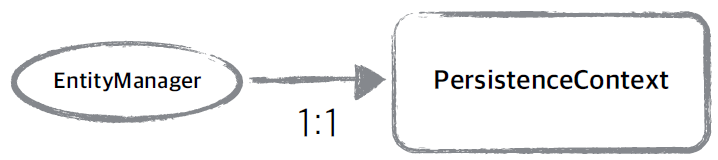

J2EE 환경(스프링 프레임워크 같은 컨테이너 환경) : 엔티티 매니저와 영속성 컨텍스트가 N:1
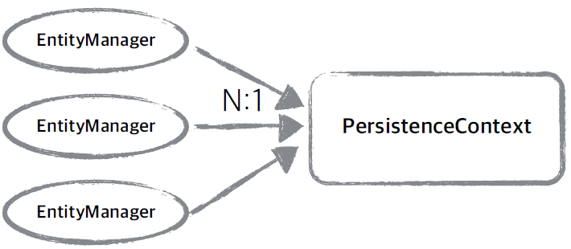

#### 엔티티의 생명주기

- 비영속 (new/transient): 영속성 컨텍스트와 전혀 관계가 없는 새로운 상태
- 영속 (managed): 영속성 컨텍스트에 의해 관리되는 상태
- 준영속 (detached): 영속성 컨텍스트에 저장되었다가 분리된 상태
- 삭제 (removed): 삭제된 상태

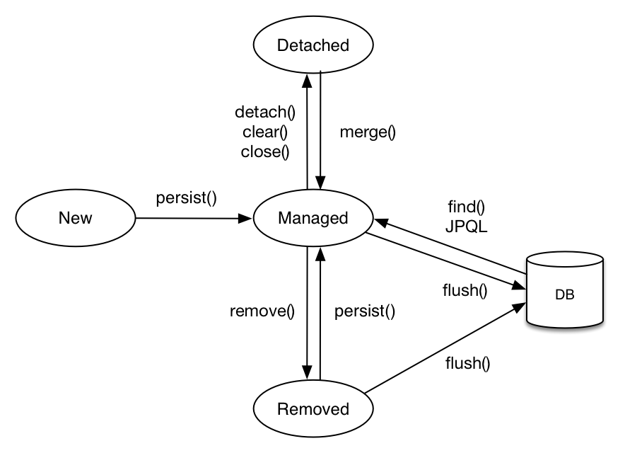

**비영속 상태**

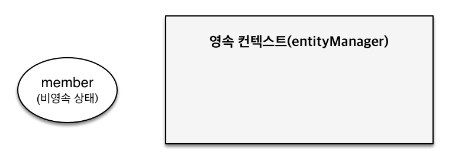

```java
// 객체를 생성하기만 한 상태(비영속)
Member member = new Member();
member.setId("member1");
member.setUsername("회원1");
```

**영속 상태**
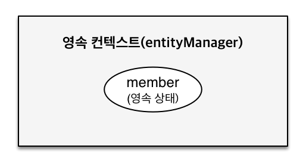

```java
public class JpaMain {
    public static void main(String[] args) {
        EntityManagerFactory emf = Persistence.createEntityManagerFactory("hello");
        EntityManager em = emf.createEntityManager();
        EntityTransaction tx = em.getTransaction();
        tx.begin();
        try {
            // 비영속 상태
            Member member = new Member();
            member.setId(100L);
            member.setName("HelloJPA");
            // 영속 상태
            System.out.println("=== BEFORE ===");
            em.persist(member);   // 영속성 context에 의해 관리되기 시작, 아직 DB에 저장된게 아님!!
            System.out.println("=== AFTER ===");

            tx.commit();
        } catch(Exception e) {
            tx.rollback();
        } finally {
            em.close();
        }
        emf.close();
    }
}
```

이 때 출력 결과는 다음과 같다.

```bash
=== BEFORE ===    # em.persist(member)를 해도 db에 쿼리가 날라가지는 않음
=== AFTER ===
# 쿼리가 날라가는 건 transaction을 commit하는 시점( tx.commit() )
Hibernate:
    /* insert hellojpa.Member
        */ insert
        into
            Member
            (name, id)
        values
            (?, ?)
```

**준영속**

```java
// 회원 엔티티를 영속성 컨텍스트에서 분리, 준영속 상태
em.detach(member);
```

**삭제**

```java
// 객체를 삭제한 상태(삭제) → db에서 삭제됨
em.remove(member);
```

#### 영속성 컨텍스트의 이점

`1차 캐시`  
`동일성(identity) 보장`  
`트랜잭션을 지원하는 쓰기 지연(transactional write-behind)`  
`변경 감지(Dirty Checking)`  
`지연 로딩(Lazy Loading)`

**1. 엔티티 조회, 1차 캐시**
JPA 사용시 1차 캐시를 사용하게 되는데, id를 key로 Entity를 value로 갖는 Map으로 구성된다.

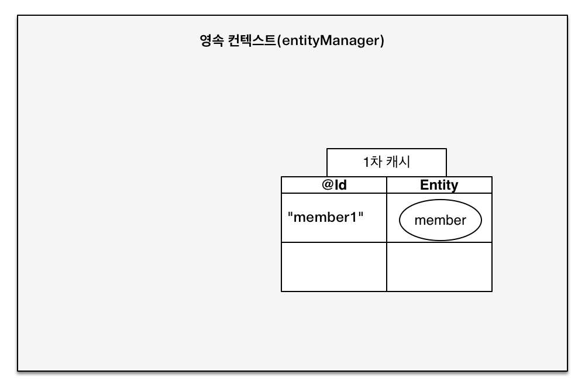

```java
※ src/main/java/hellojpa/JpaMain
// 엔티티를 생성한 상태(비영속)
Member member = new Member();
member.setId("member1");
member.setUsername("회원1");
// 엔티티를 영속화
em.persist(member);

// 1차 캐시에서 조회 -> 1차 캐시에 member1이 존재하므로, 1차 캐시에서 반환
- Member findMember = em.find(Member.class, "member1");
// => select 쿼리가 실행되지 않음
```

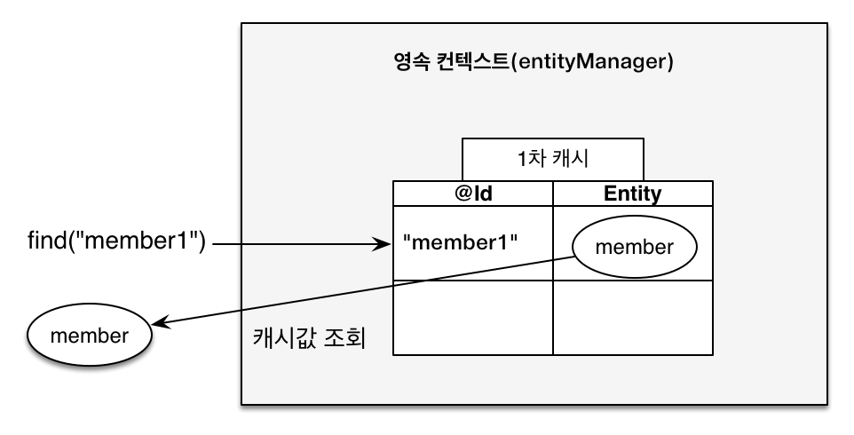

```java
// 1차 캐시에서 조회 → 1차 캐시에 member2가 없으므로, 데이터베이스에서 조회해서 가져옴 & 1차 캐시에 저장
- Member findMember2 = em.find(Member.class, "member2");
// => select 쿼리가 실행됨
// => 이후에 member2를 조회할 때에는 1차 캐시에서 가져옴
```

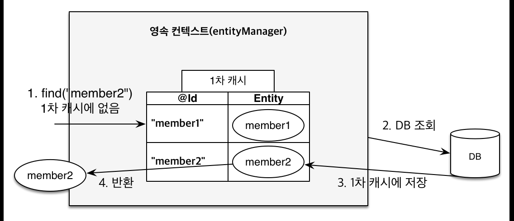

> EntityManager는 Transaction 단위로 생성되고, Transaction이 끝나면 em은 삭제된다.  
> 이 때 1차 캐시도 지워지기 때문에, 여러명의 고객이 캐시를 공동으로 사용하지는 못한다.  
> 따라서 성능상 대단한 이점은 없다. (메커니즘 상으로 얻는 이점은 존재)

**영속 엔티티의 동일성 보장**  
1차 캐시를 통해, 반복 가능한 읽기(REPEATABLE READ) 등급의 Transaction 격리 수준을 애플리케이션 차원에서 제공  
-> 동일한 식별자로 중복 조회하면 1차 캐시에서 동일한 엔티티를 가져옴
-> equal 비교 시 동일한 엔티티로 인식됨

```java
※ src/main/java/hellojpa/JpaMain
Member a = em.find(Member.class, "member1");
Member b = em.find(Member.class, "member1");
System.out.println(a == b); // true
```

**트랜잭션을 지원하는 쓰기 지연 (버퍼링과 같은 기능)**

```java
// src/main/java/hellojpa/JpaMain
EntityManager em = emf.createEntityManager();
EntityTransaction tx = em.getTransaction();
tx.begin(); // [트랜잭션] 시작

em.persist(memberA);
em.persist(memberB);
// 이 시점까지는 INSERT SQL을 데이터베이스에 보내지 않는다.

transaction.commit();   // [트랜잭션] 커밋 → 커밋하는 순간 데이터베이스에 INSERT 쿼리를 보낸다.
```

- `em.persist(memberA);` 시점의 동작 : JPA가 memberA 엔티티를 분석해서 INSERT 쿼리 생성 -> 생성한 쿼리를 쓰기 지연 SQL 저장소에 쌓아둠

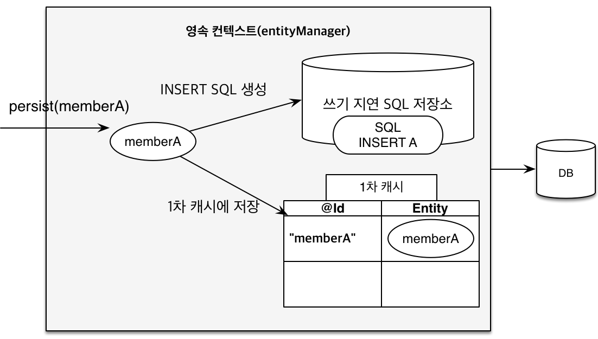

- `em.persist(memberB);` 시점의 동작 : JPA가 memberB 엔티티를 분석해서 INSERT쿼리 생성 -> 생성한 쿼리를 쓰기 지연 SQL 저장소에 쌓아둠

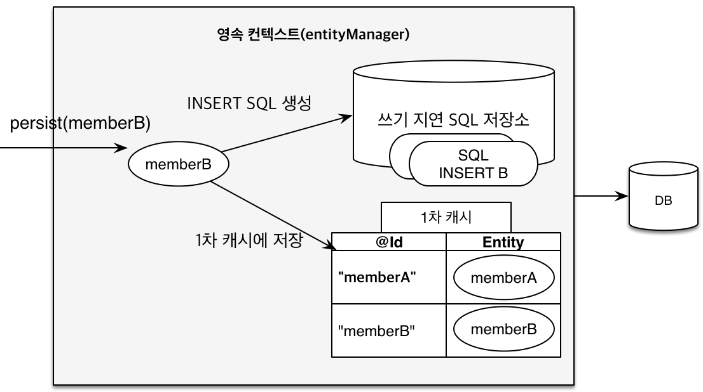

- `transaction.commit();` 시점의 동작 : 쓰기 지연 SQL 저장소에 있던 쿼리들이 db에 flush되어 날라감

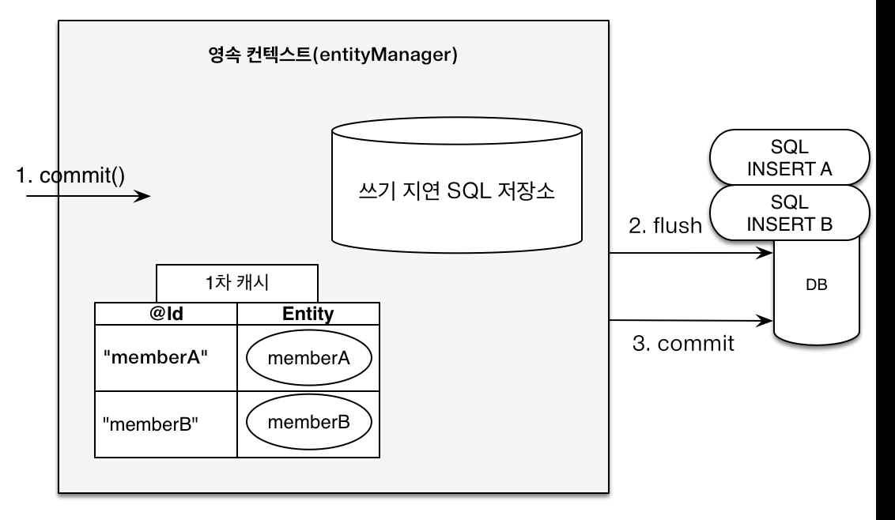

이를 확인하기 위해서 tx.commit() 이전에 임의로 출력문을 남겨보자.

```java
// src/main/java/hellojpa/JpaMain
tx.begin();
Member member1 = new Member(150L, "memberA");
Member member2 = new Member(160L, "memberB");
em.persist(member1);
em.persist(member2);

System.out.println("========================");
tx.commit();
```

로깅 결과는 다음과 같다.

```bash
========================
# tx.commit() 이후에 쿼리가 전송됨
Hibernate:
    /* insert hellojpa.Member
        */ insert             // member1에 대한 쿼리
        into
            Member
            (name, id)
        values
            (?, ?)
Hibernate:
    /* insert hellojpa.Member
        */ insert             // member2에 대한 쿼리
        into
            Member
            (name, id)
        values
            (?, ?)
```

persist() 시점에는 SQl이 실행되지 않다가, tx.commit() 시점에 쿼리가 날라가는 것을 확인할 수 있다.

**엔티티 수정 - 변경 감지 (dirty checking)**

엔티티를 수정했을 때에는 별도로 persist() 메서드를 추가로 호출하지 않아도 자동으로 업데이트 쿼리가 수행된다.

```java
// src/main/java/hellojpa/JpaMain
tx.begin()
Member member = em.find(Member.class, 150L);
member.setName("ZZZZ");
// em.persist(member)를 하지 않음

System.out.println("========================");
tx.commit()
```

위 로직의 실행 결과 로그는 다음과 같다.

```bash
# select 쿼리
Hibernate:
    select
        member0_.id as id1_0_0_,
        member0_.name as name2_0_0_
    from
        Member member0_
    where
        member0_.id=?
========================
# update 쿼리, tx.commit() 시점
Hibernate:
    /* update
        hellojpa.Member */ update
            Member
        set
            name=?
        where
            id=?
```

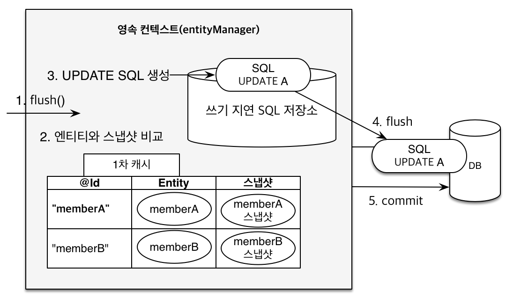

JPA 내부에서는 스냅샷을 이용해서 변경을 감지하게 된다.  
값을 읽어온 시점의 초기 데이터를 스냅샷에 저장해 두는데, flush 시점에 엔티티와 스냅샷을 비교하게 된다.  
변경사항이 감지되면 UPDATE 쿼리를 작성하여 쓰기 지연 SQL 저장소에 저장하고, 커밋 시점에 쿼리를 db에 전달하게 된다.

**엔티티 삭제**

엔티티 삭제의 경우 앞서 설명했던 메커니즘과 동일하게 동작한다.  
`em.remove();` 호출 시점에 쓰기 지연 SQL 저장소에 DELETE 쿼리를 저장하고, 커밋 시점에 쿼리를 db에 전달한다.

```java
Member memberA = em.find(Member.class, "memberA"); // 삭제 대상 엔티티 조회
em.remove(memberA); // 엔티티 삭제
```

### 플러시

플러시는 영속성 컨텍스트의 변경 내역을 데이터베이스에 반영하는 것이다.  
스냅샷으로부터 변경사항이 감지되면 수정된 엔티티를 읽어서, 쓰기 지연 SQL 저장소에 등록하게 된다.  
플러시 시점에는 쓰기 지연 SQL 저장소의 쿼리를 데이터베이스에 전송해서 데이터의 등록, 수정, 삭제가 이루어진다.

영속성 컨텍스트를 플러시하는 방법은 다음과 같다.

- `em.flush();`를 직접 호출
- 트랜잭션 커밋 : 플러시가 자동 호출됨
- JPQL 쿼리 실행 : 플러시가 자동 호출됨

```java
※ src/main/java/hellojpa/JpaMain
Member member = new Member(200L, "member200");
em.persist(member);

em.flush();  // flush가 바로 발생, 변경감지를 수행한 후 쓰기 지연 SQL 저장소의 쿼리들을 db에 반영
System.out.println("=================");
tx.commit();
```

위 로직의 실행 결과는 다음과 같다.

```bash
Hibernate:
    /* insert hellojpa.Member
        */ insert
        into
            Member
            (name, id)
        values
            (?, ?)
=================
```

특이한 점은 JPQL 실행 시점에는 바로 플러시가 발생한다는 것이다.

```java
em.persist(memberA);
em.persist(memberB);
em.persist(memberC);
query = em.createQuery("select m from Member m", Member.class);  // JPQL 실행
List<Member> members= query.getResultList();
```

위 예시에서 JPQL 실행 시점에 영속성 컨텍스트가 flush 되지 않는다면, memberA, memberB, memberC에 대한 Insert 쿼리는 아직 db에 전송되지 않았기 때문에 조회가 제대로 되지 않는다.  
JPQL은 메서드 호출 시점에 바로 쿼리가 실행되기 때문에, 해당 시점에는 영속성 컨텍스트를 flush 해서 db에 반영해야 한다.

`em.setFlushMode()`를 통해 플러시 모드를 변경할 수 있다.
`FlushModeType.AUTO` : 커밋이나 쿼리를 실행할 때 플러시 (기본값)
`FlushModeType.COMMIT` : 커밋할 때만 플러시 (쿼리를 실행할 때에는 플러시 X)

플러시는 영속성 컨텍스트를 비우는 것이 아니라, 영속성 컨텍스트의 변경내용을 데이터베이스에 동기화하는 개념이다.  
영속성 컨텍스트는 트랜잭션이라는 작업 단위를 중심으로 작동하기 때문에, 따로 플러시를 직접 다룰 필요 없이 트랜잭션을 커밋하기 전에 변경 사항을 플러시하여 db에 반영하기만 하면 된다.

### 준영속 상태

em.persist()를 통해 영속화한 엔티티나, em.find()를 통해 1차 캐시에 저장된 엔티티는 모두 영속 상태이다.  
이 때 영속 상태의 엔티티가 영속성 컨텍스트에서 분리(detached)되면 준영속 상태가 된다.  
준영속 상태가 되면 영속성 컨텍스트가 제공하는 dirty checking 등의 기능을 사용하지 못한다.

준영속 상태로 만드는 방법은 다음과 같다.

- em.detach(entity) : 특정 엔티티만 준영속 상태로 전환
- em.clear() : 영속성 컨텍스트를 완전히 초기화
- em.close() : 영속성 컨텍스트를 종료

먼저 특정 엔티티를 준영속 상태로 전환해보자.

```java
// src/main/java/hellojpa/JpaMain
Member findMember = em.find(Member.class, 150L);
findMember.setName("AAAA");
em.detach(findMember); // JPA에서 더이상 관리하지 않음 → dirty checking이 이루어지지 않음

System.out.println("===================");
tx.commit();
```

출력 결과는 다음과 같다.
조회를 위한 select 쿼리만 실행되고, update 쿼리는 실행되지 않는 것을 확인할 수 있다.  
엔티티가 준영속 상태가 되면서 dirty checking이 이루어지지 않은 것이다.

```bash
# select 쿼리 실행
Hibernate:
    select
        member0_.id as id1_0_0_,
        member0_.name as name2_0_0_
    from
        Member member0_
    where
        member0_.id=?
===================
# update 쿼리는 발생하지 않았다.
```

다음으로 em.clear()를 통해 영속성 컨텍스트를 초기화해보자.

```java
※ src/main/java/hellojpa/JpaMain
Member findMember = em.find(Member.class, 150L);
em.clear();  // 영속성 context를 비워버림 -> 1차 캐시도 지워짐
Member findMember2 = em.find(Member.class, 150L);   // 동일한 엔티티를 조회

System.out.println("===================");
tx.commit();
```

출력 결과는 다음과 같다.  
영속성 컨텍스트가 비워지면서 1차 캐시도 함께 비워지기 때문에, 동일한 엔티티를 조회했지만 select 쿼리가 2번 실행되었다.

```bash
Hibernate:
    select
        member0_.id as id1_0_0_,
        member0_.name as name2_0_0_
    from
        Member member0_
    where
        member0_.id=?
# 동일한 쿼리가 한번 더 실행됨
Hibernate:
    select
        member0_.id as id1_0_0_,
        member0_.name as name2_0_0_
    from
        Member member0_
    where
        member0_.id=?
===================
```
