### 객체와 테이블 매핑

@Entity가 붙은 클래스는 JPA가 관리하는 엔티티가 된다.  
JPA를 사용해서 테이블과 매핑할 클래스에는 @Entity를 필수로 붙여야 한다.

이 떄 엔티티에는 public 또는 protected의 기본 생성자를 필수로 정의해야 한다.
또한 final 클래스, enum, interface, inner 클래스에는 사용이 불가능하다.  
엔티티 내의 필드 중 db에 저장할 필드는 final을 사용하면 안 된다.

@Entity에는 name 속성을 통해 JPA에서 사용할 엔티티 이름을 지정할 수 있다.  
기본값으로 클래스 이름을 그대로 사용하기 때문에, 같은 클래스 이름이 없으면 가급적 기본값을 사용하는게 좋다.

@Table을 통해서는 엔티티와 매핑할 RDB의 테이블을 지정할 수 있다.

| 속성                   | 기능                                | 기본값             |
| ---------------------- | ----------------------------------- | ------------------ |
| name                   | 매핑할 테이블 이름                  | 엔티티 이름을 사용 |
| catalog                | 데이터베이스 catalog 매핑           | -                  |
| schema                 | 데이터베이스 schema 매핑            | -                  |
| uniqueConstraints(DDL) | DDL 생성 시에 유니크 제약 조건 생성 | -                  |

```java
// src/main/java/hellojpa/Member
@Entity
@Table(name = "MBR")
public class Member {
  ...
}
```

위와 같이 지정하면 쿼리 발생시 엔티티를 적절하게 테이블과 매핑해준다.

```
Hibernate:
    select
        member0_.id as id1_0_0_,
        member0_.name as name2_0_0_
    from
        MBR member0_
    where
        member0_.id=?
```

### 데이터베이스 스키마 자동 생성

JPA는 애플리케이션 실행 시점에 DDL을 자동 생성해주는 기능을 제공한다.  
각 데이터베이스에 맞게 적절한 방언을 사용하여 DDL이 구성된다.  
미리 엔티티와 테이블을 매핑 해두면, 실행시점에 필요한 테이블이 자동으로 만들어진다.

DDL은 보통 개발 환경에서만 사용하고, 운영서버에서는 미리 구축한 db를 사용한다.  
ddl 기능을 사용하기 위해서는 persistence.xml에 다음과 같은 설정을 추가해야 한다.
`<property name="hibernate.hbm2ddl.auto" value="create" />`

| 옵션        | 설명                                          |
| ----------- | --------------------------------------------- |
| create      | 기존 테이블 삭제 후 다시 생성 (DROP + CREATE) |
| create-drop | create와 같으나 종료시점에 테이블 DROP        |
| update      | 변경 분만 반영(운영DB에는 사용하면 안됨)      |
| validate    | 엔티티와 테이블이 정상 매핑되었는지만 확인    |
| none        | 사용하지 않음(운영DB에 사용)                  |

ddl 방식을 create로 지정할 경우 다음과 같은 DDL이 출력된다.

```bash
# 기존 테이블 삭제
Hibernate:
    drop table Member if exists

# Member 테이블 생성
Hibernate:
    create table Member (
       id bigint not null,
        name varchar(255),
        primary key (id)
    )
```

create-drop으로 지정시 출력은 다음과 같다.
실행 후에 결과를 다 날려버릴 때 사용하는 모드로, 보통 test case를 실행할 때 사용한다.

```bash
# 기존 테이블 삭제
Hibernate:
    drop table Member if exists

# Member 테이블 생성
Hibernate:
    create table Member (
       id bigint not null,
        name varchar(255),
        primary key (id)
    )
Hibernate:
    drop table Member if exists
```

update로 지정한 후 Member 엔티티에 age 변수를 추가한 경우에는 다음과 같은 출력을 확인할 수 있다.

> update 모드에서 엔티티의 변수를 지운다고 테이블의 칼럼이 삭제되진 않음

```bash
Hibernate:
   alter table Member
      add column age integer not null
```

validate 지정시에는 db의 설정과 엔티티의 설정이 맞는지만 확인한다.  
임의로 칼럼을 추가했을 시에는 다음과 같이 예외가 발생한다.

```bash
Schema-validation: missing column [age] in table [Member] // 예외 발생
```

또한 방언(dialect)를 다르게 지정하면 다른 DDL이 출력되는 것을 확인할 수 있다.

```bash
# <property name="hibernate.dialect" value="org.hibernate.dialect.H2Dialect"/>
# -> h2 방언 사용
Hibernate:
    create table Member (
       id bigint not null,
        name varchar(255),
        primary key (id)
    )
```

```bash
# <property name="hibernate.dialect" value="org.hibernate.dialect.Oracle12cDialect"/>
# -> Oracle 방언 사용
Hibernate:
    create table Member (
       id number(19,0) not null,
        age number(10,0) not null,
        name varchar2(255 char),
        primary key (id)
    )
```

이제 다양한 옵션을 추가하면서 DDL 생성 기능을 사용해보자.

ex1) 제약조건 추가: 회원 이름은 필수, 10자 초과X

```java
@Column(nullable = false, length = 10)
private String name;
```

ex2) 유니크 제약조건 추가

```java
@Table(uniqueConstraints = {@UniqueConstraint( name = "NAME_AGE_UNIQUE" columnNames = {"NAME", "AGE"} )})
public class Member {
}
```

ex3) unique 제약조건 & 길이 조건

```java
@Column(unique = true, length = 10)  // Runtime에는 영향을 주지 않음, ddl생성만 도와준다.
private String name;                 // → 단지 db에만 영향을 주는 것!
```

해당 제약 사항을 반영한 ddl 실행 출력은 다음과 같다.

```bash
Hibernate:
    create table Member (
        …
        # 최대 길이 10 제약사항 반영
        name varchar(10),
    )
# unique 제약사항 반영
Hibernate:
    alter table Member
       add constraint UK_ektea7vp6e3low620iewuxhlq unique (name)
```

다만 DDL 생성 기능은 DDL을 자동 생성할 때만 사용되고, JPA의 실행 로직에는 영향을 주지 않는다.  
따라서 제약 조건을 적절히 지켜서 로직을 구성하는 것은 개발자의 몫이다.

### Field와 Column 매핑

기존 예제에 다음과 같은 요구사항을 추가해보자.

- 회원은 일반 회원과 관리자로 구분해야 한다.
- 회원 가입일과 수정일이 있어야 한다.
- 회원을 설명할 수 있는 필드가 있어야 한다. 이 필드는 길이 제한이 없다.

해당 제약 사항을 반영한 엔티티를 다음과 같이 정의할 수 있다.

```java
※ src/main/java/hellojpa/Member
@Entity
public class Member {
    @Id
    private Long id;

    @Column(name = "name")
    private String username;

    private Integer age;

    @Enumerated(EnumType.STRING)       // enum 타입 매핑
    private Roletype roletype;

    @Temporal(TemporalType.TIMESTAMP)   // TemporalType에는 DATE, TIME, TIMESTAMP가 있다. (db에서의 구분 기준)
    private Date createdDate
    @Temporal(TemporalType.TIMESTAMP)
    private Date lastModifiedDate;

    @Lob   // 크기가 큰 컨텐츠를 넣고 싶을 때 사용
    private String description;

    @Transient  // 테이블에는 저장되지 않음, 메모리에서만 사용하는 필드
    private int temp;
    public Member() { }
}
```

위와 같이 각 칼럼을 매핑했을 때, 테이블을 생성하는 DDL 문은 다음과 같이 출력된다.

```bash
> 출력(DDL)
Hibernate:
    create table Member (
       id bigint not null,
        age integer,
        createdDate timestamp,
        description clob,             # 문자열 관련 lob은 clob으로 생성
        lastModifiedDate timestamp,
        roletype varchar(255),        # enum은 varchar로 생성
        name varchar(255),
        primary key (id)
    )                       # Transient로 지정한 필드는 매핑이 이루어지지 않음
```

컬럼에 사용하는 매핑 어노테이션들은 다음과 같이 정리할 수 있다.

| 어노테이션  | 설명                                        |
| ----------- | ------------------------------------------- |
| @Column     | Column 매핑                                 |
| @Temporal   | 날짜 타입 매핑                              |
| @Enumerated | enum 타입 매핑                              |
| @Lob        | BLOB, CLOB 매핑                             |
| @Transient  | 특정 필드를 컬럼에 매핑하지 않음(매핑 무시) |

#### 1. @Column

먼저 @Column 어노테이션은 다음과 같은 속성을 가진다.

| 속성             | 설명                                                              | 기본값           |
| ---------------- | ----------------------------------------------------------------- | ---------------- |
| name             | 필드와 매핑할 테이블의 컬럼 이름                                  | 객체의 필드 이름 |
| insertable       | 엔티티 저장 시에 이 컬럼을 포함할지 여부를 결정                   | true             |
| updatable        | 엔티티 수정 시에 이 컬럼을 포함할지 여부를 결정                   | true             |
| nullable         | null 값의 허용 여부를 결정, false로 설정 시 not null 제약 조건    | true             |
| unique           | unique 제약 조건을 설정, 개별 컬럼에 유니크 제약조건을 걸 때 사용 | false            |
| columnDefinition | 데이터베이스 컬럼 정보를 직접 제공 (방언 사용 가능)               |                  |
| length           | 문자 길이 제약 조건 (문자열에 사용)                               | 255              |
| precision        | 소수점 자릿수 제약 조건을 설정, 소수점을 포함한 전체 자릿수 지정  | 19               |
| scale            | 소수점 자릿수 제약 조건을 설정, 소수 자릿수를 지정                | 2                |

> precision, scale은 BigDecimal, BigInteger 타입과 같이 아주 큰 숫자를 다룰 때 사용한다.  
> 또는 정밀한 소수를 다루어야 할 때도 사용하지만, double, float 타입에는 적용되지 않는다.

ex1) `nullable = false` 지정

```java
@Column(name = "name", nullable = false)
private String username;
```

```bash
Hibernate:
    create table Member (
        …
        name varchar(255) not null,
        …
    )
```

ex2) `unique = true` 지정

```java
@Column(name = "name", unique = true)
private String username;
```

> 출력

```bash
Hibernate:
    alter table Member
       add constraint UK_ektea7vp6e3low620iewuxhlq unique (name) # 테이블에 unique 제약조건 추가
```

이 때 제약조건의 이름이 랜덤 스트링이 추가된 형태로 저장 되었다(UK_ektea7vp6e3low620iewuxhlq).  
보통 제약조건의 이름을 알기 쉽게 지정하는 편이 좋기 때문에, `@Table(uniqueConstraints = …)`를 통해 제약조건을 직접 지정하는 경우가 많다.

ex3) `length` 지정

```java
@Column(name = "name", length = 10)
private String username;
```

> 출력

```bash
Hibernate:
    create table Member (
        …
        name varchar(10),   // 길이 10으로 지정
        …
    )
```

ex4) `columnDefinition` 지정

```java
// 컬럼 정보 직접 지정
@Column(name = "name", columnDefinition = "varchar(100) default 'EMPTY'")
private String username;
```

```bash
> 출력
Hibernate:
    create table Member (
        …
        name varchar(100) default 'EMPTY',
        primary key (id)
    )
```

#### 2. @Enumerated

@Enumerated는 자바 enum 타입을 매핑할 때 사용한다.

| 속성  | 설명                                                                                                                          | 기본값           |
| ----- | ----------------------------------------------------------------------------------------------------------------------------- | ---------------- |
| value | enum 매핑 시 사용할 매핑 전략을 결정<br />EnumType.ORDINAL: enum 순서를 db에 저장<br />EnumType.STRING: enum 이름을 db에 저장 | EnumType.ORDINAL |

이 떄 ORDINAL(기본값)을 사용하면 안 된다.
예를 들어 다음과 같이 USER, ADMIN으로 이루어진 enum을 사용한다고 해보자.

```java
// src/main/java/hellojpa/Roletype
public enum Roletype {
    USER, ADMIN;
}
```

만약 아래와 같이 기본값인 ORDINAL로 Enumerated를 지정하면, 테이블 생성시 Integer 타입으로 roletype이 저장된다.

```java
// src/main/java/hellojpa/Member
@Enumerated
private Roletype roletype;
```

```bash
Hibernate:
    create table Member (
        …
        roletype integer,
        …
    )
```

member1(USER), member2(ADMIN)을 persist하고 DB상에서 확인하면,
아래와 같이 USER는 0으로, ADMIN은 1로 저장된다.

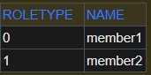

이 상황에서 roletype에 GUEST를 추가한다고 가정해보자.  
USER, ADMIN 앞에 GUEST를 추가한 상황이다.

```java
※ src/main/java/hellojpa/Roletype
public enum Roletype {
    GUEST, USER, ADMIN;
}
```

이 상태에서 RoleType을 GUEST로 member3을 persist하면 데이터베이스에는 다음과 같이 저장된다.

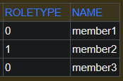

GUEST가 enum의 맨 앞에 위치하기 때문에 0으로 지정되었고, 기존의 값들은 하나씩 밀린 값들로 인식되고 있다.  
하지만 인식되는게 바뀌었을 뿐 db의 기존 데이터가 이에 맞춰 변경되지는 않는다.  
member1을 USER로 저장했었고 member3는 GUEST로 저장했지만, db에서는 이 둘이 구분되지 않는다.

이번에는 EnumType.STRING으로 지정해보자.

```java
// src/main/java/hellojpa/Member
@Enumerated(EnumType.STRING)
private Roletype roletype;
```

EnumType.STRING으로 지정할 경우 아래와 같이 varchar타입으로 roletype이 저장된다.

```bash
Hibernate:
    create table Member (
        …
        roletype varchar(255),
        …
    )
```

이 상태에서 member1(USER), member2(ADMIN), member3(GUEST)를 persist하면 데이터베이스에는 다음과 같이 저장된다.

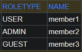

이렇게 문자열로 저장되어야 나중에 enum에 값이 추가되어도 순서로 인한 문제가 발생하지 않는다.  
따라서 @Enumerated를 사용할 때에는 반드시 EnumType.STRING 모드로 사용하자!

#### 3. @Temporal

@Temporal은 날짜 타입(java.util.Date, java.util.Calendar)을 매핑할 때 사용한다.

| 속성  | 설명                                                                                                                                                                                                                                                           | 기본값                 |
| ----- | -------------------------------------------------------------------------------------------------------------------------------------------------------------------------------------------------------------------------------------------------------------- | ---------------------- |
| value | 날짜 타입 매핑 시 사용할 매핑 전략을 결정<br />TemporalType.DATE: 날짜, db date 타입과 매핑 (2013–10–11)<br />TemporalType.TIME: 시간, db time 타입과 매핑 (11:11:11)<br />TemporalType.TIMESTAMP: 날짜와 시간, db timestamp 타입과 매핑 (2013–10–11 11:11:11) | TemporalType.TIMESTAMP |

> Java8이 업데이트되면서 최신 하이버네이트에서는 LocalDate, LocalDateTime을 사용할 때에는 @Temporal 어노테이션을 생략 가능하게 되었다.

````java
※ src/main/java/hellojpa/Member
private LocalDate testLocalDate;
private LocalDateTime testLocalDateTime;
```
출력)
Hibernate:
    create table Member (
        …
        // LocalDate → 자동으로 date로 저장
        testLocalDate date,
        // LocalDateTime → 자동으로 timestamp로 저장
        testLocalDateTime timestamp,
    )
````

#### 4. @Lob

@Lob은 데이터베이스 BLOB, CLOB 타입과 매핑된다.  
@Lob에는 지정할 수 있는 속성이 없다.  
매핑하는 필드 타입이 문자면 CLOB으로, 나머지는 BLOB으로 매핑된다.

- `CLOB`: String, char[], java.sql.CLOB
- `BLOB`: byte[], java.sql.BLOB

#### 5. @Transient

필드에 매핑되지도, 데이터베이스에 저장되지도 않는 값이다.  
주로 메모리상에만 임시로 어떤 값을 보관하고 싶을 때 사용한다.

### 기본키 매핑

기본 키 매핑 어노테이션에는 @Id, @GeneratedValue가 있다.

기본 키 매핑 방법은 다음과 같다.

- 직접 Id를 할당 -> @Id만 사용
- 자동 생성된 값을 Id에 할당 -> @Id, @GeneratedValue를 함께 사용
  - IDENTITY: 데이터베이스에 위임 (MYSQL에서 가능)
  - SEQUENCE: 데이터베이스 시퀀스 오브젝트 사용 (ORACLE에서 가능) -> @SequenceGenerator 필요
  - TABLE: 키 생성용 테이블 사용 (모든 DB에서 가능) -> @TableGenerator 필요
  - AUTO: 방언에 따라 자동 지정, 기본값

#### 1. @Id를 사용한 직접 매핑

```java
※ src/main/java/hellojpa/Member
@Id
private String id;
```

```java
※ src/main/java/hellojpa/JpaMain
Member member = new Member();
member.setId("ID_A");  // id를 직접 할당
member.setUsername("member1");
em.persist(member);
```

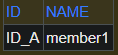

#### 2. 자동생성 - IDENTITY 전략

IDENTITY 전략을 사용할 경우 기본 키 생성을 데이터베이스에 위임한다.  
주로 MySQL, PostgreSQL, SQL Server, DB2에서 사용한다. (ex: MySQL의 AUTO\_ INCREMENT)

AUTO_INCREMENT는 DB에 INSERT SQL을 보낸 후에야 ID 값을 알 수 있다.  
이 때문에 JPA는 기본적으로는 Transaction commit시점에 INSERT SQL을 실행하지만,  
IDENTITY 전략에서는 em.persist() 시점에 즉시 INSERT SQL 실행하고 DB에서 식별자를 조회해서 가져온다.

```java
※ src/main/java/hellojpa/Member
@Id @GeneratedValue(strategy = GenerationType.IDENTITY)
private Long id;
```

```java
※ src/main/java/hellojpa/JpaMain
Member member1 = new Member();
member1.setUsername("member1");
em.persist(member1);

Member member2 = new Member();
member2.setUsername("member2");
em.persist(member2);
```

```bash
Hibernate:
    create table Member (
        # h2 방언으로 generated by default as identity
        # mysql 방언으로는 not null auto_increment
       id varchar(255) generated by default as identity,
        name varchar(255) not null,
        primary key (id)
    )
Hibernate:
    /* insert hellojpa.Member
        */ insert
        into
            Member
            (id, name)
        values
            (null, ?)   # id가 null값으로 들어감 → db에서 알아서 생성
```

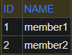

#### IDENTITY전략에서의 특이점

IDENTITY전략에서는 id에 아무 값도 넣지 않은 상태로 db에 쿼리를 보낸 후, db에서 자체적으로 id를 세팅한다.  
그렇기 때문에 db에 데이터가 들어가고 나서야 id 값을 알 수 있다.

그런데 영속성 context에서 관리되려면 pk값이 반드시 있어야 한다.  
대표적으로 1차 캐시에서는 id값을 key로 사용해서 관리한다.  
이 때문에 IDENTITY전략에서 JPA는 em.persist()를 호출하는 시점에 바로 db에 INSERT쿼리를 전달해 버린다.

```java
// src/main/java/hellojpa/Member
Member member = new Member();
member.setUsername("member");
System.out.println("===============");
em.persist(member);
System.out.println("member.id = " + member.getId());
System.out.println("===============");
```

출력 결과는 아래와 같다.

```bash
===============
# em.persist() 시점에 쿼리가 날라감
Hibernate:
    /* insert hellojpa.Member
        */ insert
        into
            Member
            (id, name)
        values
            (null, ?)   # null인 상태로 쿼리 전달
member1.id = 1   # 이후의 라인에서는 id값 확인이 가능함
===============
```

em.persist(member)시점에 INSERT 쿼리가 날라가고, 쿼리를 받은 db는 자체적으로 id 값을 생성한다.  
이 때 JPA(jdbc API)는 내부적으로 db에 SELECT 쿼리를 보내서 id값을 가져오고, 영속성 context에서 사용한다.  
미리 INSERT쿼리를 보내버리기 때문에, IDENTITY전략에서는 쿼리를 모아서 한 번에 보내는 전략이 불가능하다.

#### 3. 자동생성 - SEQUENCE 전략

database sequence는 unique한 값을 순서대로 생성하는 특별한 database object이다.  
대표적으로 Oracle, PostgreSQL, DB2, H2 데이터베이스에서 SEQUENCE 전략을 사용할 수 있다.

```java
// src/main/java/hellojpa/Member
@Id @GeneratedValue(strategy = GenerationType.SEQUENCE)
private Long id;
```

```java
// src/main/java/hellojpa/JpaMain
Member member1 = new Member();
member1.setUsername("member1");
em.persist(member1);
Member member2 = new Member();
member2.setUsername("member2");
em.persist(member2);
```

```bash
# sequence 객체 생성, 기본 이름인 hibernate_sequence로 생성됨
Hibernate: create sequence hibernate_sequence start with 1 increment by 1
Hibernate:
    create table Member (...)
# sequence로부터 다음에 지정할 값을 받아옴
Hibernate:
    call next value for hibernate_sequence
Hibernate:
    /* insert hellojpa.Member
        */ insert
        into
            Member
            (name, id)
        values
            (?, ?)  # id에 값이 지정된 상태로 insert 쿼리가 날라감
```

시퀀스 사용 시에는 엔티티에 @SequenceGenerator 어노테이션을 추가하여 식별자 생성기를 등록할 수 있다.  
@SequenceGenerator에 지정할 수 있는 속성은 다음과 같다.

| 속성           | 설명                                                                   | 기본값             |
| -------------- | ---------------------------------------------------------------------- | ------------------ |
| name           | 식별자 생성기의 이름                                                   | 엔티티 이름        |
| sequenceName   | 데이터베이스에 등록되어 있는 시퀀스 이름                               | hibernate_sequence |
| initialValue   | 시퀀스 DDL을 생성할 때 처음 시작하는 수를 지정, DDL 생성 시에만 사용됨 | 1                  |
| allocationSize | 시퀀스 한 번 호출에 증가하는 수 (성능 최적화에 사용됨)                 | 50                 |
| catalog        | 데이터베이스 catalog 매핑                                              |                    |
| schema         | 데이터베이스 schema 매핑                                               |                    |

```java
※ src/main/java/hellojpa/Member
@Entity
@SequenceGenerator(
    name = "MEMBER_SEQ_GENERATOR",
    sequenceName = "MEMBER_SEQ",  // 매핑할 데이터베이스 시퀀스 이름
    initialValue = 1, allocationSize = 1
)
public class Member {
    @Id
    @GeneratedValue(
        strategy = GenerationType.SEQUENCE,
        generator = "MEMBER_SEQ_GENERATOR"   // sequence generator 지정
    )
    private Long id;
}
```

```bash
# 시퀀스 생성
Hibernate: create sequence MEMBER_SEQ start with 1 increment by 1
…
# 시퀀스로부터 다음에 지정할 값을 받아옴
Hibernate:
    call next value for MEMBER_SEQ
```

#### SEQUENCE 전략의 특이점

Member 엔티티 생성 시 id는 Sequence에 맡기게 된다.  
그런데 em.persist(member)에서 영속성 context에 엔티티를 넣기 위해서는 id 값을 알아야 한다.  
Sequence는 db에서 관리하기 때문에, 결국 id를 알기 위해서는 db로부터 값을 가져와야 한다.  
이 때문에 SEQUENCE 전략에서 JPA는 어플리케이션 로딩 시점에 시퀀스를 미리 생성해두고, 영속화 시점에 시퀀스에서 id값을 가져온다.

```java
※ src/main/java/hellojpa/JpaMain
Member member1 = new Member();
member1.setUsername("member1");
System.out.println("===============");
em.persist(member1);
System.out.println("member1.id = " + member1.getId());
System.out.println("===============");
```

> 출력

```bash
# MEMBER_SEQ 시퀀스 생성, 1부터 시작해서 1씩 증가
Hibernate: create sequence MEMBER_SEQ start with 1 increment by 1
…
===============
# MEMBER_SEQ의 다음 값을 가져와서 member에 저장 -> 영속화에 사용
Hibernate:
    call next value for MEMBER_SEQ
member1.id = 1
===============
# INSERT쿼리는 Transaction commit 시점에 db에 전달됨 -> 버퍼링 기능 사용 가능!
Hibernate:
    /* insert hellojpa.Member
        */ insert
        into
            Member
            (name, id)
        values
            (?, ?)
```

**allocation_size를 이용한 최적화**  
allocation_size를 이용하면 지정한 개수만큼 id 값을 미리 땡겨올 수 있다.  
처음에는 1개만 가져오고, 그 다음부터 allocation_size 만큼 가져온다.

```java
// src/main/java/hellojpa/Member
@Entity
@SequenceGenerator(
    name = "MEMBER_SEQ_GENERATOR",
    sequenceName = "MEMBER_SEQ",
    initialValue = 1, allocationSize = 50
)
public class Member {
    @Id
    @GeneratedValue(
        strategy = GenerationType.SEQUENCE,
        generator = "MEMBER_SEQ_GENERATOR"
    )
    private Long id;
}
```

```java
// src/main/java/hellojpa/JpaMain
Member member1 = new Member();
member1.setUsername("member1");
Member member2 = new Member();
member2.setUsername("member2");
Member member3 = new Member();
member3.setUsername("member3");

System.out.println("===============");
em.persist(member1);  // 1 저장 → 51까지 땡겨옴
em.persist(member2);  // 메모리에서 가져옴
em.persist(member3);  // 메모리에서 가져옴
System.out.println("member1.id = " + member1.getId());
System.out.println("member2.id = " + member2.getId());
System.out.println("member3.id = " + member3.getId());
System.out.println("===============");
```

```bash
# 한 번에 50개씩 가져옴
Hibernate: create sequence MEMBER_SEQ start with 1 increment by 50
Hibernate:
    create table Member (...)
===============
# id를 1까지 가져옴
Hibernate:
    call next value for MEMBER_SEQ
# id를 51까지 가져옴
Hibernate:
    call next value for MEMBER_SEQ
member1.id = 1
member2.id = 2
member3.id = 3
===============

Hibernate:
    /* insert hellojpa.Member
        */ insert
        into
            Member
            (name, id)
        values
            (?, ?)
```

db에서 확인해보면 처음에는 시퀀스의 상태가 다음과 같다.

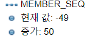

시퀀스 호출을 통해 값을 불러온 뒤에는 다음과 같이 변경된다.

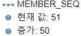

#### 4. 자동생성 - TABLE 전략

TABLE 전략은 키 생성 전용 테이블을 하나 만들어서 데이터베이스 시퀀스를 흉내내는 전략이다.  
해당 전략은 시퀀스를 지원하지 않는 데이터베이스에도 적용 가능하다는 장점이 있다.  
어떤 DB는 AUTO_INCREMENT를 사용하고, 어떤 DB는 SEQUENCE를 사용하기 때문에 선택이 제한되는데, TABLE 전략은 이런 점을 고려할 필요가 없다.
다만 TABLE 전략은 최적화가 되어있지 않기 떄문에 성능 issue가 발생할 수 있다.

@TableGenerator에는 다음과 같은 속성을 지정할 수 있다.

| 속성                   | 설명                                                   | 기본값             |
| ---------------------- | ------------------------------------------------------ | ------------------ |
| name                   | 식별자 생성기의 이름                                   | 엔티티 이름        |
| table                  | 키 생성 테이블명                                       | hibernate_sequence |
| pkColumnName           | 시퀀스 컬럼명                                          | sequence_name      |
| valueColumnName        | 시퀀스 값 컬럼명                                       | next_val           |
| pkColumnValue          | 키로 사용할 값 이름                                    | 엔티티 이름        |
| initialValue           | 초기 값                                                | 0                  |
| allocationSize         | 시퀀스 한 번 호출에 증가하는 수 (성능 최적화에 사용됨) | 50                 |
| catalog                | 데이터베이스 catalog 매핑                              |                    |
| schema                 | 데이터베이스 schema 매핑                               |                    |
| uniqueConstraints(DDL) | 유니크 제약 조건을 지정                                | -                  |

```java
// src/main/java/hellojpa/Member
@Entity
@TableGenerator(
    name = "MEMBER_SEQ_GENERATOR",
    table = "MY_SEQUENCES",  // 테이블 이름
    pkColumnValue = "MEMBER_SEQ",  // pk column명
    allocationSize = 1
)
public class Member {
    @Id
    @GeneratedValue(
        strategy = GenerationType.TABLE,
        generator = "MEMBER_SEQ_GENERATOR"
    )
    private Long id;
```

```bash
# MY_SEQUENCES 테이블 생성
Hibernate:
    create table MY_SEQUENCES (
       sequence_name varchar(255) not null,
        next_val bigint,
        primary key (sequence_name)
    )
```

MY_SEQUENCES 테이블을 다음과 같이 조회할 수 있다. - `SELECT * FROM MY_SEQUENCES`

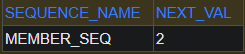

데이터를 입력할수록 NEXT_VAL의 칼럼 값이 증가한다.

다만 서비스 운영 시 TABLE전략을 사용하기는 부담스럽다.  
가능하면 사용하는 DB에 맞춰서 IDENTITY나 SEQUENCE 전략을 사용하는 것을 권장한다.

#### 권장하는 식별자 전략

기본 키 제약 조건은 **null이면 안되고, 유일해야 되고, 변하면 안된다.**
먼 미래까지 '변하면 안된다'는 조건을 만족하는 자연키는 찾기 어렵다.  
따라서 대리키(대체키)를 사용하는 것이 적절하다.

- 자연키 예: 주민등록번호(비즈니스에서 사용)
- 대리키 예: Generated Value(비즈니스와 상관없음)

보통은 Long형 + 대체키(sequence, UUID…) + 키 자동 생성 전략을 사용하는 것을 권장한다.  
AutoIncrement나 Sequence 전략을 사용하고, 필요에 따라서 UUID나 랜덤값을 조합한 값을 사용한다.

### 실전예제 - 1. 요구사항 분석과 기본 매핑

서비스의 요구사항은 다음과 같다.

- 회원은 상품을 주문할 수 있다.
- 주문시 여러 종류의 상품을 선택할 수 있다.

기능 목록은 다음과 같다.

- 회원 기능: 회원 등록, 회원 조회
- 상품 기능: 상품 등록, 상품 수정, 상품 조회
- 주문 기능: 상품 주문, 주문내역 조회, 주문 취소

도메인 모델은 다음과 같이 구성한다.

- 회원과 주문의 관계: 회원은 여러 번 주문할 수 있다. (일대다)
- 주문과 상품의 관계: 주문할 때 여러 상품을 선택할 수 있다.
  반대로 같은 상품도 여러 번 주문될 수 있다.(다대다)
  -> 주문상품이라는 중간 테이블을 만들어서, 다대다 관계를 일다대 & 다대일 관계로 풀어내야 한다.

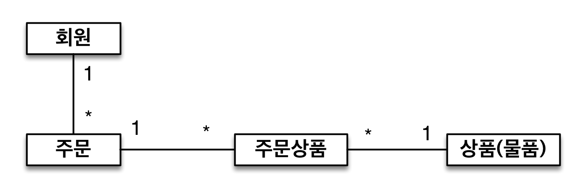

이를 바탕으로 다음과 같이 테이블을 설계할 수 있다.

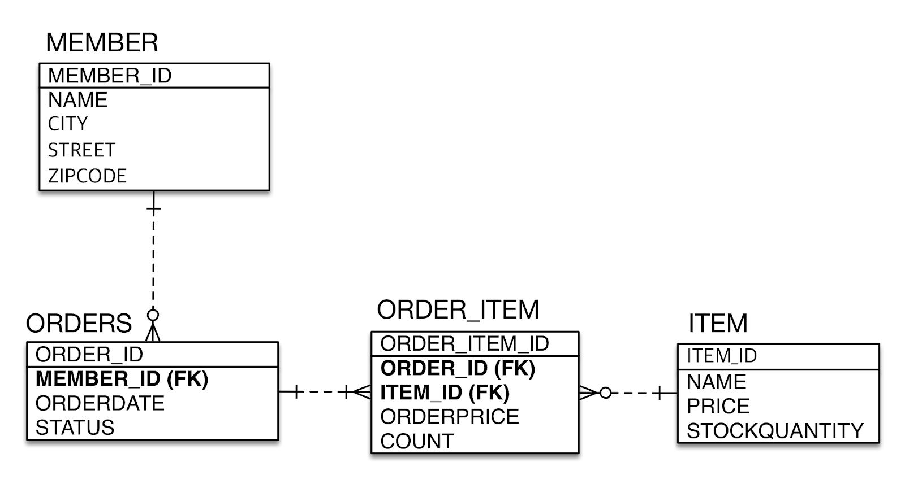

엔티티 설계는 다음과 같다.

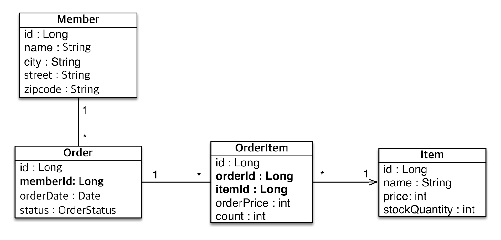

지금의 엔티티 설계에는 외부키인 다른 테이블의 id가 엔티티 안에 직접 들어가 있기 때문에, 데이터 중심으로 엔티티가 설계되었다고 볼 수 있다.

```java
// src/main/java/jpabook.jpashop/domain/Member
@Entity
public class Member {
    @Id @GeneratedValue  // starategy=GenerationType.AUTO 사용
    @Column(name = "member_id")
    private Long id;

    private String name;
    private String city;
    private String street;
    private String zipcode;
    …  // getter, setter 정의
}
```

```java
// src/main/java/jpabook.jpashop/domain/Item
@Entity
public class Item {
    @Id @GeneratedValue
    @Column(name = "item_id")
    private Long id;

    private String name;
    private int price;
    private int stockQuantity;
    …  // getter, setter 정의
}
```

```java
// src/main/java/jpabook.jpashop/domain/Order
@Entity
@Table(name = "ORDERS")
public class Order {
    @Id @GeneratedValue
    @Column(name = "order_id")
    private Long id;

    @Column(name = "member_id")
    private Long memberId;    // 객체를 관계형 db에 맞춘 설계

    //  db 관점에서는 이름이 order_date 처럼 snake case로 되어 있는 것이 좋다.
    // boot를 사용하면 camelCase를 자동으로 snake_case 방식으로 바꿔준다.
    private LocalDateTime orderDate;

    @Enumerated(EnumType.STRING)
    private OrderStatus orderStatus;
    …  // getter, setter 정의
}
```

```java
// src/main/java/jpabook.jpashop/domain/OrderItem
@Entity
public class OrderItem {
    @Id @GeneratedValue
    @Column(name = "order_item_id")
    private Long id;

    @Column(name = "order_id")
    private Long orderId;

    @Column(name = "item_id")
    private Long itemId;

    private int orderPrice;
    private int count;
    …  // getter, setter 정의
}
```

```java
※ src/main/java/jpabook.jpashop/domain/OrderStatus
public enum OrderStatus {
    ORDER, CANCEL
}
```

```java
※ src/main/java/jpabook.jpashop/JpaMain
public class JpaMain {
    public static void main(String[] args) {
        EntityManagerFactory emf = Persistence.createEntityManagerFactory("hello");
        EntityManager em = emf.createEntityManager();
        EntityTransaction tx = em.getTransaction();
        tx.begin();
        try {
            Order order = em.find(Order.class, 1L);
            Long memberId = order.getMemberId();

            // 연관관계가 있는 객체를 id를 바탕으로 db에서 조회해서 가져와야 한다.
            // 객체 지향적이기 위해서는 주문한 member가 누구인지를 order.getMember()로 바로 구할 수 있어야 한다.
            Member member = em.find(Member.class, memberId);

            tx.commit();
        } catch (Exception e) {
            tx.rollback();
        } finally {
            em.close();
        }
        emf.close();
    }
}
```

```bash
> 출력
Hibernate:
    create table Item (
       item_id bigint not null,
        name varchar(255),   price integer not null,
        stockQuantity integer not null,    primary key (item_id)
    )
Hibernate:
    create table Member (
       member_id bigint not null,
        city varchar(255),   name varchar(255),
        street varchar(255),    zipcode varchar(255),
        primary key (member_id)
    )
Hibernate:
    create table OrderItem (
       order_item_id bigint not null,
        count integer not null,    item_id bigint,
        order_id bigint,    orderPrice integer not null,
        primary key (order_item_id)
    )
Hibernate:
    create table ORDERS (
       order_id bigint not null,
        member_id bigint,
        orderDate timestamp,
        orderStatus varchar(255),
        primary key (order_id)
    )
```

현재 방식은 객체 설계를 테이블 설계에 맞춘 방식으로, 테이블의 외래키를 객체의 프로퍼티로 그대로 가져왔다.  
이로 인해 객체 그래프 탐색이 불가능하고, 참조가 없으므로 UML(다이어그램)에도 맞지 않다.
