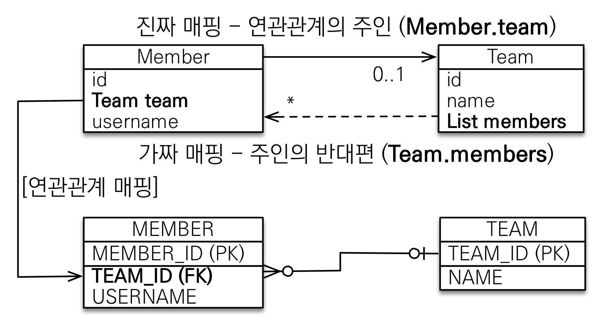

### 연관관계 매핑 기초

객체지향 설계의 목표는 자율적인 객체들의 협력 공동체를 만드는 것이다.  
객체간의 협력을 위해서는, 객체간 연관관계를 만드는 작업이 필수적이다.

예제 시나리오를 다음과 같이 가정하자

- 회원과 팀이 있다.
- 회원은 하나의 팀에만 소속될 수 있고, 회원과 팀은 다대일 관계다.

객체를 테이블에 맞추어 모델링하면 다음과 같이 참조를 통한 객체 간 연관관계가 없어진다.
그 대신 연관 객체의 식별자를 갖게 된다.


  
테이블과 객체 사이에는 아래와 같은 큰 간격이 존재한다.

- **테이블**은 **외래 키로 조인**해서 연관된 테이블을 찾는다.
- **객체**는 **참조**를 사용해서 연관된 객체를 찾는다.

```java
// src/main/java/hellojpa/Member
@Entity
public class Member {
  @Id @GeneratedValue
  @Column(name = "MEMBER_ID")
  private Long id;

  @Column(name = "USERNAME")
  private String username;

  // 외래키를 프로퍼티로 가지고 있음
  @Column(name = "TEAM_ID")
  private Long teamId;

  …  // getter, setter 정의
}
```

```java
// src/main/java/hellojpa/Team
@Entity
public class Team {
    @Id @GeneratedValue
    @Column(name = "TEAM_ID")
    private Long id;

    private String name;

    …  // getter, setter 정의
}
```

```java
※ src/main/java/hellojpa/JpaMain
…
Team team = new Team();
team.setName("TeamA");
em.persist(team);

Member member = new Member();
member.setUsername("member1");
member.setTeamId(team.getId());  // 식별자로 객체 간 연관관계를 설정
em.persist(member);

Member findMember = em.find(Member.class, member.getId());
// findMember가 속한 팀을 조회하고 싶은 경우, id를 사용해서 영속성 컨텍스트에서 조회해야 한다
Long findTeamId = findMember.getTeamId();
Team findTeam = em.find(Team.class, findTeamId);

tx.commit();
```

### 단방향 연관관계

객체지향다운 모델링은 아래와 같다.


먼저 엔티티 객체에는 다음과 같이 연관관계가 있는 객체에 대한 참조를 가지게 하고, @ManyToOne, @JoinColumn 어노테이션을 추가해서 관계를 설정한다.

```java
// src/main/java/hellojpa/Member
@Entity
public class Member {
    …
    @ManyToOne  // Member 입장에서 many, Team 입장에서 one
    @JoinColumn(name = "TEAM_ID")  // join해야 하는 column을 명시
    private Team team;
}
```

이제 엔티티 저장 시에는 연관관계를 설정할 엔티티를 조회하고, 참조에 객체를 넣어주면 된다.  
JPA가 알아서 연관관계 엔티티의 pk값을 꺼내서, insert시 foreign key로 사용하여 쿼리를 생성한다.

아래 예시에서는 teamA, teamB 객체를 생성하고, member1의 팀을 teamA로 설정했다.  
이 때 엔티티 저장 후 직접 flush 및 clear 해서, 이후에 발생하는 select 쿼리를 확인할 수 있게 했다.  
(이렇게 하지 않았다면 1차 캐시에서 엔티티를 조회해왔을 것)  
이후에는 memeber1의 팀을 teamB로 변경했다.

```java
// src/main/java/hellojpa/JpaMain
/**
 * 단방향 연관관계 저장
 */
Team team = new Team();
team.setName("TeamA");
em.persist(team);

Team team2 = new Team();
team.setName("TeamB");
em.persist(team2);

Member member = new Member();
member.setUsername("member1");
member.setTeam(team);
em.persist(member);

em.flush();
em.clear();

/**
 * 단방향 연관관계 조회
 */
Member findMember = em.find(Member.class, member.getId());
// 참조를 통한 연관 객체 탐색
Team findTeam = findMember.getTeam();
System.out.println("findTeam = " + findTeam.getName());

/**
 * 단방향 연관관계 수정
 */
Team newTeam = em.find(Team.class, 2L);
findMember.setTeam(newTeam);

tx.commit();
```

```bash
… # team1, team2 INSERT

Hibernate:
    # member1 INSERT
    /* insert hellojpa.Member
        */ insert
        into
            Member
            (TEAM_ID, USERNAME, MEMBER_ID)
        values
            (?, ?, ?)

…
    # member1, team1 JOIN SELECT - em.find(Member.class, member.getId())
    select
        member0_.MEMBER_ID as MEMBER_I1_0_0_,
        member0_.TEAM_ID as TEAM_ID3_0_0_,
        member0_.USERNAME as USERNAME2_0_0_,
        team1_.TEAM_ID as TEAM_ID1_1_1_,
        team1_.name as name2_1_1_
    from
        Member member0_
    left outer join
        Team team1_
            on member0_.TEAM_ID=team1_.TEAM_ID
    where
        member0_.MEMBER_ID=?

findTeam = TeamA

    …  # teamB SELECT - em.find(Team.class, 2L)
    # member1 UPDATE - findMember.setTeam(teamB)
    /* update
        hellojpa.Member */ update
            Member
        set
            TEAM_ID=?,
            USERNAME=?
        where
            MEMBER_ID=?
```

### 양방향 연관관계와 연관관계의 주인

양방향으로 이루어진 연관관계에서는 객체 간에 양쪽 방향으로 자유롭게 이동할 수 있어야 한다.  
예시에서는 Member → Team, Team → Member로 모두 이동이 가능하다.


Table 구조에는 양방향/단방향의 개념이 없다.  
Member, Team을 함께 조회하기 위해서는, Member의 TEAM_ID를 외래키로 두고 Member-Team을 join해서 가져오면 된다.


```java
// src/main/java/hellojpa/Team
@Entity
public class Team {
    …
    @OneToMany(mappedBy = "team")  // Member의 team 변수에 매핑되어 있음을 명시
    private List<Member> members = new ArrayList<>(); // add할 때 null point Exception이 없도록 ArrayList를 넣어둠
}
```

```java
※ src/main/java/hellojpa/JpaMain
…
/**
 * 양방향 연관관계 저장
 */
Team team = new Team();
team.setName("TeamA");
em.persist(team);

Member member = new Member();
member.setUsername("member1");
member.setTeam(team);
em.persist(member);

em.flush();
em.clear();

/**
 * 양방향 연관관계 조회
 */
Member findMember = em.find(Member.class, member.getId());
List<Member> members = findMember.getTeam().getMembers();  // 양방향으로 꺼내는게 가능하다!
for (Member m : members) {
    System.out.println("m = " + m.getUsername());
}
tx.commit();
```

```
m = member1
```

객체와 테이블은 관계를 맺는 방식에 차이가 있다.  
객체의 양방향 연관관계는 단방향 연관관계 2개로 구성된다.

- (회원 → 팀) 연관관계 1개(단방향)
- (팀 → 회원) 연관관계 1개(단방향)

따라서 A와 B가 양방향 관계를 가지게 하려면, 서로를 참조할 수 있는 단방향 관계를 2개 만들어야 한다.

- A → B (`a.getB()`)
- B → A (`b.getA()`)

이와 달리, 테이블의 연관관계는 언제나 양방향 1개로만 구성된다.

- (회원 ↔ 팀) 연관관계 1개(양방향)

테이블은 외래 키 하나로 두 테이블의 연관관계를 관리한다.  
MEMBER의 TEAM_ID 외래 키 하나로 양쪽으로 조인하는 것이 모두 가능하다.

```sql
SELECT *
FROM MEMBER M
JOIN TEAM T ON M.TEAM_ID = T.TEAM_ID
-----------------------------------------
SELECT *
FROM TEAM T
JOIN MEMBER M ON T.TEAM_ID = M.TEAM_ID
```

이 때 두 테이블 중 연관관계의 주인을 정해야 한다.  
즉 Member의 team 변수와 Team의 members 변수 중 하나로 외래 키를 관리해야 한다.  
이에 따라 Member의 team이 변경되었을 때, 또는 Team의 members가 변경되었을 때 TEAM_ID를 업데이트하게 된다.  


**연관관계의 주인(Owner)**은 양방향 매핑의 주요한 규칙이다.  
객체의 두 관계중 하나를 연관관계의 주인으로 지정해서, 연관관계의 주인만이 외래 키에 대한 수정 권한을 가진다.  
주인이 아닌 쪽은 외래키에 대한 읽기만 가능하고, mappedBy 속성을 통해 주인이 되는 필드를 지정해야 한다.   

문제는 누구를 주인으로 하느냐인데, 보통 외래 키가 있는 엔티티를 주인으로 정한다.  
1:N 관계에서 외래키는 N쪽 테이블에 존재하므로, N쪽을 주인으로 정하게 된다.  
예시에서는 MEMBER 테이블에 TEAM_ID(FK)가 존재하므로, Member.team이 연관관계의 주인이 된다.



예시에서 team.members를 통해 팀의 멤버 목록을 조회하는 것은 가능하지만, team.members에 수정을 가해도 db에 변화가 일어나지는 않는다!  
오로지 Member.team이 변경되었을 때에만 db에 UPDATE문이 날라간다.

이런 식으로 구성하는 이유는, 외래키가 없는 쪽을 주인으로 정할 경우 테이블 - 객체 매핑에 혼동이 될 수 있기 때문이다.  
예를 들어 team.members를 연관관계의 주인으로 지정한다면,
개발자는 team 객체의 값을 변경했는데 MEMBER 테이블에 쿼리가 날라가는 상황이 발생한다.  
개발자가 수정을 가한 객체와 영향을 받는 테이블이 불일치되기 때문에 혼란이 생긴다.

양방향 매핑시 가장 많이 하는 실수는, 연관관계의 주인에 값을 입력하지 않는 것이다.  
아래와 같이 연관관계에서 주인이 아닌 쪽에 값을 넣으면, db에는 반영이 되지 않는다.

```java
// src/main/java/hellojpa/JpaMain
Member member = new Member();
member.setUsername("member1");
em.persist(member);   // member에서는 team을 넣지 않음

Team team = new Team();
team.setName("TeamA");
team.getMembers().add(member);   // team에서 member를 넣음
em.persist(team);
```

→ MEMBER 테이블에서 TEAM_ID가 입력되지 않음


```java
// src/main/java/hellojpa/JpaMain
Team team = new Team();
team.setName("TeamA");
em.persist(team);  // team에서는 member를 넣지 않음

Member member = new Member();
member.setUsername("member1");
member.setTeam(team); // member에서 team을 넣음
em.persist(member);
```

→ MEMBER 테이블에서 TEAM_ID가 정상적으로 입력됨


```java
// src/main/java/hellojpa/JpaMain
…   // 위와 동일
em.flush();
em.clear();

Team findTeam = em.find(Team.class, team.getId());
List<Member> members = findTeam.getMembers();  // members를 사용하는 시점에 쿼리가 날라간다
for (Member m : members) {      // →  직접 team.getMembers.add(member)를 하지 않아도 값이 잘 출력된다
    System.out.println("m = " + m.getUsername());
}
```

```bash
# em.find(Team.class, team.getId())
Hibernate:
    select
        team0_.TEAM_ID as TEAM_ID1_1_0_,
        team0_.name as name2_1_0_
    from
        Team team0_
    where
        team0_.TEAM_ID=?
# findTeam.getMembers(), m.getUsername()
Hibernate:
    select
        members0_.TEAM_ID as TEAM_ID3_0_0_,
        members0_.MEMBER_ID as MEMBER_I1_0_0_,
        members0_.MEMBER_ID as MEMBER_I1_0_1_,
        members0_.TEAM_ID as TEAM_ID3_0_1_,
        members0_.USERNAME as USERNAME2_0_1_
    from
        Member members0_
    where
        members0_.TEAM_ID=?
m = member1
```

위와 같이, 연관관계 주인이 아닌쪽에는 값을 넣지 않아도 정상적으로 작동이 된다.  
하지만 양쪽에서 모두 값을 넣어주는게 안전하다.  
영속성 컨텍스트가 완전히 flush, clear 하지 않은 상태에서 주인이 아닌 쪽을 조회하면, 값이 없을 수 있다.

```java
// src/main/java/hellojpa/JpaMain
Team team = new Team();
team.setName("TeamA");
em.persist(team);

Member member = new Member();
member.setUsername("member1");
member.setTeam(team);
em.persist(member);

Team findTeam = em.find(Team.class, team.getId());   // 1차 캐시에서 가져옴
List<Member> members = findTeam.getMembers();   // → findteam.members에는 member1이 들어있지 않음
                                                //      정상적으로 조회가 되지 않는다.
System.out.println("==============");
for (Member m : members) {      //
    System.out.println("m = " + m.getUsername());
}
System.out.println("==============");
```

```
==============
==============
```

또한, test case를 작성할 때에는 JPA 없이 순수한 Java 코드로 작성하는 경우에도 에러가 발생할 수 있다.  
따라서 양방향 관계인 경우에는 양쪽 모두에 값을 세팅하자!

양쪽에 값을 모두 세팅하기 위해 양쪽에 값을 모두 설정해주는 연관관계 편의 메소드를 정의해서 사용하면 편리하다.  
관계에 있는 두 엔티티 중 한 쪽에만 작성해주면 된다.

아래 예시에서는 Member에 changeTeam 메서드를 정의했다.  
change라는 이름을 사용해서 getter,setter와 혼동하지 않도록 했다.

```java
// src/main/java/hellojpa/Member
@Entity
public class Member {
    …
    public void changeTeam(Team team) {
        this.team = team;
        team.getMembers().add(this);
    }
}
```

또는 Team 엔티티에 addMember 메서드로 추가하는 것도 가능하다.

```java
※ src/main/java/hellojpa/Team
@Entity
public class Team {
    …
    public void addMember(Member member) {
        member.setTeam(this);
        members.add(member);
    }
}
```

단, 양방향 매핑시에는 무한 루프를 항상 조심해야 한다.  
toString(), lombok, JSON 생성 라이브러리 등에서는 연관관계에 있는 엔티티를 참조할 수 있는데, 이 때 무한 루프가 발생할 수 있다.  
아래 예시에서는 Member, Team 양쪽에서 서로의 toString()을 호출하고 있으므로, 무한루프가 발생한다!  
lombok에서는 프로퍼티를 바탕으로 toString()을 자동으로 만들어버리기 때문에 신경을 써야 한다.

```java
※ src/main/java/hellojpa/Member
@Entity
public class Member {
    …
    @Override
    public String toString() {
        return "Member{" +
                "id=" + id +
                ", username='" + username + '\'' +
                ", team=" + team +    // team.toString() 호출
                '}';
    }
}
```

```java
※ src/main/java/hellojpa/Team
@Entity
public class Team {
    …
    @Override
    public String toString() {
        return "Team{" +
                "id=" + id +
                ", name='" + name + '\'' +
                ", members=" + members +        // member.toString() 호출
                '}';
    }
}
```

또한 Controller에서 response에 Entity를 직접 전달하는 경우 내부에서 JSON 생성 라이브러리를 사용하게 되는데, 이 과정에서 문제가 생길 수 있다.  
이 때에도 Entity가 양방향 관계일 경우 서로를 바라보고 있어서 무한루프가 발생한다.  
이 때문에 Controller에서는 절대 엔티티를 직접 반환하지 않고, DTO로 변환해서 반환해야 한다.

마지막으로 정리하자면, 객체 - 테이블 매핑 설계시에는 단방향 매핑만으로 설계를 완료해야 한다.  
보통 테이블 설계를 그리면서 객체를 설계하게 하는데, 그러다보면 어느쪽에 foreign key를 넣을지가 대충 결정이 된다.  
이에 맞게 단방향 매핑만을 넣어준다.

양방향 매핑은 반대 방향으로 조회하는 기능이 추가된 것 뿐이다.(특히 JPQL에서 역방향으로 탐색할 일이 많다.)  
기본적으로 단방향 매핑을 잘 구성하고, 양방향은 어플리케이션 개발 단계에서 필요할 때 추가하는 식으로 구성하자.  
어차피 java코드 몇 줄만 넣어주면 되고, 테이블에 영향을 주지 않기 때문에 설계 단계에서 이를 고려할 필요가 없다.

### 실전예제 - 2. 연관관계 매핑 시작

테이블 구조는 이전과 동일하다.


객체 구조에서는 연관관계에서 서로의 참조를 사용하도록 변경했다.


```java
// src/main/java/jpabook.jpashop/domain/Member
@Entity
public class Member {
    @Id @GeneratedValue @Column(name = "member_id")
    private Long id;
    …
    @OneToMany(mappedBy = "member")
    private List<Order> orders = new ArrayList<>();
}
```

예시를 위해서 위에서는 양방향을 사용했지만, 실무에서는 가급적 단방향을 사용하는게 좋다.  
양방향을 사용하면 양쪽 객체를 모두 신경써야 하기 때문에 복잡도가 증가하기 때문이다.  
위 예시에서도 Member 엔티티 내의 orders로 가져오기보다는, Order 테이블에서 시작하여 memberId를 이용하여 jpql을 날리는게 더 좋다.  
양방향 관계는 주인이 아닌 쪽의 엔티티를 조회할 때, 연관 관계 목록을 거의 언제나 함께 불러와야 할 때 사용해야 한다.

```java
// src/main/java/jpabook.jpashop/domain/Order
@Entity @Table(name = "ORDERS")
public class Order {
    @Id @GeneratedValue @Column(name = "order_id")
    private Long id;
    …
    @ManyToOne
    @JoinColumn(name = "MEMBER_ID") // 연관관계의 주인
    private Member member;

    @OneToMany(mappedBy = "order")
    private List<OrderItem> orderItems;
}
```

Order에서 orderItems를 가지는 것은 괜찮다.  
주문서를 뽑을 때에는 연관된 Item 목록을 함께 가져오는 경우가 대부분이기 때문이다.  
이렇게 작성하면 Order를 가져올 때 JPQL을 통해서 관련된 OrderItem을 함께 가져올 수 있어 편리하다.

```java
※ src/main/java/jpabook.jpashop/domain/OrderItem
@Entity
public class OrderItem {
    @Id @GeneratedValue
    @Column(name = "order_item_id")
    private Long id;
    …
    @ManyToOne
    @JoinColumn(name = "order_id")
    private Order order;

    @ManyToOne
    @JoinColumn(name = "item_id")
    private Item item;
}
```
