### 개요

연관관계 매핑시 3가지 고려 사항이 있다 - `다중성`, `단방향/양방향`, `연관관계의 주인`

이 때 다중성을 고려해서 db의 연관관계를 매핑하게 되는데, 각 연관관계 종류에 따라 매핑 Annotation들이 존재한다.

- 다대일: @ManyToOne
- 일대다: @OneToMany
- 일대일: @OneToOne
- 다대다: @ManyToMany(실무에서 사용 X)

### 1. 다대일[N:1]

먼저 다대일 단방향으로 관계를 구성할 수 있다.  
외래키가 있는 N 쪽에 연관된 객체의 참조를 넣고, 해당 객체를 외래키와 매핑시킨다.  
가장 많이 사용하는 연관관계로, 다대일의 반대가 일대다 관계이다.

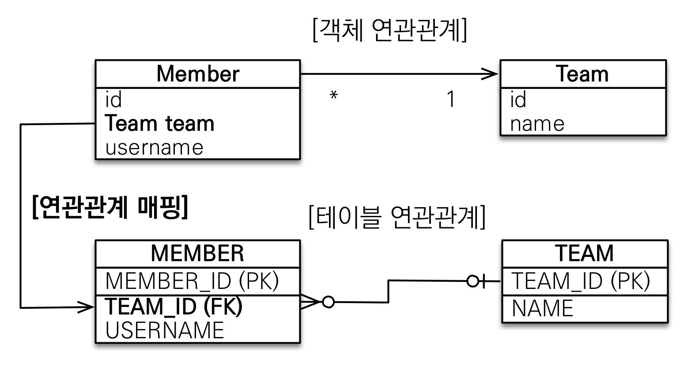

다음으로 다대일 양방향 관계를 구성할 수 있다.  
이 때 외래 키가 있는 쪽이 연관관계의 주인이 되고, 외래키가 없는 객체에는 list로 관계 매핑을 추가해서 양쪽이 서로를 참조할 수 있도록 개발한다.

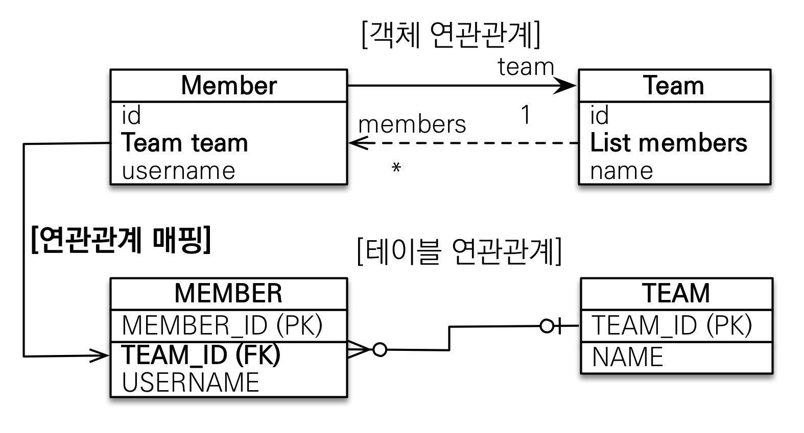

```java
// src/main/java/hellojpa/Member
@Entity
public class Member {
    …
    @ManyToOne @JoinColumn(name = "TEAM_ID")
    private Team team;
}
```

```java
// src/main/java/hellojpa/Team
@Entity
public class Team {
    …
    @OneToMany(mappedBy = "team")
    private List<Member> members = new ArrayList<>();
}
```

### 2. 일대다[1:N]

일대다 관계에서는 1 쪽에서 외래키를 관리한다.

먼저 일대다 단방향 관계는 다음과 같이 구성할 수 있다.  
Team에서 Member 목록을 조회할 필요는 있지만, Member에서 Team을 조회할 일은 없는 경우 이러한 설계를 할 수 있다.  
(다만 권장되지는 않는 설계 방식이다.)

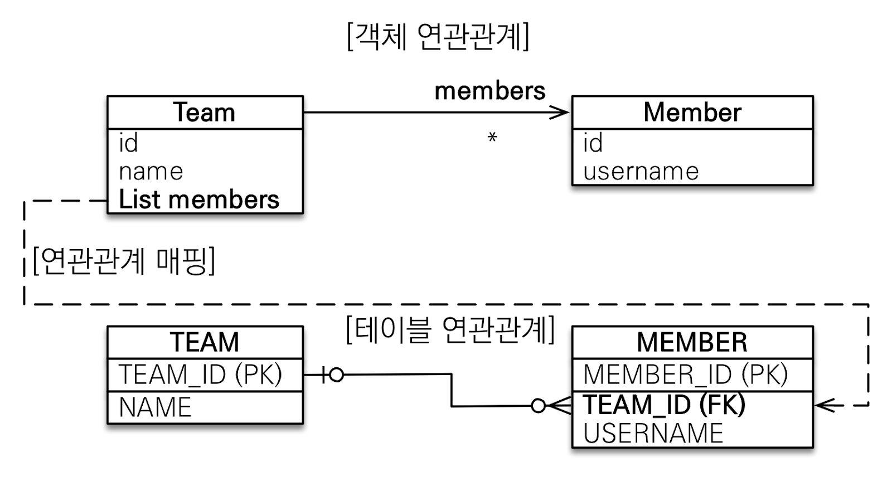

하지만 테이블 일대다 관계는 항상 다(N) 쪽에 외래 키가 있다.  
이로 인해 다대일 관계를 사용하게 되면 일(1)쪽의 엔티티가 반대편 테이블의 외래 키를 관리하는 특이한 구조가 된다.

다대일 관계를 사용할 때에는 반드시 @JoinColumn을 함께 사용해야 한다.  
그렇지 않으면 Join Table 방식을 사용하게 되는데, 이 경우 Team_Member와 같은 중간 테이블을 생성해서 관계를 매핑하게 된다.  
다만 Join Table 방식은 운영이 어렵고 성능도 저하되기 때문에 지양된다.

```java
※ src/main/java/hellojpa/Team
@Entity
public class Team {
    …
    @OneToMany
    @JoinColumn(name = "TEAM_ID")
    private List<Member> members = new ArrayList<>();
}
```

멤버와 팀 객체를 각각 생성하고, 연관관계의 주인인 Team 객체의 members 프로퍼티에 Member 객체를 추가한다.

```java
※ src/main/java/hellojpa/JpaMain
Member member = new Member();
member.setUsername("member1");
em.persist(member);

Team team = new Team();
team.setName("teamA");
team.getMembers().add(member);  // team 엔티티를 통해 연관관계 설정

em.persist(team);
```

이렇게 할 경우 Member, Team 각각을 insert 한 후에, Member의 외래키를 수정하는 것으로 쿼리가 하나 더 날라가야 한다.

```bash
# INSERT Member
Hibernate:
    /* insert hellojpa.Member
        */ insert
        into
            Member
            (USERNAME, MEMBER_ID)
        values
            (?, ?)
# INSERT Team
Hibernate:
    /* insert hellojpa.Team
        */ insert
        into
            Team
            (name, TEAM_ID)
        values
            (?, ?)
# UPDATE Member (외래키 수정)
Hibernate:
    /* create one-to-many row hellojpa.Team.members */ update
        Member
    set
        TEAM_ID=?
    where
        MEMBER_ID=?
```

코드 상에서는 Team 객체를 수정했는데, Member에 쿼리가 날라가는 상황이 발생한다.  
이러한 부분들이 혼동이 될 수 있기 때문에, Member에서 Team으로 갈 일이 없다고 하더라도 차라리 다대일 양방향 관계를 사용하는 게 낫다.

일대다 양방향 관계는 다음과 같이 구성할 수 있다.  
매핑이 공식적으로 존재하지는 않고, 읽기 전용 필드를 사용해서 양방향처럼 사용하는 방법이다.

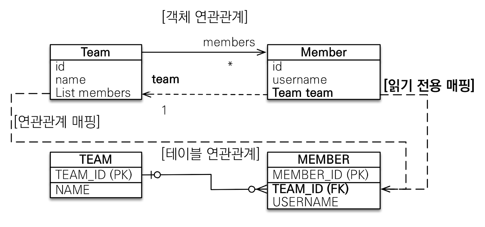

```java
※ src/main/java/hellojpa/Member
@Entity
public class Member {
    …
    @ManyToOne
    @JoinColumn(name = "TEAM_ID", insertable = false, updatable = false)   // 읽기 전용으로 만듦
    private Team team;
}
```

굳이 이렇게까지 해서 다대일 관계를 사용할 필요는 없다.  
다대일 대신 일대다 관계를 이용해서 보다 명확하게 관계를 매핑하는 것이 좋다.

### 3. 일대일[1:1]

외래키에 유니크(UNI) 제약조건이 추가되면 일대일 매핑이 된다.  
일대일 관계는 그 반대도 일대일인 대칭적 관계이다.  
따라서 주 테이블이나 대상 테이블 중에 외래 키를 넣을 위치 선택할 수 있다.  
(주 테이블 : 많이 접근되는 테이블)  
예시에서는 Member가 주 테이블이고, Locker가 대상 테이블이다.  
각 Member는 Locker를 한 개씩 배정받는다.

#### 1) 주 테이블에 외래 키

주 테이블에 외래 키를 두고, 조회 시 대상 테이블을 Join하는 것으로 테이블을 설계하는 방식이다.  
객체 설계에서는 주 객체가 대상 객체의 참조를 가지게 된다.  
위 방식은 개발자 입장에서 선호되는 방식으로, JPA 매핑이 편리하다는 장점이 있다.

- 장점: 주 테이블만 조회해도 대상 테이블의 데이터까지 확인 가능
- 단점: 값이 없으면 외래 키에 null을 허용하게 됨

단방향 관계는 다음과 같이 구성할 수 있다.

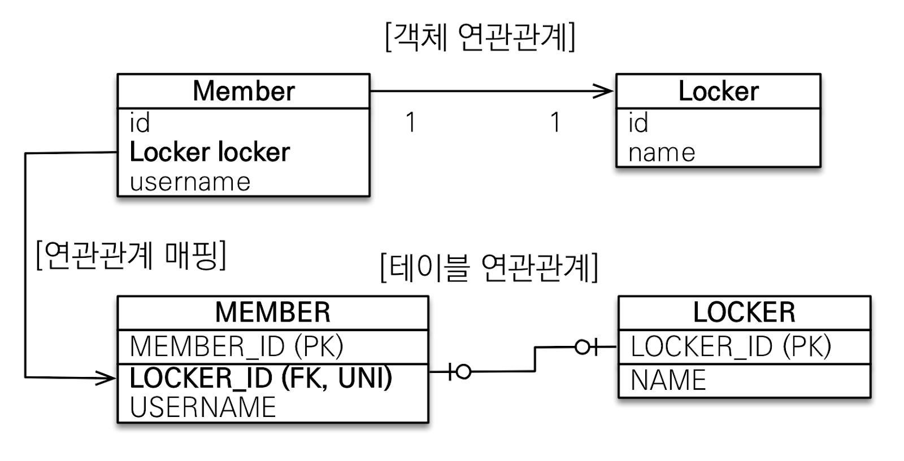

-> 설계 자체는 다대일 단방향 관계와 유사하다.

```java
// src/main/java/hellojpa/Locker
@Entity
public class Locker {
    @Id @GeneratedValue
    @Column(name="LOCKER_ID")
    private Long id;

    private String name;
}
```

```java
// src/main/java/hellojpa/Member
@Entity
public class Member {
    …
    @OneToOne
    @JoinColumn(name = "LOCKER_ID") // @ManyToOne과 작성방식이 유사함
    private Locker locker;
}
```

양방향 관계는 다음과 같이 구성한다.  
다대일 양방향 매핑처럼 외래 키가 있는 곳이 연관관계의 주인이 되고, 반대편은 mappedBy를 적용한다.

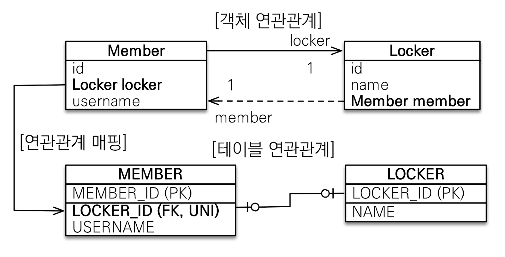

```java
※ src/main/java/hellojpa/Locker
@Entity
public class Locker {
    …
    @OneToOne(mappedBy = "locker")
    private Member member;
}
```

#### 2) 대상 테이블에 외래 키

대상 테이블에 외래 키를 두는 방식은 보통 전통적인 데이터베이스 엔지니어가 선호한다.

- 장점: 주 테이블과 대상 테이블을 일대일 관계에서 일대다 관계로 변경할 때, 테이블 구조를 유지할 수 있다.
- 단점: 프록시 기능의 한계로 지연 로딩으로 설정해도 항상 즉시 로딩됨 (프록시는 뒤에서 설명)

먼저 단방향 관계는 다음과 같이 설계할 수 있지만, JPA에서는 해당 방식을 지원하지 않는다.

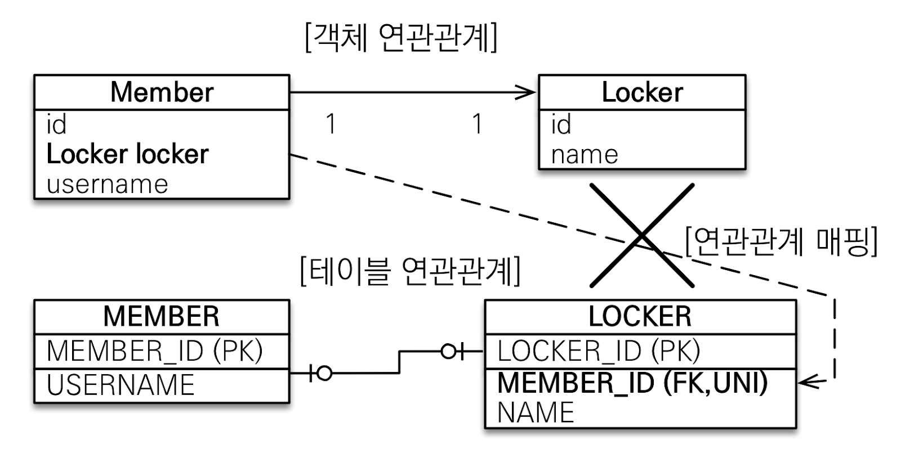

양방향 관계로는 다음과 같이 구성할 수 있다.
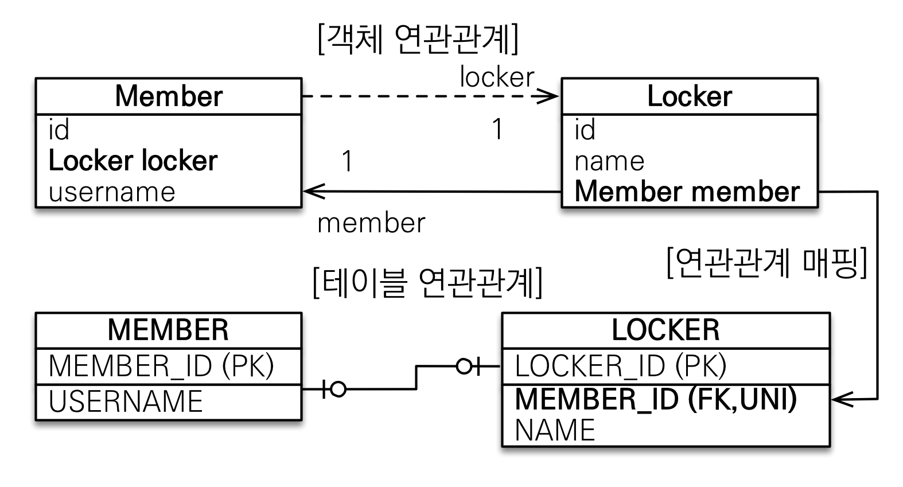

대상테이블인 Locker를 연관관계 주인으로 두고 매핑하며, Member에서는 읽기만 가능하다.  
주 테이블에 외래 키를 두는 양방향 방식과 매핑 방법은 동일하다.

#### 주 테이블에 외래키 vs 대상 테이블에 외래키

db설계상, 외래키를 어디에 두든 일대일 관계는 유효하게 성립한다.  
그러나 테이블은 한 번 만들면 변경하기 어렵기 때문에, 외래키의 위치가 미칠 장기적인 영향도 고려해야 한다.

예를 들어 시간이 흐른 뒤 Member가 다수의 Locker를 가질 수 있도록 비즈니스 로직이 변경되었을 때, Locker에 외래키가 있는 경우 ALTER를 통해 UNI 제약조건만 풀어주면 된다.  
쉽게 일대일에서 일대다로 바꿀 수 있는 것이다.  
그러나 MEMBER에 외래키가 있으면, LOCKER에 외래키 칼럼을 추가하는 등의 테이블 변경포인트가 발생한다.  
(단, 반대로 하나의 Locker가 여러 명의 Member에게 공유될 수 있도록 바뀐다면, Member에 외래키가 있는게 적절)

개발자 입장에서는 Member에 외래키가 있는게 유리하다.  
Member 테이블을 많이 SELECT하는 상황에서, 외래키를 통해 Join하는 쿼리 하나로 Locker를 함께 가져올 수 있기 때문이다.  
따라서 두가지 측면을 모두 고려해서 외래키의 위치를 정해야 한다.

### 대상 테이블에 외래키를 두면 왜 즉시로딩이 되는지?

Member 엔티티의 locker에 대한 프록시 객체를 만든다고 해보자.  
JPA 입장에서는 프록시 객체를 만들려면 연관된 locker가 존재하는지 알아야 한다.  
주테이블(Member)에 외래키가 있을 경우, 간단히 Member 테이블에 외래키가 저장되어있는지를 확인하면 된다.  
그러나 대상테이블(Locker)에 외래키가 있을 경우, Locker 테이블의 전체 데이터에서 외래키로 MEMBER_ID가 저장된 데이터가 있는지를 조회해봐야 한다.  
따라서 SELECT ~ from LOCKER where member_id=? 쿼리가 나가야 확인이 가능하기 때문에 프록시를 만들 이유가 없어지고, 따라서 그냥 즉시로딩해버린다.

### 4. 다대다[N:M]

관계형 데이터베이스는 정규화된 테이블 2개로 다대다 관계를 표현할 수 없다.  
따라서 중간에 연결 테이블을 추가해서 일대다, 다대일 관계로 풀어내야 한다.  
다음의 예시에서는 중간 테이블로 Member_Product를 생성해서 Member, Product 간의 다대다 관계를 풀어냈다.

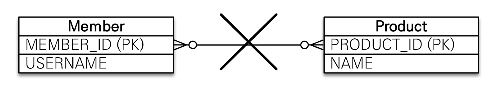
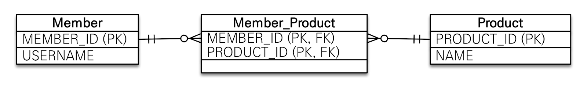

객체는 컬렉션을 사용해서 객체 2개 만으로 다대다 관계를 표현할 수 있다.  
Member, Product 엔티티가 각각 productList, memberList를 가지게 해서 서로를 참조하게 하면 된다.

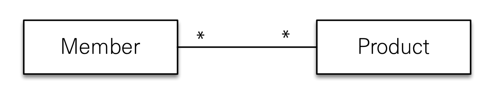

실제 매핑 시에는 @ManyToMany를 사용하고, @JoinTable로 연결 테이블 지정하면 된다.  
단방향, 양방향 모두 동일한 방식으로 지정할 수 있다.

```java
// src/main/java/hellojpa/Member
@Entity
public class Member {
    …
    @ManyToMany
    @JoinTable(name = "MEMBER_PRODUCT")   // 연결테이블 이름 지정
    private List<Product> products = new ArrayList<>();
}
```

```java
// src/main/java/hellojpa/Product
@Entity
public class Product {
    …
    @ManyToMany(mappedBy = "products")  // 양방향 관계
    private List<Member> members = new ArrayList<>();
}
```

```bash
…
Hibernate:
    # 연결테이블 생성
    create table MEMBER_PRODUCT (
       Member_MEMBER_ID bigint not null,
        products_PRODUCT_ID bigint not null
    )
```

**다대다 매핑의 한계**
@ManyToMany는 편리해 보이지만 실무에서는 잘 사용하지 않는다.  
보통 연결 테이블은 단순히 연결 용도로만 사용되지는 않기 때문이다.  
비즈니스 로직에 따라 연결 테이블에는 주문시간, 수량 같은 데이터가 추가로 들어가야 하는 경우가 많은데, 다대다 연관관계를 사용하면 추가 정보를 넣는게 불가능하다.

**다대다 한계 극복**
연결 테이블용 엔티티를 별도로 정의하면 위와 같은 한계를 극복할 수 있다.  
연결 테이블을 엔티티로 승격한다!
@ManyToMany → @OneToMany + @ManyToOne

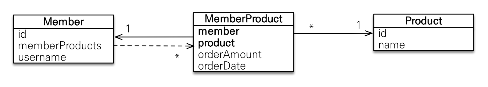

중간 테이블은 다음과 같이 설계할 수 있다.  
외래키인 memberId, productId를 복합키로 사용했다.

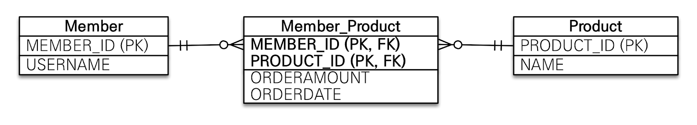

다만 위 방식은 테이블 형식으로써 비추천한다.  
외래키에 유니크 제약조건이 걸리면 유연하게 사용하는데 불편함이 있을 수 있다.  
예를 들어 위 예시에서도 한 멤버가 동일한 상품을 중복 구매할 수 있으려면 외래키 복합키로 구성하면 안 된다.
가능하면 의미없는 generated value 값이 PK로 사용되는게 좋다.

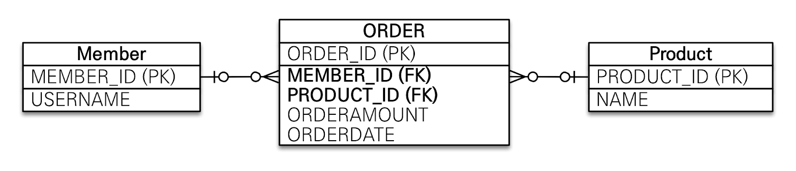

```java
// src/main/java/hellojpa/MemberProduct
@Entity
public class MemberProduct {
    @Id @GeneratedValue
    private Long id;

    @ManyToOne
    @JoinColumn(name = "MEMBER_ID")
    private Member member;

    @ManyToOne
    @JoinColumn(name = "PRODUCT_ID")
    private Product product;

    private int count;    // 추가 칼럼을 넣는게 가능!
    private int price;
    private LocalDateTime orderDateTime;
}
```

```java
// src/main/java/hellojpa/Member
@Entity
public class Member {
    …
    @OneToMany(mappedBy = "member")
    private List<MemberProduct> memberProducts = new ArrayList<>();
}
```

```java
// src/main/java/hellojpa/Product
@Entity
public class Product {
    …
    @OneToMany(mappedBy = "product")
    private List<MemberProduct> memberProducts = new ArrayList<>();
}
```

### 5. 실전 예제 - 3. 다양한 연관관계 매핑

이번에는 예제에 배송, 카테고리 엔티티를 추가한다.  
주문과 배송은 1:1(@OneToOne), 상품과 카테고리는 N:M(@ManyToMany) 관계를 가진다.

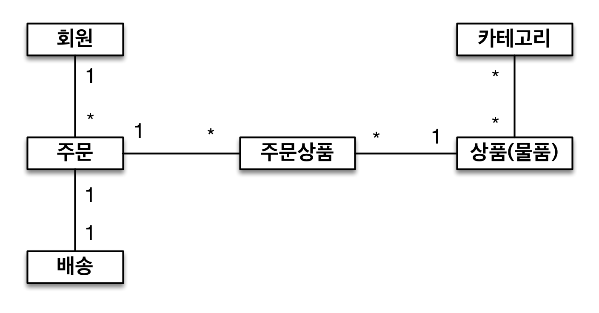

테이블 설계는 아래와 같다.

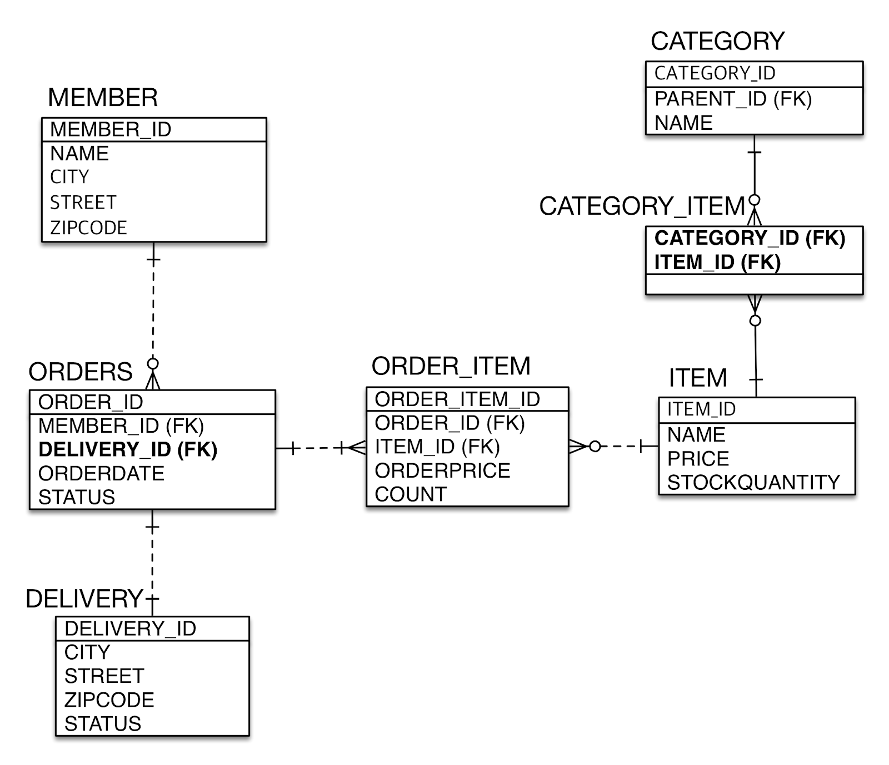

ORDERS - DELIVERY의 1:1 관계에서는 주 테이블인 ORDERS에 외래키를 삽입했다.  
CATEGORY - ITEM의 N:M 관계에서는 중간테이블로 CATEGORY_ITEM을 사용했다.

엔티티 설계는 다음과 같다.

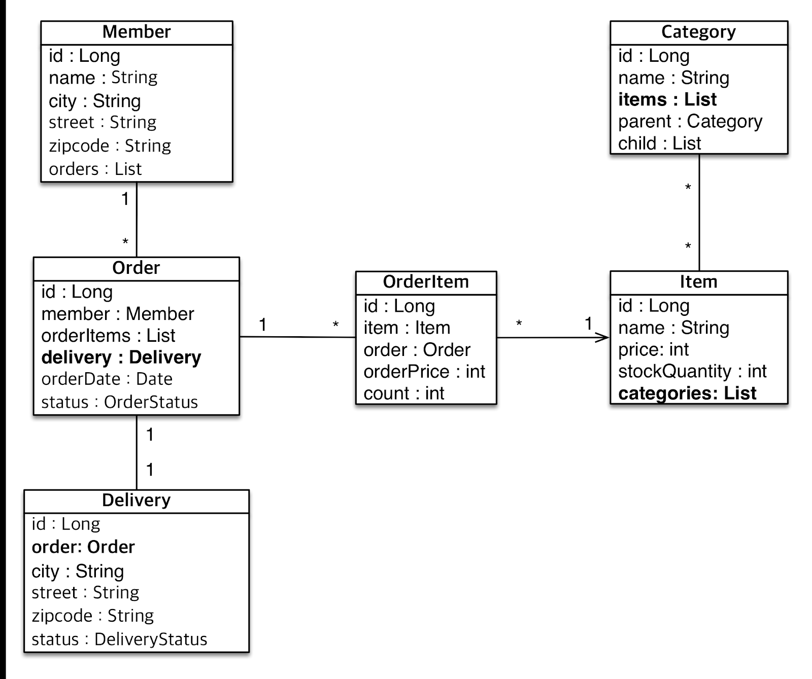

Order-Delivery는 OneToOne 양방향 관계를 가진다.  
Item-Category는 ManyToMany 양방향 관계를 가진다.
예시는 단순하게 구성하기 위해 중간테이블 엔티티를 생성하지 않았다.

```java
// src/main/java/jpabook.jpashop/domain/Delivery
@Entity
public class Delivery {
    @Id @GeneratedValue
    @Column(name = "delivery_id")
    private Long id;

    private String city;
    private String street;
    private String zipcode;

    @Enumerated(EnumType.STRING)
    private DeliveryStatus status;

    // 1:1 관계, 대상 테이블
    @OneToOne(mappedBy = "delivery")
    private Order order;
}
```

```java
※ src/main/java/jpabook.jpashop/domain/Orders
@Entity
@Table(name = "ORDERS")
public class Order {
    …
    // 1:1 관계, 주테이블 + 연관관계 주인
    @OneToOne
    @JoinColumn(name = "delivery_id")
    private Delivery delivery;
}
```

```java
// src/main/java/jpabook.jpashop/domain/Category
@Entity
public class Category {
    @Id
    @GeneratedValue
    @Column(name = "category_id")
    private Long id;

    private String name;

    @ManyToOne
    @JoinColumn(name = "parent_id")
    private Category parent;

    @OneToMany(mappedBy = "parent")
    private List<Category> child = new ArrayList<>();

    @ManyToMany
    @JoinTable(name = "CATEGORY_ITEM",
            joinColumns = @JoinColumn(name = "category_id"),      // 내가 조인해야 하는 column
            inverseJoinColumns = @JoinColumn(name = "item_id")    // 상대편이 조인해야 하는 column
    )
    private List<Item> items = new ArrayList<>();
}
```

```java
※ src/main/java/jpabook.jpashop/domain/Item
@Entity
public class Item {
    …
    @ManyToMany(mappedBy = "items")
    private List<Category> categories = new ArrayList<>();
}
```

실전에서는 보통 @ManyToMany를 사용하지 않는다.  
중간 테이블이 단순하지 않은 경우가 많고, @ManyToMany를 사용하면 필드 추가 불가하다는 제약이 존재한다.  
또한 엔티티와 테이블이 불일치한다는 점도 단점이 될 수 있다.  
따라서 N:M 관계는 중간 테이블을 이용해서 1:N + N:1로 풀어서 사용한다.

```bash
…
# CATEGORY_ITEM 중간테이블 생성
Hibernate:
    create table CATEGORY_ITEM (
       category_id bigint not null,
        item_id bigint not null
    )
Hibernate:
    create table ORDERS (
       order_id bigint not null,
        orderDate timestamp,
        orderStatus varchar(255),
        # 연관관계의 주인이자 주테이블인 ORDERS에 외래키 저장
        delivery_id bigint,
        member_id bigint,
        primary key (order_id)
    )
```

**@JoinColumn 주요 속성**
외래키를 매핑할 때 사용하는 어노테이션이다.  
@Column의 속성과 유사하다.

| 속성명                                                          | 설명                                                                            | 기본값                                         |
| --------------------------------------------------------------- | ------------------------------------------------------------------------------- | ---------------------------------------------- |
| name                                                            | 매핑할 외래 키 이름                                                             | 필드명 + \_ + 참조하는 테이블의 기본 키 컬럼명 |
| referencedColumnName                                            | 외래 키가 참조하는 대상 테이블의 컬럼명                                         | 참조하는 테이블의 기본 키 컬럼명               |
| foreignKey(DDL)                                                 | 외래 키 제약조건을 직접 지정할 수 있다. <br> 테이블을 생성할 때만 사용하는 속성 |                                                |
| unique, nullable, insertable, updatable, table,columnDefinition | @Column과 같은 속성                                                             |                                                |

**@ManyToOne 주요 속성**

| 속성명   | 설명                                                                                                 | 기본값                                  |
| -------- | ---------------------------------------------------------------------------------------------------- | --------------------------------------- |
| optional | false로 설정하면 연관된 엔티티가 항상 있어야 한다. <br> true로 설정하면 연관된 엔티티가 없어도 된다. | true                                    |
| fetch    | 글로벌 페치 전략을 설정한다.                                                                         | @ManyToOne: EAGER <br> @OneToMany: LAZY |
| cascade  | 영속성 전이 기능을 사용한다.                                                                         |                                         |

> mappedBy 속성은 없다, 다(Many)쪽 엔티티는 반드시 연관관계의 주인이어야 한다.

**@OneToMany 주요 속성**

| 속성명        | 설명                                                | 기본값                                  |
| ------------- | --------------------------------------------------- | --------------------------------------- |
| mappedBy      | 연관관계의 주인 필드 이름을 설정한다.               |                                         |
| orphanRemoval | 부모 엔티티가 제거되면 자식 엔티티도 함께 제거된다. | false                                   |
| fetch         | 글로벌 페치 전략을 설정한다.                        | @ManyToOne: EAGER <br> @OneToMany: LAZY |
| cascade       | 영속성 전이 기능을 사용한다.                        |                                         |
