### 1) 상속관계 매핑

관계형 데이터베이스에는 상속 관계가 존재하지 않는다.  
슈퍼타입 - 서브타입 관계라는 모델링 기법이 객체 상속과 그나마 유사한 편이다.  
상속관계 매핑이라고 하면 보통 객체의 상속 구조와 DB의 슈퍼타입-서브타입 관계를 매핑하는 것을 의미한다.

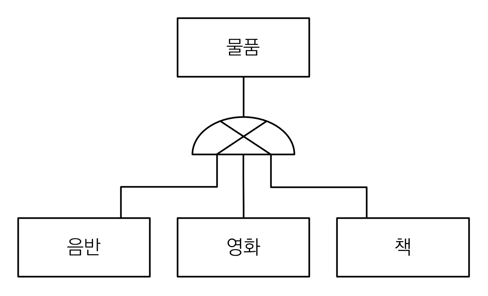


슈퍼타입-서브타입 논리 모델을 실제 물리 모델로 구현하는 방법에는 3가지가 있다.  
객체 구현 모델은 동일하고, 테이블을 구현하는 방법이 달라진다.

- **조인 전략** : 각각 테이블로 변환
- **단일 테이블 전략** : 통합 테이블로 변환
- **구현 클래스마다 테이블 전략** : 서브타입 테이블로 변환

주요 어노테이션은 다음과 같다.

- `@Inheritance(strategy=InheritanceType.XXX)` - `JOINED`, `SINGLE_TABLE`, `TABLE_PER_CLASS`
- `@DiscriminatorColumn(name=“DTYPE”)` : 부모 클래스에 붙이면 dtype 칼럼이 생성된다.
  - db에 item에 대한 쿼리가 전달되었을 때, dtype이 없을 경우 어느 서브 테이블과 조인해야 하는지 알 수 없음.
  - 운영이나 db작업 상 dtype은 필요하다.
- @DiscriminatorValue(“XXX”) : 자식 클래스에 붙이면 각 클래스에 대한 dtype의 값을 설정할 수 있다. (기본값: 클래스명)

#### 1. 조인전략(JOINED)

조인 전략에서는 부모인 ITEM 테이블과 자식인 ALBUM, MOVIE, BOOK 테이블을 각각 만들게 된다.  
자식 테이블에 부모테이블에 대한 외래키를 두고, JOIN으로 데이터를 함께 가져오는 식으로 상속관계를 구현하게 된다.  
예를 들어 album 엔티티를 생성한다면, 부모 엔티티인 item도 함께 생성해야 한다.  
두 엔티티를 각각 저장해야 하기 때문에 저장 시 2번의 INSERT가 필요하다.

예시에서는 부모 테이블인 ITEM의 dtype 필드에 자식 테이블의 타입을 저장하고, 자식 테이블의 item_id로 부모 테이블을 연결한다.  
item_id는 자식 테이블의 PK이자 부모 테이블에 대한 FK로 사용한다.

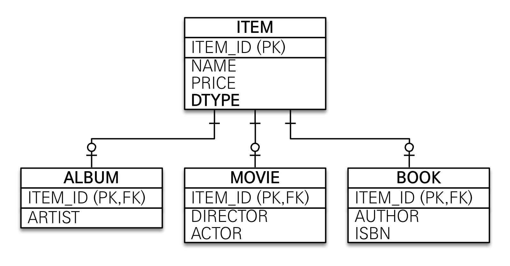

조인전략의 장점은 테이블이 정규화된다는 점이다.  
이에 따라 저장공간 효율화되고, 외래 키 참조 무결성 제약조건 활용할 수 있는 가장 정석적인 방법이다.  
다만 단점은 조회시 무조건 join을 사용해서 성능이 저하되고, 조회 쿼리가 복잡하다는 점이다.  
데이터 저장시에는 INSERT SQL을 2번 호출해야 한다.

이러한 장/단점을 고려하여, 조인전략은 보통 핵심 비즈니스 로직을 다루거나 데이터가 복잡할 때 사용한다.

```java
// src/main/java/hellojpa/Item
@Entity
@Inheritance(strategy = InheritanceType.JOINED)  // JOINED 전략 사용
@DiscriminatorColumn
public abstract class Item {
    @Id @GeneratedValue
    private Long id;

    private String name;
    private int price;
}
```

```java
// src/main/java/hellojpa/Album
@Entity
@DiscriminatorValue("A")
public class Album extends Item {
    private String artist;
}
```

```java
// src/main/java/hellojpa/Movie
@Entity
@DiscriminatorValue("M")
public class Movie extends Item {
    private String director;
    private String actor;
}
```

```java
// src/main/java/hellojpa/Book
@Entity
@DiscriminatorValue("B")
public class Book extends Item {
    private String author;
    private String isbn;
}
```

```java
// src/main/java/hellojpa/JpaMain
/**
 * 조인 전략 - 엔티티 생성 및 저장
 */
Movie movie = new Movie();
movie.setDirector("aaa");
movie.setActor("bbb");
movie.setName("바람");
movie.setPrice(10000);

em.persist(movie);
em.flush();
em.clear();   // 1차 캐시를 비움

/**
 * 조인 전략 - 조회
 */
Movie findMovie = em.find(Movie.class, movie.getId());
System.out.println("findMovie = " + findMovie);
tx.commit();
```

```bash
# INSERT문이 총 2개 날라감 → ITEM, MOVIE
# JPA가 알아서 필요한 쿼리를 날려준다.
Hibernate:
    /* insert hellojpa.Movie
        */ insert
        into
            Item
            (name, price, id)
        values
            (?, ?, ?)
Hibernate:
    /* insert hellojpa.Movie
        */ insert
        into
            Movie
            (actor, director, id)
        values
            (?, ?, ?)

# movie 조회시, ITEM 테이블을 조인해서 함께 가져옴
Hibernate:
    select
        movie0_.id as id1_2_0_,
        movie0_1_.name as name2_2_0_,
        movie0_1_.price as price3_2_0_,
        movie0_.actor as actor1_6_0_,
        movie0_.director as director2_6_0_
    from
        Movie movie0_
    inner join
        Item movie0_1_
            on movie0_.id=movie0_1_.id
    where
        movie0_.id=?
findMovie = hellojpa.Movie@7640a5b1
```

Item, Movie 테이블에 각각 데이터가 저장되고, Item 테이블 데이터에 DType으로 M이 저장된 것을 확인할 수 있다.  
Movie의 ID 값은 Item에 대한 외래키로, Item의 ID와 값이 동일하다.

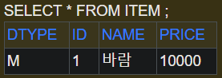
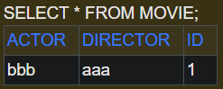

#### 2. 단일 테이블 전략(SINGLE_TABLE)

단일 테이블 전략은 한 테이블에 모든 내용을 합쳐버리는 방식이다.  
예시에서는 Album, Movie, Book의 칼럼을 모두 한테이블에 넣고, dtype으로 종류를 구분하게 된다.

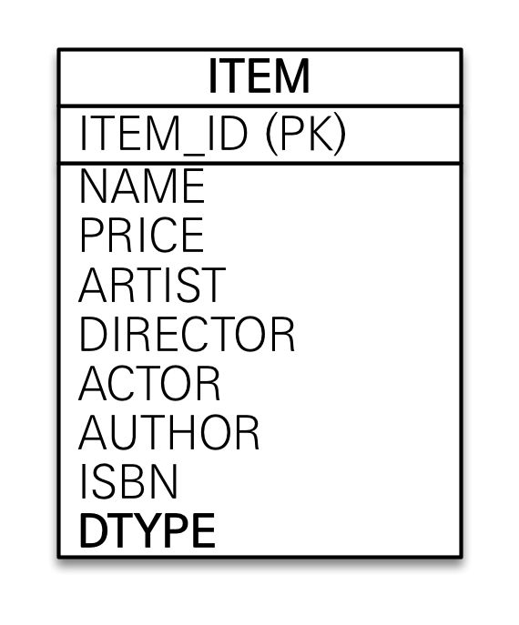
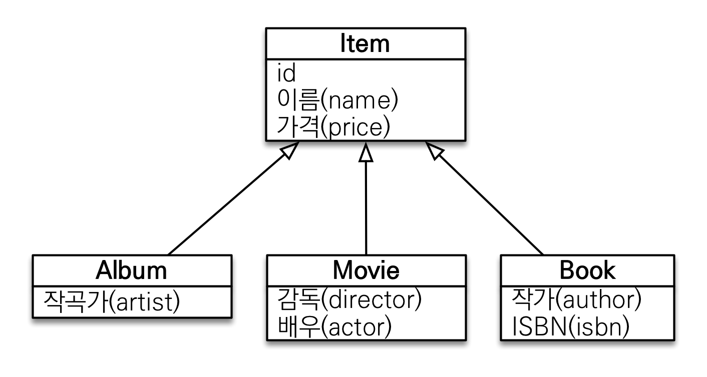

단일 테이블 전략은 조회 시 join이 필요 없기 때문에 일반적으로 조회 성능이 빠르고, 조회 쿼리가 단순하다.  
다만 자식 엔티티로 매핑한 컬럼은 모두 null 허용이 되어야 하기 때문에, 데이터 무결성 측면에서 좋지 않은 설계이다.  
단일 테이블에 하위 엔티티의 모든 프로퍼티를 저장해야 하므로 테이블이 커지게 된다.  
이로 인해 상황에 따라서 조회 성능이 오히려 느려질 수 있다.
따라서 단일 테이블 전략은 다루어야 하는 데이터가 단순하고, 확장 가능성이 적을 때 주로 사용한다.

조상 엔티티는 다음과 같이 구성한다.  
@Inheritance에 strategy로 SINGLE_TABLE을 지정하기만 하면 전략을 변경할 수 있다.  
SINGLE_TABLE 전략에서는 @DiscriminatorColumn을 넣지 않아도 자동으로 dtype이 생성된다.

```java
// src/main/java/hellojpa/Item
@Entity
@Inheritance(strategy = InheritanceType.SINGLE_TABLE)
@DiscriminatorColumn
public abstract class Item {
    …
}
```

```bash
# 단일 테이블인 ITEM에 대한 CREATE TABLE
Hibernate:
    create table Item (
       DTYPE varchar(31) not null,
        id bigint not null,
        name varchar(255),
        price integer not null,
        artist varchar(255),
        author varchar(255),
        isbn varchar(255),
        actor varchar(255),
        director varchar(255),
        primary key (id)
    )
# 단일 테이블인 ITEM에 대한 INSERT
Hibernate:
    /* insert hellojpa.Movie
        */ insert
        into
            Item
            (name, price, actor, director, DTYPE, id)
        values
            (?, ?, ?, ?, 'M', ?)
# 단일 테이블인 ITEM에 대한 SELECT
Hibernate:
    select
        movie0_.id as id2_0_0_,
        movie0_.name as name3_0_0_,
        movie0_.price as price4_0_0_,
        movie0_.actor as actor8_0_0_,
        movie0_.director as director9_0_0_
    from
        Item movie0_
    where
        movie0_.id=?
        and movie0_.DTYPE='M'
findMovie = hellojpa.Movie@74ecacc3
```

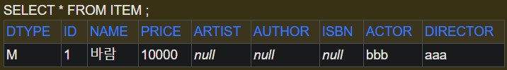

#### 3. 구현 클래스마다 테이블 전략

구현 클래스마다 테이블 전략은 ALBUM, MOVIE, BOOK 테이블을 각각 만들고, ITEM에 들어있던 column을 각각 별도로 가지고 있는 전략이다.

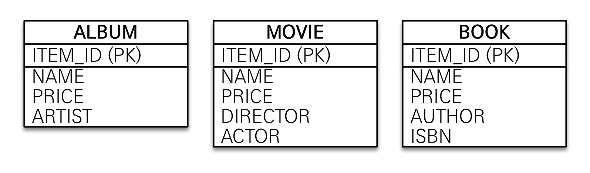

이 방식의 장점은 서브 타입을 명확하게 구분해서 처리할 수 있다는 것과, not null 제약조건을 사용 가능하다는 점이다.
다만 여러 자식 테이블을 함께 조회할 때 UNION을 사용해야 하기 때문에 성능이 느리고 쿼리가 복잡하다는 단점이 있다.  
예를 들어 아이템 전체를 이용해서 정산하는 시스템을 만든다면, 새로운 타입이 추가될 경우 쿼리를 추가로 변경해야 한다.
이러한 복잡성으로 인해 이 전략은 데이터베이스 설계자와 ORM 전문가 둘 다 추천하지 않는다.

먼저 첫번째 예제는 단순 저장하고, 자식 클래스로 조회하는 경우이다.  
단순히 자식 클래스로 조회하는 경우에는 별 문제 없이 조회 가능하다.

```java
// src/main/java/hellojpa/Item
@Entity
@Inheritance(strategy = InheritanceType.TABLE_PER_CLASS)
public abstract class Item {
    …
}
```

```bash
# 자식 테이블 MOVIE 생성, ITEM 테이블(부모)은 생성되지 않음
Hibernate:
    create table Movie (
       id bigint not null,
        name varchar(255),
        price integer not null,
        actor varchar(255),
        director varchar(255),
        primary key (id)
    )

…
# Movie 엔티티 저장, 자식 테이블인 MOVIE에 대한 INSERT
Hibernate:
    /* insert hellojpa.Movie
        */ insert
        into
            Movie
            (name, price, actor, director, id)
        values
            (?, ?, ?, ?, ?)
# Movie 엔티티 조회, MOVIE에 대한 SELECT
Hibernate:
    select
        movie0_.id as id1_2_0_,
        movie0_.name as name2_2_0_,
        movie0_.price as price3_2_0_,
        movie0_.actor as actor1_6_0_,
        movie0_.director as director2_6_0_
    from
        Movie movie0_
    where
        movie0_.id=?
findMovie = hellojpa.Movie@97d0c06
```

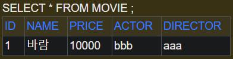

다음 예제는 부모 클래스로 조회하는 경우이다.  
이 때에는 조회 쿼리가 매우 복잡해진다.

```java
※ src/main/java/hellojpa/JpaMain
Item findItem = em.find(Item.class, movie.getId());  // Item 타입으로 조회
System.out.println("findItem = " + findItem);
```

이 경우 모든 자식 클래스를 union해서 다 뒤져 보는 비효율적인 방식으로 동작한다.

```bash
# 모든 자식 테이블은 UNION ALL하고, 그 중에서 WHERE 조건으로 필터링
Hibernate:
    select
        item0_.id as id1_2_0_,
        …
        item0_.clazz_ as clazz_0_
    from
        ( select
            id,
            …
            null as director,
            1 as clazz_
        from
            Album
        union
        all select
            id,
     …
            null as director,
            2 as clazz_
        from
            Book
	     …
```

### 2) @MappedSuperclass

@MappedSuperclass는 단순히 공통 매핑 정보가 필요할 때 사용한다.  
id, name 이나 등록일, 수정일, 등록자, 수정자처럼 전체 엔티티에서 공통으로 가지는 속성을 모으기 위한 목적으로 사용한다.

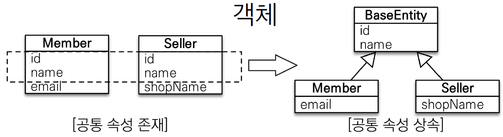
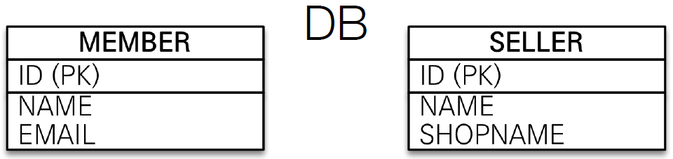

이 때 상속관계는 테이블로 매핑이 되지 않는다.  
즉 부모 클래스는 상속 받는 자식 클래스에 프로퍼티 정보만 제공하고, 부모 클래스는 엔티티가 아니게 되며 테이블이 매핑되지 않는다.

따라서 부모 클래스에 대한 조회, 검색이 불가하다.  
예를 들어 `em.find(BaseEntity.class, 1L)`으로 부모 클래스에 대해 조회하면 에러가 발생한다.
MappedSuperclass에서 부모 클래스는 직접 생성해서 사용할 일이 없으므로, 추상 클래스로 사용할 것을 권장한다.

> @Entity 클래스는 @Entity나 @MappedSuperclass로 지정한 클래스만 상속 가능하다.

다음의 예시는 모든 테이블에 공통 정보인 등록일, 등록자, 수정일, 수정자를 등록하는 예시이다.

```java
※ src/main/java/hellojpa/BaseEntity
@MappedSuperclass
public abstract class BaseEntity {
    private String createdBy;
    private LocalDateTime createdDate;
    private String lastModifiedBy;
    private LocalDateTime lastModifiedDate;
    …
}
```

```java
※ src/main/java/hellojpa/Member
@Entity
public class Member extends BaseEntity {
    …
}
```

```java
※ src/main/java/hellojpa/Team
@Entity
public class Team extends BaseEntity {
    …
}
```

```bash
Hibernate:
    create table Member (
       MEMBER_ID bigint not null,
        createdBy varchar(255),  # MEMBER 테이블에 직접 들어감
        createdDate timestamp,
        lastModifiedBy varchar(255),
        lastModifiedDate timestamp,
	 …
    )
Hibernate:
    create table Team (
       TEAM_ID bigint not null,
        createdBy varchar(255),  # TEAM 테이블에 직접 들어감
        createdDate timestamp,
        lastModifiedBy varchar(255),
        lastModifiedDate timestamp,
	 …
    )
```

### 3) 실전 예제 - 4. 상속관계 매핑

실전 예제를 보강해서, 요구사항이 추가된다고 하자.  
상품의 종류는 도서, 음반, 영화가 있고, 이후 더 확장될 수 있다는 요구사항이다.
추가적으로 모든 데이터에는 등록일과 수정일이 필수로 포함되어야 한다.

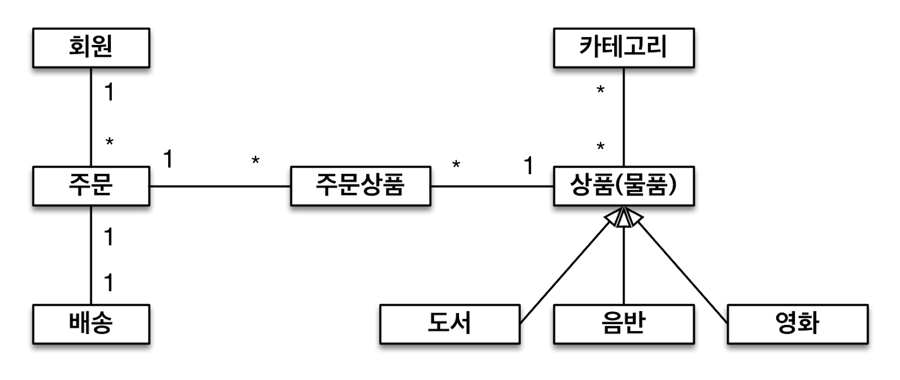

도메인 모델 상세는 다음과 같다.
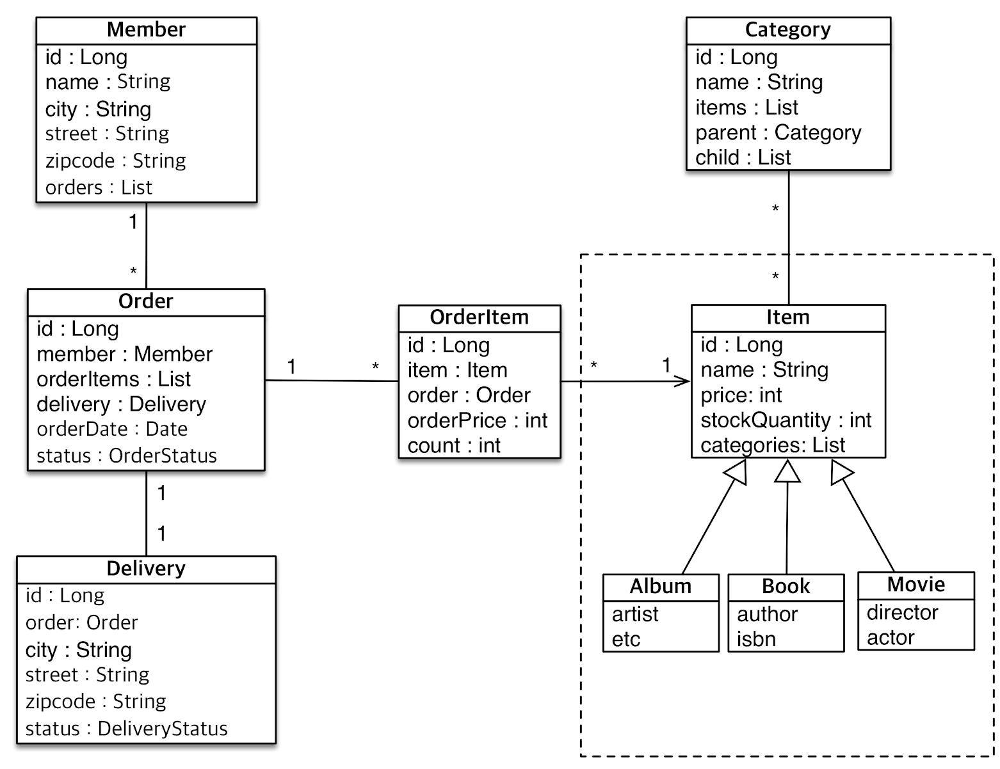

이에 따른 테이블 설계이다.
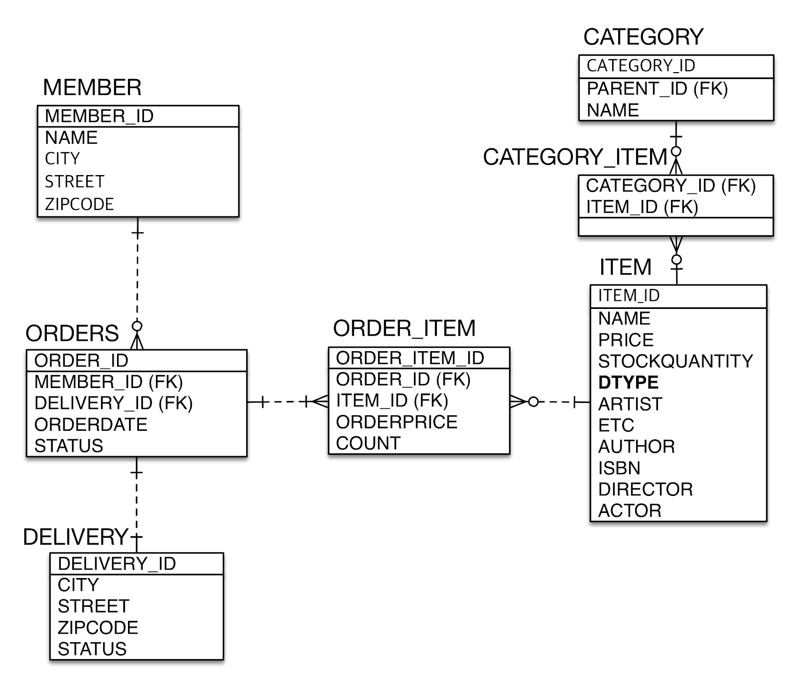

코드는 앞서 작성한 예제코드와 거의 동일하므로 생략한다.

주의할 점은, 상속관계를 무조건 넣는다고 능사는 아니라는 것이다.  
데이터가 작고 트래픽이 많지 않은 상황에서는 상속관계가 잘 작동하지만, 주문이 100만 건이 넘어가는 등 서비스가 커지면 복잡한 상속 관계가 존재할 경우 실행 시간이 많이 늘어날 수 있다.  
따라서 처음에는 객체지향적으로 데이터 무결하게 설계하되, 어느정도 서비스가 성장한 이후에는 트레이드 오프를 고려하여 설계를 변경하는 것도 고려해야 한다.  
(ITEM 테이블에 가능한 정보를 다 넣고, 자식 클래스는 JSON으로 말아 넣는 등의 방식으로 변경)
