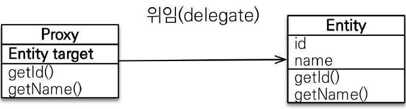

### 1) 프록시

만약 Member와 Team 사이에 연관 관계가 있다면, Member를 조회할 때 Team도 함께 조회해야 할까?


먼저 회원과 팀 정보를 함께 사용하는 예시는 다음과 같다.  
연관된 Team 정보를 함께 사용할 경우, Member 조회시 함께 Team을 조회하는게 효율적이다.

```java
public void printUserAndTeam(String memberId) {
    Member member = em.find(Member.class, memberId);
    Team team = member.getTeam();
    System.out.println("회원 이름: " + member.getUsername());
    System.out.println("소속팀: " + team.getName());
}
```

다음은 회원 정보만 사용하는 경우이다.  
Member 정보만 사용할 경우, Team을 함께 조회하면 비효율적이다.

```java
public void printUser(String memberId) {
    Member member = em.find(Member.class, memberId);
    Team team = member.getTeam();
    System.out.println("회원 이름: " + member.getUsername());
}
```

#### (1) 프록시란? - em.find() vs em.getReference()

- `em.find()`: 데이터베이스를 통해서 실제 엔티티 객체 조회
- `em.getReference()`: 데이터베이스 조회를 미루는 가짜(프록시) 엔티티 객체 조회


em.getReference()를 사용하면 db에 쿼리가 날라가지 않는데도 엔티티 객체가 조회된다.  
겉모습은 실제 객체와 동일한 프록시 객체가 조회되고, target에 실제 객체의 참조를 저장하게 된다.

```java
// src/main/java/hellojpa/JpaMain
Member member = new Member();
member.setUsername("hello");
em.persist(member);

em.flush();
em.clear();

Member findMember = em.getReference(Member.class, member.getId());
System.out.println("findMember = " + findMember.getClass());
// id는 getReference()에서 넣은 값이 프록시 객체에 저장되어 있기 때문에, 쿼리를 실행하지 않아도 접근 가능
System.out.println("findMember.id = " + findMember.getId());
System.out.println("findMember.username = " + findMember.getUsername()); // 값이 실제로 사용되는 시점 → db에 쿼리를 날림

```

```bash
findMember = class hellojpa.Member$HibernateProxy$ZEDGcrLe   # 프록시 객체 class
findMember.id = 1
# findMember.getUsername() -> 실제 쿼리가 날라감
Hibernate:
    select
        member0_.MEMBER_ID as MEMBER_I1_3_0_,
        …
        member0_.USERNAME as USERNAME6_3_0_,
        team1_.TEAM_ID as TEAM_ID1_7_1_,
        …
        team1_.name as name6_7_1_
    from
        Member member0_
    left outer join
        Team team1_
            on member0_.TEAM_ID=team1_.TEAM_ID
    where
        member0_.MEMBER_ID=?
findMember.username = hello
```

#### (2) 프록시의 기본 특징

프록시 객체는 실제 엔티티 클래스를 상속 받아서 만들어진다.  
실제 클래스와 겉 모양이 동일하기 때문에, 사용하는 입장에서는 진짜 객체인지 프록시 객체인지 구분하지 않고 사용하면 된다.


프록시 객체는 내부에서 실제 객체의 참조(target)를 보관한다.  
프록시 객체의 메소드를 호출하면 프록시 객체는 실제 객체의 메소드를 위임 호출한다.



프록시 객체의 초기화는 실제 데이터가 필요한 시점에 이루어진다.

```java
Member member = em.getReference(Member.class, "id1");
member.getName();
```


사용자가 member.getName() 호출하면, Proxy 객체의 target이 비어있는 걸 확인하게 된다.  
이 때 영속성 컨텍스트에 엔티티 초기화를 요청하게 되고, 영속성 컨텍스트는 DB로부터 데이터를 조회한 값을 바탕으로 실제 엔티티를 생성한다.  
이렇게 생성된 실제 엔티티가 프록시 객체의 target에 연결된다.

프록시 사용시에는 몇가지 주의점들이 있다.

먼저, 프록시 객체는 원본 엔티티를 상속받은 별도의 클래스라는 점이다.  
프록시 객체는 처음 실제 값에 접근할 때 한 번만 초기화된다.  
이 때 프록시 객체를 초기화했다고 해서 프록시 객체가 실제 엔티티로 바뀌는 것은 아니다.  
단지 프록시 객체를 통해서 실제 엔티티에 접근이 가능해지는 것일 뿐이다.  
따라서 엔티티 타입 체크를 할 때에는 `==` 비교 대신 `instanceof`를 사용해야 한다.

```java
Member member1 = new Member();
member1.setUsername("hello1");
em.persist(member1);
Member member2 = new Member();
member2.setUsername("hello2");
em.persist(member2);

em.flush();
em.clear();
Member m1 = em.find(Member.class, member1.getId());
Member m2 = em.getReference(Member.class, member2.getId());
// 타입 == 비교, m1 instanceof Member로 타입 체크하는 것이 적절하다.
System.out.println("m1 == m2: " + (m1.getClass() == m2.getClass()));
```

```bash
m1 == m2: false    # == 비교를 했기 때문에 false가 됨
```

또한 영속성 컨텍스트에 실제 엔티티가 이미 있으면, em.getReference()를 호출해도 실제 엔티티가 반환된다는 점을 주의해야 한다.  
JPA에서는 한 트랜잭션 안에서 같은 id를 가진 엔티티를 조회하면 `==` 비교시 true가 됨을 보장해야 한다.  
이러한 메커니즘을 지키기 위해, 이미 영속성 컨테스트에 해당 객체가 존재하는 경우에는 실제 객체를 가져온다.  
영속성 컨텍스트에 실제 엔티티가 존재한다는 것은 이미 데이터를 조회했다는 뜻이므로, 프록시를 사용해서 얻을 수 있는 이익도 없다.

```java
※ src/main/java/hellojpa/JpaMain
Member m1 = em.find(Member.class, member1.getId());
System.out.println("m1 = " + m1.getClass());

Member reference = em.getReference(Member.class, member1.getId());
System.out.println("reference = " + reference.getClass());
System.out.println("m1 == reference: " + (m1 == reference));
```

> 출력

```bash
m1 = class hellojpa.Member
reference = class hellojpa.Member  # 실제 엔티티 클래스
m1 == reference: true
```

동일한 이유로 앞서 em.getReference()를 통해 프록시 객체로 조회했으면, em.find()를 호출해도 프록시 객체가 반환된다.

```java
Member refMember = em.getReference(Member.class, member1.getId());
System.out.println("refMember = " + refMember.getClass());

Member findMember = em.find(Member.class, member1.getId());
System.out.println("findMember = " + findMember.getClass());
System.out.println("m1 == reference: " + (refMember == findMember));
```

```bash
refMember = class hellojpa.Member$HibernateProxy$dQU1HLG6
findMember = class hellojpa.Member$HibernateProxy$dQU1HLG6
m1 == reference: true  # em.getReference(), em.find()로 조회한 엔티티가 동일함
```

마지막으로, 영속성 컨텍스트의 도움을 받을 수 없는 준영속 상태일 때 프록시를 초기화하면 문제 발생한다.  
하이버네이트는 org.hibernate.LazyInitializationException 예외를 발생시킨다.  
이는 실무에서도 자주 발생하는 문제이다.  
영속성 컨텍스트는 트랜잭션과 시작과 끝이 동일한데, 트랜잭션이 끝난 후에 프록시 객체를 다뤄서 문제가 발생한다.

````java
try {
    Member refMember = em.getReference(Member.class, member1.getId());
    System.out.println("refMember = " + refMember.getClass()); // Proxy

    em.detach(refMember);

    refMember.getUsername();  // 프록시 초기화가 일어나지 않았음
    tx.commit();
} catch(Exception e) {
    tx.rollback();
    e.printStackTrace();
}
```> 출력

```bash
refMember = class hellojpa.Member$HibernateProxy$Ktj6NMoE
org.hibernate.LazyInitializationException: could not initialize proxy [hellojpa.Member#1] - no Session
````

#### (4) 프록시 확인에 도움을 주는 utility 메서드

- 프록시 인스턴스의 초기화 여부 확인 : `PersistenceUnitUtil.isLoaded(Object entity)`
- 프록시 클래스 확인 : `entity.getClass().getName()` -> `..javasist..` or `HibernateProxy..`
- 프록시 강제 초기화 : `org.hibernate.Hibernate.initialize(entity);`

> JPA 표준은 강제 초기화 기능이 없고, 그냥 실제 객체의 메서드를 호출해서 초기화해야 한다.

```java
Member refMember = em.getReference(Member.class, member1.getId());
refMember.getUsername();   // 프록시 강제 초기화
System.out.println("isLoaded = " + emf.getPersistenceUnitUtil().isLoaded(refMember));
```

```bash
isLoaded = true
```

### 2) 즉시로딩과 지연로딩

Member를 조회할 때 연관된 객체인 Team도 함께 조회해야 할까?


단순히 member 정보만 사용하는 비즈니스 로직의 경우, 함께 조인할 필요가 없다.  
이 떄에는 지연 로딩(LAZY)을 사용해서, 프록시로 조회하면 된다.

```java
// src/main/java/hellojpa/Member
@Entity
public class Member {
    …
    @ManyToOne(fetch = FetchType.LAZY) // 지연로딩
    @JoinColumn(name = "TEAM_ID")
    private Team team;
}
```

```java
// src/main/java/hellojpa/JpaMain
Team team1 = new Team();
team1.setName("teamA");
em.persist(team1);

Member member1 = new Member();
member1.setUsername("hello1");
member1.setTeam(team1);
em.persist(member1);

em.flush();
em.clear();

Member m = em.find(Member.class, member1.getId());
System.out.println("team = " + m.getTeam().getClass());

System.out.println("============");
m.getTeam().getName();  // 이 시점에 Team을 조회
System.out.println("============");
```

```bash
# 프록시 객체가 확인됨
team = class hellojpa.Team$HibernateProxy$uGs0taXV

# m.getTeam().getName() -> 실제 쿼리 실행
============
Hibernate:
    select
        team0_.TEAM_ID as TEAM_ID1_7_0_,
        …
============
```


```java
Member member = em.find(Member.class, 1L);   // team은 프록시 객체로 저장
```


```java
Team team = member.getTeam();  // 단순히 프록시 객체를 가져옴 → 초기화 X
team.getName();   // 실제 team을 사용하는 시점, DB 조회해서 프록시 객체 초기화
```


만약 Member와 Team을 자주 함께 사용한다면 즉시 로딩 (EAGER)를 사용해서 함께 조회하면 된다.

```java
// src/main/java/hellojpa/Member
@Entity
public class Member {
    …
    @ManyToOne(fetch = FetchType.EAGER)
    @JoinColumn(name = "TEAM_ID")
    private Team team;
}
```

```bash
# Member와 Team을 조인해서 함께 가져옴
Hibernate:
    select
        member0_.MEMBER_ID as MEMBER_I1_3_0_,
        …
        team1_.TEAM_ID as TEAM_ID1_7_1_,
        …
    from
        Member member0_
    left outer join
        …
team = class hellojpa.Team   # 프록시가 아닌 실제 객체가 들어가 있음
============
============
```


JPA 구현체는 가능하다면 조인을 사용해서 한번에 함께 조회하는 식으로 동작한다.

이론으로만 따지만, 상황에 따라 적절하게 지연 로딩과 즉시 로딩을 활용하면 된다.

- Member와 Team은 자주 함께 사용 → 즉시 로딩
- Member와 Order는 가끔 사용 → 지연 로딩
- Order와 Product는 자주 함께 사용 → 즉시 로딩


하지만 실무에서는 즉시로딩 대신, 가급적 지연로딩만 사용해야 한다.  
즉시 로딩을 적용하면 예상하지 못한 SQL이 발생하고, JPQL에서는 N+1 문제를 일으킨다.  
N+1 문제란 처음에 발생한 1개의 쿼리로 인해, N개의 쿼리가 추가 발생하는 것을 의미한다.

```java
// src/main/java/hellojpa/jpaMain
Team team = new Team();
team.setName("teamA");
em.persist(team);
Team team2 = new Team();
team.setName("teamB");
em.persist(team2);

Member member1 = new Member();
member1.setUsername("member1");
member1.setTeam(team);
em.persist(member1);
Member member2 = new Member();
member2.setUsername("member2");
member2.setTeam(team2);
em.persist(member2);

em.flush();
em.clear();
List<Member> members = em.createQuery("select m from Member m", Member.class)
    .getResultList();
// SQL: select * from Member    : JPQL을 그대로 SQL로 변역(1)
// SQL: select * from Team where TEAM_ID = xxx  : 각 member에 대해서 team을 조회(N)
```

```bash
# MEMBER 조회
Hibernate:
    /* select
        m
    from
        Member m */ select
            member0_.MEMBER_ID as MEMBER_I1_3_,
            …
# TEAM 조회1
Hibernate:
    select
        team0_.TEAM_ID as TEAM_ID1_7_0_,
        …
    where
        team0_.TEAM_ID=?
# TEAM 조회2
Hibernate:
    select
        team0_.TEAM_ID as TEAM_ID1_7_0_,
        …
    where
        team0_.TEAM_ID=?
```

또한 다수의 테이블이 연결되어 있어 JOIN이 여러 개 걸리면, 시스템이 매우 느려진다.  
따라서 가능한 지연로딩을 사용하여 불필요한 JOIN이 발생하지 않게 해야 한다.  
`@ManyToOne`, `@OneToOne`은 기본이 즉시 로딩이므로, LAZY로 직접 설정해줘야 한다.  
`@OneToMany`, `@ManyToMany`는 기본이 지연 로딩이다.

N+1 문제를 해결하기 위해서는, 우선 모든 연관관계를 지연로딩으로 설정해야 한다.  
이 때 JPQL의 Fetch Join을 사용하면 런타임에 원하는 엔티티들을 동적으로 한 번에 가져올 수 있다.

```java
List<Member> members = em.createQuery("select m from Member m join fetch m.team", Member.class).getResultList();
```

```bash
# MEMBER, TEAM을 즉시 JOIN해서 한 번에 가져옴 (Fetch Join)
Hibernate:
    …
        select
            member0_.MEMBER_ID as MEMBER_I1_3_0_,
            team1_.TEAM_ID as TEAM_ID1_7_1_,
            member0_.createdBy as createdB2_3_0_,
            …
            team1_.createdBy as createdB2_7_1_,
            …
        inner join
            Team team1_
                on member0_.team_TEAM_ID=team1_.TEAM_ID
```

또는 @EntityGraph를 사용하거나, batch size를 사용할 수 있다.

### 3) 영속성 전이(CASCADE)

영속성 전이(CASCADE)는 특정 엔티티를 영속화할 때 연관된 엔티티도 함께 영속화하고 싶을 때 사용한다.  
부모 엔티티를 저장할 때 자식 엔티티도 함께 저장하는 개념이다.


`@OneToMany(mappedBy="parent", cascade=CascadeType.PERSIST)` -> 영속성 전이 저장


parent 엔티티 위주로 코드를 작성할 때, parent를 통해 child 엔티티도 함께 관리하고 싶을 수 있다.  
이 때에는 parent 엔티티만 영속화하면 child 엔티티들도 함께 영속화되도록 만들면 편리하다.

ex) 게시글 - 첨부파일 목록 사이의 관계

- 하나의 게시글에만 첨부파일들이 속한 경우, CASCADE 사용해도 좋다
- 첨부파일이 여러 게시판에서 사용되거나, 다른 테이블에서도 사용되는 경우 CASCADE 사용하면 안 됨

위와 같이 자식 엔티티가 단일 엔티티에만 종속되어(단일 소유자) 단일한 Parent만 특정 Child를 관리하고, 부모와 자식의 라이프사이클이 정확히 일치하는 경우에 CASCADE를 사용할 수 있다.  
이런 조건들을 만족하면 실무에서도 충분히 사용 가능한 기능이다.

```java
// src/main/java/hellojpa/Parent
@Entity
public class Parent {
    …
    @OneToMany(mappedBy = "parent", cascade = CascadeType.ALL)
    private List<Child> childList = new ArrayList<>();
}
```

```java
※ src/main/java/hellojpa/Child
@Entity
public class Child {
    …
    @ManyToOne
    @JoinColumn(name="parent_id")
    private Parent parent;
}
```

```java
// src/main/java/hellojpa/jpaMain
Child child1 = new Child();
Child child2 = new Child();

Parent parent = new Parent();
parent.addChlid(child1);
parent.addChlid(child2);

em.persist(parent);   // parent에 대해서만 em.persist() 수행
```

```bash
# parent만 영속화해도 자식들이 함께 영속화 된다.
Hibernate:
    /* insert hellojpa.Parent
    …
Hibernate:
    /* insert hellojpa.Child
    …
Hibernate:
    /* insert hellojpa.Child
```

이 때 주의할 점은, 영속성 전이는 연관관계 매핑과 아무 관련이 없다는 점이다.  
엔티티를 영속화할 때 연관된 엔티티도 함께 영속화하는 편리함을 제공할 뿐이지, 기존의 연관관계 매핑은 그대로 해줘야 정상 동작한다.

**CASCADE의 종류 (옵션)**

- ALL: 모두 적용
- PERSIST: 영속 (영속화 할 때만 같이)
- REMOVE, MERGE, REFRESH, DETACH

### 4) 고아 객체

고아 객체 제거는 부모 엔티티와 연관관계가 끊어진 자식 엔티티를 자동으로 삭제하는 기능이다.

```java
※ src/main/java/hellojpa/Parent
@Entity
public class Parent {
    …
    @OneToMany(mappedBy = "parent", orphanRemoval = true)
    private List<Child> childList = new ArrayList<>();
}
```

```java
// src/main/java/hellojpa/jpaMain
…
em.persist(parent);
em.persist(child1);
em.persist(child2);

em.flush();
em.clear();

Parent findParent = em.find(Parent.class, parent.getId());

// 자식 엔티티를 컬렉션에서 제거 → 부모 엔티티와 연관관계가 끊어짐
findParent.getChildList().remove(0);
```

```bash
Hibernate:
    /* delete hellojpa.Child */
    delete from Child where id=?
```

고아 객체 제거를 사용할 경우, 참조가 제거된 엔티티는 다른 곳에서 참조하지 않는 고아 객체로 판단해서 삭제한다.  
따라서 참조하는 곳이 하나일 때만 사용해야한다.  
특정 엔티티가 개별 엔티티 객체에 의해 소유되는 @OneToOne, @OneToMany 상황에서만 가능하다.

또한 부모를 제거하면 자식은 고아로 인식 되기 때문에, 부모를 제거할 때 자식도 함께 제거된다.
CascadeType.REMOVE와 동일하게 동작한다고 보면 된다.

영속성 전이와 고아 객체를 함꼐 사용하면 자식의 라이프 사이클을 부모에 완전히 일치시킬 수 있다.

```java
@OneToMany(mappedBy = "parent", cascade = CascadeType.ALL, orphanRemoval = true)
```

cascade와 orphanRemoval를 모두 활성화 하면, 부모 엔티티를 통해서 자식의 생명 주기를 관리할 수 있다.  
도메인 주도 설계(DDD)의 Aggregate Root 개념을 구현할 때 유용하게 사용할 수 있다.  
Parent는 Aggregate Root로써 역할하여, 그 아래에 있는 Child에 대한 Repository는 만들지 않아도 된다.  
어차피 Parent에서 생명주기를 모두 관리하기 때문이다.

```java
em.persist(parent); // 자식들도 함께 persist

Parent findParent = em.find(Parent.class, parent.getId());
em.remove(findParent);  // 자식들도 함께 remove

findParent.getChildList().remove(0); // 자식 중 일부를 삭제
```

### 5) 실전예제 - 5. 연관관계 관리

먼저 글로벌 페치 전략을 설정해야 한다.  
앞서 배운대로 모든 연관관계를 지연 로딩으로 설정해야 한다.
@ManyToOne, @OneToOne은 기본이 즉시 로딩이므로 지연로딩으로 변경한다.

```java
@OneToOne(fetch = FetchType.LAZY)
@ManyToOne(fetch = FetchType.LAZY)
```

그 다음 영속성 전이를 설정한다.

- Order → Delivery 영속성 전이 ALL 설정
- Order → OrderItem 영속성 전이 ALL 설정

```java
// src/main/java/jpabook.jpashop/domain/Order
import static javax.persistence.CascadeType.*;
@Entity
@Table(name = "ORDERS")
public class Order extends BaseEntity {
    …
    // order를 영속화할 때 delivery를 함께 영속화
    @OneToOne(fetch = FetchType.LAZY, cascade = ALL)
    @JoinColumn(name = "delivery_id")
    private Delivery delivery;

    @OneToMany(mappedBy = "order", cascade = ALL)
    private List<OrderItem> orderItems;
}
```

위 예시에서는 OrderItem과 Delivery를 Order에 영속성 전이를 설정했다.  
하지만 Delivery의 라이프 사이클이 복잡해진다면 따로 관리하는게 더 나을 수 있다.
