### 1) 기본값 타입

#### 데이터 타입의 분류

JPA의 데이터 타입은 크게 엔티티 타입과 값 타입으로 분류할 수 있다.

먼저 엔티티 타입은 @Entity로 정의하는 객체로, 데이터가 중간에 변해도 식별자로 지속해서 추적 가능한 타입이다.  
예를 들어 회원 엔티티의 키나 나이 값을 변경해도, 식별자로 해당 엔티티를 인식할 수 있다.

이와 달리 값 타입은 int, Integer, String 처럼 단순히 값으로 사용하는 자바 기본 타입이나 객체이다.  
이 경우에는 식별자가 없고 값만 있으므로, 변경 시 추적이 불가하다.  
예를 들어 숫자 100을 200으로 변경하면 완전히 다른 값으로 대체된다.

값 타입은 다음의 세 가지로 분류할 수 있다.

- 기본값 타입
  - 자바 기본 타입(int, double)
  - wrapper 클래스(Integer, Long)
  - String
- 임베디드 타입(embedded type, 복합 값 타입)
- 컬렉션 값 타입(collection value type)

#### 기본값 타입

JPA의 기본값 타입은 생명주기를 엔티티에 의존한다는 것이다.  
회원을 삭제하면 이름, 나이 필드도 함께 삭제된다.

또한 값 타입은 엔티티 사이에서 공유하면 안 된다.  
값 타입이 공유 된다면 특정 회원 이름 변경 시 다른 회원의 이름도 함께 변경되는 식으로 side effect가 발생하게 될 것이다.

참고로 자바의 int, double 같은 기본 타입(primitive type)은 기본적으로 공유가 되지 않는다.  
`a = b` 식으로 복사하더라도 기본 타입은 항상 참조가 아니라 값을 복사한다.  
Integer 같은 래퍼 클래스나 String 같은 특수한 클래스는 공유 가능한 객체이지만, 변경이 불가능하기 때문에 마찬가지로 side effect가 발생하지 않는다.

### 2) 임베디드 타입(복합 값 타입)

JPA의 임베디드 타입(embedded type)은 새로운 값 타입을 직접 정의할 수 있는 타입이다.  
주로 기본 값 타입을 모아서 만들기 때문에, 복합 값 타입이라고도 한다.  
임베디드 타입은 int, String과 같은 값 타입이기 때문에, 변경하면 추적이 불가능하다.

예를 들어 회원 테이블이 이름, 근무 시작일, 근무 종료일, 주소 도시, 주소 번지, 주소 우편번호 칼럼을 가진다고 가정해보자.

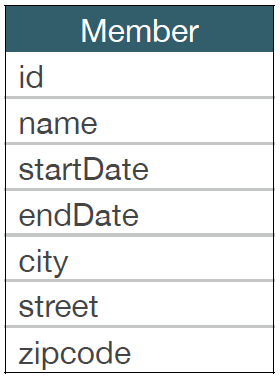

임베디드 타입을 통해 각 칼럼 정보들을 묶어내서, 회원 엔티티가 이름, 근무 기간, 집 주소를 가지는 것으로 추상화할 수 있다.

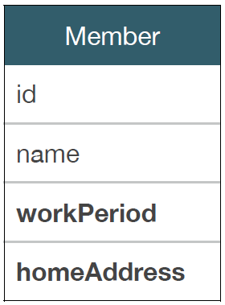
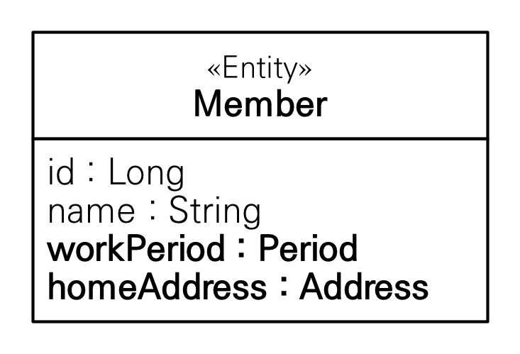

이 때 Period, Address라는 값타입을 정의하고, 멤버 엔티티에서 임베디드 타입으로 사용하면 된다.

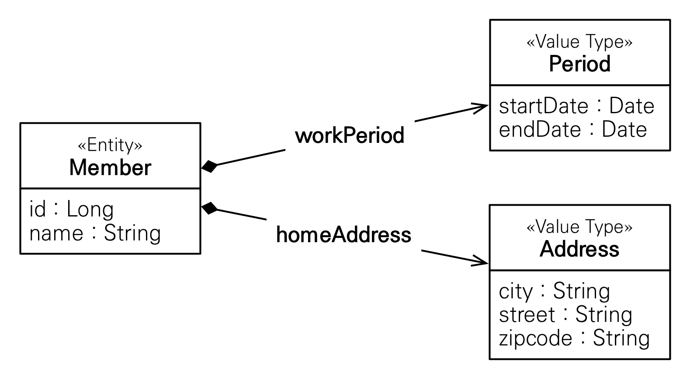

임베디드 타입을 사용하기 위해서 다음의 두 어노테이션을 사용한다.

- @Embeddable: 값 타입을 정의하는 곳에 표시
- @Embedded: 값 타입을 사용하는 곳에 표시

임베디드 타입도 엔티티와 마찬가지로 기본 생성자를 필수로 정의해야 한다.  
또한 임베디드 타입도 값 타입의 일종이기 때문에, 값 타입을 소유한 엔티티에 생명주기를 의존한다.

```java
// src/main/java/hellojpa/Member
@Entity
public class Member {
    …
    @Embedded
    private Period workPeriod;

    @Embedded
    private Address homeAddress;
}
```

```java
// src/main/java/hellojpa/Address
@Embeddable
public class Address {
    private String city;
    private String street;
    private String zipcode;
}
```

```java
// src/main/java/hellojpa/Period
@Embeddable
public class Period {
    private LocalDateTime startDate;
    private LocalDateTime endDate;
}
```

```java
※ src/main/java/hellojpa/jpaMain
Member member = new Member();
member.setUsername("hello");
member.setHomeAddress(new Address("city", "street", "100"));
member.setWorkPeriod(new Period());
em.persist(member);
```

임베디드 타입의 장점은 타입이 재사용 가능하다는 것과, 데이터의 응집도가 높아진다는 점이다.  
또한 해당 값 타입만 사용하는 의미 있는 메소드를 클래스 내에 정의하면, 더 객체 지향적으로 설계할 수 있다.  
(ex. 기간이 근무 시간인지를 반환하는 Period.isWork())

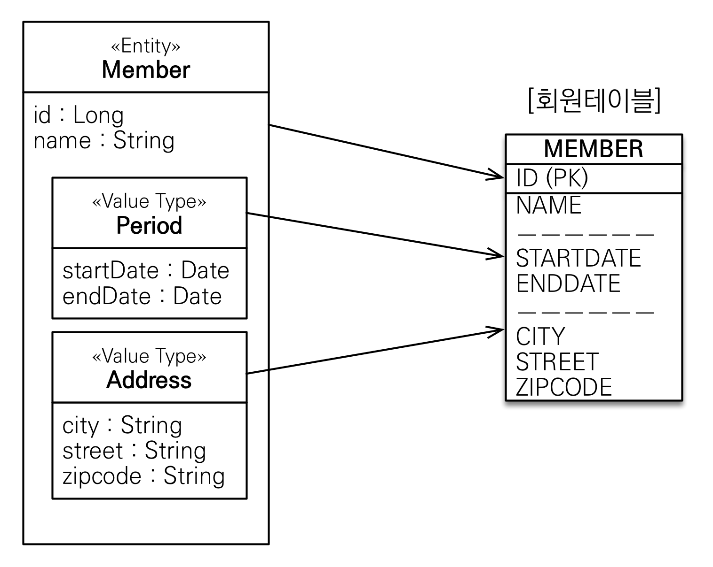

임베디드 타입을 사용하더라도 테이블은 변경된 것이 없다.  
임베디드 타입은 엔티티의 값일 뿐이기 떄문에 매핑 대상이 되는 테이블은 이전과 동일하다.

테이블은 데이터를 잘 관리하는게 목적이기 떄문에 모든 데이터를 가지고 있는게 맞다.  
하지만 엔티티는 기능을 함께 가지고 있기 때문에 데이터를 묶음으로써 얻는 이득이 분명 존재한다.
임베디드 타입을 통해 객체와 테이블을 아주 세밀하게(find-grained) 매핑하는 것이 가능하다.  
잘 설계한 ORM 애플리케이션은 매핑한 테이블의 수보다 클래스의 수가 더 많다.

또한 임베디드 타입이 다른 임베디드 타입이나 엔티티를 포함할 수도 있다.

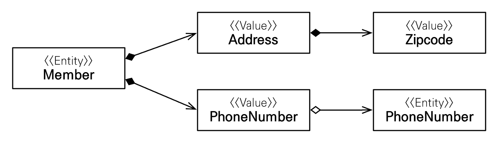

위 예제에서는 임베디드 타입인 Address가 또다른 임베디드 타입인 Zipcode을 가지고 있다.  
또한 임베디드 타입인 PhoneNumber가 엔티티 타입인 PhoneNumber를 가지고 있다.

값 타입의 속성들을 컬럼에 매핑하기 위해 `@AttributeOverride`를 사용할 수 있다.  
만약 한 엔티티에서 같은 값 타입을 중복해서 사용하면 column 명이 중복되기 떄문에, `@AttributeOverrides`, `@AttributeOverride`를 사용해서 column 명 속성을 재정의해야 한다.

```java
@Entity
public class Member {
    …
    @Embedded
    @AttributeOverrides({
        @AttributeOverride(name = "city", column = @Column(name = "WORK_CITY")),
        @AttributeOverride(name = "street", column = @Column(name = "WORK_STREET")),
        @AttributeOverride(name = "zipcode", column = @Column(name = "WORK_ZIPCODE"))
    })
    private Address workAddress;
}
```

또한 임베디드 타입의 값이 null이면, 매핑한 컬럼 값은 모두 null이 된다.  
예를 들어 `member.setAdress(null)`로 지정하면, 그 안의 프로퍼티인 city, street, zipcode가 모두 null인 것처럼 동작한다.

### 3) 값 타입과 불변 객체

값 타입은 복잡한 객체 세상을 조금이라도 단순화하려고 만든 개념이다.  
따라서 값 타입은 보다 단순하고 안전하게 다룰 수 있어야 한다.  
이 때 임베디드 타입 같은 값 타입의 참조를 복사해서 여러 엔티티에서 공유하게 되면, side effect가 발생할 수 있어서 위험하다.

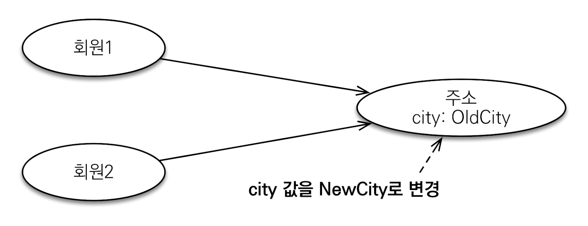

위 예제에서 주소 값타입의 city 프로퍼티 값을 oldCity에서 newCity로 바꾸면,
같은 주소 객체를 바라보고 있는 회원1, 회원2의 주소가 모두 변경된다.

```java
// src/main/java/hellojpa/jpaMain
Address address = new Address("oldCity", "street", "100");

Member member = new Member();
member.setUsername("member1");
member.setHomeAddress(address);
em.persist(member);

Member member2 = new Member();
member2.setUsername("member2");
member2.setHomeAddress(address);  // member2도 같은 Adress를 사용
em.persist(member2);

// 첫번째 member의 주소를 변경
member.getHomeAddress().setCity("newCity");
```

```bash
# UPDATE 쿼리가 2번 발생 -> member1, member2 모두 변경됨
Hibernate:
    /* update
        hellojpa.Member */ update
            Member
        set city=?, street=?, zipcode=?, USERNAME=?, endDate=?, startDate=?
        where MEMBER_ID=?
Hibernate:
    /* update
        hellojpa.Member */ update
            Member
        set city=?, street=?, zipcode=?, USERNAME=?, endDate=?, startDate=?
        where MEMBER_ID=?
```

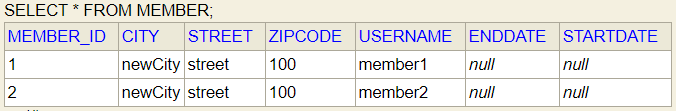

위와 같이 값 타입의 실제 인스턴스를 공유하는 것은 위험하기 때문에, 대신 인스턴스의 값을 복사해서 사용해야 한다.

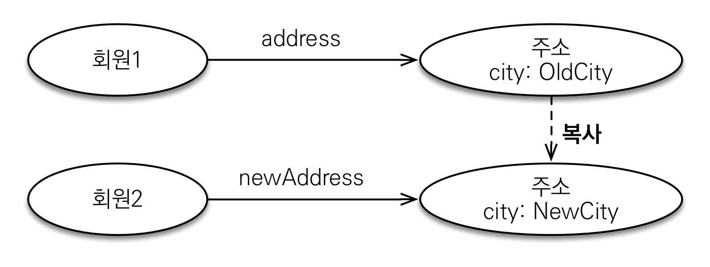

```java
※ src/main/java/hellojpa/jpaMain
Address address = new Address("oldCity", "street", "100");
Member member = new Member();
member.setUsername("member1");
member.setHomeAddress(address);
em.persist(member);

// 값타입의 값을 복사
Address copyAddress = new Address(address.getCity(), address.getStreet(), address.getZipcode());
Member member2 = new Member();
member2.setUsername("member2");
member2.setHomeAddress(copyAddress);
em.persist(member2);

// 첫번째 member의 주소를 변경
member.getHomeAddress().setCity("newCity");
```

```bash
# 의도한대로 UPDATE 쿼리가 한 번만 발생
Hibernate:
    /* update
        hellojpa.Member */ update
            Member
        set city=?, street=?, zipcode=?, USERNAME=?, endDate=?, startDate=?
        where MEMBER_ID=?
```

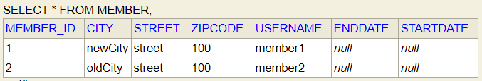

항상 값을 복사해서 사용하면 공유 참조로 인해 발생하는 부작용을 피할 수 있다.  
자바 기본 타입에 값을 대입하면 자동으로 값을 복사하기 때문에 문제가 없다.  
하지만 임베디드 타입처럼 직접 정의한 값 타입은 자바의 기본타입이 아니라 객체 타입이다.  
객체 타입은 값을 직접 대입해서 참조가 공유되는 것을 막을 방법이 없다.

**기본 타입(primitive type)**

```java
int a = 10;
int b = a;  // 기본 타입은 값을 복사해서 넣음
b = 4;  // a는 바뀌지 않음
```

**객체 타입**

```java
Address a = new Address("Old");
Address b = a;  // 객체 타입은 참조를 전달 → 같은 Address 인스턴스를 가리킴
b.setCity("New")  // a도 같은 인스턴스를 바라보기 때문에, 함께 바뀜
```

이러한 문제가 있기 때문에 값 타입은 언제나 불변 객체(immutable object)로 설계해야 한다.  
불변 객체는 생성 시점 이후에는 절대 값을 변경할 수 없는 객체이다. (대표적인 불변 객체 - Integer, String)

불변 객체로 만들기 위해서는 생성자로만 값을 설정하고, 수정자(Setter)를 별도로 만들지 않으면 된다.  
불변이라는 작은 제약을 줌으로써 부작용이라는 큰 재앙을 막을 수 있다.

```java
※ src/main/java/hellojpa/jpaMain
    Address address = new Address("oldCity", "street", "100");

    Member member = new Member();
    member.setUsername("member1");
    member.setHomeAddress(address);
    em.persist(member);

    // 값을 바꾸고 싶다면, 임베디드 타입을 새로 만들어서 갈아끼워야 함!
    Address newAddress = new Address("newCity", address.getStreet(), address.getZipcode());
    member.setHomeAddress(newAddress);
```

### 4) 값 타입의 비교

값 타입의 경우 인스턴스가 다르더라도, 그 안에 값이 같으면 동등한 것으로 봐야 한다.

```java
public static void main(String[] args) {
    int a = 10;
    int b = 10;
    System.out.println("a==b = " + (a==b))

    Address address1 = new Address("oldCity", "street", "100");
    Address address2 = new Address("oldCity", "street", "100");
    System.out.println("address1==address2 = " + (a==b))
}
```

```bash
a==b = true
address1==address2 = false
```

- 동일성(identity) 비교: == 사용, 인스턴스의 참조 값을 비교
- 동등성(equivalence) 비교: equals() 사용, 인스턴스의 값을 비교 (주로 모든 필드를 비교)

값 타입은 `a.equals(b)`와 같이 동등성 비교를 해야 한다.  
이 때 모든 필드를 이용해서 비교가 될 수 있도록 값 타입의 equals() 메소드를 적절하게 재정의해야 한다.  
`alt+insert(generate)` → `equals() and hashcode()`로 자동 생성하면 알아서 객체 내의 멤버 변수를 바탕으로 equals를 재정의해준다.  
이 때 `Use getters during code generation`를 체크해 줘서 equals 내에서 getter를 사용하도록 해야 프록시일 때에도 equals()가 제대로 작동한다.

```java
※ src/main/java/hellojpa/Address
public class Address {
    …
    // 재정의된 equals, city, street, zipcode 모두 같아야 true 반환
    @Override
    public boolean equals(Object o) {
        if (this == o) return true;
        if (o == null || getClass() != o.getClass()) return false;
        Address address = (Address) o;
        return Objects.equals(city, address.city)
            && Objects.equals(street, address.street)
            && Objects.equals(zipcode, address.zipcode);
    }
    @Override
    public int hashCode() {
        return Objects.hash(city, street, zipcode);
    }
}
```

```java
public static void main(String[] args) {
        Address address1 = new Address("oldCity", "street", "100");
        Address address2 = new Address("oldCity", "street", "100");
        System.out.println("address1 equals address2 = " + (address1.equals(address2)));
}
```

```bash
address1 equals address2 = true
```

### 5) 값 타입 컬렉션

db는 기본적으로 컬렉션을 담을 자료형이 존재하지 않는다.  
컬렉션을 db에 매핑하기 위해서는 컬렉션에 들어갈 원소를 별도의 테이블에 저장해서 1: N 관계로 연결해야 한다.

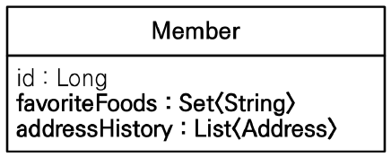

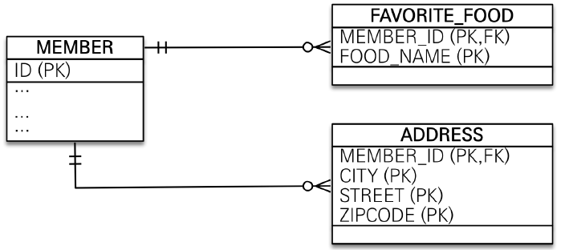

값 타입 컬렉션은 값 타입을 하나 이상 저장할 때 사용한다.  
데이터베이스는 컬렉션을 같은 테이블에 저장할 수 없기 때문에, 컬렉션을 저장하기 위한 별도의 테이블이 필요하다.  
@ElementCollection, @CollectionTable을 사용해서 구성할 수 있다.

```java
※ src/main/java/hellojpa/Member
@Entity
public class Member {
    …
    @ElementCollection
    @CollectionTable(
      name = "FAVORITE_FOOD",  // 테이블 이름 지정
      joinColumns = @JoinColumn(name = "MEMBER_ID")  // 조인할 외래키 지정
    )
    @Column(name = "FOOD_NAME")  // 들어가는 column이 하나인 경우, column의 이름을 지정할 수 있다
    private Set<String> favoriteFoods = new HashSet<>();

    @ElementCollection
    @CollectionTable(
      name = "ADDRESS",
      joinColumns = @JoinColumn(name = "MEMBER_ID")
    )
    private List<Address> addressHistory = new ArrayList<>();
}
```

```bash
…
Hibernate:
    create table FAVORITE_FOOD (
      MEMBER_ID bigint not null, # 외래키 값
      FOOD_NAME varchar(255)
    )

Hibernate:
    create table ADDRESS (
      MEMBER_ID bigint not null,
      city varchar(255),
      street varchar(255),
      zipcode varchar(255)
    )
```

값 타입 컬렉션은 기본적으로 지연 로딩 전략을 사용한다.  
또한 영속성 전이(Cascade) + 고아 객체 제거 기능을 필수로 가진다.  
다음은 값타입 컬렉션에 값을 저장하고 조회하는 예제이다.

```java
// src/main/java/hellojpa/jpaMain
Member member = new Member();
member.setUsername("member1");
// 값 타입 저장
member.setHomeAddress(new Address("homeCity", "street", "10000"));

/**
 * 값 타입 컬렉션에 값 저장
 */
member.getFavoriteFoods().add("치킨");
member.getFavoriteFoods().add("족발");
member.getFavoriteFoods().add("피자");
member.getAddressHistory().add(new Address("old1", "street", "10000"));
member.getAddressHistory().add(new Address("old2", "street", "10000"));

em.persist(member);  // CASCADE 적용되어 값 타입들도 함께 저장됨
em.flush();
em.clear();

System.out.println("=============== START ==============");
// member를 가져올 때 값타입들을 함께 가져오진 않음 - 지연로딩 사용
Member findMember = em.find(Member.class, member.getId());

List<Address> addressHistory = findMember.getAddressHistory();
for (Address address : addressHistory) {
    System.out.println("address = " + address.getCity());
}

Set<String> favoriteFoods = findMember.getFavoriteFoods();
for (String favoriteFood : favoriteFoods) {
    System.out.println("favoriteFood = " + favoriteFood);
}
```

```bash
Hibernate:
    create table Member (
      MEMBER_ID bigint not null,
      city varchar(255),
      street varchar(255),
      zipcode varchar(255),
      USERNAME varchar(255),
      primary key (MEMBER_ID)
    )
Hibernate:
    create table FAVORITE_FOOD (
      MEMBER_ID bigint not null,
      FOOD_NAME varchar(255)
    )
Hibernate:
    create table ADDRESS (
      MEMBER_ID bigint not null,
      city varchar(255),
      street varchar(255),
      zipcode varchar(255)
    )

=============== START ==============
Hibernate:
    select
        member0_.MEMBER_ID as MEMBER_I1_6_0_,
        …
    from Member member0_
    where member0_.MEMBER_ID=?

# addressHistory가 사용되는 시점에 쿼리를 날림 (지연로딩)
Hibernate:
    select
        addresshis0_.MEMBER_ID as MEMBER_I1_0_0_,
        …
    from ADDRESS addresshis0_
    where addresshis0_.MEMBER_ID=?

address = old1
address = old2

# favoriteFoods가 사용되는 시점에 쿼리를 날림 (지연로딩)
Hibernate:
    select
        favoritefo0_.MEMBER_ID as MEMBER_I1_4_0_,
        favoritefo0_.FOOD_NAME as FOOD_NAM2_4_0_
    from FAVORITE_FOOD favoritefo0_
    where favoritefo0_.MEMBER_ID=?

favoriteFood = 족발
favoriteFood = 치킨
favoriteFood = 피자
```

이번에는 값타입 컬렉션의 원소를 삭제하고 다시 넣는 예제를 살펴보자.

```java
// src/main/java/hellojpa/jpaMain
…
Member findMember = em.find(Member.class, member.getId());
// 치킨 -> 한식
findMember.getFavoriteFoods().remove("치킨");
findMember.getFavoriteFoods().add("한식");
```

```bash
…
Hibernate:
    /* delete collection row
      hellojpa.Member.favoriteFoods */
    delete from FAVORITE_FOOD
      where MEMBER_ID=? and FOOD_NAME=?
Hibernate:
    /* insert collection row
      hellojpa.Member.favoriteFoods */
    insert into FAVORITE_FOOD (MEMBER_ID, FOOD_NAME)
      values (?, ?)
```

값타입 컬렉션에는 CASCADE와 고아 객체 삭제가 기본 적용되기 때문에, 위와 같이 컬렉션만 변경해도 db에 쿼리가 날라가면서 데이터가 수정된다.

다만 값 타입 컬렉션에는 제약 사항이 많다.  
값 타입은 엔티티와 다르게 식별자 개념이 없기 때문에, 값을 변경하면 추적이 어렵다.  
이로 인해 JPA에서는 값 타입 컬렉션에 변경 사항이 발생하면, 주인 엔티티와 연관된 모든 값 타입 데이터를 삭제하고, 값 타입 컬렉션에 있는 현재 값을 모두 다시 저장하는 식으로 동작한다.

```java
// src/main/java/hellojpa/jpaMain
…
Member findMember = em.find(Member.class, member.getId());
findMember.getAddressHistory().remove(new Address("old1", "street", "10000"));
findMember.getAddressHistory().add(new Address("new1", "street", "10000"));
// remove(...) 사용시, 내부적으로 equals()를 실행하여, 같은 값을 갖고 있는 객체를 지워준다.
// →  equals()를 제대로 오버라이딩 해야한다!
```

```bash
# AddressHistory 테이블의 해당 멤버와 연관된 모든 데이터를 삭제
Hibernate:
    /* delete collection hellojpa.Member.addressHistory */
    delete from ADDRESS where MEMBER_ID=?
# 남아있어야 하는 데이터 INSERT
Hibernate:
    /* insert collection row hellojpa.Member.addressHistory */
    insert  into ADDRESS (MEMBER_ID, city, street, zipcode) values (?, ?, ?, ?)
# 새롭게 추가한 데이터 INSERT
Hibernate:
    /* insert collection row hellojpa.Member.addressHistory */
    insert  into ADDRESS (MEMBER_ID, city, street, zipcode) values (?, ?, ?, ?)
```

또한 식별자가 별도로 없기 때문에 값 타입 컬렉션에 매핑되는 테이블은 모든 컬럼을 묶어서 기본키로 구성한다.  
따라서 모든 칼럼에 null 입력이 불가능하고, 중복된 값을 저장하는 것도 불가능하다.

위와 같이 사용하는데 제약사항이 너무 많기 때문에 값 타입 컬렉션은 가능한 사용하지 않는 것이 좋다.  
실무에서는 값 타입 컬렉션 대신, 상황에 맞게 일대다 관계나 다대일 양방향 관계로 풀어내면 된다.  
값타입만을 내부적으로 가지고 있는 엔티티를 별도로 정의하고, 일대다 관계를 통해 연관관계를 맺어주면 된다.  
여기에 영속성 전이(cascade)와 고아 객체 제거(orphanRemoval)를 적용해서 값 타입 컬렉션처럼 사용하면 된다.

```java
// src/main/java/hellojpa/Member
@Entity
public class Member {
    …
    // 일대다 관계 : cascade와 고아 객체 설정, 라이프 사이클 동일하게 맞춤
    @OneToMany(cascade = CascadeType.ALL, orphanRemoval = true)
    @JoinColumn(name = "MEMBER_ID")
    private List<AddressEntity> addressHistory = new ArrayList<>();
}
```

```java
// src/main/java/hellojpa/AddressEntity
@Entity
@Table(name = "ADDRESS")
public class AddressEntity {
    @Id @GeneratedValue
    private Long id;

    // 내부에 임베디드 타입인 Address를 가지고 있음
    // Address의 값들이 AddressEntity의 칼럼으로 저장됨
    @Embedded
    private Address address;

    public AddressEntity() {
    }

    public AddressEntity(String city, String street, String zipcode) {
        this.address = new Address(city, street, zipcode);
    }
}
```

```java
// src/main/java/hellojpa/jpaMain
…
Member member = new Member();
member.setUsername("member1");
member.setHomeAddress(new Address("homeCity", "street", "10000"));

member.getAddressHistory().add(new AddressEntity("old1", "street", "10000"));
member.getAddressHistory().add(new AddressEntity("old2", "street", "10000"));

em.persist(member);
```

```bash
# MEMBER INSERT
Hibernate:
    /* insert hellojpa.Member */
    insert into Member (city, street, zipcode, USERNAME, MEMBER_ID) values (?, ?, ?, ?, ?)
# ADDRESS INSERT
Hibernate:
    /* insert hellojpa.AddressEntity*/
     insert into ADDRESS (city, street, zipcode, id) values (?, ?, ?, ?)
Hibernate:
    /* insert hellojpa.AddressEntity */
    insert into ADDRESS (city, street, zipcode, id) values (?, ?, ?, ?)
# MEMBER - ADDRESS 관계 설정
Hibernate:
    /* create one-to-many row hellojpa.Member.addressHistory */
    update ADDRESS set MEMBER_ID=? where id=?
Hibernate:
    /* create one-to-many row hellojpa.Member.addressHistory */
    update ADDRESS set MEMBER_ID=? where id=?
```

값 타입은 정말 값 타입이라 판단될 때만 사용해야 한다.  
예를 들어 치킨/피자 중 선호도를 선택하는 수준의 극도로 단순한 case에만 사용해야 한다.  
식별자가 필요하고 지속해서 값을 추적 및 변경해야 한다면, 그것은 값 타입이 아닌 엔티티로 설계해야 한다.

### 6) 실전 예제 - 6. 값 타입 매핑

주소 정보가 Member와 Delivery에 동시에 존재하는 상황이다.  
Address라는 별도의 값타입을 정의해서, Member와 Delivery에서 재사용하도록 하자.

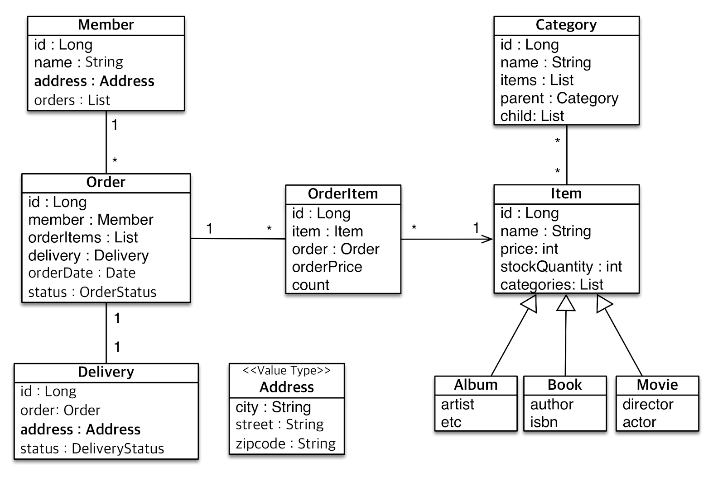

```java
// src/main/java/jpabook.jpashop/domain/Member
@Entity
public class Member extends BaseEntity {
    …
    @Embedded
    private Address address;
}
```

```java
// src/main/java/jpabook.jpashop/domain/Delivery
@Entity
public class Delivery {
    …
    @Embedded
    private Address address;
}
```

```java
※ src/main/java/jpabook.jpashop/domain/Address
@Embeddable
public class Address {
    @Column(length = 10)
    private String city;

    @Column(length = 20)
    private String street;

    @Column(length = 5)
    private String zipcode;

    public String fullAddress() {
        return getCity() + " " + getStreet() + " " + getZipcode();
    }
}
```

위와 같이 Address 값 타입을 정의하면, 칼럼에 적용하는 제약 사항을 모든 Entity에 동일하게 적용할 수 있다.  
또한 fullAddress() 처럼 Address와 관련된 비즈니스 메서드를 정의하여 코드의 응집력을 상승시킬 수 있다.
