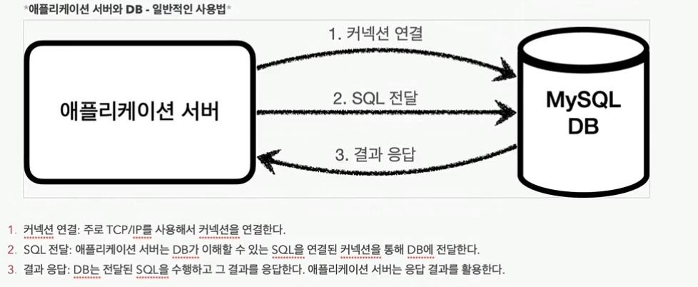

### 1. JDBC 이해



보통 애플리케이션 서버에서는 중요한 데이터를 저장하기 위해 데이터베이스를 사용한다.  
이 때 서버에서 데이터베이스를 사용하기 위해서는 크게 3가지 단계를 거쳐야 한다.

1. 커넥션 연결
2. sql 전달
3. 결과 응답

예전에는 해당 과정을 직접 애플리케이션 코드로 구현했고, 각 db마다 세부적인 구현 방법도 달랐다.
따라서 특정 db를 활용하려면 해당 db의 세부 연결방법을 학습해야만 했다.
또한 db를 변경하면 해당 db에 맞는 연결 방법을 새롭게 배우고, 코드도 모두 변경해야 했다.

jdbc에서는 db에 접근하는 인터페이스를 추상화해두었다.
db 작업에 필요한 3가지의 단계를 다음의 인터페이스로 추상화했다.

- `java.sql.Connection` - 커넥션 연결
- `java.sql.Statement` - SQL 전달
- `java.sql.ResultSet` - SQL 결과 응답

각 db 벤더들은 자신의 db에 접근할 수 있는 jdbc 드라이버를 개발해서 제공한다.  
각 db 드라이버는 모두 jdbc 인터페이스에 맞게 구현되어 있다.

이렇게 바뀌면서 개발자는 jdbc 표준 api를 사용해서 개발하기만 하면 되도록 바뀌었다.
만약 사용하는 db 종류가 바뀐다면 드라이버만 바꿔서 끼워주면 된다.

### 2. JDBC와 최신 데이터 접근 기술

최근에는 jdbc를 직접 사용하기 보다는, 사용을 편리하게 도와주는 여러 기술들을 통해 사용한다.  
대표적인 데이터 접근 기술에는 ObjectMapper와 JPA가 있다.

ObjectMapper의 경우에는 sql을 전달하면, 커넥션 연결 등 반복적인 작업을 자동으로 수행하고, 받아온 결과를 바탕으로 객체를 생성해준다.  
Jpa는 sql 객체를 전달하면 동적으로 sql을 생성하여 각 db의 특징적인 sql도 자동으로 생성해준다.
ObjectMapper는 sql을 직접 짜야한다는 단점이 있으나, sql만 작성할 줄 알면 쉽게 사용할 수 있다.  
ORM은 직접 sql을 짤 필요가 없어서 개발 생산성이 올라가지만, 깊이 있게 활용하기 위해서는 학숩이 필요하다.

기억해야 할 점은, 어떤 기술을 사용하든 그 기반에서는 결국 jdbc를 사용한다는 것이다.
따라서 각 기술을 깊이 있게 활용하고 문제 발생 시 해결하기 위해서는 jdbc의 기본 동작 원리를 학습해야 한다.

### 3. 데이터베이스 연결

어플리케이션에는 다양한 jdbc driver가 등록될 수 있다.  
`DriverManager.getConnection()`는 등록된 드라이버 중 적절한 드라이버를 찾아서 db에 연결을 맺게 해준다.  
jdbc를 이용하여 연결을 맺는 코드를 다음과 같이 작성할 수 있다.

```java
@Slf4j
public class DBConnectionUtil {
  public static Connection getConnection() {
    try {
      Connection connection = DriverManager.getConnection(URL, USERNAME,
  PASSWORD);
      log.info("get connection={}, class={}", connection,
  connection.getClass());
      return connection;
    } catch (SQLException e) {
      throw new IllegalStateException(e);
    }
  }
}
```

해당 getConnection 메서드를 호출하면 다음과 같은 로그가 남는다.

```
DBConnectionUtil - get connection=conn0: url=jdbc:h2:tcp://localhost/~/test
  user=SA, class=class org.h2.jdbc.JdbcConnection
```

h2 전용 커넥션 객체인 org.h2.jdbc.JdbcConnection 을 사용하고 있는 것을 확인할 수 있다.  
이는 h2 데이터베이스 드라이버에서 제공한 것으로, jdbc의 java.sql.Connection 표준 커넥션 인터페이스를 구현한 것이다.


db에 커넥션을 맺을 때의 url은 다음과 같은 형식을 갖는다.

```
jdbc:h2:tcp://localhost/~/test
```

`DriverManager.getConnection(URL, USERNAME, PASSWORD)` 메서드는 등록된 모든 드라이버를 순회하면서, db url이 각 드라이버에서 처리할 수 있는 형식인지를 확인하여 적절한 드라이버를 찾는다.  
해당 드라이버를 통해 db와 연결을 맺은 후에는 드라이버에서 구현한 java sql Connection 구현체가 반환된다.


### 4. JDBC 개발 - 등록

실행할 sql문을 스트링으로 작성하고, 이를 Statement 생성자에 넘겨서 객체를 생성한다.
앞서 연결한 Connection 객체로부터 Statement 객체를 생성할 수 있다.

```java
String sql = "insert into member(member_id, money) values(?, ?)";

Connection con = getConnection();
PreparedStatement pstmt = con.prepareStatement(sql);
```

PreparedStatement를 사용하면 원하는 변수를 바인딩할 수 있다. (sql injection을 막기 위한 것)

executeUpdate()를 호출하면 입력한 update문이 실행되고, 그 결과가 반환된다.

```java
pstmt.executeUpdate();
```

모든 db 실행을 마친 후에는 connection을 닫는 것을 잊지 말아야 한다. 생성된 역순으로 statement, connection 순서로 닫아준다

```
pstmt.close();
con.close();
```

(위 코드에서는 에러 처리를 제외해서 간단하게 작성했으나, 실제 코드에서는 에러 핸들링이 필요하다)

### 5. JDBC 개발 - 조회

조회도 등록과 대부분의 플로우가 비슷하다.

```java
String sql = "select * from member where member_id = ?";

Connection con = getConnection();
PreparedStatement pstmt = con.prepareStatement(sql);
ResultSet rs = pstmt.executeQuery();
```

조회의 경우 쿼리를 실행한 결과를 ResultSet 객체로 받는다.  
resultSet.next()를 호출하면 커서가 한 칸씩 이동하면서 모든 데이터를 순회할 수 있다.
이렇게 이동한 데이터로부터 각 컬럼 값을 꺼내고, 새로운 엔티티 객체에 해당 값을 넣어준다

```java
if (rs.next()) {
  Member member = new Member();
  member.setMemberId(rs.getString("member_id"));
  member.setMoney(rs.getInt("money"));
  return member;
}
```

### 6. JDBC 개발 - 수정, 삭제

수정, 삭제의 경우도 앞선 생성/조회와 동일하게 ?가 포함되어 있는 쿼리로 만든 PreparedStatement를 이용하여, 변수값을 바인딩해서 실행시키면 된다. 생성의 경우와 동일하게 executeUpdate를 호출하면 된다.
