### 스프링 트랜잭션 전파1 - 커밋, 롤백

스프링에서는 트랜잭션을 중첩해서 사용하는 등의 상황에서 트랜잭션 전파가 발생한다.  
예제를 통해서 스프링 전파가 어떻게 동작하는지 확인하고, 스프링 트랜잭션의 동작 원리에 대해서 더 깊이 학습해보자.

먼저 가장 기본적인 트랜잭션 사용 예제를 살펴보자.  
트란잭션 매니저의 경우 스프링에서 자동으로 넣어주는 객체 대신, 직접 DataSourceTransactionManager를 생성해서 삽입했다.
기본적인 트랜잭션 커밋, 롤백을 수행하는 테스트 케이스를 작성했다.

```java
package hello.springtx.propagation;

@Slf4j
@SpringBootTest
public class BasicTxTest {

    @Autowired
    PlatformTransactionManager txManager;

    @TestConfiguration
    static class Config {
        @Bean
        public PlatformTransactionManager transactionManager(DataSource dataSource) {
            return new DataSourceTransactionManager(dataSource);
        }
    }

    @Test
    void commit() {
        log.info("트랜잭션 시작");
        TransactionStatus status = txManager.getTransaction(new DefaultTransactionAttribute());

        log.info("트랜잭션 커밋 시작");
        txManager.commit(status);
        log.info("트랜잭션 커밋 완료");
    }

    @Test
    void rollback() {
        log.info("트랜잭션 시작");
        TransactionStatus status = txManager.getTransaction(new DefaultTransactionAttribute());

        log.info("트랜잭션 롤백 시작");
        txManager.rollback(status);
        log.info("트랜잭션 롤백 완료");
    }
}
```

먼저 트랜잭션 커밋 시에 남는 로그는 다음과 같다.  
트랜잭션 매니저를 통해 커넥션을 얻어외서 트랜잭션을 시작한 뒤, 트랜잭션 커밋 시점에 커넥션을 반환한다.

```
sringtx.propagation.BasicTxTest : 트랜잭션 시작
DataSourceTransactionManager : Creating new transaction with name [null]
DataSourceTransactionManager : Acquired Connection [conn0] for JDBC transaction
DataSourceTransactionManager : Switching JDBC Connection [conn0] to manual commit
sringtx.propagation.BasicTxTest : 트랜잭션 커밋 시작
DataSourceTransactionManager : Initiating transaction commit
DataSourceTransactionManager : Committing JDBC transaction on Connection [conn0]
DataSourceTransactionManager : Releasing JDBC Connection [conn0] after transaction
sringtx.propagation.BasicTxTest : 트랜잭션 커밋 완료
```

트랜잭션 롤백 시 남는 로그는 다음과 같다.  
트랜잭션 매니저를 통해 커넥션을 얻어외서 트랜잭션을 시작한 뒤, 롤백 시점에 커넥션을 반환한다.

```
sringtx.propagation.BasicTxTest : 트랜잭션 시작
DataSourceTransactionManager : Creating new transaction with name [null] : Acquired Connection [conn0] for JDBC
DataSourceTransactionManager : Switching JDBC Connection [conn0] to manual transaction commit
sringtx.propagation.BasicTxTest : 트랜잭션 롤백 시작
DataSourceTransactionManager : Initiating transaction rollback
DataSourceTransactionManager : Rolling back JDBC transaction on Connection [conn0]
DataSourceTransactionManager : Releasing JDBC Connection [conn0] after transaction
sringtx.propagation.BasicTxTest : Releasing JDBC Connection [conn0] after : 트랜잭션 롤백 완료
```

### 스프링 트랜잭션 전파2 - 트랜잭션 두 번 사용

이번에는 하나의 메서드 안에서 잇달아 트랜잭션을 두 번 사용하는 예제를 확인해보자.

```java
package hello.springtx.propagation;

@Slf4j
@SpringBootTest
public class BasicTxTest {

    @Autowired
    PlatformTransactionManager txManager;

    @TestConfiguration
    static class Config {
        @Bean
        public PlatformTransactionManager transactionManager(DataSource dataSource) {
            return new DataSourceTransactionManager(dataSource);
        }
    }

    @Test
    void double_commit() {
        log.info("트랜잭션1 시작");
        TransactionStatus tx1 = txManager.getTransaction(new DefaultTransactionAttribute());
        log.info("트랜잭션1 커밋");
        txManager.commit(tx1);

        log.info("트랜잭션2 시작");
        TransactionStatus tx2 = txManager.getTransaction(new DefaultTransactionAttribute());
        log.info("트랜잭션2 커밋");
        txManager.commit(tx2);
    }

    @Test
    void double_commit_rollback() {
        log.info("트랜잭션1 시작");
        TransactionStatus tx1 = txManager.getTransaction(new DefaultTransactionAttribute());
        log.info("트랜잭션1 커밋");
        txManager.commit(tx1);

        log.info("트랜잭션2 시작");
        TransactionStatus tx2 = txManager.getTransaction(new DefaultTransactionAttribute());
        log.info("트랜잭션2 롤백");
        txManager.rollback(tx2);
    }
}
```

먼저 트랜잭션 커밋을 잇따라 수행하는 double_commit()의 로그는 다음과 같다.  
커넥션을 얻어오면서 트랜잭션 시작 및 커밋 시점에 반환 후, 다시 새롭게 트랜잭션을 시작하여 다음 작업을 진행한다.  

```
트랜잭션1 시작
Creating new transaction with name [null]: PROPAGATION_REQUIRED,ISOLATION_DEFAULT
Acquired Connection [HikariProxyConnection@1064414847 wrapping conn0] for JDBC transaction
Switching JDBC Connection [HikariProxyConnection@1064414847 wrapping conn0] to manual commit
트랜잭션1 커밋
Initiating transaction commit
Committing JDBC transaction on Connection [HikariProxyConnection@1064414847 wrapping conn0]
Releasing JDBC Connection [HikariProxyConnection@1064414847 wrapping conn0] after transaction

트랜잭션2 시작
Creating new transaction with name [null]: PROPAGATION_REQUIRED,ISOLATION_DEFAULT
Acquired Connection [HikariProxyConnection@778350106 wrapping conn0] for JDBC transaction
Switching JDBC Connection [HikariProxyConnection@778350106 wrapping conn0] to manual commit
트랜잭션2 커밋
Initiating transaction commit
Committing JDBC transaction on Connection [HikariProxyConnection@778350106 wrapping conn0]
Releasing JDBC Connection [HikariProxyConnection@778350106 wrapping conn0] after transaction
```

이 때 앱에서 커넥션 풀을 사용하고 있기 때문에, 두 경우 모두 동일한 물리 커넥션인 conn0를 사용하고 있다.  
트랜잭션1에서 획득하고 반환한 것과 동일한 물리 커넥션을 트랜잭션2에서 사용하고 있는 것이다.  
히카리 커넥션 풀에서 커넥션을 반환 받으면 프록시를 반환 받는데, 이 프록시 객체는 두 경우에 차이가 있는 것을 확인할 수 있다.  
커넥션 풀의 작용에 따라 커넥션을 재사용하고는 있으나, 트랜잭션1, 2에서 각각 사용하고 있는 커넥션은 구분된다고 봐야 한다.

- 트랜잭션1: Acquired Connection [HikariProxyConnection@1000000 wrapping conn0] 
- 트랜잭션2: Acquired Connection [HikariProxyConnection@2000000 wrapping conn0]

트랜잭션을 연속으로 사용하는 상황을 다음과 같은 그림으로 풀어낼 수 있다.  
트랜잭션1과 트랜잭션2는 분리된 상태로 진행되며, 내부에서 사용하는 db 커넥션도 서로 다르다.

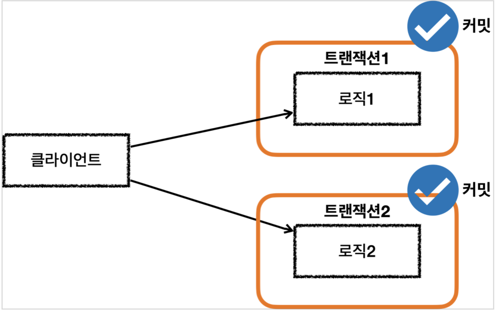

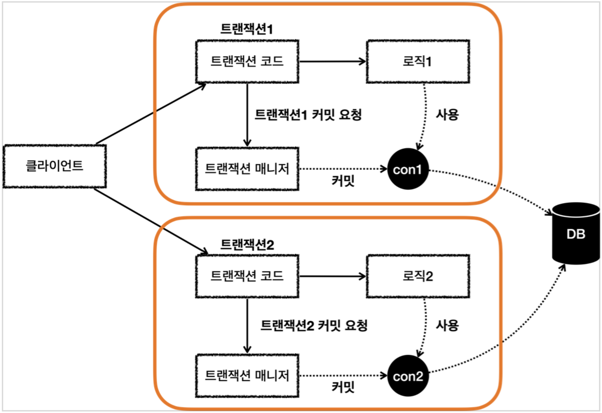

이번에는 트랜잭션1을 커밋한 뒤, 트랜잭션2에서 롤백을 수행하는 double_commit_rollback() 메서드의 로그를 살펴보자.  
위 예제와 마찬가지로 각 트랜잭션에서 별도로 커넥션을 얻어와서 커밋/롤백이 수행된다.

```
트랜잭션1 시작
Creating new transaction with name [null]: PROPAGATION_REQUIRED,ISOLATION_DEFAULT
Acquired Connection [HikariProxyConnection@1943867171 wrapping conn0] for JDBC transaction
Switching JDBC Connection [HikariProxyConnection@1943867171 wrapping conn0] to manual commit
트랜잭션1 커밋
Initiating transaction commit
Committing JDBC transaction on Connection [HikariProxyConnection@1943867171 wrapping conn0]
Releasing JDBC Connection [HikariProxyConnection@1943867171 wrapping conn0] after transaction
트랜잭션2 시작
Creating new transaction with name [null]: PROPAGATION_REQUIRED,ISOLATION_DEFAULT
Acquired Connection [HikariProxyConnection@239290560 wrapping conn0] for JDBC transaction
Switching JDBC Connection [HikariProxyConnection@239290560 wrapping conn0] to manual commit
트랜잭션2 롤백
Initiating transaction rollback
Rolling back JDBC transaction on Connection [HikariProxyConnection@239290560 wrapping conn0]
Releasing JDBC Connection [HikariProxyConnection@239290560 wrapping conn0] after transaction
```

이는 아래의 그림으로 풀어낼 수 있다.  
각 트랜잭션이 분리된 상태로 커밋/롤백 되기 때문에, 서로에게 영향을 주지 않는다.

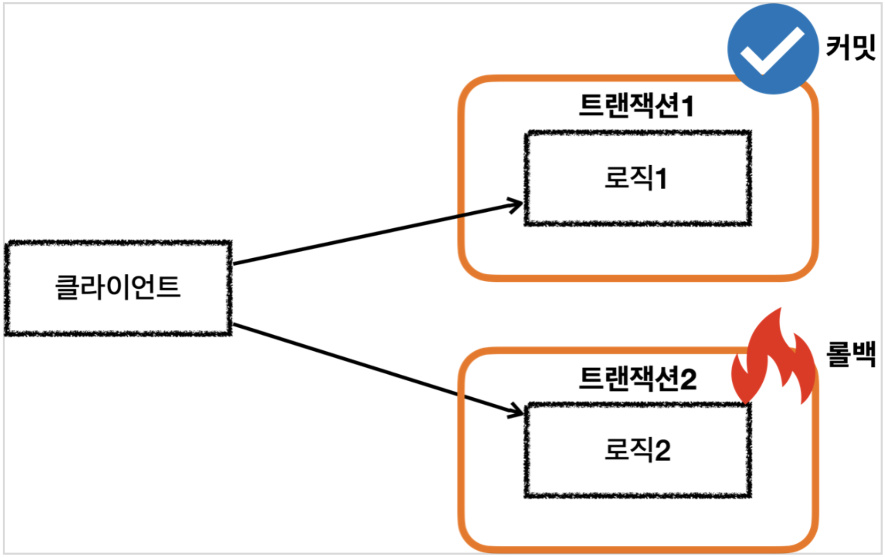

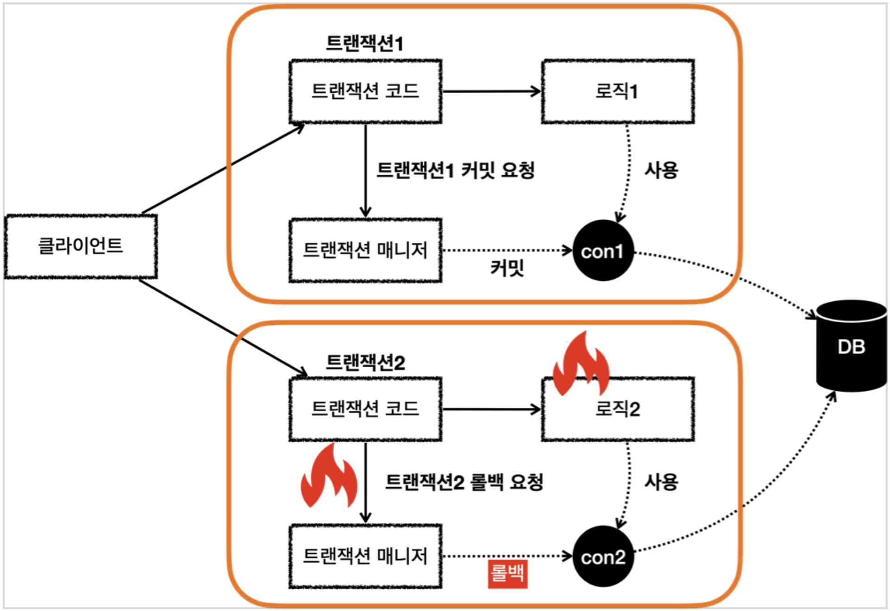

### 스프링 트랜잭션 전파3 - 전파 기본

만약 트랜잭션이 아직 커밋/롤백 되지 않은 상태에서 새로운 트랜잭션을 시작하면 어떻게 될까?
기존의 트랜잭션을 이어 받거나, 새로운 트랜잭션을 시작하는 식으로 동작해야 하는데, 이를 결정하는 것을 트랜잭션 전파라고 한다.
스프링에서 제공하는 트랜잭션 전파의 원리를 자세히 확인해보자.

설명에서는 외부 트랜잭션과 내부 트랜잭션으로 개념을 나눠서 설명한다.  
외부 트랜잭션은 먼저 시작한 트랜잭션이고, 내부 트랜잭션은 외부 트랜잭션이 끝나기 전에 시작된 트랜잭션이다.

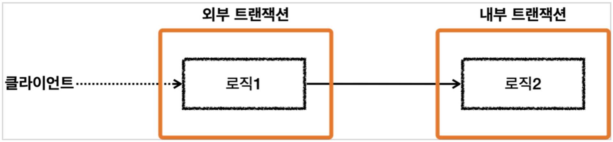

이 때 스프링의 트랜잭션 전파는 두 트랜잭션을 묶어서 하나의 트랜잭션으로 만든다.  
마치 내부 트랜잭션이 외부 트랜잭션에 참여하는 식으로 동작하게 된다.

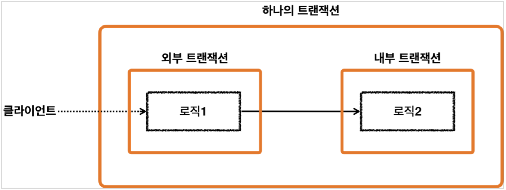

스프링에서는 물리 트랜잭션과 논리 트랜잭션으로 개념을 구분한다.  
물리 트랜잭션은 실제로 커넥션을 통해 set autocommit false를 통해 트랜잭션을 시작하고 커밋/롤백하는 단위이다.  
논리 트랜잭션은 트랜잭션 매니저를 통해 트랜잭션을 사용하는 단위이다.

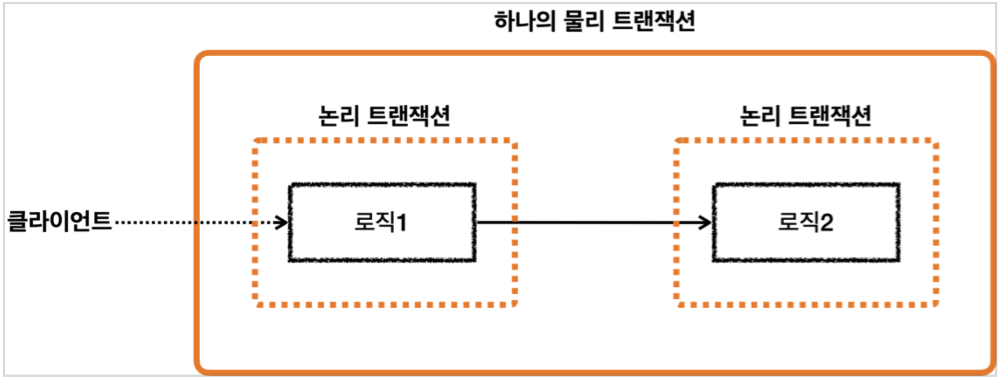

만약 트랜잭션이 하나만 사용된다면 물리/논리 트랜잭션이 구분되지 않는다.  
하지만 트랜잭션이 중첩되어 사용되면 여러 가지의 경우의 수가 가능해지고, 각 상황을 설명하기 위해서 논리 트랜잭션이라는 단위가 필요해진다.  
논리 트랜잭션은 다음과 같은 원칙을 가진다.

- 모든 논리 트랜잭션이 커밋 되어야 물리 트랜잭션이 커밋된다.
- 하나의 논리 트랜잭션이라도 롤백되면, 물리 트랜잭션은 롤백된다.

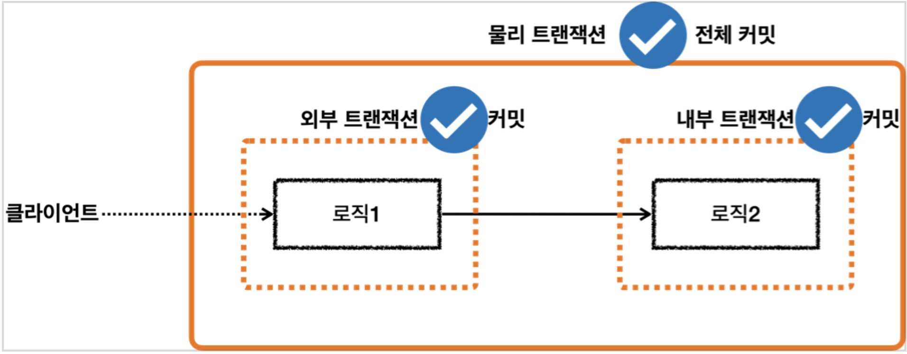

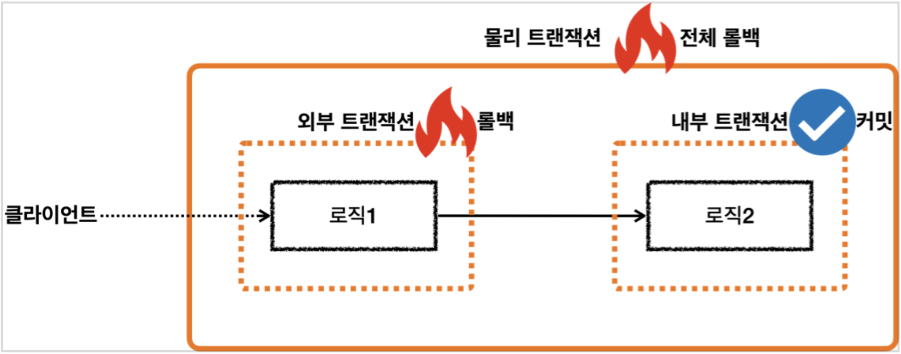

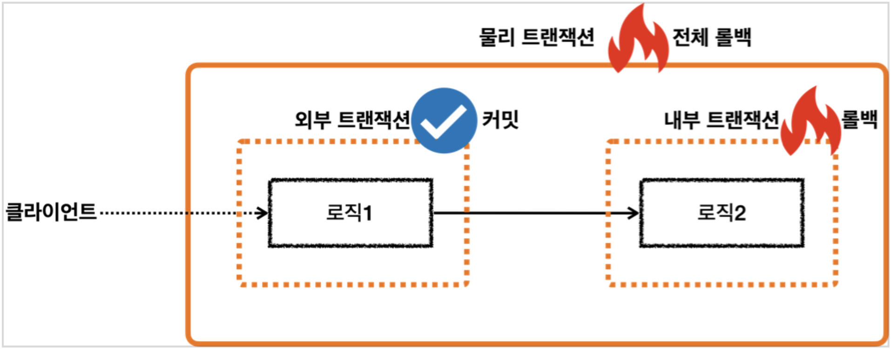

### 스프링 트랜잭션 전파4 - 전파 예제

먼저 내부 트랜잭션이 모두 커밋 되어, 물리 트랜잭션이 커밋되는 경우를 확인해보자.

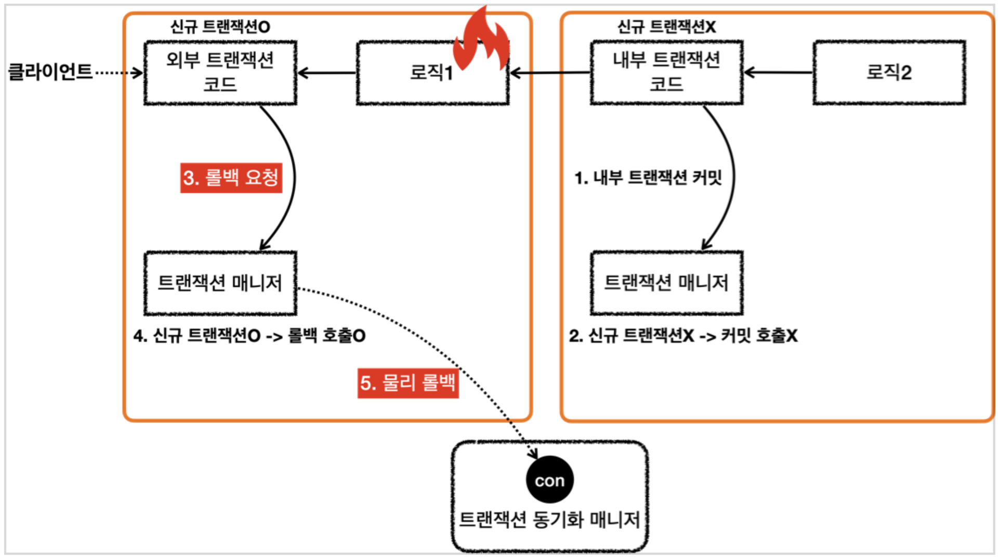

```java
    @Test
    void inner_commit() {
        log.info("외부 트랜잭션 시작");
        TransactionStatus outer = txManager.getTransaction(new DefaultTransactionAttribute());
        log.info("outer.isNewTransaction()={}", outer.isNewTransaction());

        log.info("내부 트랜잭션 시작");
        TransactionStatus inner = txManager.getTransaction(new DefaultTransactionAttribute());
        log.info("inner.isNewTransaction()={}", inner.isNewTransaction());
        log.info("내부 트랜잭션 커밋");
        txManager.commit(inner);

        log.info("외부 트랜잭션 커밋");
        txManager.commit(outer);
    }
```

inner_commit() 에서는 먼저 외부 트랜잭션 outer를 시작한 뒤, 내부에서 inner 트랜잭션을 시작 및 커밋한다.  
내부 트랜잭션 작업을 모두 마친 후에 outer 트랜잭션을 커밋한다.

위와 같은 상황에서는 내부 트랜잭션이 외부 트랜잭션에 참여하게 된다.  
이는 외부에서 시작한 물리 트랜잭션의 범위가 내부 트랜잭션까지 넓어진다는 것을 의미한다.  
다른 물리 트랜잭션에 참여한 트랜잭션인지를 확인할 때에는 tx.isNewTransaction() 값을 참조할 수 있다.

실행 로그를 확인해보면 외부 트랜잭션을 시작/커밋할 때에는 커넥션을 이용해서 트랜잭션 작업을 하는 로그가 확인된다.  
이와 달리 내부 트랜잭션 시작 시에는 다음과 같이 외부 트랜잭션에 참여하는 로그가 남는다.  
`Participating in existing transaction inner.isNewTransaction()=false`
또한 내부 트랜잭션 커밋 시에는 아무런 로그도 남지 않는다.

```
외부 트랜잭션 시작
Creating new transaction with name [null]: PROPAGATION_REQUIRED,ISOLATION_DEFAULT
Acquired Connection [HikariProxyConnection@1943867171 wrapping conn0] for JDBC transaction
Switching JDBC Connection [HikariProxyConnection@1943867171 wrapping conn0] to manual commit
outer.isNewTransaction()=true

내부 트랜잭션 시작
Participating in existing transaction inner.isNewTransaction()=false
내부 트랜잭션 커밋

외부 트랜잭션 커밋
Initiating transaction commit
Committing JDBC transaction on Connection [HikariProxyConnection@1943867171 wrapping conn0]
Releasing JDBC Connection [HikariProxyConnection@1943867171 wrapping conn0] after transaction
```

이와 같이 트랜잭션이 중첩 사용되면, 외부 트랜잭션이 전체 물리 트랜잭션을 관리하게 된다.

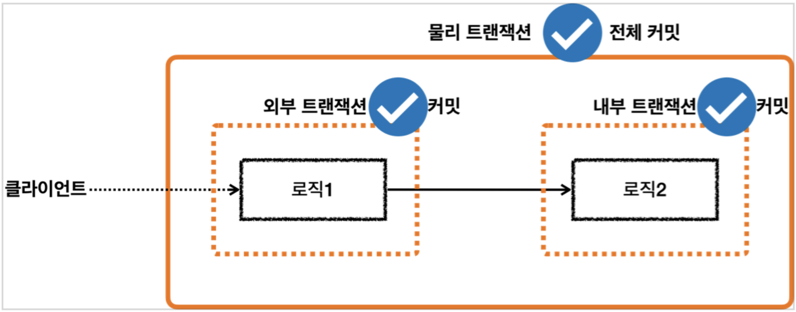

전체적인 동작 과정을 다음과 같이 정리할 수 있다.  
최초에 트랜잭션 시작을 요청하면, 트랜잭션 매니저에서 DataSource로부터 커넥션을 얻어와서 트랜잭션을 시작한다.  
해당 커넥션은 트랜잭션 동기화 매니저에 저장되고, 트랜잭션 매니저는 새로운 트랜잭션이라는 정보(isNewTransaction)를 담아서 status를 반환한다.  
레포지토리 단에서는 동기화 매니저로부터 커넥션을 얻어와서 로직을 수행하게 된다.

이 때 내부 로직에서 잇달아 트랜잭션 시작을 요청하면, 트랜잭션 매니저는 이미 시작한 트랜잭션이 있음을 확인하고 기존 트랜잭션에 참여한다.  
이는 기존에 트랜잭션을 시작한 커넥션을 그대로 사용한다는 것을 의미한다.  
트랜잭션 매니저는 새로운 트랜잭션이 아니라는 정보를 담아서 status를 반환하고, 레포지토리 단에서는 동기화 매니저로부터 기존의 커넥션을 얻어와서 로직을 수행한다.

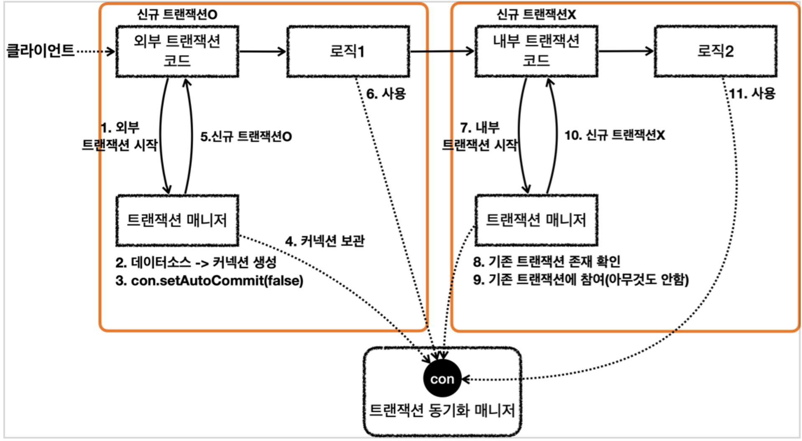

이제 커밋 과정은 다음과 같다.  
먼저 내부 트랜잭션이 커밋 되는데, 트랜잭션 매니저에서 새로운 트랜잭션이 아님을 확인하고 물리적 커밋을 하지 않는다.  
이후에 외부 트랜잭션이 커밋되고, 매니저에서 새로운 트랜잭션임을 확인하고 물리적 커밋을 수행한다.

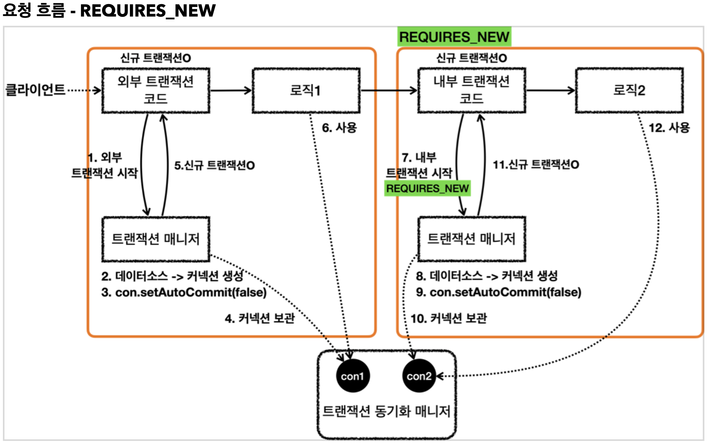

예시에서 보듯이 트랜잭션 매니저를 통해 커밋을 한다고 해서 반드시 물리적 커밋이 발생하는 것은 아니다.  
외부 트랜잭션에서 전체 물리 트랜잭션을 관리하기 때문에, 외부 트랜잭션이 최종 커밋될 때에만 물리적 커밋이 발생한다.

### 스프링 트랜잭션 전파5 - 외부 롤백

이번에는 내부 트랜잭션은 커밋 되었는데 외부 트랜잭션이 롤백되는 경우를 살펴보자.  

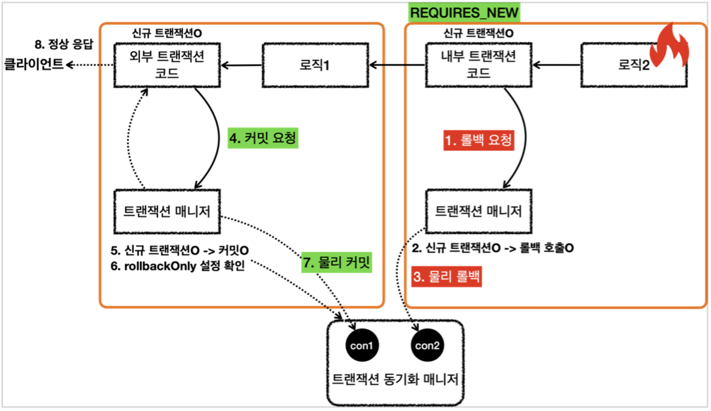

outer_rollback() 에서는 기존과 동일하게 outer 트랜잭션을 시작한 후 inner 트랜잭션을 시작한다.  
이 때 내부 트랜잭션이 먼저 커밋된 후, 외부 트랜잭션이 롤백되도록 구현했다.

```java
@Test
void outer_rollback() {
    log.info("외부 트랜잭션 시작");
    TransactionStatus outer = txManager.getTransaction(new DefaultTransactionAttribute());

    log.info("내부 트랜잭션 시작");
    TransactionStatus inner = txManager.getTransaction(new DefaultTransactionAttribute());
    log.info("내부 트랜잭션 커밋");
    txManager.commit(inner);

    log.info("외부 트랜잭션 롤백");
    txManager.rollback(outer);
}
```

이에 대한 실행 로그는 다음과 같다.  
이전과 동일하게 내부 트랜잭션 시작/커밋 시에는 물리 트랜잭션이 작동하지 않고, 외부 트랜잭션에서 시작/롤백할 때 로그가 남고 있다.  
결국 외부 트랜잭션이 롤백되면서 내부 트랜잭션의 작업도 함께 롤백되었다.  

```
외부 트랜잭션 시작
Creating new transaction with name [null]: PROPAGATION_REQUIRED,ISOLATION_DEFAULT
Acquired Connection [HikariProxyConnection@461376017 wrapping conn0] for JDBC transaction
Switching JDBC Connection [HikariProxyConnection@461376017 wrapping conn0] to manual commit

내부 트랜잭션 시작
Participating in existing transaction
내부 트랜잭션 커밋

외부 트랜잭션 롤백
Initiating transaction rollback
Rolling back JDBC transaction on Connection [HikariProxyConnection@461376017 wrapping conn0]
Releasing JDBC Connection [HikariProxyConnection@461376017 wrapping conn0] after transaction
```

커밋/롤백 수행 과정은 다음과 같다.  
먼저 내부 트랜잭션이 커밋을 요청하면, 트랜잭션 매니저에서는 신규 트랜잭션이 아님을 확인하고 넘어간다.  
이제 외부 트램잭션이 롤백을 요청하면, 매니저에서 신규 트랜잭션임을 확인하고 물리적 롤백을 수행한다.


### 스프링 트랜잭션 전파6 - 내부 롤백

이번에는 내부 트랜잭션은 롤백, 외부 트랜잭션은 커밋되는 경우를 살펴보자.


inner_rollback() 에서는 기존과 동일하게 외부/내부 트랜잭션을 시작한다.  
이제 먼저 내부 트랜잭션이 롤백하고, 외부 트랜잭션은 커밋한다.

```java
@Test
void inner_rollback() {
    log.info("외부 트랜잭션 시작");
    TransactionStatus outer = txManager.getTransaction(new DefaultTransactionAttribute());

    log.info("내부 트랜잭션 시작");
    TransactionStatus inner = txManager.getTransaction(new DefaultTransactionAttribute());
    log.info("내부 트랜잭션 롤백");
    txManager.rollback(inner); //rollback-only 표시

    log.info("외부 트랜잭션 커밋");
    assertThatThrownBy(() -> txManager.commit(outer))
            .isInstanceOf(UnexpectedRollbackException.class);
}
```

이에 대한 실행 로그는 다음과 같다.

```
외부 트랜잭션 시작
Creating new transaction with name [null]: PROPAGATION_REQUIRED,ISOLATION_DEFAULT
Acquired Connection [HikariProxyConnection@220038608 wrapping conn0] for JDBC transaction
Switching JDBC Connection [HikariProxyConnection@220038608 wrapping conn0] to manual commit

내부 트랜잭션 시작
Participating in existing transaction
내부 트랜잭션 롤백
Participating transaction failed - marking existing transaction as rollback-only
Setting JDBC transaction [HikariProxyConnection@220038608 wrapping conn0] rollback-only

외부 트랜잭션 커밋
Global transaction is marked as rollback-only but transactional code requested commit
Initiating transaction rollback
Rolling back JDBC transaction on Connection [HikariProxyConnection@220038608 wrapping conn0]
Releasing JDBC Connection [HikariProxyConnection@220038608 wrapping conn0] after transaction
```

외부/내부 트랜잭션을 시작한 후 내부 트랜잭션을 롤백했다.  
이 때 다음과 같이 트랜잭션에 rollback-only를 마킹한다는 로그가 남는다.  
`Participating transaction failed - marking existing transaction as rollback-only`  
이로 인해 기존 트랜잭션은 롤백만 가능하도록 상태가 변경되고, 외부 트랜잭션이 커밋 되더라도 해당 상태값으로 인해 롤백이 발생하게 된다.  
`Global transaction is marked as rollback-only but transactional code requested commit`

전체적인 플로우는 다음과 같다.  
먼저 내부 트랜잭션에서 트랜잭션 매니저에 롤백을 요청하면, 매니저는 신규 트랜잭션이 아님을 확인한다.  
따라서 물리 트랜잭션을 롤백하지 않고, 트랜잭션 매니저의 rollbackOnly 값을 true로 변경하는 식으로 동작한다.  
이제 외부 트랜잭션에서 트랜잭션 매니저에 커밋을 요청하면, 매니저는 rollbackOnly 값이 true임을 확인하고 물리 트랜잭션을 롤백한다.  
이 때 스프링은 UnexpectedRollbackException을 발생시켜서 예상치 못한 롤백이 발생했음을 알린다.


외부 트랜잭션을 커밋했는데 전체가 롤백되는 상황은, 예외 없이 그냥 넘어가게 되면 사용자에게 혼란을 줄 수 있다.  
위와 같이 모호한 상황이 발생했을 때에는 예외를 발생시켜서 기대와 다른 결괴가 발생했음을 명확히 알리는 것이 좋은 설계이다.

### 스프링 트랜잭션 전파7 - REQUIRES_NEW

만약 외부/내부 트랜잭션의 물리 트랜잭션을 별도로 구성하고 싶다면, 내부 트랜잭션 시작 시 REQUIRES_NEW 옵션을 주면 된다.  
이를 통해 외부/내부 트랜잭션에서 별도로 커밋/롤백을 수행할 수 있다.


