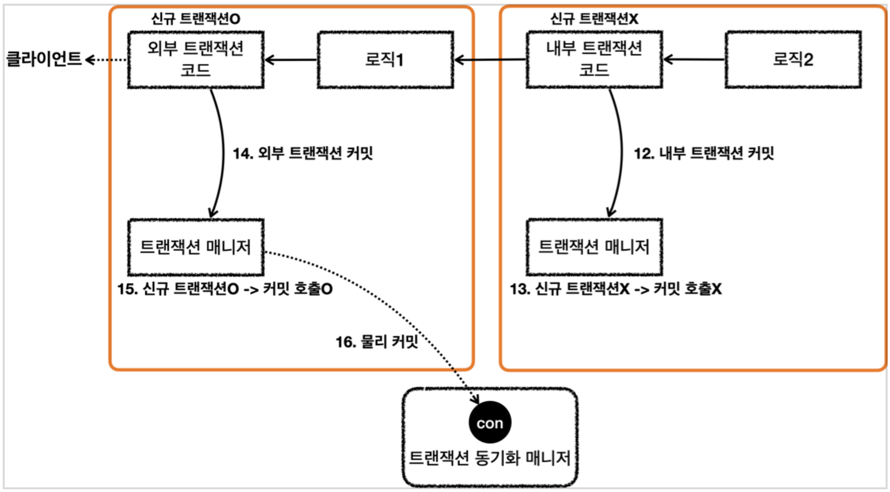
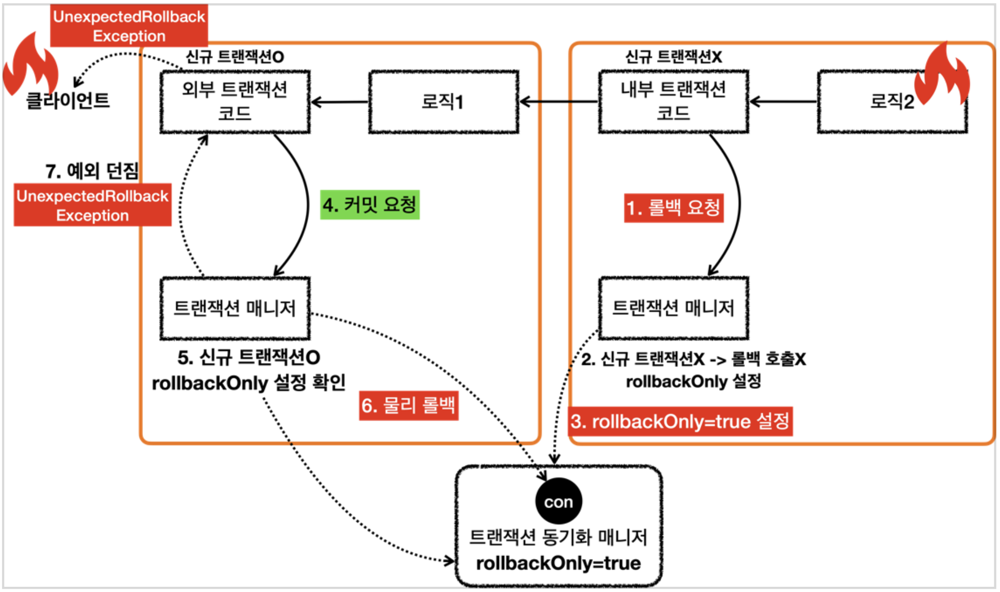

### 스프링 트랜잭션 전파1 - 커밋, 롤백

스프링에서는 트랜잭션을 중첩해서 사용하는 등의 상황에서 트랜잭션 전파가 발생한다.  
예제를 통해서 스프링 전파가 어떻게 동작하는지 확인하고, 스프링 트랜잭션의 동작 원리에 대해서 더 깊이 학습해보자.

먼저 가장 기본적인 트랜잭션 사용 예제를 살펴보자.  
트란잭션 매니저의 경우 스프링에서 자동으로 넣어주는 객체 대신, 직접 DataSourceTransactionManager를 생성해서 삽입했다.
기본적인 트랜잭션 커밋, 롤백을 수행하는 테스트 케이스를 작성했다.

```java
package hello.springtx.propagation;

@Slf4j
@SpringBootTest
public class BasicTxTest {

    @Autowired
    PlatformTransactionManager txManager;

    @TestConfiguration
    static class Config {
        @Bean
        public PlatformTransactionManager transactionManager(DataSource dataSource) {
            return new DataSourceTransactionManager(dataSource);
        }
    }

    @Test
    void commit() {
        log.info("트랜잭션 시작");
        TransactionStatus status = txManager.getTransaction(new DefaultTransactionAttribute());

        log.info("트랜잭션 커밋 시작");
        txManager.commit(status);
        log.info("트랜잭션 커밋 완료");
    }

    @Test
    void rollback() {
        log.info("트랜잭션 시작");
        TransactionStatus status = txManager.getTransaction(new DefaultTransactionAttribute());

        log.info("트랜잭션 롤백 시작");
        txManager.rollback(status);
        log.info("트랜잭션 롤백 완료");
    }
}
```

먼저 트랜잭션 커밋 시에 남는 로그는 다음과 같다.

```
sringtx.propagation.BasicTxTest : 트랜잭션 시작
DataSourceTransactionManager : Creating new transaction with name [null]
DataSourceTransactionManager : Acquired Connection [conn0] for JDBC transaction
DataSourceTransactionManager : Switching JDBC Connection [conn0] to manual commit
sringtx.propagation.BasicTxTest : 트랜잭션 커밋 시작
DataSourceTransactionManager : Initiating transaction commit
DataSourceTransactionManager : Committing JDBC transaction on Connection [conn0]
DataSourceTransactionManager : Releasing JDBC Connection [conn0] after transaction
sringtx.propagation.BasicTxTest : 트랜잭션 커밋 완료
```

```
sringtx.propagation.BasicTxTest : 트랜잭션 시작
DataSourceTransactionManager : Creating new transaction with name [null] : Acquired Connection [conn0] for JDBC
DataSourceTransactionManager : Switching JDBC Connection [conn0] to manual transaction commit
sringtx.propagation.BasicTxTest : 트랜잭션 롤백 시작
DataSourceTransactionManager : Initiating transaction rollback
DataSourceTransactionManager : Rolling back JDBC transaction on Connection [conn0]
DataSourceTransactionManager : Releasing JDBC Connection [conn0] after transaction
sringtx.propagation.BasicTxTest : Releasing JDBC Connection [conn0] after : 트랜잭션 롤백 완료
```

### 스프링 트랜잭션 전파2 - 트랜잭션 두 번 사용

```
트랜잭션1 시작
Creating new transaction with name [null]: PROPAGATION_REQUIRED,ISOLATION_DEFAULT
Acquired Connection [HikariProxyConnection@1064414847 wrapping conn0] for JDBC transaction
Switching JDBC Connection [HikariProxyConnection@1064414847 wrapping conn0] to manual commit
트랜잭션1 커밋
Initiating transaction commit
Committing JDBC transaction on Connection [HikariProxyConnection@1064414847 wrapping conn0]
Releasing JDBC Connection [HikariProxyConnection@1064414847 wrapping conn0] after transaction
트랜잭션2 시작
Creating new transaction with name [null]: PROPAGATION_REQUIRED,ISOLATION_DEFAULT
Acquired Connection [HikariProxyConnection@778350106 wrapping conn0] for JDBC transaction
Switching JDBC Connection [HikariProxyConnection@778350106 wrapping conn0] to manual commit
트랜잭션2 커밋
Initiating transaction commit
Committing JDBC transaction on Connection [HikariProxyConnection@778350106 wrapping conn0]
Releasing JDBC Connection [HikariProxyConnection@778350106 wrapping conn0] after transaction
```


```
트랜잭션1 시작
Creating new transaction with name [null]: PROPAGATION_REQUIRED,ISOLATION_DEFAULT
Acquired Connection [HikariProxyConnection@1943867171 wrapping conn0] for JDBC transaction
Switching JDBC Connection [HikariProxyConnection@1943867171 wrapping conn0] to manual commit
트랜잭션1 커밋
Initiating transaction commit
Committing JDBC transaction on Connection [HikariProxyConnection@1943867171 wrapping conn0]
Releasing JDBC Connection [HikariProxyConnection@1943867171 wrapping conn0] after transaction
트랜잭션2 시작
Creating new transaction with name [null]: PROPAGATION_REQUIRED,ISOLATION_DEFAULT
Acquired Connection [HikariProxyConnection@239290560 wrapping conn0] for JDBC transaction
Switching JDBC Connection [HikariProxyConnection@239290560 wrapping conn0] to manual commit
트랜잭션2 롤백
Initiating transaction rollback
Rolling back JDBC transaction on Connection [HikariProxyConnection@239290560 wrapping conn0]
Releasing JDBC Connection [HikariProxyConnection@239290560 wrapping conn0] after transaction
```


### 스프링 트랜잭션 전파3 - 전파 기본




### 스프링 트랜잭션 전파4 - 전파 예제


```
외부 트랜잭션 시작
Creating new transaction with name [null]: PROPAGATION_REQUIRED,ISOLATION_DEFAULT
Acquired Connection [HikariProxyConnection@1943867171 wrapping conn0] for JDBC transaction
Switching JDBC Connection [HikariProxyConnection@1943867171 wrapping conn0] to manual commit
outer.isNewTransaction()=true
내부 트랜잭션 시작
Participating in existing transaction inner.isNewTransaction()=false
내부 트랜잭션 커밋
외부 트랜잭션 커밋
Initiating transaction commit
Committing JDBC transaction on Connection [HikariProxyConnection@1943867171 wrapping conn0]
Releasing JDBC Connection [HikariProxyConnection@1943867171 wrapping conn0]
after transaction
```




### 스프링 트랜잭션 전파5 - 외부 롤백
