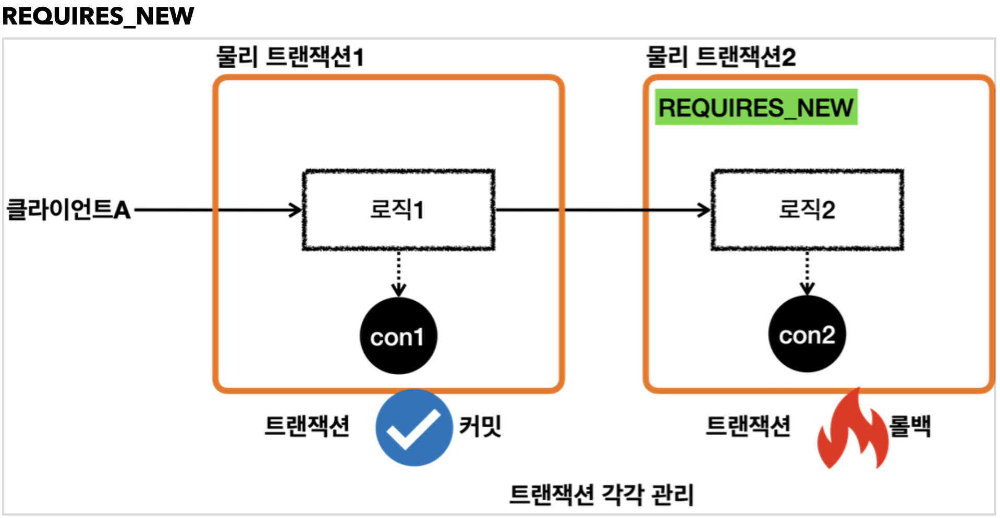

### 스프링 트랜잭션 전파1 - 커밋, 롤백

스프링에서는 트랜잭션을 중첩해서 사용하는 등의 상황에서 트랜잭션 전파가 발생한다.  
예제를 통해서 스프링 전파가 어떻게 동작하는지 확인하고, 스프링 트랜잭션의 동작 원리에 대해서 더 깊이 학습해보자.

먼저 가장 기본적인 트랜잭션 사용 예제를 살펴보자.  
트란잭션 매니저의 경우 스프링에서 자동으로 넣어주는 객체 대신, 직접 DataSourceTransactionManager를 생성해서 삽입했다.
기본적인 트랜잭션 커밋, 롤백을 수행하는 테스트 케이스를 작성했다.

```java
package hello.springtx.propagation;

@Slf4j
@SpringBootTest
public class BasicTxTest {

    @Autowired
    PlatformTransactionManager txManager;

    @TestConfiguration
    static class Config {
        @Bean
        public PlatformTransactionManager transactionManager(DataSource dataSource) {
            return new DataSourceTransactionManager(dataSource);
        }
    }

    @Test
    void commit() {
        log.info("트랜잭션 시작");
        TransactionStatus status = txManager.getTransaction(new DefaultTransactionAttribute());

        log.info("트랜잭션 커밋 시작");
        txManager.commit(status);
        log.info("트랜잭션 커밋 완료");
    }

    @Test
    void rollback() {
        log.info("트랜잭션 시작");
        TransactionStatus status = txManager.getTransaction(new DefaultTransactionAttribute());

        log.info("트랜잭션 롤백 시작");
        txManager.rollback(status);
        log.info("트랜잭션 롤백 완료");
    }
}
```

먼저 트랜잭션 커밋 시에 남는 로그는 다음과 같다.  
트랜잭션 매니저를 통해 커넥션을 얻어외서 트랜잭션을 시작한 뒤, 트랜잭션 커밋 시점에 커넥션을 반환한다.

```
sringtx.propagation.BasicTxTest : 트랜잭션 시작
DataSourceTransactionManager : Creating new transaction with name [null]
DataSourceTransactionManager : Acquired Connection [conn0] for JDBC transaction
DataSourceTransactionManager : Switching JDBC Connection [conn0] to manual commit
sringtx.propagation.BasicTxTest : 트랜잭션 커밋 시작
DataSourceTransactionManager : Initiating transaction commit
DataSourceTransactionManager : Committing JDBC transaction on Connection [conn0]
DataSourceTransactionManager : Releasing JDBC Connection [conn0] after transaction
sringtx.propagation.BasicTxTest : 트랜잭션 커밋 완료
```

트랜잭션 롤백 시 남는 로그는 다음과 같다.  
트랜잭션 매니저를 통해 커넥션을 얻어외서 트랜잭션을 시작한 뒤, 롤백 시점에 커넥션을 반환한다.

```
sringtx.propagation.BasicTxTest : 트랜잭션 시작
DataSourceTransactionManager : Creating new transaction with name [null] : Acquired Connection [conn0] for JDBC
DataSourceTransactionManager : Switching JDBC Connection [conn0] to manual transaction commit
sringtx.propagation.BasicTxTest : 트랜잭션 롤백 시작
DataSourceTransactionManager : Initiating transaction rollback
DataSourceTransactionManager : Rolling back JDBC transaction on Connection [conn0]
DataSourceTransactionManager : Releasing JDBC Connection [conn0] after transaction
sringtx.propagation.BasicTxTest : Releasing JDBC Connection [conn0] after : 트랜잭션 롤백 완료
```

### 스프링 트랜잭션 전파2 - 트랜잭션 두 번 사용

이번에는 하나의 메서드 안에서 잇달아 트랜잭션을 두 번 사용하는 예제를 확인해보자.

```java
package hello.springtx.propagation;

@Slf4j
@SpringBootTest
public class BasicTxTest {

    @Autowired
    PlatformTransactionManager txManager;

    @TestConfiguration
    static class Config {
        @Bean
        public PlatformTransactionManager transactionManager(DataSource dataSource) {
            return new DataSourceTransactionManager(dataSource);
        }
    }

    @Test
    void double_commit() {
        log.info("트랜잭션1 시작");
        TransactionStatus tx1 = txManager.getTransaction(new DefaultTransactionAttribute());
        log.info("트랜잭션1 커밋");
        txManager.commit(tx1);

        log.info("트랜잭션2 시작");
        TransactionStatus tx2 = txManager.getTransaction(new DefaultTransactionAttribute());
        log.info("트랜잭션2 커밋");
        txManager.commit(tx2);
    }

    @Test
    void double_commit_rollback() {
        log.info("트랜잭션1 시작");
        TransactionStatus tx1 = txManager.getTransaction(new DefaultTransactionAttribute());
        log.info("트랜잭션1 커밋");
        txManager.commit(tx1);

        log.info("트랜잭션2 시작");
        TransactionStatus tx2 = txManager.getTransaction(new DefaultTransactionAttribute());
        log.info("트랜잭션2 롤백");
        txManager.rollback(tx2);
    }
}
```

먼저 트랜잭션 커밋을 잇따라 수행하는 double_commit()의 로그는 다음과 같다.  
커넥션을 얻어오면서 트랜잭션 시작 및 커밋 시점에 반환 후, 다시 새롭게 트랜잭션을 시작하여 다음 작업을 진행한다.  

```
트랜잭션1 시작
Creating new transaction with name [null]: PROPAGATION_REQUIRED,ISOLATION_DEFAULT
Acquired Connection [HikariProxyConnection@1064414847 wrapping conn0] for JDBC transaction
Switching JDBC Connection [HikariProxyConnection@1064414847 wrapping conn0] to manual commit
트랜잭션1 커밋
Initiating transaction commit
Committing JDBC transaction on Connection [HikariProxyConnection@1064414847 wrapping conn0]
Releasing JDBC Connection [HikariProxyConnection@1064414847 wrapping conn0] after transaction

트랜잭션2 시작
Creating new transaction with name [null]: PROPAGATION_REQUIRED,ISOLATION_DEFAULT
Acquired Connection [HikariProxyConnection@778350106 wrapping conn0] for JDBC transaction
Switching JDBC Connection [HikariProxyConnection@778350106 wrapping conn0] to manual commit
트랜잭션2 커밋
Initiating transaction commit
Committing JDBC transaction on Connection [HikariProxyConnection@778350106 wrapping conn0]
Releasing JDBC Connection [HikariProxyConnection@778350106 wrapping conn0] after transaction
```

이 때 앱에서 커넥션 풀을 사용하고 있기 때문에, 두 경우 모두 동일한 물리 커넥션인 conn0를 사용하고 있다.  
트랜잭션1에서 획득하고 반환한 것과 동일한 물리 커넥션을 트랜잭션2에서 사용하고 있는 것이다.  
히카리 커넥션 풀에서 커넥션을 반환 받으면 프록시를 반환 받는데, 이 프록시 객체는 두 경우에 차이가 있는 것을 확인할 수 있다.  
커넥션 풀의 작용에 따라 커넥션을 재사용하고는 있으나, 트랜잭션1, 2에서 각각 사용하고 있는 커넥션은 구분된다고 봐야 한다.

- 트랜잭션1: Acquired Connection [HikariProxyConnection@1000000 wrapping conn0] 
- 트랜잭션2: Acquired Connection [HikariProxyConnection@2000000 wrapping conn0]

트랜잭션을 연속으로 사용하는 상황을 다음과 같은 그림으로 풀어낼 수 있다.  
트랜잭션1과 트랜잭션2는 분리된 상태로 진행되며, 내부에서 사용하는 db 커넥션도 서로 다르다.


이번에는 트랜잭션1을 커밋한 뒤, 트랜잭션2에서 롤백을 수행하는 double_commit_rollback() 메서드의 로그를 살펴보자.  
위 예제와 마찬가지로 각 트랜잭션에서 별도로 커넥션을 얻어와서 커밋/롤백이 수행된다.

```
트랜잭션1 시작
Creating new transaction with name [null]: PROPAGATION_REQUIRED,ISOLATION_DEFAULT
Acquired Connection [HikariProxyConnection@1943867171 wrapping conn0] for JDBC transaction
Switching JDBC Connection [HikariProxyConnection@1943867171 wrapping conn0] to manual commit
트랜잭션1 커밋
Initiating transaction commit
Committing JDBC transaction on Connection [HikariProxyConnection@1943867171 wrapping conn0]
Releasing JDBC Connection [HikariProxyConnection@1943867171 wrapping conn0] after transaction
트랜잭션2 시작
Creating new transaction with name [null]: PROPAGATION_REQUIRED,ISOLATION_DEFAULT
Acquired Connection [HikariProxyConnection@239290560 wrapping conn0] for JDBC transaction
Switching JDBC Connection [HikariProxyConnection@239290560 wrapping conn0] to manual commit
트랜잭션2 롤백
Initiating transaction rollback
Rolling back JDBC transaction on Connection [HikariProxyConnection@239290560 wrapping conn0]
Releasing JDBC Connection [HikariProxyConnection@239290560 wrapping conn0] after transaction
```

이는 아래의 그림으로 풀어낼 수 있다.  
각 트랜잭션이 분리된 상태로 커밋/롤백 되기 때문에, 서로에게 영향을 주지 않는다.


### 스프링 트랜잭션 전파3 - 전파 기본

만약 트랜잭션이 아직 커밋/롤백 되지 않은 상태에서 새로운 트랜잭션을 시작하면 어떻게 될까?
기존의 트랜잭션을 이어 받거나, 새로운 트랜잭션을 시작하는 식으로 동작해야 하는데, 이를 결정하는 것을 트랜잭션 전파라고 한다.
스프링에서 제공하는 트랜잭션 전파의 원리를 자세히 확인해보자.

설명에서는 외부 트랜잭션과 내부 트랜잭션으로 개념을 나눠서 설명한다.  
외부 트랜잭션은 먼저 시작한 트랜잭션이고, 내부 트랜잭션은 외부 트랜잭션이 끝나기 전에 시작된 트랜잭션이다.


이 때 스프링의 트랜잭션 전파는 두 트랜잭션을 묶어서 하나의 트랜잭션으로 만든다.  
마치 내부 트랜잭션이 외부 트랜잭션에 참여하는 식으로 동작하게 된다.


스프링에서는 물리 트랜잭션과 논리 트랜잭션으로 개념을 구분한다.  
물리 트랜잭션은 실제로 커넥션을 통해 set autocommit false를 통해 트랜잭션을 시작하고 커밋/롤백하는 단위이다.  
논리 트랜잭션은 트랜잭션 매니저를 통해 트랜잭션을 사용하는 단위이다.


만약 트랜잭션이 하나만 사용된다면 물리/논리 트랜잭션이 구분되지 않는다.


### 스프링 트랜잭션 전파4 - 전파 예제


```
외부 트랜잭션 시작
Creating new transaction with name [null]: PROPAGATION_REQUIRED,ISOLATION_DEFAULT
Acquired Connection [HikariProxyConnection@1943867171 wrapping conn0] for JDBC transaction
Switching JDBC Connection [HikariProxyConnection@1943867171 wrapping conn0] to manual commit
outer.isNewTransaction()=true
내부 트랜잭션 시작
Participating in existing transaction inner.isNewTransaction()=false
내부 트랜잭션 커밋
외부 트랜잭션 커밋
Initiating transaction commit
Committing JDBC transaction on Connection [HikariProxyConnection@1943867171 wrapping conn0]
Releasing JDBC Connection [HikariProxyConnection@1943867171 wrapping conn0]
after transaction
```





### 스프링 트랜잭션 전파5 - 외부 롤백
