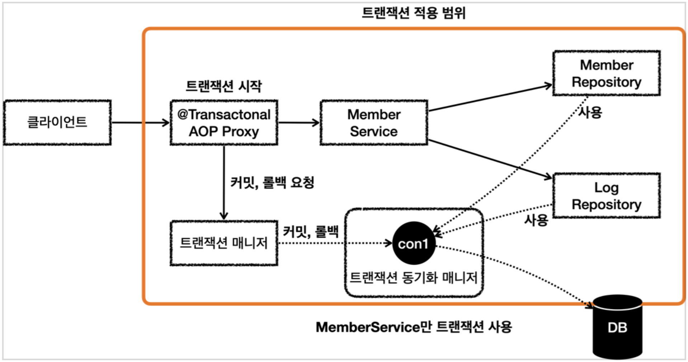
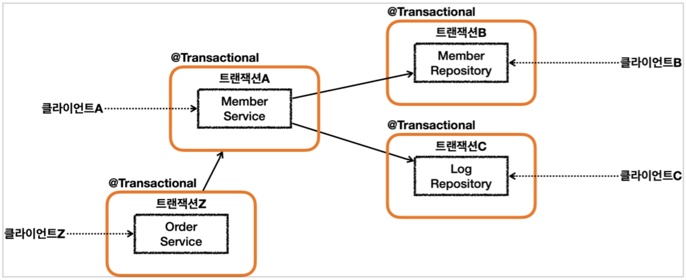

### 트랜잭션 전파 활용1 - 예제 프로젝트 시작

예제를 통해 지금까지 학습한 트랜잭션 전파를 이해해보자.  
예제는 회원을 등록 및 조회하고, 회원의 가입 이력을 LOG 테이블에 남기도록 구현할 것이다.

먼저 회원 정보를 저장할 Member 엔티티를 정의한다.

```java
package hello.springtx.propagation;

@Entity
@Getter @Setter
public class Member {

    @Id @GeneratedValue
    private Long id;
    private String username;

    public Member() {
    }

    public Member(String username) {
        this.username = username;
    }
}
```

그리고 회원 정보를 저장 및 조회하는데 사용할 MemverRepository를 정의한다.  
보다 명확하게 로직을 확인하기 위해 순수 JPA를 사용하여 구현한다.

```java
package hello.springtx.propagation;

@Slf4j
@Repository
@RequiredArgsConstructor
public class MemberRepository {

    private final EntityManager em;

    @Transactional
    public void save(Member member) {
        log.info("member 저장");
        em.persist(member);
    }

    public Optional<Member> find(String username) {
        return em.createQuery("select m from Member m where m.username = :username", Member.class)
                .setParameter("username", username)
                .getResultList().stream().findAny();
    }
}
```

이제 가입 이력을 저장할 Log 엔티티를 정의하고, 이를 저장 및 조회하는 LogRepository를 정의한다.  
이 때 저장 시에 로그 메시지에 `로그예외` 문자열이 포함되면 런타임 예외가 발생하여 트랜잭션이 롤백되도록 로직을 추가했다.

```java
package hello.springtx.propagation;

@Entity
@Getter @Setter
public class Log {

    @Id @GeneratedValue
    private Long id;
    private String message;

    public Log() {
    }

    public Log(String message) {
        this.message = message;
    }
}
```

```java
package hello.springtx.propagation;

@Slf4j
@Repository
@RequiredArgsConstructor
public class LogRepository {

    private final EntityManager em;

    @Transactional(propagation = Propagation.REQUIRES_NEW)
    public void save(Log logMessage) {
        log.info("log 저장");
        em.persist(logMessage);

        if (logMessage.getMessage().contains("로그예외")) {
            log.info("log 저장시 예외 발생");
            throw new RuntimeException("예외 발생");
        }

    }

    public Optional<Log> find(String message) {
        return em.createQuery("select l from Log l where l.message = :message", Log.class)
                .setParameter("message", message)
                .getResultList().stream().findAny();
    }
}
```

이제 회원을 관리하는 MemberService를 정의한다.  
먼저 joinV1()은 트랜잭션 설정 없이 Member와 Log 엔티티를 순차적으로 저장한다.  
이 때 레포지토리의 메서드에는 각각 @Transactional이 붙어 있기 때문에 별도로 트랜잭션이 시작된다.

다음으로 joinV2()는 Log 엔티티 저장 메서드 호출 부분을 try - catch로 묶어서 처리하도록 구현했다.  
로그 저장에 실패했다고 해서 회원 가입을 막을 필요는 없다고 생각될 때 이와 같이 구현할 수 있다.

```java
package hello.springtx.propagation;

@Slf4j
@Service
@RequiredArgsConstructor
public class MemberService {

    private final MemberRepository memberRepository;
    private final LogRepository logRepository;

    public void joinV1(String username) {
        Member member = new Member(username);
        Log logMessage = new Log(username);

        log.info("== memberRepository 호출 시작 ==");
        memberRepository.save(member);
        log.info("== memberRepository 호출 종료 ==");

        log.info("== logRepository 호출 시작 ==");
        logRepository.save(logMessage);
        log.info("== logRepository 호출 종료 ==");
    }

    public void joinV2(String username) {
        Member member = new Member(username);
        Log logMessage = new Log(username);

        log.info("== memberRepository 호출 시작 ==");
        memberRepository.save(member);
        log.info("== memberRepository 호출 종료 ==");

        log.info("== logRepository 호출 시작 ==");
        try {
            logRepository.save(logMessage);
        } catch (RuntimeException e) {
            log.info("log 저장에 실패했습니다. logMessage={}", logMessage.getMessage());
            log.info("정상 흐름 반환");
        }

        log.info("== logRepository 호출 종료 ==");
    }
}
```

joinV1()의 정상 케이스에 대한 테스트 코드는 다음과 같이 작성할 수 있다.  
memberService.joinV1을 호출하여 멤버 및 로그를 저장하고, 제대로 조회가 되는지 테스트한다.

```java
package hello.springtx.propagation;

@Slf4j
@SpringBootTest
class MemberServiceTest {

    @Autowired
    MemberService memberService;
    @Autowired
    MemberRepository memberRepository;
    @Autowired
    LogRepository logRepository;

    /**
     * memberService    @Transactional:OFF
     * memberRepository @Transactional:ON
     * logRepository    @Transactional:ON
     */
    @Test
    void outerTxOff_success() {
        //given
        String username = "outerTxOff_success";

        //when
        memberService.joinV1(username);

        //when: 모든 데이터가 정상 저장된다.
        assertTrue(memberRepository.find(username).isPresent());
        assertTrue(logRepository.find(username).isPresent());
    }
}
```

### 트랜잭션 전파 활용2 - 커밋, 롤백

outerTxOff_success() 테스트 케이스에서는 서비스 단에는 트랜잭션을 적용하지 않고, 레포지토리에 각각 적용한 상태에서 멤버와 로그를 저장했다.  
이로 인해 멤버, 로그를 저장할 때 각각 트랜잭션을 시작하여 별도로 처리하게 된다.


이에 대한 플로우는 다음과 같다.  
서비스 단에서 멤버를 저장하기 위해 트랜잭션 매니저를 통해 트랜잭션을 시작한다.  
이후에 멤버 저장을 레포지토리에 요청하면, 레포지토리에서는 트랜잭션이 적용된 커넥션을 동기화 매니저로부터 받아와서 멤버를 저장한다.  
이제 트랜잭션 매니저에 커밋을 요청하면 해당 커넥션을 통해 트랜잭션을 커밋하고, 커넥션은 반환된다.  
로그를 저장할 때에는 새롭게 커넥션을 받아와서 트랜잭션을 시작하게 된다.


이번에는 로그 저장 과정에서 런타임 예외가 발생하도록 테스트 케이스를 작성해보자.  
로그 레포지토리의 save()는 username에 `로그예외`가 포함되면 런타임 예외가 발생하도록 구현했었다.

```java
/**
 * memberService    @Transactional:ON
 * memberRepository @Transactional:ON
 * logRepository    @Transactional:ON Exception
 */
@Test
void outerTxOn_fail() {
    //given
    String username = "로그예외_outerTxOn_fail";

    //when
    assertThatThrownBy(() -> memberService.joinV1(username))
            .isInstanceOf(RuntimeException.class);

    //when: 모든 데이터가 롤백된다.
    assertTrue(memberRepository.find(username).isEmpty());
    assertTrue(logRepository.find(username).isEmpty());
}
```

username에 따라 런타임 예외가 발생하고, 트랜잭션 AOP에서는 이를 확인하고 트랜잭션을 롤백한다.  
따라서 로그는 저장에 실패하게 되고, 조회가 불가능하다.  
하지만 멤버 저장 시 시작한 트랜잭션과 로그 저장 시 시작한 트랜잭션이 구분되기 때문에, 멤버는 정상적으로 저장되어 조회가 가능하다.


실제로 롤백이 발생하는 플로우는 다음과 같다.  
LogRepository에서 런타임 예외가 발생하면, 이것을 트랜잭션 AOP 단에서 받게 된다.  
트랜잭션 AOP는 런타임 예외가 발생했음을 확인하고 트랜잭션 매니저에 롤백을 요청한다.  
이 때 롤백을 수행하는 db 커넥선은 member를 저장할 때 사용한 커넥션과 다르기 때문에, 별도로 롤백된다.


다만 위와 같이 구현할 경우 멤버와 로그 정보의 정합성이 저하된다.  
만약 두 데이터의 정합성이 중요한 상황이라면 하나의 트랜잭션으로 두 작업을 묶어야 한다.

### 트랜잭션 전파 활용3 - 단일 트랜잭션

두 개의 작업을 하나로 묶는 가장 쉬운 방법은, 서비스 단에 트랜잭션을 적용하고 레포지토리에는 적용하지 않는 것이다.  
이를 위해 서비스 단에 @Transactional을 붙이고, 레포지토리에 붙였던 @Transactional은 제거한다.

```java
    /**
     * memberService    @Transactional:ON
     * memberRepository @Transactional:OFF
     * logRepository    @Transactional:OFF
     */
    @Test
    void singleTx() {
        //given
        String username = "singleTx";

        //when
        memberService.joinV1(username);

        //when: 모든 데이터가 정상 저장된다.
        assertTrue(memberRepository.find(username).isPresent());
        assertTrue(logRepository.find(username).isPresent());
    }
```

이렇게 구성하면 서비스 로직을 실행하는 동안 하나의 트랜잭션으로 묶이게 된다.  


처음에 트랜잭션 설정 시 사용한 커넥션을 로직이 끝날 때까지 사용하게 되어서, 레포지토리 단에서는 동기화 매니저로부터 동일한 커넥션을 꺼내서 사용하게 된다.  
> 같은 쓰레드를 사용하면 동기화 매니저는 동일한 커넥션을 반환한다.



하지만 만약 서비스와 각 레포지토리에서 별도의 트랜잭션이 구성되는 상황이라면 어떻게 해야 할까?


레포지토리의 메서드는 여러 로직에서 사용될 수 있다.  
이 때 특정 로직에서는 상위의 트랜잭션에 묶이길 원하고, 다른 로직에서는 별도로 트랜잭션이 구성되기를 원할 수 있다.  
이 상황에서 만약 트랜잭션 전파 기능이 없다면 @Transactional을 붙인 메서드와 붙이지 않은 메서드를 동시에 정의해야 할 것이다.


더 복잡하게는 트랜잭션을 적용한 서비스 메서드를 다른 서비스에서 호출하는 상황도 가정해볼 수 있다.  
이와 같은 모든 경우에 대응하기 위해 메서드를 모두 중복해서 정의할 수는 없다.



스프링은 이러한 문제를 해결하기 위해 트랜잭션 전파 기능을 제공한다.  
트랜잭션이 계층적으로 사용되는 상황에서도 트랜잭션 AOP가 적절히 작동하도록 지원한다.

### 트랜잭션 전파 활용4 - 전파 커밋

@Transactional을 적용하면 스프링에서는 기본 전파 옵션인 REQUIRED가 적용된다.  
REQUIRED는 기존 트랜잭션이 없으면 생성하고, 있으면 참여하는 식으로 동작한다.  
이 때 트랜잭션 참여 시 기존의 물리 트랜잭션을 그대로 따르게 되고, 동기화 매니저로부터 동일한 커넥션을 받아와서 사용하게 된다.  
이를 설명하기 위해 개념적으로 물리 트랜잭션과 논리 트랜잭션으로 구분하게 된다.


이번에는 예제에서 서비스 및 레포지토리의 @Transactional을 활성화해보자.  
이 경우 먼저 트랜잭션을 시작한 서비스 단의 트랜잭션이 물리 트랜잭션을 관리하게 된다.  
서비스 단이 외부 트랜잭션이 되며, 물리 트랜잭션 시작 및 커밋/롤백을 이곳에서 맡게 된다.  
레포지토리 단은 내부 트랜잭션이 되며, 물리 트랜잭션에 직접적으로 관여하지 않게 된다.


먼저 모든 논리 트랜잭션이 커밋되는 경우를 살펴보자.


테스트 코드는 다음과 같다.

```java
    /**
     * memberService    @Transactional:ON
     * memberRepository @Transactional:ON
     * logRepository    @Transactional:ON
     */
    @Test
    void outerTxOn_success() {
        //given
        String username = "outerTxOn_success";

        //when
        memberService.joinV1(username);

        //when: 모든 데이터가 정상 저장된다.
        assertTrue(memberRepository.find(username).isPresent());
        assertTrue(logRepository.find(username).isPresent());
    }
```

전체적인 실행 플로우는 다음과 같다.  
먼저 서비스 단에서 트랜잭션 매니저에 트랜잭션 시작을 요청한다.  
매니저에서는 신규 트랜잭션임을 확인하고 커넥션을 받아와서 트랜잭션을 시작한 뒤 동기화 매니저에 넣는다.  
이제 레포지토리 단에서 매니저에 시작을 요청하면, 기존 트랜잭션이 있음을 확인하고 해당 커넥션을 그대로 사용하게 한다.  
커밋 시에도 물리 트랜잭션을 커밋하지 않는 식으로 동작한다.  
최종적으로 실행 흐름이 서비스단에 넘어가고 메서드가 종료되었을 때 트랜잭션이 커밋된다.


### 트랜잭션 전파 활용5 - 전파 롤백

이번에는 로그 레포지토리에서 런타임 예외가 발생하여, 전체 트랜잭션이 롤백되는 상황을 확인해보자.  
레포지토리 단에서 발생한 예외가 서비스 단에까지 전파되도록 할 것이다.


이에 대한 테스트 코드는 다음과 같다.  
예외가 클라이언트 단까지 전달 되었는지, 레포지토리의 모든 저장 내역이 정상적으로 롤백되었는지를 확인한다.

```java
    /**
     * memberService    @Transactional:ON
     * memberRepository @Transactional:ON
     * logRepository    @Transactional:ON Exception
     */
    @Test
    void outerTxOn_fail() {
        //given
        String username = "로그예외_outerTxOn_fail";

        //when
        assertThatThrownBy(() -> memberService.joinV1(username))
                .isInstanceOf(RuntimeException.class);

        //when: 모든 데이터가 롤백된다.
        assertTrue(memberRepository.find(username).isEmpty());
        assertTrue(logRepository.find(username).isEmpty());
    }
```

전체 실행 플로우는 다음과 같다.  
로그 레포지토리에서 예외가 발생하면, 이에 대한 트랜잭션 AOP가 이를 확인하고 매니저에 롤백 요청을 한다.  
이 때 신규 트랜잭션이 아니므로 rollback-only를 설정한다.  
해당 예외는 서비스 단에 전달되고, 서비스에 대한 트랜잭션 AOP도 해당 예외를 받게 된다.  
AOP는 매니저에 롤백을 요청하고, 매니저에서 신규 트랜잭션임을 확인하고 물리 트랜잭션을 롤백한다.  
이 때 예외가 발생한 것이기 때문에 rollback only 설정과 관계 없이 그냥 롤백된다.

위와 같이 MemberRepository와 LogRepository가 하나의 트랜잭션으로 묶이면서, 데이터 정합성에 문제가 없도록 조치가 왼료되었다.  
데이터 전체가 커밋되거나 롤백되는 식으로 정상 동작한다.


### 트랜잭션 전파 활용6 - 복구 REQUIRED

이번에는 로그 저장에 실패하더라도 회원가입에는 성공하도록 해야 한다는 요구사항이 추가되었다고 해보자.  
단순하게 생각해보면 레포지토리 단에서 발생한 예외를 서비스단에서 try - catch로 받아서 처리하면 될 것으로 보인다.


하지만 이 방법을 사용하면 이전과 동일하게 전체 데이터에 롤백이 발생한다.  
이번에는 왜 그런 문제가 생기는지 확인해볼 것이다.

먼저 서비스 단에 로그 레포지토리에서 발생한 예외를 받아서 복구 처리하는 식으로 메서드를 정의한다.

```java
package hello.springtx.propagation;

import lombok.RequiredArgsConstructor;
import lombok.extern.slf4j.Slf4j;
import org.springframework.stereotype.Service;
import org.springframework.transaction.annotation.Transactional;

@Slf4j
@Service
@RequiredArgsConstructor
public class MemberService {

    private final MemberRepository memberRepository;
    private final LogRepository logRepository;

    @Transactional
    public void joinV2(String username) {
        Member member = new Member(username);
        Log logMessage = new Log(username);

        log.info("== memberRepository 호출 시작 ==");
        memberRepository.save(member);
        log.info("== memberRepository 호출 종료 ==");

        log.info("== logRepository 호출 시작 ==");
        try {
            logRepository.save(logMessage);
        } catch (RuntimeException e) {
            log.info("log 저장에 실패했습니다. logMessage={}", logMessage.getMessage());
            log.info("정상 흐름 반환");
        }

        log.info("== logRepository 호출 종료 ==");
    }
}
```

이제 이에 대한 테스트 코드를 작성한다.  
MemberService.joinV2 호출 시 UnexpectedRollbackException이 발생하고, 전체 데이터가 롤백되었는지 확인한다.

```java
/**
     * memberService    @Transactional:ON
     * memberRepository @Transactional:ON
     * logRepository    @Transactional:ON Exception
     */
    @Test
    void recoverException_fail() {
        //given
        String username = "로그예외_recoverException_fail";

        //when
        assertThatThrownBy(() -> memberService.joinV2(username))
                .isInstanceOf(UnexpectedRollbackException.class);

        //when: 모든 데이터가 롤백된다.
        assertTrue(memberRepository.find(username).isEmpty());
        assertTrue(logRepository.find(username).isEmpty());
    }
```


### 트랜잭션 전파 활용7 - 복구 REQUIRES_NEW


