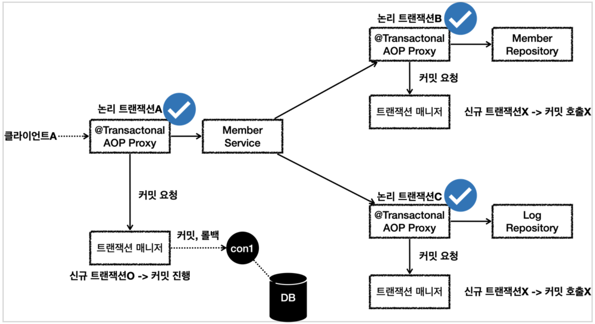

### 트랜잭션 전파 활용1 - 예제 프로젝트 시작

### 트랜잭션 전파 활용2 - 커밋, 롤백

### 트랜잭션 전파 활용3 - 단일 트랜잭션

### 트랜잭션 전파 활용4 - 전파 커밋

### 트랜잭션 전파 활용5 - 전파 롤백

### 트랜잭션 전파 활용6 - 복구 REQUIRED

### 트랜잭션 전파 활용7 - 복구 REQUIRES_NEW

