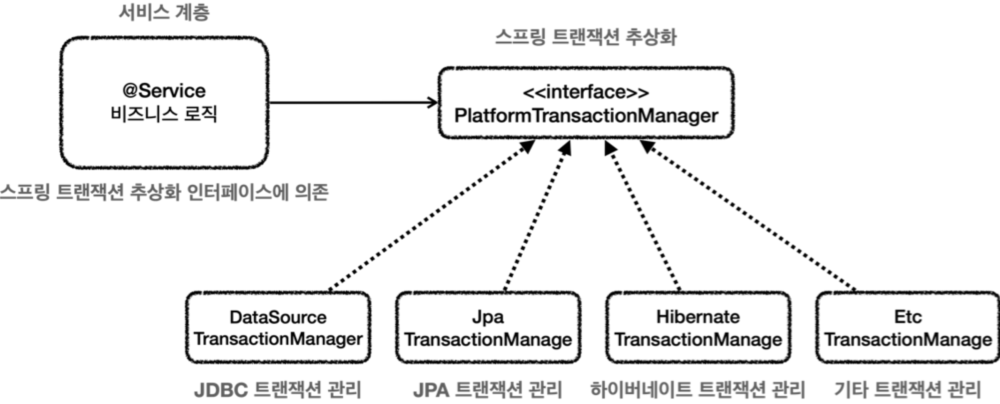
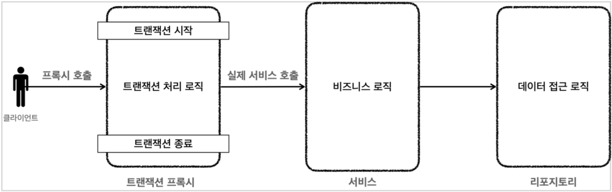
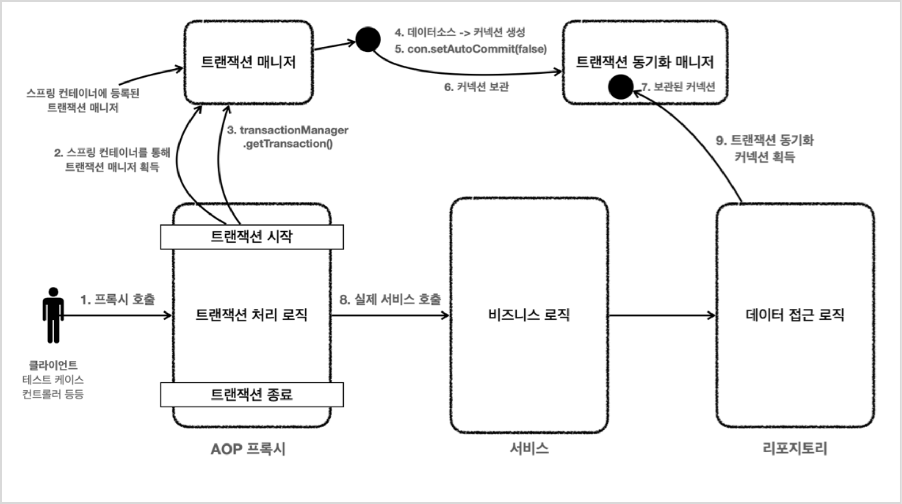
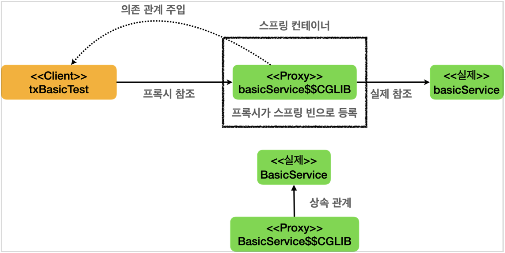
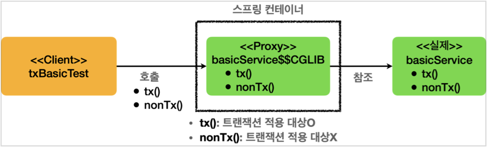
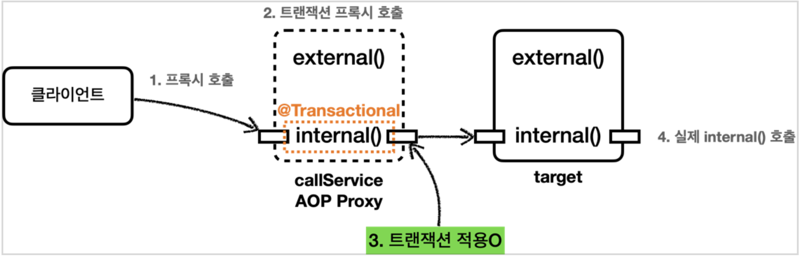
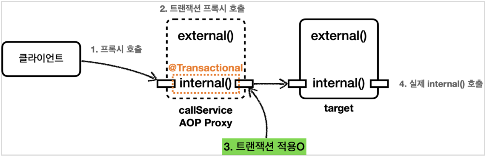
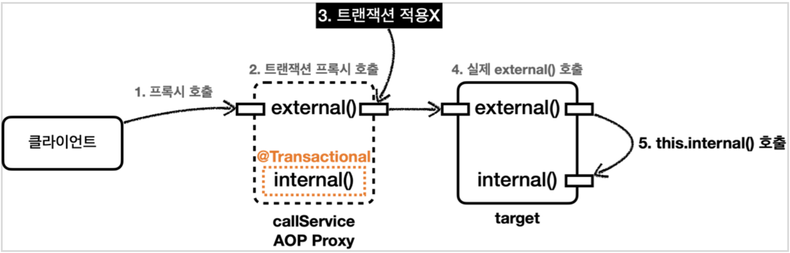
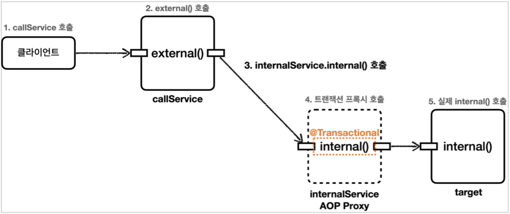
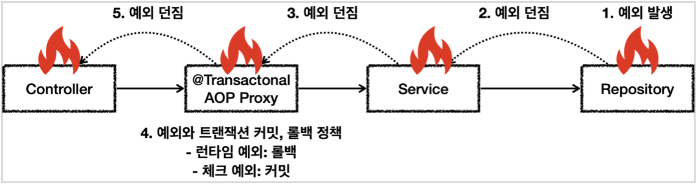

### 스프링 트랜잭션 소개

이번에는 스프링에서 제공하는 스프링 트랜잭션에 대해서 더 자세히 알아보자.

각 데이터 접근 기술에서 트랜잭션을 사용하는 방법에는 차이가 있었다.  
먼저 jdbc에서 트랜잭션을 다룰 때에는 커넥션을 가져와서 직접 setAutoCommit()을 통해 트랜잭션을 시작했다.

```java
public void accountTransfer(String fromId, String toId, int money) throws SQLException {
    Connection con = dataSource.getConnection();
    try {
        con.setAutoCommit(false); // 트랜잭션 시작
        bizLogic(con, fromId, toId, money); // 비즈니스 로직
        con.commit(); // 성공시 커밋
    } catch (Exception e) {
        con.rollback(); // 실패시 롤백
        throw new IllegalStateException(e);
    } finally {
        release(con);
    }
}
```

이와 달리 JPA에서는 엔티티 메니저를 통해 EntityTransaction을 얻어왔다.

```java
public static void main(String[] args) {
    //엔티티 매니저 팩토리 생성
    EntityManagerFactory emf =
        Persistence.createEntityManagerFactory("jpabook");
    EntityManager em = emf.createEntityManager(); // 엔티티 매니저 생성 
    EntityTransaction tx = em.getTransaction(); // 트랜잭션 기능 획득
    try {
        tx.begin();  // 트랜잭션 시작
        logic(em);   // 비즈니스 로직
        tx.commit(); // 트랜잭션 커밋
    } catch (Exception e) {
        tx.rollback(); // 트랜잭션 롤백
    } finally {
        em.close(); // 엔티티 매니저 종료
    }
    emf.close(); // 엔티티 매니저 팩토리 종료
}
```

위와 같이 각 기술마다 트랜잭션을 관리하는 로직이 다르기 때문에, 데이터 접근 기술을 바꾸면 관련 코드를 모두 수정해야 한다.  
스프링은 이를 해결하기 위해 PlatformTransactionManager 인터페이스를 통해 트랜잭션을 추상화해서 제공한다.  
트랜잭션 시작, 커밋, 롤백으로 구성된 간단한 인터페이스이다.

```java
package org.springframework.transaction;
    public interface PlatformTransactionManager extends TransactionManager {
        TransactionStatus getTransaction(@Nullable TransactionDefinition definition) throws TransactionException;
        void commit(TransactionStatus status) throws TransactionException;
        void rollback(TransactionStatus status) throws TransactionException;
    }
```

스프링에서는 각 데이터 접근 기술에 대한 PlatformTransactionManager의 구현체도 함께 제공하고 있기 때문에, 선택해서 사용하면 된다.  
추가적으로 스프링 부트에서는 사용하는 기술에 따라 적절한 구현체를 자동으로 빈으로 등록해주기 때문에, 더욱 편리하게 사용 가능하다.



스프링 트랜잭션을 사용하는 방식에는 선언적 방식과 프로그래밍 방식이 있다.  
선언적 방식은 @Transaction을 붙여서 트랜잭션을 사용하겠다고 선언하는 방식이다.  
프로그래밍 방식은 트랜잭션 매니저나 트랜잭션 템플릿을 직접 사용해서 트랜잭션을 다루는 방식이다.

프로그래밍 방식을 사용하면 어플리케이션 코드가 트랜잭션 기술 코드와 강하게 결합되는 문제가 있다.  
다음과 같이 트랜잭션을 시작하고, 종료하는 코드가 서비스 단에 작성되어야 한다.


```java
// 트랜잭션 시작
TransactionStatus status = transactionManager.getTransaction(new DefaultTransactionDefinition());
try {
    // 비즈니스 로직
    bizLogic(fromId, toId, money);
    transactionManager.commit(status); // 성공시 커밋
} catch (Exception e) {
    transactionManager.rollback(status); // 실패시 롤백
    throw new IllegalStateException(e);
}
```

실무에서는 훨씬 편리하게 트랜잭션을 적용할 수 있는 선언적 방식을 주로 사용한다.  
@Transaction을 붙이면 스프링 프록시 AOP가 적용되어, 클라이언트는 트랜잭션을 처리하는 프록시에 비즈니스 로직을 위임 호출하게 된다.  
이를 통해 서비스 계층에서 트랜잭션 관련 로직을 제거하고, 순수한 비즈니스 로직만 남길 수 있다.



```java
public class Service {
    @Transactional
    public void logic() {
        //트랜잭션 관련 코드 제거, 순수 비즈니스 로직만 남음
        bizLogic(fromId, toId, money);
    }
}
```

최종적인 플로우는 다음과 같다.  
클라이언트가 서비스의 로직을 호출하면 트랜잭션 매니저가 데이터 소스를 통해 커넥션을 얻어오고, set autocommit false를 통해 트랜잭션을 시작한다.  
트랜잭션을 시작한 커넥션은 트랜잭션 동기화 매니저에 전달되고, 레포지토리 계충에서는 동기화 매니저로부터 커넥션을 얻어와서 사용한다.



스프링은 트랜잭션 AOP를 지원하기 위한 모든 기능을 기본으로 제공하고 있다.  
또한 스프링 부트를 사용하면 트랜잭션 AOP를 위한 빈들을 자동으로 등록해주기 때문에, 특별한 추가 설정 없이 사용이 가능하다.  
서비스 로직에 @Transactional을 붙이면 스프링은 이를 자동으로 인식하여 프록시를 적용해준다.

### 트랜잭션 적용 확인 방법

`TransactionSynchronizationManager.isActualTransactionActive()`를 통해 트랜잭션 적용 여부를 명시적으로 확인할 수 있다.  
또는 `AopUtils.isAopProxy()`를 이용하면 특정 클래스에 AOP 프록시가 적용되었는지를 확인할 수 있다.

> `TransactionSynchronizationManager.isActualTransactionActive()`를 호출하면 쓰레드에 트랜잭션이 적용되었는지를 확인한다.

```java
package hello.springtx.apply;

@Slf4j
@SpringBootTest
public class TxBasicTest {

    @Autowired
    BasicService basicService;

    @Test
    void proxyCheck() {
        //BasicService$$EnhancerBySpringCGLIB...
        log.info("aop class={}", basicService.getClass());
        assertThat(AopUtils.isAopProxy(basicService)).isTrue();
    }

    @Test
    void txTest() {
        basicService.tx();
        basicService.nonTx();
    }

    @TestConfiguration
    static class TxApplyBasicConfig {
        @Bean
        BasicService basicService() {
            return new BasicService();
        }
    }

    @Slf4j
    static class BasicService {

        @Transactional
        public void tx() {
            log.info("call tx");
            boolean txActive =
                TransactionSynchronizationManager.isActualTransactionActive();
            log.info("tx active={}", txActive);
        }
        public void nonTx() {
            log.info("call nonTx");
            boolean txActive =
                TransactionSynchronizationManager.isActualTransactionActive();
            log.info("tx active={}", txActive);
        }
    }
}
```

출력 결과는 다음과 같다.  
@Transactional을 적용한 tx()를 호출하면 txActive 값이 true지만, 적용하지 않은 nonTx()를 호출하면 false이다.

```
call tx
tx active=true
call nontTx
tx active=false
```

서비스 객체의 클래스명을 확인해보면 EnhancerBy...가 붙은 프록시가 등록된 것을 확인할 수 있다.

```java
TxBasicTest : aop class=class ..$BasicService$$EnhancerBySpringCGLIB$$xxxxxx
```

스프링 컨테이너에 트랜잭션 AOP 프록시가 등록되는 과정을 자세히 살펴보자.  
@Transactional이 클래스나 메서드에 하나라도 붙어있으면, 트랜잭션 AOP는 해당 클래스의 프록시를 스프링 컨테이너에 등록한다.  
프록시 클래스는 원본 클래스를 상속하고, 원본 대신 프록시가 스프링 빈으로 등록되기 때문에, 프록시가 각 객체에 자동 주입된다.  
프록시 클래스는 내부에서 원본 클래스의 메서드를 호출하는 식으로 작동한다.



이번엔 프록시가 호출될 경우의 동작 방식을 살펴보자.  
먼저 다음의 옵션으로 트랜잭션 관련 로깅을 보강한다.

```
logging.level.org.springframework.transaction.interceptor=TRACE
```

이렇게 설정한 후에 로그를 확인하면 다음과 같다.

```bash
#tx() 호출
TransactionInterceptor : Getting transaction for [..BasicService.tx]
y.TxBasicTest$BasicService : call tx
y.TxBasicTest$BasicService : tx active=true
TransactionInterceptor : Completing transaction for [..BasicService.tx]

#nonTx() 호출
y.TxBasicTest$BasicService : call nonTx
y.TxBasicTest$BasicService : tx active=false
```

프록시 객체의 특정 메서드가 호출되면, 프록시에서는 해당 메서드가 프록시 적용 대상인지, 즉 @Transactional이 붙어있는지 확인한다.  
@Transactional이 적용된 tx()를 호출하면, 트랜잭션을 시작한 뒤에 원본 메서드를 호출한다.  
원본 메서드의 호출이 종료되면 트랜잭션을 커밋하거나 롤백한 뒤 종료한다.

트랜잭션이 적용되지 않은 nonTx() 메서드를 호출하면, 동일하게 프록시의 메서드가 호출된다.  
하지만 프록시에서 해당 메서드가 트랜잭션 적용 대상이 아님을 확인하고, 트랜잭션 작업을 생략하고 원본 메서드를 호출한다.



### 트랜잭션 적용 위치

이번에는 @Transactional의 위치에 따른 우선순위에 대해서 알아보자.  
예를 들어 @Transactional이 클래스와 메서드에 동시에 붙은 상황에서, 어노테이션의 옵션이 서로 다를 경우 어떻게 동작할까?

스프링은 기본적으로 더 구체적이고 자세한 것이 더 높은 우선순위를 가지도록 설계되었다.  
이를 통해 오버라이드를 이용한 다형성이 가능하도록 지원한다.  
예를 들어 인터페이스보다 구현체가 더 구체적이기 때문에, 구현체 클래스에 붙은 어노테이션이 인터페이스에 붙은 어노테이션 보다 더 높은 우선순위를 가진다.  
마찬가지로 클래스보다 메서드가 더 구체적이므로, 메서드에 붙은 @Transactional이 더 높은 우선 순위를 가진다.

다음의 예시를 통해 살펴보자.  
LevelService 클래스에는 `@Transactional(readOnly = true)`가 붙어있지만, 메서드인 write()에는 `@Transactional(readOnly = false)`가 붙어있다.  
현재 적용된 트랜잭션이 read only인지는 `TransactionSynchronizationManager.isCurrentTransactionReadOnly()`로 확인할 수 있다.

```java
package hello.springtx.apply;

@SpringBootTest
public class TxLevelTest {

    @Autowired LevelService service;

    @Test
    void orderTest() {
        service.write();
        service.read();
    }

    @TestConfiguration
    static class TxLevelTestConfig {
        @Bean
        LevelService levelService() {
            return new LevelService();
        }
    }

    @Slf4j
    @Transactional(readOnly = true)
    static class LevelService {

        @Transactional(readOnly = false)
        public void write() {
            log.info("call write");
            printTxInfo();
        }

        public void read() {
            log.info("call read");
            printTxInfo();
        }

        private void printTxInfo() {
            boolean txActive = TransactionSynchronizationManager.isActualTransactionActive();
            log.info("tx active={}", txActive);
            boolean readOnly = TransactionSynchronizationManager.isCurrentTransactionReadOnly();
            log.info("tx readOnly={}", readOnly);
        }
    }
}
```

출력 결과는 다음과 같다.  
write, read 메서드에서 모두 트랜잭션이 활성화 되었다.  
readonly=false로 명시한 write()에는 일반 트랜잭션이 적용되었고, 명시하지 않은 read()에는 읽기 전용으로 적용되었다.

```
# write() 호출
TransactionInterceptor : Getting transaction for [..LevelService.write]
y.TxLevelTest$LevelService : call write
y.TxLevelTest$LevelService : tx active=true
y.TxLevelTest$LevelService : tx readOnly=false
TransactionInterceptor : Completing transaction for [..LevelService.write]

# read() 호출
TransactionInterceptor : Getting transaction for [..LevelService.read]
y.TxLevelTest$LevelService : call read
y.TxLevelTest$LevelService : tx active=true
y.TxLevelTest$LevelService : tx readOnly=true
TransactionInterceptor : Completing transaction for [..LevelService.read]
```

스프링 트랜잭션은 프록시 내의 메서드가 호출되었을 때 먼저 메서드에 어노테이션이 붙었는지 확인하고, 없으면 클래스에 붙었는지 확인한다.  
따라서 write()에는 메서드에 붙은 옵션으로 트랜잭션이 적용되고, read()에는 클래스이 붙은 옵션으로 적용된다.

스프링 5.0부터는 인터페이스에 어노테이션을 붙이는 것도 허용된다.  
따라서 @Transactional도 인터페이스에 붙일 수 있고, 다음의 순서로 어노테이션을 확인해서 적용한다.  
`구현 클래스 메서드 -> 구현 클래스 -> 인터페이스 메서드 -> 인터페이스`  

> 다만 인터페이스에 붙일 경우 AOP 방식에 따라서 제대로 적용이 되지 않을 수도 있다.  
> 가급적 구현 클래스에 붙여서 사용하자.

### 트랜잭션 AOP 주의 사항 - 프록시 내부 호출1

트랜잭션 AOP를 사용할 때에는 프록시를 통해서 대상 객체를 호출해야 트랜잭션이 적용된다.  
만약 프록시를 거치지 않고 대상 객체를 직접 호출하면 트랜잭션이 적용되지 않는다.  



@Transactional을 적용하면 프록시 객체가 스프링 컨테이너에 등록되어 자동 주입 되기 때문에, 주입 받은 객체를 통해서 호출하면 문제가 발생하지 않는다.  
다만 대상 객체 내부에서 @Transactional이 적용된 메서드를 호출하면 프록시를 거치지 않고 호출하여, 트랜잭션이 적용되지 않는다.

다음의 예시에서 external()에는 @Transactional이 붙어있지 않고, internal()에는 붙어있다.  
external은 내부에서 internal을 호출하고 있다.  

```java
package hello.springtx.apply;

@Slf4j
@SpringBootTest
public class InternalCallV1Test {

    @Autowired
    CallService callService;

    @Test
    void printProxy() {
        log.info("callService class={}", callService.getClass());
    }

    @Test
    void internalCall() {
        callService.internal();
    }

    @Test
    void externalCall() {
        callService.external();
    }

    @TestConfiguration
    static class InternalCallV1TestConfig {

        @Bean
        CallService callService() {
            return new CallService();
        }
    }

    @Slf4j
    static class CallService {

        public void external() {
            log.info("call external");
            printTxInfo();
            this.internal();
        }

        @Transactional
        public void internal() {
            log.info("call internal");
            printTxInfo();
        }

        private void printTxInfo() {
            boolean txActive = TransactionSynchronizationManager.isActualTransactionActive();
            log.info("tx active={}", txActive);
        }
    }
}
```

주입받은 서비스 객체를 통해 internal을 호출하는 internalCall에서는 프록시를 통해 메서드를 호출한다.  
따라서 정상적으로 트랜잭션이 적용된다.



```
TransactionInterceptor : Getting transaction for [..CallService.internal]
..rnalCallV1Test$CallService : call internal
..rnalCallV1Test$CallService : tx active=true
TransactionInterceptor : Completing transaction for [..CallService.internal]
```

하지만 externalCall에서는 external을 통해서 internal을 호출하고 있다.  
처음에는 프록시를 거쳐서 external을 호출하게 되고, external에는 @Transactional이 붙어있지 않기 때문에 트랜잭션을 시작하지 않는다.  
그리고 external에서는 내부 메서드인 internal을 프록시가 적용되지 않은 채로 직접 호출하게 된다.

자바에서는 메서드 앞에 별도의 참조가 없을 경우, this를 붙여서 자기 자신을 가리키게 한다.  
이 때 external 로직이 실행되는 것은 대상 객체 내부이기 때문에, this는 대상 객체를 가리킨다.  
따라서 프록시를 거치지 않은 채로 대상 객체의 메서드를 직접 호출하게 되어, 트랜잭션이 적용되지 않는다.



```bash
CallService : call external
CallService : tx active=false
CallService : call internal
CallService : tx active=false
```

### 트랜잭션 AOP 주의 사항 - 프록시 내부 호출2

메서드의 내부 호출이 문제가 되는 경우에는, 해당 메서드를 별도의 클래스로 분리해서 해결할 수 있다.  
아래 예시에서는 트랜잭션이 필요했던 internal() 메서드를 별도의 클래스인 InternalService에 분리해서 정의했다.  
기존의 CallService는 InternalService를 주입받아서 사용한다.

```java
package hello.springtx.apply;

@Slf4j
@SpringBootTest
public class InternalCallV2Test {

    @Autowired
    CallService callService;

    @Test
    void printProxy() {
        log.info("callService class={}", callService.getClass());
    }

    @Test
    void externalCallV2() {
        callService.external();
    }

    @TestConfiguration
    static class InternalCallV1TestConfig {

        @Bean
        CallService callService() {
            return new CallService(internalService());
        }

        @Bean
        InternalService internalService() {
            return new InternalService();
        }

    }

    @Slf4j
    @RequiredArgsConstructor
    static class CallService {

        private final InternalService internalService;

        public void external() {
            log.info("call external");
            printTxInfo();
            internalService.internal();
        }

        private void printTxInfo() {
            boolean txActive = TransactionSynchronizationManager.isActualTransactionActive();
            log.info("tx active={}", txActive);
        }
    }

    static class InternalService {

        @Transactional
        public void internal() {
            log.info("call internal");
            printTxInfo();
        }

        private void printTxInfo() {
            boolean txActive = TransactionSynchronizationManager.isActualTransactionActive();
            log.info("tx active={}", txActive);
        }
    }
}
```

callService.external()을 호출한 결과는 다음과 같다.  
internal() 호출시 트랜잭션이 정상적으로 시작되는 것을 확인할 수 있다.

```bash
#external()
..InternalCallV2Test$CallService : call external
..InternalCallV2Test$CallService : tx active=false
#internal()
TransactionInterceptor : Getting transaction for [..InternalService.internal]
..rnalCallV2Test$InternalService : call internal
..rnalCallV2Test$InternalService : tx active=true
TransactionInterceptor : Completing transaction for [..InternalService.internal]
```

InternalService의 프록시가 주입되어, 프록시 객체를 통해 internal()이 호출된 것이다.  
이를 통해 정상적으로 트랜잭션이 적용되었다. 



추가적으로, 스프링 트랜잭션 AOP는 private 메서드에는 적용되지 않도록 기본 설정 되어있다.  
보통 트랜잭션을 시작하는 것은 비즈니스 로직의 시작 부분이다.  
private 메서드는 보통 내부에서 사용할 간단한 로직을 정의하기 때문에 트랜잭션이 필요하지 않다.  
private 메서드에 @Transactional이 붙어 있더라도 무시하고 넘어가게 된다.

> 스프링 부트 3.0 이전에는 protected, package-visible 메서드에도 트랜잭션이 적용되지 않았다.

### 트랜잭션 AOP 주의 사항 - 초기화 시점

스프링 초기화 시점에는 트랜잭션 AOP가 적용되지 않을 수 있다.  
아래 예시에서 Hello 클래스의 initV1 메서드에는 @PostConstruct가 적용되어 있어서 의존성 주입이 완료된 직후에 호출된다.  

```java
package hello.springtx.apply;

@SpringBootTest
public class InitTxTest {

    @Autowired Hello hello;

    @Test
    void go() {
        // 초기화 코드는 스프링이 초기화 시점에 호출한다.
    }

    @TestConfiguration
    static class InitTxTestConfig {
        @Bean
        Hello hello() {
            return new Hello();
        }
    }

    @Slf4j
    static class Hello {

        @PostConstruct
        @Transactional
        public void initV1() {
            boolean isActive = TransactionSynchronizationManager.isActualTransactionActive();
            log.info("Hello init @PostConstruct tx active={}", isActive);
        }

        @EventListener(ApplicationReadyEvent.class)
        @Transactional
        public void initV2() {
            boolean isActive = TransactionSynchronizationManager.isActualTransactionActive();
            log.info("Hello init ApplicationReadyEvent tx active={}", isActive);
        }
    }
}
```

이 때 initV1()에는 @Transactional이 붙어 있지만 트랜잭션이 적용되지 않는다.  
초기화 시점에는 아직 트랜잭션 AOP가 적용되지 않았기 때문에, 원본 객체의 메서드가 호출된 것이다.

```
Hello init @PostConstruct tx active=false
```

이를 해결하기 위해서 @PostConstruct 대신 @EventListener(ApplicationReadyEvent.class)를 붙이면 된다.  
해당 어노테이션은 AOP 설정을 포함한 모든 스프링 컨테이너 설정이 끝났을 때 메서드가 호출되게 한다.  
따라서 트랜잭션 AOP 프록시를 통해 메서드를 호출하여, 정싱적으로 트랜잭션을 적용할 수 있다.

```
TransactionInterceptor : Getting transaction for [Hello.init2]
..ngtx.apply.InitTxTest$Hello : Hello init ApplicationReadyEvent tx active=true
TransactionInterceptor : : Completing transaction for [Hello.init2]
```

### 트랜잭션 옵션 소개

스프링 트랜잭션은 다양한 옵션을 제공한다.  
이번에는 그 중 주요한 옵션들을 하나씩 살펴보자.

```java
public @interface Transactional {

    String value() default "";
    String transactionManager() default "";

    Class<? extends Throwable>[] rollbackFor() default {};
    Class<? extends Throwable>[] noRollbackFor() default {};
    Propagation propagation() default Propagation.REQUIRED;
    Isolation isolation() default Isolation.DEFAULT;
    int timeout() default TransactionDefinition.TIMEOUT_DEFAULT;
    boolean readOnly() default false;
    String[] label() default {};
}
```

먼저 value 또는 transactionManager에 트랜잭션 관리에 사용할 트랜잭션 매니저의 이름을 지정할 수 있다.  
보통은 값을 생략하여 스프링 컨테이너에서 자동으로 매니저를 주입 받아 사용한다.  
하지만 트랜잭션 매니저가 둘 이상 존재하는 등의 상황에서는 어떤 매니저를 사용할지 알려줘야 한다.

```java
public class TxService {

    @Transactional("memberTxManager")
    public void member() {...}

    @Transactional("orderTxManager")
    public void order() {...}
}
```

다음으로 rollbackFor를 통해 어떤 조건에서 롤백을 수행할지를 지정할 수 있다.  
스프링 트랜잭션은 언체크 예외인 RuntimeException, Error가 발생하면 롤백을 수행하고, 체크 예외인 Exception이 발생하면 커밋을 수행한다.  
이 때 rollbackFor를 사용하면 기본 조건 외에도 롤백을 발생시키고 싶은 예외 타입을 지정할 수 있다.  
noRollbackFor는 이와 반대로, 특정 예외 타입에 대해서는 롤백을 하고 싶지 않을 때 지정한다.

```java
@Transactional(rollbackFor = Exception.class)
```

isolation에는 트랜잭션 격리 수준을 지정할 수 있다.  
기본값은 DEFAULT로, 데이터베이스에서 지정한 트랜잭션 격리 수준을 따른다.  
보통은 DB의 기본 설정을 따르기 위해 기본값을 사용한다.  
원한다면 다음의 값으로 격리 수준을 지정할 수 있다.

- DEFAULT : 데이터베이스에서 설정한 격리 수준을 따름 
- READ_UNCOMMITTED : 커밋되지 않은 읽기 
- READ_COMMITTED : 커밋된 읽기
- REPEATABLE_READ : 반복 가능한 읽기
- SERIALIZABLE : 직렬화 가능

timeout에는 트랜잭션의 타임아웃 시간을 초 단위로 지정할 수 있다.  
기본값으로는 트랜잭션 시스템의 타임아웃이 지정된다.  
운영 환경에 따라 옵션이 적용되지 않을 수도 있기 때문에 확인하고 사용해야 한다.

readOnly 옵션은 읽기 전용으로 트랜잭션을 적용하고 싶을 때 사용한다.  
트랜잭션은 기본적으로 읽기, 등록, 수정, 삭제가 모두 가능하지만, readOnly를 true로 지정하면 읽기만 가능해진다.  
readOnly 옵션을 사용하면 읽기에서 다양한 성능 최적화가 발생하는 이점이 있다.

readOnly을 true로 지정하면 크게 세 곳에서 영향을 받게 된다.  
먼저 프레임워크 단에서 영향을 받을 수 있다.  
JdbcTemplate은 읽기 전용일 때 데이터 수정을 수행하면 예외가 발생한다.  
JPA는 영속성 컨텍스트를 플러시하지 않고, 변경 감지를 위해 스냅샷 객체를 생성하지 않아서 성능이 최적화된다.

데이터베이스 드라이브도 영향을 받는데, 각 드라이버 종류와 버전에 따라 동작 방식에 차이가 있을 수 있다.  
기본적으로 읽기 전용 트랜잭션에서 변경 쿼리가 실행되면 예외가 발생한다.  
또한 읽기, 쓰기 데이터베이스를 구분하여, 읽기 전용 트랜잭션은 읽기 데이터베이스의 커넥션을 획득해서 사용한다.

데이터베이스 단에서도 읽기 전용 트랜잭션은 읽기만 수행하면 되기 때문에 일부 성능 최적화가 발생할 수 있다.  
다만 이 부분도 데이터베이스마다 차이가 있을 수 있다.

### 예외와 트랜잭션 커밋, 롤백 - 기본

트랜잭션 AOP 프록시 객체에 예외가 전달되면, 예외의 종류에 따라서 트랜잭션이 커밋/롤백 된다.  
언체크 예외인 RuntimeException, Error가 발생하면 트랜잭션이 롤백되고, 체크 예외인 Exception이 발생하면 트랜잭션이 커밋된다.



직접 코드를 통해 이를 확인해보자.  
트랜잭션의 커밋/롤백 여부를 로그로 확인하기 위해 다음의 설정을 추가한다.

```
logging.level.org.springframework.transaction.interceptor=TRACE
logging.level.org.springframework.jdbc.datasource.DataSourceTransactionManager=DEBUG
#JPA log
logging.level.org.springframework.orm.jpa.JpaTransactionManager=DEBUG
logging.level.org.hibernate.resource.transaction=DEBUG
```

이제 다음의 테스트 코드로 각 예외 상황을 테스트 해보자.  
런타임 예외가 발생하는 경우, 체크 예외가 발생하는 경우, 그리고 rollbackFor 옵션을 지정하는 경우로 구분한다.

```java
package hello.springtx.exception;

@SpringBootTest
public class RollbackTest {

    @Autowired RollbackService service;

    @Test
    void runtimeException() {
        Assertions.assertThatThrownBy(() -> service.runtimeException())
                .isInstanceOf(RuntimeException.class);
    }

    @Test
    void checkedException() {
        Assertions.assertThatThrownBy(() -> service.checkedException())
                .isInstanceOf(MyException.class);
    }

    @Test
    void rollbackFor() {
        Assertions.assertThatThrownBy(() -> service.rollbackFor())
                .isInstanceOf(MyException.class);
    }

    @TestConfiguration
    static class RollbackTestConfig {
        @Bean
        RollbackService rollbackService() {
            return new RollbackService();
        }
    }

    @Slf4j
    static class RollbackService {

        //런타임 예외 발생: 롤백
        @Transactional
        public void runtimeException() {
            log.info("call runtimeException");
            throw new RuntimeException();
        }

        //체크 예외 발생: 커밋
        @Transactional
        public void checkedException() throws MyException {
            log.info("call checkedException");
            throw new MyException();
        }

        //체크 예외 rollbackFor 지정: 롤백
        @Transactional(rollbackFor = MyException.class)
        public void rollbackFor() throws MyException {
            log.info("call rollbackFor");
            throw new MyException();
        }
    }

    static class MyException extends Exception {
    }

}
```

이제 로그를 통해 각 예외 타입에 따라 트랜잭션이 어떻게 종료되었는지를 확인해보자.  
먼저 runtimeException 호출 시에는 트랜잭션이 롤백된 것을 확인할 수 있다.

```
Getting transaction for [...RollbackService.runtimeException]
call runtimeException
Completing transaction for [...RollbackService.runtimeException] after exception: RuntimeException
Initiating transaction rollback
Rolling back JPA transaction on EntityManager
```

이와 달리 체크 예외를 발생시키는 checkedException을 호출하면 커밋이 발생한다.

```
Getting transaction for [...RollbackService.checkedException]
call checkedException
Completing transaction for [...RollbackService.checkedException] after exception: MyException
Initiating transaction commit
Committing JPA transaction on EntityManager
```

마지막으로 @Transactional(rollbackFor = MyException.class)를 붙여서 rollbackFor 옵션을 적용해보자.  
이 때에는 rollbackFor에 지정한 예외가 발생하면 롤백 된다.

```
Getting transaction for [...RollbackService.rollbackFor]
call rollbackFor
Completing transaction for [...RollbackService.rollbackFor] after exception: MyException
Initiating transaction rollback
Rolling back JPA transaction on EntityManager
```

### 예외와 트랜잭션 커밋, 롤백 - 활용

왜 스프링 트랜잭션에서는 런타임 예외는 롤백하고 체크 예외는 커밋하는 걸까?  
스프링은 기본적으로 런타임 예외는 db 연결 실패와 같은 복구 불가능한 예외라고 판단한다.  
복구가 불가능하기 때문에 계속 밖으로 던져서, 클라이언트에 에러 메시지를 전달하는 식으로 동작하는게 적절하다고 본다.  
이와 달리 체크 예외는 비즈니스적으로 의미가 있는 예외라고 판단한다.

예를 들어 고객이 특정 상품을 구매하는 로직이 있다고 하자.  
처리 과정에서 쿼리 오류 등으로 예외가 발생하면 시스템 장애로 판단하고, 모든 변경사항을 롤백하는게 맞다.  
하지만 고객의 잔고가 부족해서 예외가 발생했다면, 결제 상태를 대기로 설정하여 주문 데이터를 저장하고 싶을 수 있다.  
고객에게는 계좌 번호을 전달해서, 입금이 완료되면 이전에 저장한 주문 데이터를 이용하여 정상적으로 주문 처리를 할 수 있다.

고객의 잔고가 부족한 문제는 비즈니스적으로 중요하게 다뤄야 하는 예외이기 따문에 체크 예외로 정의해서 처리할 수 있다.  
이 때 해당 예외는 시스템의 문제가 아닌, 비즈니스적인 문제로 인해 발생히는 비즈니스 예외이다.  
이러한 비즈니스 예외가 발생했을 때에는 db에 관련 사항을 저장할 필요가 있기 때문에, 트랜잭션을 커밋하는 식으로 처리하는 것이다.

이제 위에서 든 예시를 직접 코드로 작성하여 확인해보자.  
먼저 잔고가 부족할 때 발생시킬 커스텀 체크 예외를 다음과 같이 정의한다.

```java
package hello.springtx.order;

public class NotEnoughMoneyException extends Exception {

    public NotEnoughMoneyException(String message) {
        super(message);
    }
}
```

예제에서는 데이터 접근 기술로 JPA를 사용할 것이므로, 여기에 사용할 Order 엔티티를 다음과 같이 정의한다.  

```java
package hello.springtx.order;

@Entity
@Table(name = "orders")
@Getter
@Setter
public class Order {

    @Id
    @GeneratedValue
    private Long id;

    private String username; // 정상, 예외, 잔고부족
    private String payStatus; // 대기, 완료
}
```

예제에서는 데이터를 등록, 조회, 삭제하기 위해 스프링 데이터 JPA 레포지토리를 사용한다.  
이를 위해 레포지토리를 다음과 같이 정의한다.

```java
package hello.springtx.order;

public interface OrderRepository extends JpaRepository<Order, Long> {
}
```

이제 본격적으로 서비스 계층을 구현해보자.  
예제를 단순화하기 위해 username에 따라 정상 처리 하거나 예외를 발생시키도록 구성했다.  
주문이 정상 처리된 경우 payStatus를 완료로 저장하고, 잔고가 부족할 경우 체크 예외를 발생시키고 payStatus를 대기로 저장한다.

```java
package hello.springtx.order;

@Slf4j
@Service
@RequiredArgsConstructor
public class OrderService {

    private final OrderRepository orderRepository;

    @Transactional
    public void order(Order order) throws NotEnoughMoneyException {
        log.info("order 호출");
        orderRepository.save(order);

        log.info("결제 프로제스 진입");
        if (order.getUsername().equals("예외")) {
            log.info("시스템 예외 발생");
            throw new RuntimeException("시스템 예외");
        } else if (order.getUsername().equals("잔고부족")) {
            log.info("잔고 부족 비즈니스 예외 발생");
            order.setPayStatus("대기");
            throw new NotEnoughMoneyException("잔고가 부족합니다");
        } else {
            //정상 승인
            log.info("정상 승인");
            order.setPayStatus("완료");
        }
        log.info("결제 프로세스 완료");
    }
}
```

이제 해당 서비스 계층을 사용하는 테스트 코드를 작성해보자.  
먼저 complete() 에서는 주문이 정상 처리되도록 구현하여, 데이터가 정상적으로 저장되고 payStatus가 `완료`로 설정되었는지 확인한다.  
runtimeException() 은 처리 과정에서 런타임 예외가 발생하도록 구현하여, 정상적으로 예외가 발생하고 데이터가 롤백되었는지 확인한다.  
bizException() 은 비즈니스 예외가 발생하도록 구현하여, 정상적으로 예외가 발생하고 데이터가 저장되어 payStatus가 `대기`로 설정되었는지 확인한다.


```java
package hello.springtx.order;

@Slf4j
@SpringBootTest
class OrderServiceTest {

    @Autowired OrderService orderService;
    @Autowired OrderRepository orderRepository;

    @Test
    void complete() throws NotEnoughMoneyException {
        //given
        Order order = new Order();
        order.setUsername("정상");

        //when
        orderService.order(order);

        //then
        Order findOrder = orderRepository.findById(order.getId()).get();
        assertThat(findOrder.getPayStatus()).isEqualTo("완료");
    }

    @Test
    void runtimeException() throws NotEnoughMoneyException {
        //given
        Order order = new Order();
        order.setUsername("예외");

        //when
        Assertions.assertThatThrownBy(() -> orderService.order(order))
                .isInstanceOf(RuntimeException.class);

        //then
        Optional<Order> orderOptional = orderRepository.findById(order.getId());
        assertThat(orderOptional.isEmpty()).isTrue();
    }

    @Test
    void bizException() {
        //given
        Order order = new Order();
        order.setUsername("잔고부족");

        //when
        try {
            orderService.order(order);
        } catch (NotEnoughMoneyException e) {
            log.info("고객에게 잔고 부족을 알리고 별도의 계좌로 입금하도록 안내");
        }

        //then
        Order findOrder = orderRepository.findById(order.getId()).get();
        assertThat(findOrder.getPayStatus()).isEqualTo("대기");
    }
}
```

레포지토리 단에서 런타임 예외가 발생하여 트랜잭션이 롤백되면, 내부적으로는 JPA의 영속성 컨텍스트가 비워진다.  
이로 인해 저장을 시도했던 주문 엔티티를 조회할 수 없게 된다.  
체크 예외가 발생한 경우에는 영속성 컨텍스트의 내용이 커밋되어 정상적으로 데이터를 조회할 수 있다.

비즈니스 예외를 던지는 것은 실질적으로 결과를 반환하는 것과 동일한 의미를 가진다.  
비즈니스적인 문제가 있다는 사실이 전달되면 되기 때문에, 원한다면 예외를 던지는 대신 반환값에 결과를 담아서 전달할 수도 있다.  
가능하다면 초기 설계부터 스프링의 정책을 고려하여, 롤백이 필요하면 런타임 예외를 던지고, 커밋이 필요하다면 체크 예외를 던지도록 설계하는 것이 적절하다.
