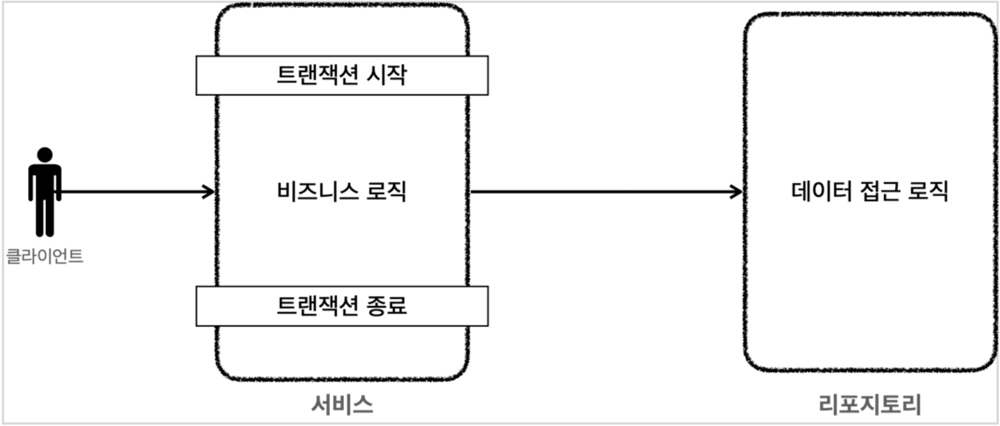

### 스프링 트랜잭션 소개

이번에는 스프링에서 제공하는 스프링 트랜잭션에 대해서 더 자세히 알아보자.

각 데이터 접근 기술에서 트랜잭션을 사용하는 방법에는 차이가 있었다.  
먼저 jdbc에서 트랜잭션을 다룰 때에는 커넥션을 가져와서 직접 setAutoCommit()을 통해 트랜잭션을 시작했다.

```java
public void accountTransfer(String fromId, String toId, int money) throws SQLException {
    Connection con = dataSource.getConnection();
    try {
        con.setAutoCommit(false);//트랜잭션 시작 //비즈니스 로직
        bizLogic(con, fromId, toId, money);
        con.commit();//성공시 커밋
    } catch (Exception e) {
        con.rollback();//실패시 롤백
        throw new IllegalStateException(e);
    } finally {
        release(con);
    }
}
```

이와 달리 JPA에서는 엔티티 메니저를 통해 EntityTransaction을 얻어왔다.

```java
public static void main(String[] args) {
    //엔티티 매니저 팩토리 생성
    EntityManagerFactory emf =
        Persistence.createEntityManagerFactory("jpabook");
    EntityManagerem=emf.createEntityManager();//엔티티 매니저 생성 EntityTransactiontx=em.getTransaction();//트랜잭션 기능 획득
    try {
        tx.begin();  //트랜잭션 시작
        logic(em);   //비즈니스 로직
        tx.commit(); //트랜잭션 커밋
    } catch (Exception e) {
        tx.rollback(); //트랜잭션 롤백
    } finally {
        em.close();//엔티티 매니저 종료
    }
    emf.close();//엔티티 매니저 팩토리 종료
}
```

위와 같이 각 기술마다 사용 코드가 다르기 때문에, 데이터 접근 기술을 중간에 바꾸면 관련 코드를 모두 수정해야 한다.  
스프링은 이를 해결하기 위해 PlatformTransactionManager 인터페이스를 통해 트랜잭션을 추상화해서 제공한다.  
트랜잭션 시작, 커밋, 롤백으로 구성된 간단한 인터페이스이다.

```java
package org.springframework.transaction;
    public interface PlatformTransactionManager extends TransactionManager {
        TransactionStatus getTransaction(@Nullable TransactionDefinition definition) throws TransactionException;
        void commit(TransactionStatus status) throws TransactionException;
        void rollback(TransactionStatus status) throws TransactionException;
    }
```

스프링에서는 실무에서 많이 사용되는 데이터 접근 기술의 구현체도 함께 제공하고 있기 때문에, 이를 가져다가 쓰면 된다.  
또한 스프링 부트에서는 사용하는 기술에 따라 적절한 구현체를 자동으로 빈으로 등록해주기 때문에, 구현체를 직접 선택하고 등록하는 과정도 생략할 수 있다.


스프링 트랜잭션을 사용하는 방식에는 선언적 방식과 프로그래밍 방식이 있다.  
선언적 방식은 @Transaction을 붙여서 트랜잭션을 사용하겠다고 선언하면 자동으로 트랜잭션이 적용되는 방식이다.  
프로그래밍 방식은 트랜잭션 매니저나 트랜잭션 템플릿을 직접 사용해서 트랜잭션을 다루는 방식이다.

프로그래밍 방식을 사용하면 어플리케이션 코드가 트랜잭션 기술 코드와 강하게 결합되는 문제가 있다.  
다음과 같이 직접 트랜잭션을 시작하고, 종료하는 코드가 작성되어야 한다.



```java
//트랜잭션 시작
TransactionStatus status = transactionManager.getTransaction(new DefaultTransactionDefinition());
try {
    //비즈니스 로직
    bizLogic(fromId, toId, money);
    transactionManager.commit(status); //성공시 커밋
} catch (Exception e) {
    transactionManager.rollback(status); //실패시 롤백
    throw new IllegalStateException(e);
}
```

실무에서는 보통 훨씬 편리하게 사용이 가능한 선언적 방식을 많이 사용한다.  
@Transaction을 붙이게 되면 스프링 프록시 AOP가 적용되어, 트랜잭션을 처리하는 프록시에 비즈니스 로직을 위임해서 호출하게 된다.  
이를 통해 서비스 계층에서 트랜잭션 관련 로직을 제거하고, 순수한 비즈니스 로직만 남길 수 있다.


```java
public class Service {
    @Transactional
    public void logic() {
        //트랜잭션 관련 코드 제거, 순수 비즈니스 로직만 남음
        bizLogic(fromId, toId, money);
    }
}
```

최종적인 플로우는 다음과 같다.  
클라이언트가 서비스의 로직을 호출하면 트랜잭션 매니저가 데이터 소스를 통해 커넥션을 얻어오고, set autocommit false를 통해 트랜잭션을 시작한다.  
이렇게 시작한 트랜잭션은 트랜잭션 동기화 매니저에 전달되고, 레포지토리 계충에서는 동기화 매니저로부터 트랜잭션을 얻어와서 사용한다.


스프링은 트랜잭션 AOP를 지원하기 위한 기능을 모두 제공하고 있다.  
또한 스프링 부트를 사용하면 트랜잭션 AOP를 위한 빈들을 자동으로 등록해준다.  
서비스 로직에 @Transactional을 붙이면 스프링은 이를 자동으로 인식하여 프록시를 적용해준다.


### 프로젝트 생성


