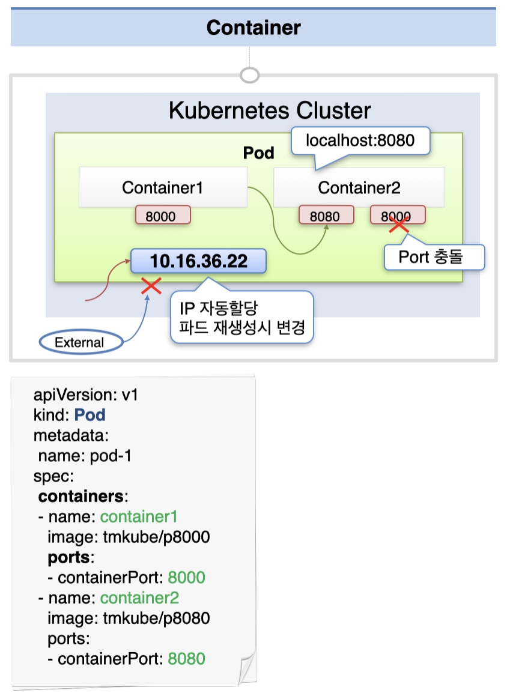
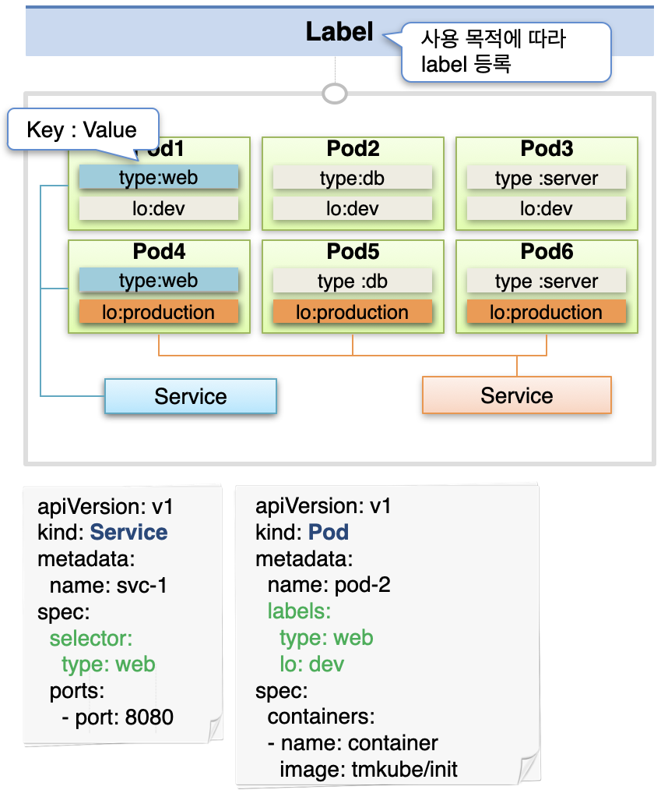
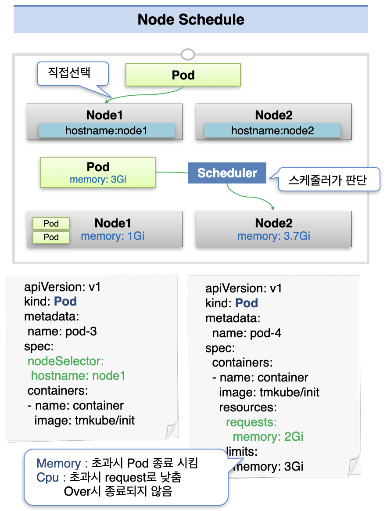

# Pod - Container, Label, NodeSchedule

## Container

하나의 파드에는 여러 개의 컨테이너를 둘 수 있다.  
이 때 파드 내의 컨테이너들은 하나의 호스트를 공유하며, 파드 내에서 localhost:[port] 로 서로 통신이 가능하다.  
(따라서 파드 내 컨테이너들은 서로 다른 포트를 가지고 있어야 한다.)  
각 파드는 다른 파드와 통신할 수 있는 ip를 할당 받는데, 이는 파드 재생성 시 변경된다.  
따라서 일관된 IP 및 도메인을 통해 파드와 통신하기 위해서는 파드에 서비스를 연결해서 통신해야 한다.

## Label

또한 각각의 파드는 라벨을 가질 수 있다.  
라벨은 key: value 형식으로 할당되며, 서비스에서 selector를 통해 원하는 라벨을 가진 파드를 골라서 서비스에 연결할 수 있다.

## NodeSelector

파드는 자신이 실행될 노드를 골라야 한다.  
이 때 nodeSelector를 통해 원하는 노드를 라벨로 선택할 수 있고, 이를 지정하지 않으면 자동으로 노드를 할당 받게 된다.  
자동 할당 시 파드에 지정해 둔 CPU/Memory requests & limits에 따라 스케줄러에 의해 적절한 유휴 자원이 있는 노드에 할당된다.

각 파드 정의 시 리소스의 requests(최소 요구량), limits(최대 요구량)을 지정할 수 있다.  
이는 파드가 무한정 리소스를 가져가는 것을 막기 위한 옵션이다.  
노드의 전체 부하 상태가 OverCommit되면 자원 사용량을 적정 수준으로 낮추기 위한 조치를 취하게 된다.  
메모리의 경우 limits를 초과한 파드가 즉시 종료되고, cpu는 requests 수준으로 떨어질 때까지 기다린다.  
이는 메모리 사용량이 초과될 경우 프로그램 간 메모리 사용에 충돌이 발생하는 등 심각한 문제가 생길 수 있기 때문에 정해진 정책이다.

출처: [인프런 대세는 쿠버네티스 [초급 ~ 중급]](https://inf.run/yW34)
