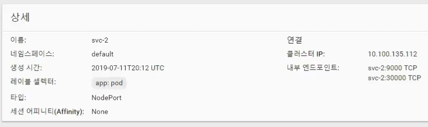
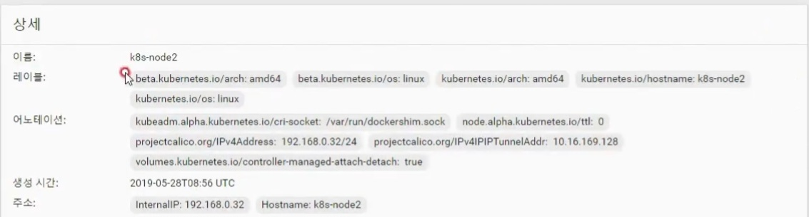
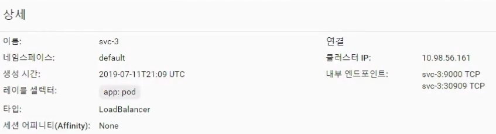
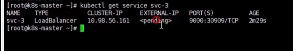

# Service - ClusterIP, NodePort, LoadBalancer

파드의 경우 시스템/서비스 장애로 인해 언제든 종료되어 새롭게 생성될 수 있고, 이 때마다 할당된 IP가 변경된다.  
이와 달리 서비스는 임의로 삭제하지 않는 한 한 번 생성되면 그대로 유지된다.  
따라서 파드에 요청을 보낼 때에는 해당 파드에 연결한 서비스를 통하는 게 일반적이다.

이 때 서비스는 크게 세가지 종류로 구분할 수 있다 - **ClusterIP, NodePort, LoadBalancer**

## ClusterIP

ClusterIP의 경우 특정 클러스터 내에서 해당 서비스에 접근할 수 있는 IP를 하나 할당받게 된다.  
해당 IP를 통해 외부에서 접근하는 것은 불가능하고, 클러스터 내에서만 접근이 가능하다.  
ClusterIP는 보통 어드민 사용자가 직접 클러스터에 접속해서 사용하는 경우에 채택된다.

## NodePort

NodePort의 경우 모든 노드의 특정 포트를 할당 받아서 서비스에 연결시키는 방식이다.  
이 경우 모든 노드에서는 해당 포트로 요청이 오면 연결된 서비스로 전달한다.  
이 때 서비스에서는 요청이 온 노드와 무관하게 자신에게 연결된 파드에 요청을 전달하게 된다.

따라서 처음 요청을 받은 노드와 최종적으로 요청을 전달 받는 파드의 노드가 다를 수 있다.  
만약 이를 일치시키고 싶다면 `externalTrafficPolicy: Local` 옵션을 줄 수 있다.

NodePort은 보통 내부망 또는 임시적으로 연결하는 용도로 많이 사용하는 서비스 유형이다.

## LoadBalancer

LoadBalancer의 경우 NodePort의 구조에 더해서, 트래픽을 각 노드에 분산시키는 Load Balancer를 추가적으로 생성한다.  
이 때에는 Load Balancer에 할당된 IP를 통해 외부에서 접근하는 것이 가능하다.  
이 때 외부 IP가 자동으로 생성되지는 않기 때문에, 이를 지원하는 플러그인이 설치되어 있어야 한다.

LoadBalancer 타입은 보통 실제로 서비스를 외부에 노출할 때 사용하는 방식이다.

# 실습

## ClusterIP

ClusterIP 타입의 서비스 객체는 다음과 같이 구성할 수 있다.  
(type을 지정하지 않으면 자동으로 clusterIP로 구성된다)

```yaml
apiVersion: v1
kind: Service
metadata:
  name: svc-1
spec:
  selector:
    app: pod
  ports:
    - port: 9000
      targetPort: 8080
```

이 경우 `app: pod` 라벨을 적용한 파드에 서비스가 연결된다.  
클러스터 내에서 서비스에 할당된 IP에 curl 요청을 보내면 잘 닿지만, 클러스터 밖의 로컬 컴퓨터에서 요청을 보내면 닿지 않는 것을 확인할 수 있다.  
파드를 삭제 후 재생성해도 서비스 객체에 파드가 잘 연결되고, 서비스의 동일한 IP로 파드에 요청을 보낼 수 있다.

## NodePort

NodePort 타입의 서비스 객체는 다음과 같이 구성할 수 있다.

```yaml
apiVersion: v1
kind: Service
metadata:
  name: svc-2
spec:
  selector:
    app: pod
  ports:
    - port: 9000
      targetPort: 8080
      nodePort: 30000
  type: NodePort
```

위와 같이 구성 시 클러스터 내에서 접근할 수 있는 ClusterIP 및 포트와, 외부에서 접근할 수 있는 노드 포트가 둘 다 생성된다.  


노드의 internal IP를 이용해서 30000번 포트로 요청을 보내면 파드에 정상적으로 접근되는 것을 확인할 수 있다.


또한 해당 IP로 수차례 요청을 보내 보면 파드들에 트래픽이 분산되어 전달되는 것을 확인할 수 있다.  
node1에 pod1, node2에 pod2를 띄우고 서비스에 둘 다 연결한 상태에서, 노드의 해당 포트에 요청을 보내면 랜덤으로 파드에 요청이 닿는다.  
어떤 노드에 요청을 보냈는지와 관계 없이, pod1, pod2에 랜덤하게 요청이 전달된다.

`externalTrafficPolicy: Local` 옵션을 추가하면 요청한 노드에 존재하는 파드로만 요청이 전달된다.  
node1에 요청을 보내면 pod1에, node2에 요청을 보내면 pod2에 요청이 전달되는 것이다.  
만약 해당 노드에 서비스에 연결된 파드가 없으면 요청이 닿지 않는다.

## LoadBalancer

LoadBalancer 타입의 서비스는 아래와 같이 구성할 수 있다.

```yaml
apiVersion: v1
kind: Service
metadata:
  name: svc-3
spec:
  selector:
    app: pod
  ports:
    - port: 9000
      targetPort: 8080
  type: LoadBalancer
```

이 경우 자동으로 클러스터 IP와 포트, 노드 포트가 할당 되는 것을 확인할 수 있다.  
다만 외부 라이브러리가 연결되지 않아서 External IP는 발급 받지 못한 상태이다.



출처: [인프런 대세는 쿠버네티스 [초급 ~ 중급]](https://inf.run/yW34)
