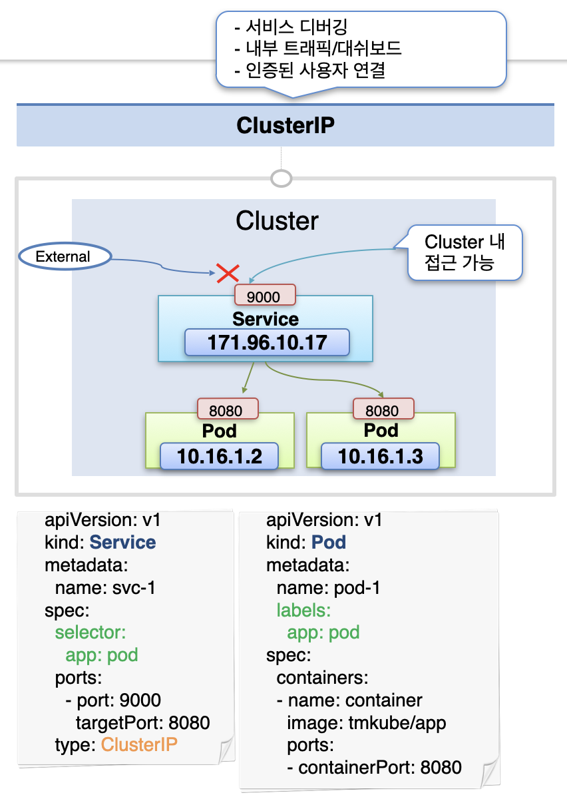
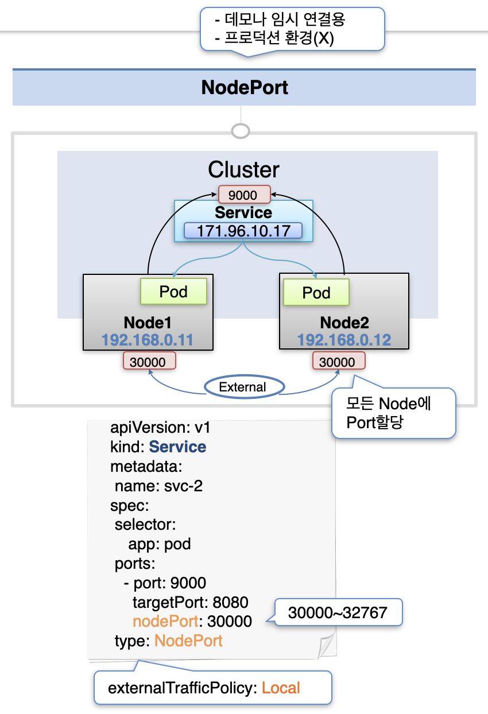
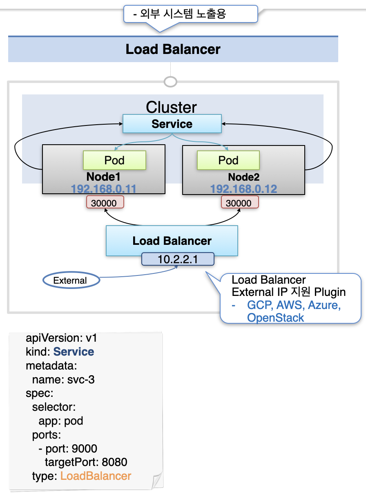

# Service - ClusterIP, NodePort, LoadBalancer

## Service가 필요한 이유

파드의 경우 시스템 및 서비스 장애로 인해 언제든 종료되어 새롭게 생성될 수 있고, 이 때마다 파드에 할당된 IP가 변경된다.  
이와 달리 서비스는 한 번 생성되면 임의로 삭제하지 않는 한 그대로 유지된다.  
따라서 파드에 요청을 보낼 때에는 해당 파드에 연결한 서비스에 요청을 보내는 게 적절하다.

이 때 서비스는 크게 세가지 종류로 구분할 수 있다 - **ClusterIP, NodePort, LoadBalancer**

## ClusterIP

ClusterIP 서비스의 경우 클러스터 내에서 해당 서비스에 접근할 수 있는 IP를 하나 할당받는다.  
해당 IP를 통해 클러스터 내에서만 접근이 가능하고, 외부에서는 접근이 불가능하다.
이러한 특성 때문에 ClusterIP는 보통 어드민 사용자가 직접 클러스터에 접속해서 사용하는 경우에 채택된다.

## NodePort

NodePort 서비스의 경우 모든 노드의 특정 포트를 할당 받는다.  
이 경우 모든 노드에서는 해당 포트로 요청이 오면 이를 해당하는 서비스로 전달한다.  
이 때 서비스에서는 자신에게 연결된 파드로 요청을 전달하는데, 어떤 파드에 요청을 전달할지는 요청이 온 노드와 무관하게 결정된다.  
따라서 처음 요청을 받은 노드와 최종적으로 요청을 전달 받는 파드의 노드가 다를 수 있다.  
만약 이를 일치시키고 싶다면 `externalTrafficPolicy: Local` 옵션을 줄 수 있다.

NodePort은 보통 내부망에서 사용하거나 임시적인 데모 시연 용도로 많이 사용한다.

## LoadBalancer

LoadBalancer의 경우 NodePort에서와 동일하게 각 노드의 포트를 할당받은 뒤, 트래픽을 각 노드에 분산시키는 Load Balancer를 추가적으로 생성한다.  
LoadBalancer에 할당된 IP를 통해 외부에서 접근하는 것이 가능하다.  
이 때 외부 IP가 자동으로 생성되지는 않고, 이를 지원하는 플러그인이 설치되어 있어야 할당 받을 수 있다.

LoadBalancer 타입은 실제로 서비스를 외부에 노출해야 할 때 사용한다.

출처: [인프런 대세는 쿠버네티스 [초급 ~ 중급]](https://inf.run/yW34)
