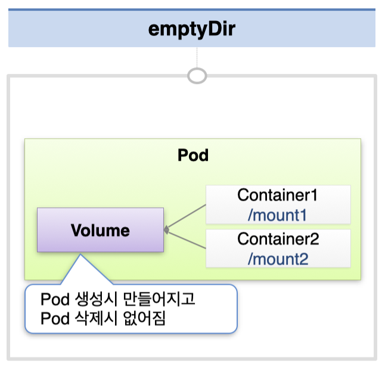
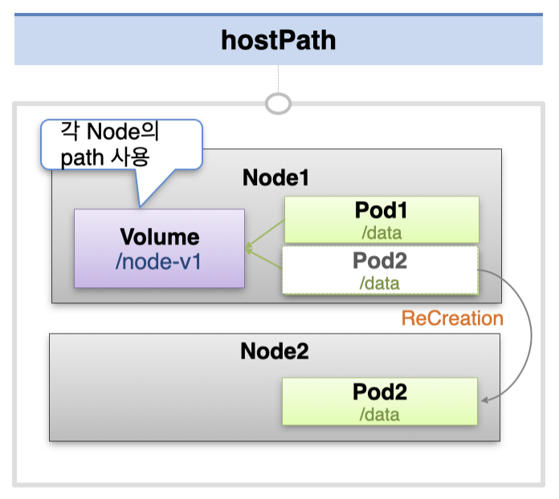
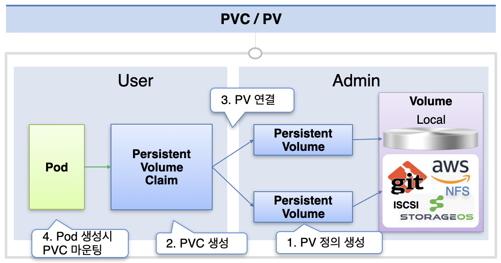

# Volume - emptyDir, hostPath, PV/PVC

볼륨에는 크게 3가지 종류가 있다 - **emptyDir, hostPath, PVC/PV**

## emptyDir

emptyDir은 파드 내에 위치하는 볼륨으로, 파드 내 컨테이너 간 편리하게 파일을 공유할 수 있게 해준다.  
볼륨이 생성될 때 기본적으로 비어 있는 상태로 생성되기 때문에 emptyDir이라는 이름을 가지고 있다.

emptyDir의 경우 파드가 생성될 때 만들어지고 파드가 삭제되면 함께 삭제되기 때문에, 휘발성이여도 상관 없는 데이터만 저장해야 한다.

```yaml
apiVersion: v1
kind: Pod
metadata:
  name: pod-volume-1
spec:
  containers:
    - name: container1
      image: kubetm/init
      volumeMounts:
        - name: empty-dir
          mountPath: /mount1
    - name: container2
      image: kubetm/init
      volumeMounts:
        - name: empty-dir
          mountPath: /mount2
  volumes:
    - name: empty-dir
      emptyDir: {}
```

위와 같이 Pod 정의시 함께 volumes에 정의되며, 각 컨테이너에서 mount할 volume을 name으로, 위치를 mountPath로 지정한다.  
이 때 각 컨테이너는 서로 다른 mountPath를 가질 수 있다.



## hostPath

hostPath는 노드 안에 위치한 볼륨이다.  
자신이 속한 노드(호스트)의 path를 하나 할당 받아서, 해당 위치에 볼륨을 위치시킨다.  
hostPath 볼륨은 파드 밖에 존재하기 때문에 파드가 종료되더라도 볼륨이 유지될 수 있다.

이 때 hostPath에 지정할 path는 사전에 node에 만들어져 있어야 한다.  
디렉토리를 자동으로 생성하게 하고 싶다면 DirectoryOrCreate로 타입을 지정하면 된다.

```yaml
apiVersion: v1
kind: Pod
metadata:
  name: pod-volume-3
spec:
  nodeSelector:
    kubernetes.io/hostname: k8s-node1
  containers:
    - name: container
      image: kubetm/init
      volumeMounts:
        - name: host-path
          mountPath: /mount1
  volumes:
    - name: host-path
      hostPath:
        path: /node-v
        type: DirectoryOrCreate
```

주의해야 할 점은 파드는 노드 자원 상황에 따라 이전과 다른 노드에 생성될 수 있다는 것이다.  
다른 노드에 피드가 생성되면 이전에 사용하던 볼륨을 계속해서 사용하지 못한다.  
따라서 보통 hostPath는 자신이 속한 노드의 시스템 파일, 구성 파일 등에 접근할 때만 사용한다.



## PV, PVC

영속적으로 데이터를 저장할 때에는 주로 PV(Persistent Volume)를 사용한다.

이 때 쿠버네티스는 Admin 영역과 User 영역을 구분했다.  
Admin 영역에서 관리자는 Local Storage나 볼륨을 제공하는 여러 서비스에 연결하기 위한 PV를 생성해둔다.  
각 볼륨의 속성마다 제공해야 하는 설정이 다르기 때문에, 전문적으로 이를 관리하는 관리 영역을 별도로 분리해두었다.

PV에는 해당 볼륨이 가지는 접근 권한(accessModes), 용량(capacity storage)을 정의할 수 있다.  
아래의 예시에서는 local 타입의 볼륨을 사용했다.  
local 볼륨을 사용할 경우 특정 노드의 path를 사용하여 볼륨이 생성되기 때문에, nodeSelectorTerms를 이용하여 특정 노드에만 파드가 생성되게 설정해두었다.  
(PV는 노드에 상관없이 볼륨을 사용하기 위한 목적이 크기 때문에, local 타입의 PV는 잘 사용하지 않는다.)

```yaml
apiVersion: v1
kind: PersistentVolume
metadata:
  name: pv-03
spec:
  capacity:
    storage: 2G
  accessModes:
    - ReadWriteOnce
  local:
    path: /node-v
  nodeAffinity:
    required:
      nodeSelectorTerms:
        - matchExpressions:
            - { key: kubernetes.io/hostname, operator: In, values: [k8s-node1] }
```

User 단은 서비스를 배포하고 운영하는 영역인데, 그 과정에서 데이터를 저장하기 위해 PV에 연결할 PVC를 만들게 된다.  
PVC에는 어떤 접근 권한이 필요한지(accessModes), 어느 정도의 크기가 필요한지(requests storage)를 정의한다.  
여기에 `storageClassName: ""` 옵션을 넣으면 해당 조건을 만족하는 PV가 자동으로 할당 된다.

```yaml
apiVersion: v1
kind: PersistentVolumeClaim
metadata:
  name: pvc-01
spec:
  accessModes:
    - ReadWriteOnce
  resources:
    requests:
      storage: 1G
  storageClassName: ""
```

마지막으로 파드의 volumes에서는 claimName에 방금 생성해 둔 PVC를 지정하여 볼륨을 정의해두고, 컨테이너 정의 부분에서 해당 볼륨을 마운트해서 사용하도록 정의한다.

```yaml
apiVersion: v1
kind: Pod
metadata:
  name: pod-volume-3
spec:
  containers:
    - name: container
      image: kubetm/init
      volumeMounts:
        - name: pvc-pv
          mountPath: /mount3
  volumes:
    - name: pvc-pv
      persistentVolumeClaim:
        claimName: pvc-01
```



출처: [인프런 대세는 쿠버네티스 [초급 ~ 중급]](https://inf.run/yW34)
