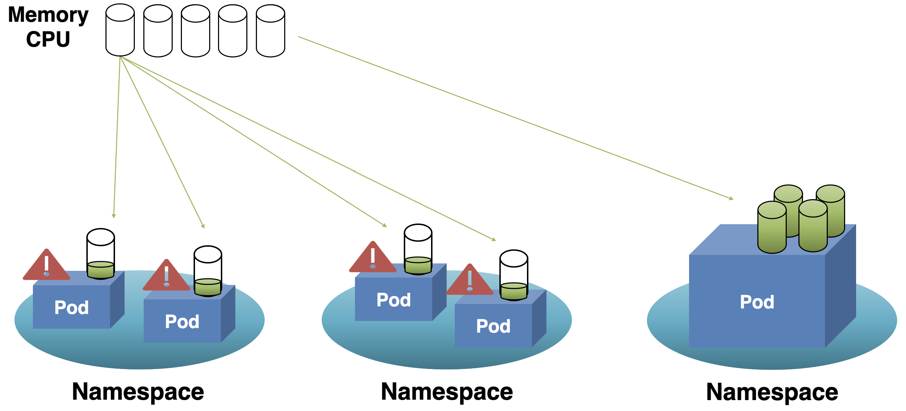
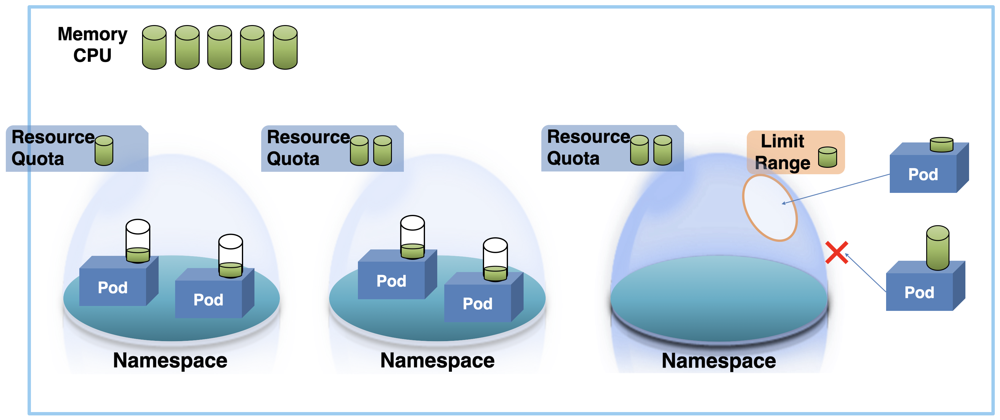
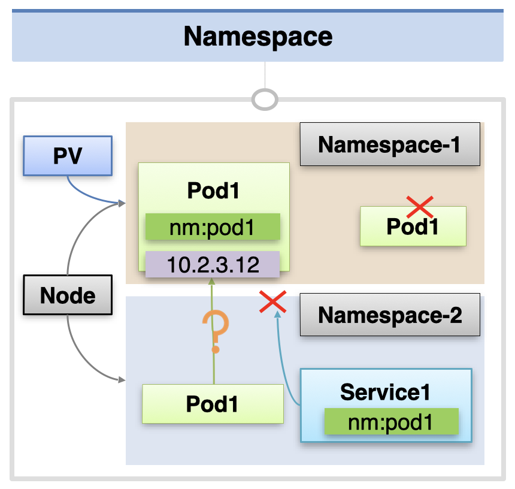
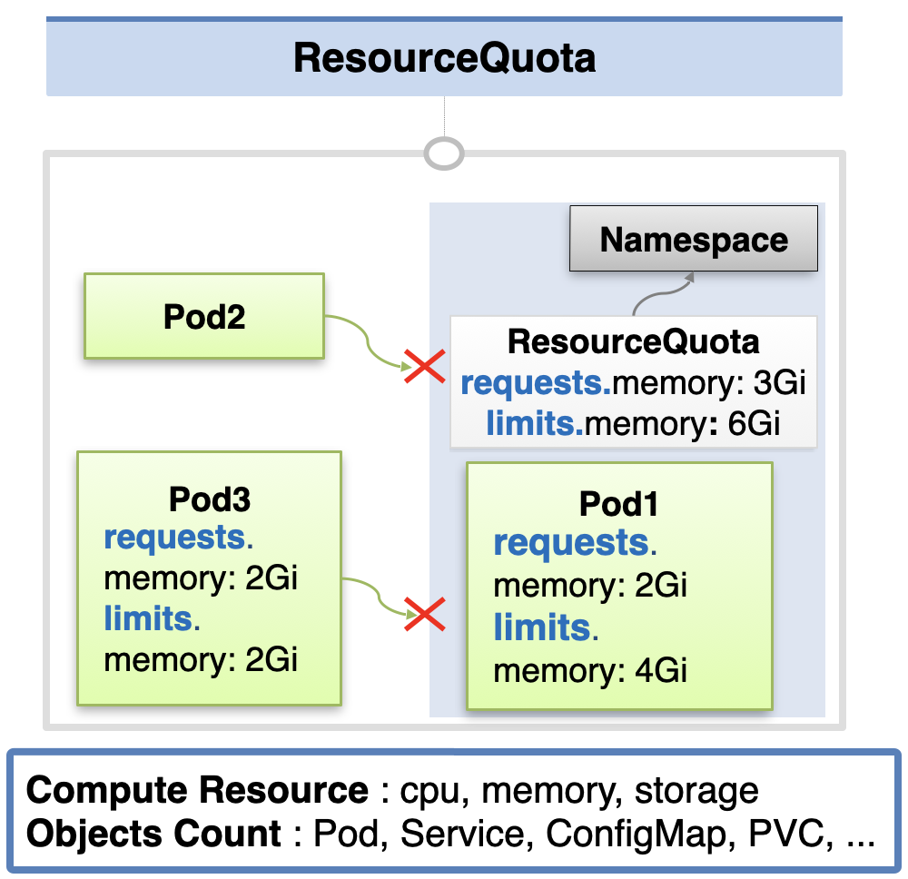
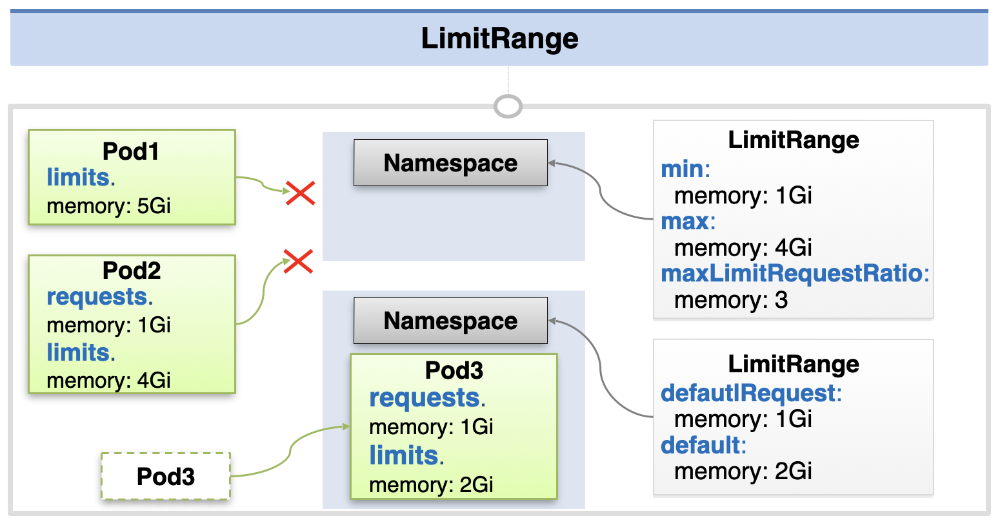

# Namespace, ResourceQuota, LimitRange

클러스터가 가진 cpu, 메모리 등의 자원이 있으면, 이를 각각의 네임스페이스가 공유해서 사용한다.  
만약 한 네임스페이스에서 지나치게 많은 자원을 사용한다면, 다른 클러스터의 파드들은 정상 동작하지 못할 수 있다.



이를 방지하기 위해 각 네임스페이스가 사용할 수 있는 최대 자원 양인 ResourceQuata를 지정할 수 있다.

또한 각 네임스페이스 안에서도 특정 파드가 지나치게 많은 자원을 사용한다면 다른 파드들이 생성되지 못할 수 있다.  
이를 방지하기 위해 하나의 파드가 사용할 수 있는 최대 자원양인 LimitRange를 지정할 수 있다.



## Namespace

네임스페이스 내의 오브젝트는 서로 다른 이름을 가지고 있어야 한다.  
따라서 네임스페이스의 한 리소스 내에서는 이름을 식별자로 사용할 수 있다.

네임스페이스 내의 객체들은 서로 별도로 관리된다.  
PV, Node 처럼 네임스페이스 밖에 존재하여 공유되는 자원을 제외하면 네임스페이스 안에 있는 객체들은 명확히 분리된다.  
예를 들어 Service 객체에서 다른 ns의 파드를 연결하는 것은 불가능하다.  
다만 다른 ns에 있는 파드들 간 ip로 통신하는 것은 Network Policy에 따라 금지될 수도, 허용될 수도 있다. (아무 것도 지정하지 않으면 허용됨)  
또한 ns를 삭제하면 그 안에 존재하는 자원들은 함께 삭제된다.



네임스페이스는 다음과 같이 간단히 구성할 수 있다.

```yaml
apiVersion: v1
kind: Namespace
metadata:
  name: nm-1
```

각 객체를 생성할 때 metadata에 어떤 네임스페이스에 생성될지 지정할 수 있다.

```yaml
apiVersion: v1
kind: Pod
metadata:
  name: pod-1
  namespace: nm-1
  labels:
    app: pod
spec:
  containers:
    - name: container
      image: kubetm/app
      ports:
        - containerPort: 8080
```

## ResourceQuata

ResourceQuata는 Namespace의 총 자원 스펙을 정의하는 객체이다.  
특정 Namespace에 ResourceQuata를 붙였으면, 해당 네임스페이스에 생성되는 모든 객체들은 requests, limits 등의 스펙을 명시해야 한다.  
또한 자원 사용량의 합계가 ResourceQuata에서 지정한 requests, limits 값을 초과시키는 객체는 추가가 불가능하다.  
ResourceQuata는 원할 경우 클러스터에 붙이는 것도 가능하다



ResourceQuata를 정의할 때에는 다음과 같이 연결할 네임스페이스의 이름을 metadata에 지정하고, 자원 스펙을 `spec: hard`에 명시한다.

```yaml
apiVersion: v1
kind: ResourceQuota
metadata:
  name: rq-1
  namespace: nm-1
spec:
  hard:
    requests.memory: 1Gi
    limits.memory: 1Gi
```

## LimitRange

LimitRange는 해당 Namespace에 들어올 수 있는 객체의 스펙을 제한한다.  
min에는 최소 스펙, max에는 최대 스펙, maxLimitRequestRatio에는 requests - limits의 최대 비율을 지정할 수 있다.  
조건에 맞지 않는 객체들은 Namespace에 생성될 수 없다.  
또한 defaultRequest, default 값을 설정하면 스펙을 지정하지 않은 객체들은 해당 스펙으로 객체가 생성된다.

LimitRange를 정의할 때에는 어떤 타입의 객체에 대한 것인지를 명시한다.  
각 객체마다 정의할 수 있는 항목이 다르므로 확인이 필요하다.



LimitRange는 Namespace에만 연결할 수 있으며, metadata에 연결할 Namespace를 명시한다.

```yaml
apiVersion: v1
kind: LimitRange
metadata:
  name: lr-5
  namespace: nm-1
spec:
  limits:
    - type: Container
      min:
        memory: 0.1Gi
      max:
        memory: 0.5Gi
      maxLimitRequestRatio:
        memory: 1
      defaultRequest:
        memory: 0.5Gi
      default:
        memory: 0.5Gi
```

출처: [인프런 대세는 쿠버네티스 [초급 ~ 중급]](https://inf.run/yW34)
