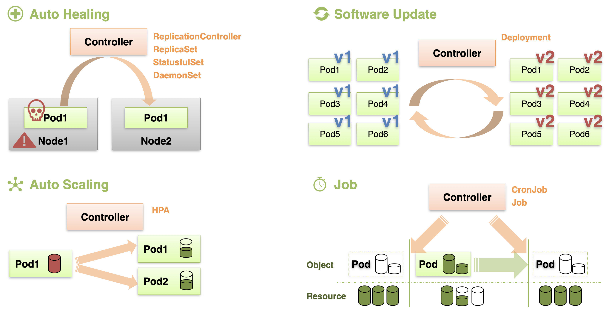

# Controller Introduction

컨트롤러는 **서비스의 운영을 도와주는 여러 기능을 제공**한다.  
**Auto Healing**은 파드에 문제가 생기거나 파드가 스케줄된 노드에 문제가 생겼을 때, 이를 자동으로 감지해서 다른 노드에 새로운 파드를 띄우는 식으로 자동 복구 해주는 기능이다.  
**Auto Scaling**은 특정 파드의 자원 사용량이 limit에 가까워질 때, 자동으로 새로운 파드를 띄워서 부하를 분담시키는 기능이다.  
**Software Update** 또한 서비스 업데이트가 필요할 때 대상이 되는 파드를 손쉽게 변경해주며, 이 과정에서 문제가 발생했을 때 롤백을 하는 기능을 제공한다.  
**Job**의 경우 특정 작업을 수행해야 할 때 일시적으로 자원을 할당해서 작업을 진행하고, 작업이 종료되면 자동으로 자원을 반납하는 기능이다.

