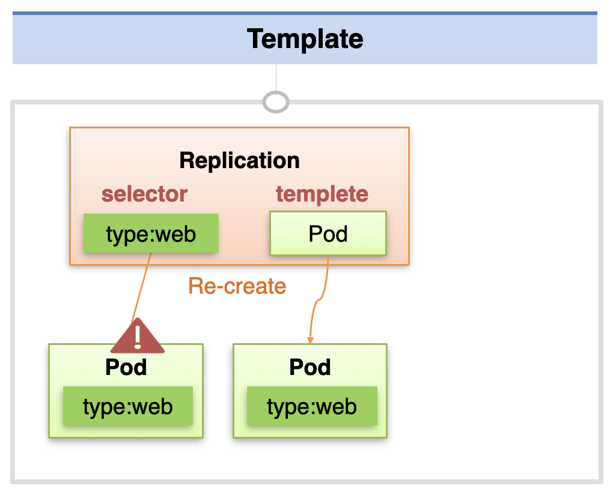
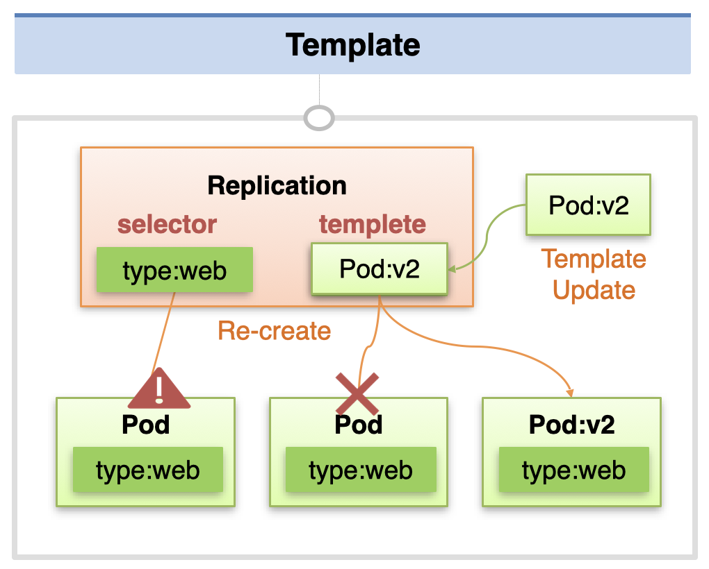
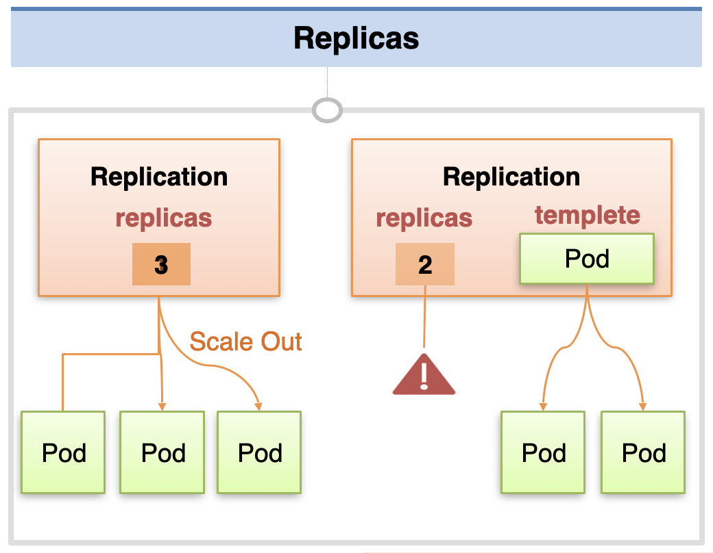
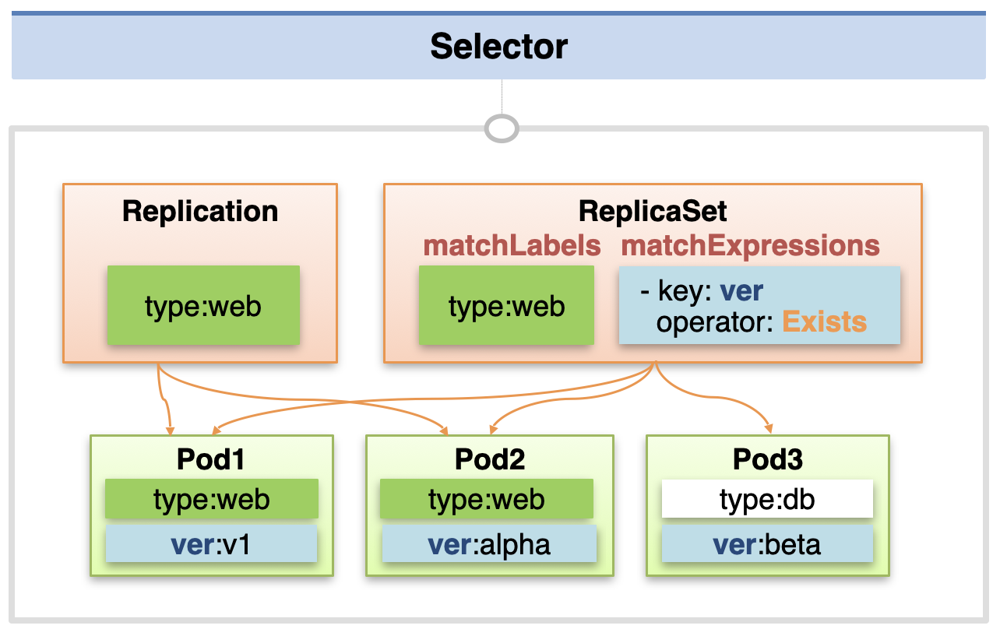

# Replication Controller, ReplicaSet - Template, Replicas, Selector

**Replication Controller**는 현재 deprecated된 객체이고, 여기에 몇몇 기능이 추가되어 **ReplicaSet**이 만들어졌다.  
Replication Controller도 **template**, **replicas** 기능을 제공하지만, **selector** 기능은 ReplicaSet에서만 지원한다.

## template

먼저 template 기능에 대한 설명이다.  
Controller는 selector를 통해 연결할 파드의 라벨을 지정한다.

이 때 `template: spec`에는 컨트롤러에서 생성할 파드의 정보를 입력해둔다.  
template의 `containers`에 컨테이너의 정보 (name, image)를 지정하면, 해당 컨테이너를 담은 파드를 생성하는 식이다.  
만약 Replication Controller에 연결한 파드에 문제가 발생하면, 컨트롤러에서는 template에 지정한 정보를 통해 파드를 새롭게 생성하여 연결한다.



이러한 특성을 이용해서 서비스의 업데이트를 진행하는 것도 가능하다.  
template에 파드 정보를 새롭게 갱신하고, 기존 파드를 임의로 정지시키면 새로운 버전의 파드를 생성해서 연결하게 된다.



다음의 구성 파일로 `type: web` 라벨을 가진 파드를 연결한 ReplicaSet을 생성할 수 있다.

```yaml
apiVersion: apps/v1
kind: ReplicaSet
metadata:
  name: replica1
spec:
  replicas: 1
  selector:
    matchLabels:
      type: web
  template:
    metadata:
      name: pod1
      labels:
        type: web
    spec:
      containers:
        - name: container
          image: kubetm/app:v1
```

## replicas

**replicas**를 통해 생성해 둘 파드의 개수를 지정할 수 있다.  
ReplicaSet은 현재 존재하는 파드의 개수가 replicas에 미치지 못하면, 자동으로 필요한 개수만큼 파드를 생성한다.
예를 들어 replicas를 3으로 지정한 상태로 ReplicaSet을 생성한 뒤 연결된 파드 중 2개를 정지시키면, 자동으로 2개가 새롭게 생성되어 replicas 개수만큼 채우게 된다.

replicas와 template을 지정하면 따로 파드 객체를 생성하지 않아도 된다.  
ReplicaSet만 생성하면 연결된 파드 개수가 0개 임을 인식하여 자동으로 replicas 값만큼 파드를 생성한다.



## selector

Replication Controller와 달리 ReplicaSet에는 selector 기능이 존재한다.  
**matchLabels**의 경우 key:value 형식으로 명시하면, 정확히 key, value가 모두 일치하는 파드를 찾는다.  
이와 달리 **matchExpressions**에는 Exists, DoesNotExists, In, NotIn 등의 표현식을 사용해서 파드 선택 규칙을 지정할 수 있다.  
이렇게 되면 특정 키가 존재하는지, 값이 특정 후보들에 해당하는지 등을 기준으로 파드를 선택할 수 있다.



```yaml
apiVersion: apps/v1
kind: ReplicaSet
metadata:
  name: replica1
spec:
  replicas: 1
  selector:
    matchLabels:
      type: web
    matchExpressions:
      - { key: ver, operator: Exists }
  template:
    metadata:
      labels:
        type: web
```

출처: [인프런 대세는 쿠버네티스 [초급 ~ 중급]](https://inf.run/yW34)
