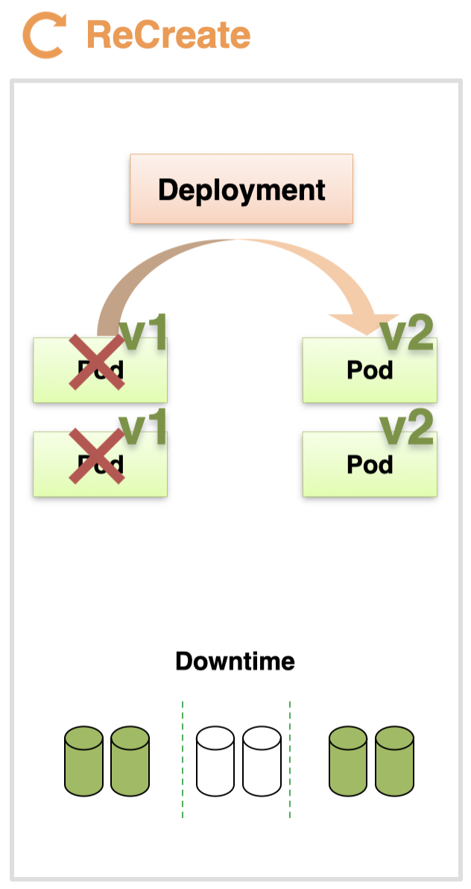
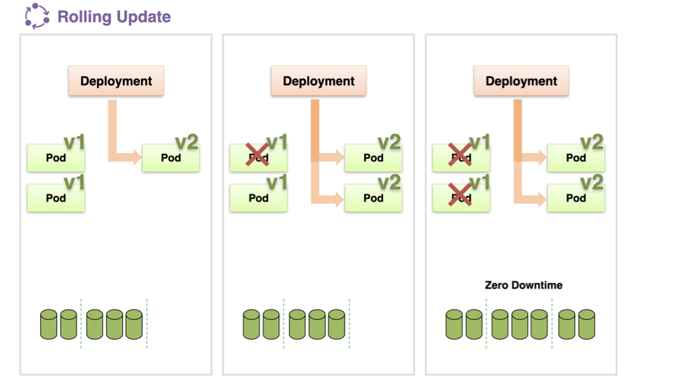
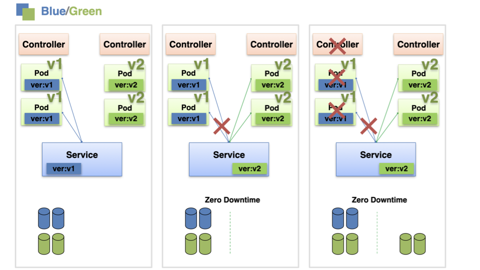
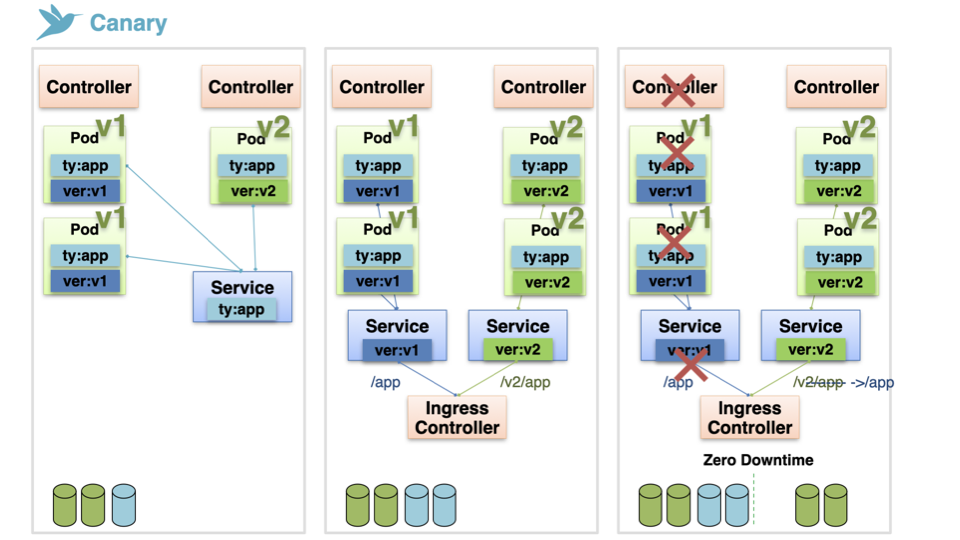

# Deployment - Recreate, RollingUpdate

Deployment는 서비스를 새로운 버전으로 쉽게 업데이트할 수 있도록 지원하는 컨트롤러이다.  
Deployment가 지원 가능한 배포 방식에는 4가지가 있다 - `ReCreate`, `Rolling Update`, `Blue/Green`, `Canary`

## 각 방식에 대한 개요

### ReCreate 방식

`ReCreate` 방식은 기존 버전의 파드를 일시적으로 정지하고, 다시 새롭게 파드를 생성해서 띄우는 방식이다.  
이 때 리소스가 반납되고 서비스 이용이 불가능해지는 Downtime이 일시적으로 발생하게 된다.  
따라서 Recreate 방식은 잠시 동안 서비스가 정지되어도 상관없는 경우에만 사용 가능하다.

### Rolling Update 방식

`Rolling Update` 방식은 기존 파드를 그대로 유지한 상태에서 새로운 버전의 파드를 생성하는 식으로 배포를 진행한다.  
이 경우 잠시 동안은 이전 버전의 파드와 새로운 버전의 파드가 공존하게 된다.  
새 버전의 파드가 생성 완료되면 Deployment는 기존 버전의 파드를 삭제한다.
이런 식으로 모든 파드를 하나씩 새로운 버전으로 갈아끼운다.

해당 방식의 장점은 서비스를 사용하지 못하는 Downtime이 하나도 없다는 것이다.  
다만 기존 파드와 새 파드가 동시에 존재하여 리소스를 2배로 사용하는 구간이 존재한다.

### Blue / Green 방식

`Blue / Green 방식`은 Deployment 객체 자체에서 지원하는 방식은 아니다.  
selector에서 선택하는 라벨을 변경하는 식으로 구현하기 때문에 ReplicaSet을 이용할 때에도 채택할 수 있는 방식이다.

먼저 새로운 버전의 파드를 필요한 replicas 개수 만큼 생성한다.  
그리고 Service의 selector에서 새로운 버전의 파드를 선택하도록 변경한다.  
이 때 새로운 버전의 파드에서 문제가 확인되면 selector를 변경하여 빠르게 롤백이 가능하다.  
새 파드에 문제가 없다면 기존의 파드를 삭제한다.

Blue / Green 방식의 장점은 서비스 사용이 불가한 downtime이 없고, 롤백이 쉬운 안정적인 배포 방식이라는 점이다.  
하지만 배포 및 테스트하는 시간 동안 리소스를 2배로 사용해야 한다.

### Canary 방식

Canary 방식은 실험군을 이용해서 새로운 버전이 정상적인지 테스트하면서 배포를 진행한다.  
테스트 단계에서는 이전 버전의 파드와 새로운 버전의 파드를 함께 Service에 연결한다.  
이 때 일부 사용자의 요청은 기존의 파드에, 나머지 사용자의 요청은 새로운 버전의 파드에 전달되기 때문에, 일부 사용자를 대상으로 테스트트가 가능하다.  
새로운 버전이 문제가 없음을 확인하면 이전 버전의 파드를 제거한다.

만약 ingress 객체를 사용한다면, 특정 path에는 새로운 버전의 파드를 연결한 Service 객체를 연결해서, 해당 path를 이용하는 사용자를 대상으로 테스트를 진행할 수도 있다.  
영어권 사용자는 /en이 붙은 url에 요청을 한다고 했을 때, 해당 path에 연결한 Service에만 새로운 버전의 파드를 연결해서 테스트 하는 식이다.  
문제가 없음이 확인되면 이전 버전을 연결한 Service를 제거하고, /en에 연결한 Service의 path를 전체 path에 연결하도록 변경하면 된다.

출처: [인프런 대세는 쿠버네티스 [초급 ~ 중급]](https://inf.run/yW34)
