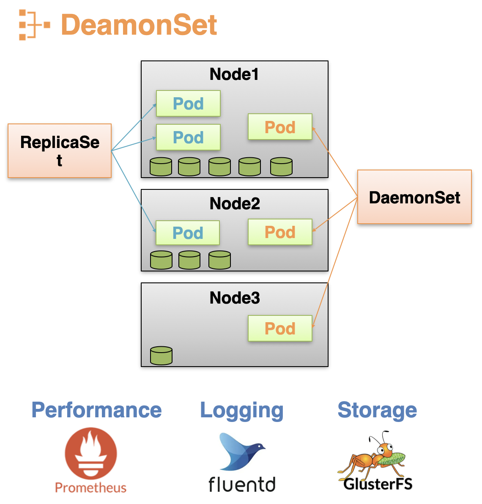
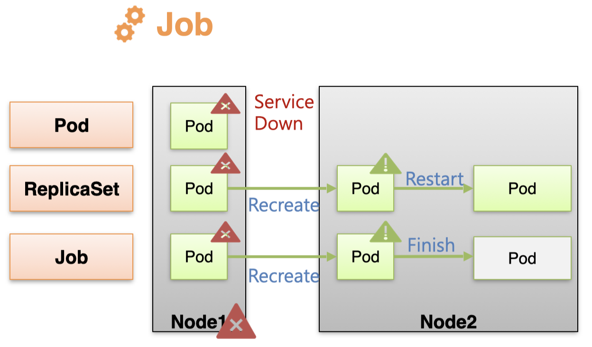
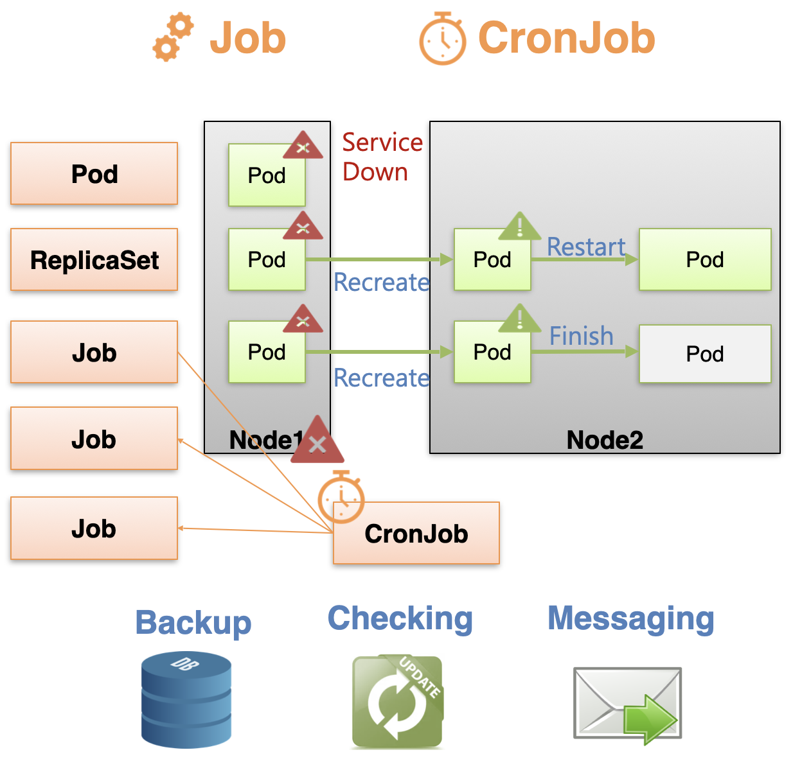
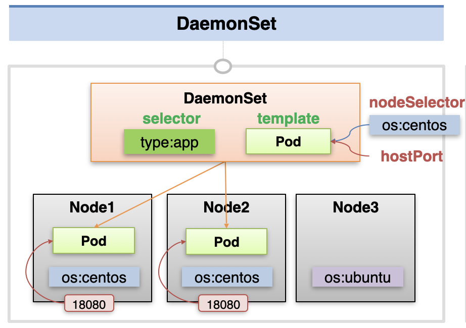
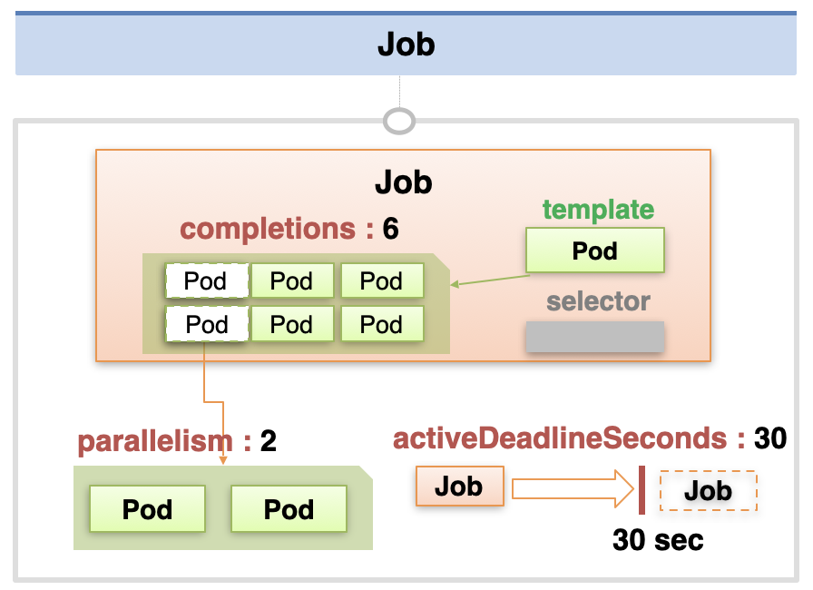
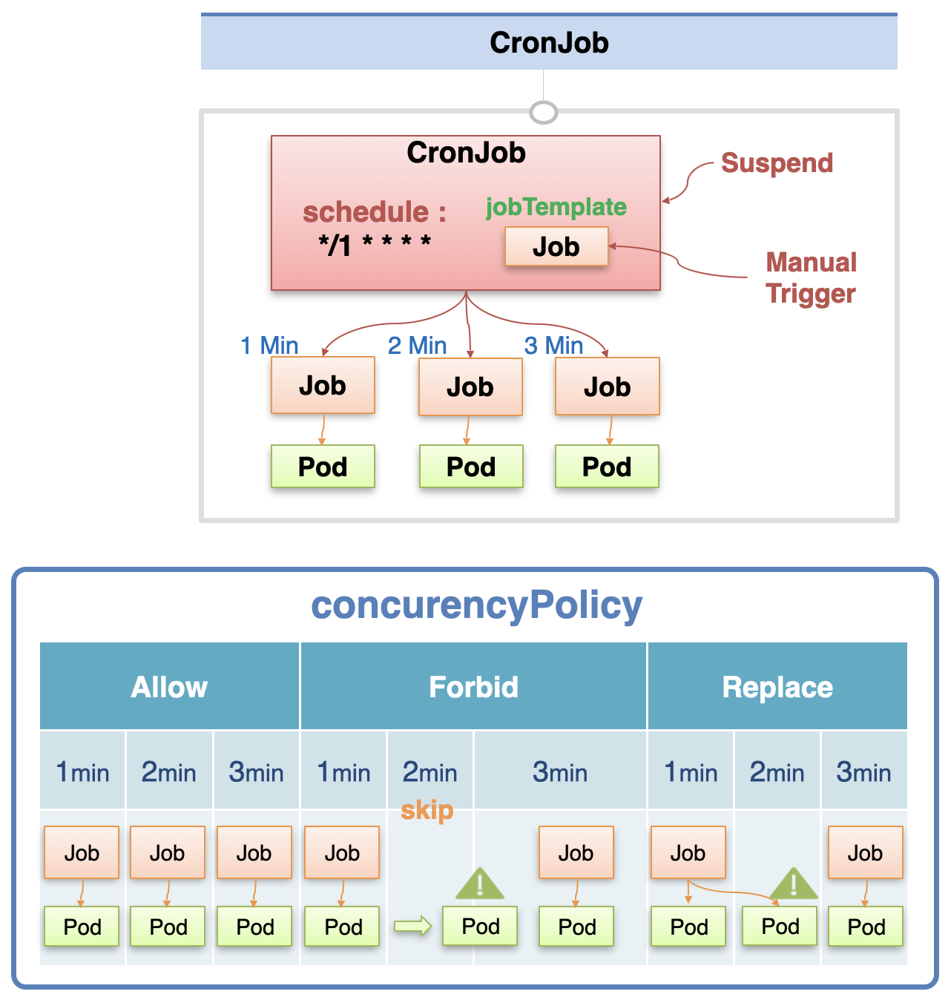

# DaemonSet, Job, CronJob

## DaemonSet 개념

### 일반적인 노드 스케줄링

보통의 클러스터 환경에는 여러 노드가 존재하고, 각 노드마다 서로 다른 양의 자원을 가지고 있다.  
이 때 파드들은 노드 스케줄링에 의해서 자원이 많이 남은 노드에 주로 스케줄링 된다.  
따라서 자원이 많은 특정 노드에 파드가 쏠리거나, 자원이 없는 노드에는 파드가 생성되지 않을 수도 있다.

### DaemonSet을 통한 노드 스케줄링

하지만 DaemonSet의 경우 반드시 각 노드 당 하나의 파드를 생성해서 할당한다.  
각 노드마다 하나씩은 들어가야 하는 서비스들에 DaemonSet을 많이 사용한다.

예를 들어 각 노드의 성능 관련 정보를 수집하기 위해 Prometheus를 두거나, 로깅을 하기 위해 fluentd를 둘 수 있다.  
또는 각 노드를 Storage에 활용하기 위해 GlusterFS를 각 노드에 설치해서 Network File System을 구축하는 것도 가능하다.



## Job, CronJob 개념

### Pod 직접 생성 vs ReplicaSet vs Job

Job을 통해서 파드를 생성하는 것도 가능하다.  
이 때 파드를 직접 생성한 경우, ReplicaSet을 통해 생성한 경우, Job을 통해 생성한 경우에 모두 다르게 동작한다.

**장애 상황에서의 차이 (Pod vs [ReplicaSet, Job])**

만약 파드가 위치해 있는 노드에 문제가 생겨서 다운이 되면, 그 위에 있는 파드들도 작동 불가능한 상태가 된다.  
이 때 Pod를 직접 생성한 경우에는 장애가 발생해도 재생성이 이루어지지 않아서 서비스가 그대로 중단되어 버린다.  
이와 달리 ReplicaSet이나 Job을 통해 생성한 경우에는 파드가 다른 노드에 재생성되어 서비스가 유지될 수 있다.

**파드 실행 중단 시 차이 (ReplicaSet vs Job)**

또한 만약 파드가 중간에 실행을 멈추면 ReplicaSet은 해당 파드를 재시작해서 서비스를 계속 유지시킨다.  
이와 달리 Job은 파드의 실행이 멈추어도 파드를 재시작 하지 않는다.  
사용자는 멈춘 Pod를 통해 수행한 작업의 로그 등 결과를 확인할 수 있다.



### CronJob

CronJob은 일정 시간마다 Job을 생성하는 오브젝트이다.  
주로 데이터를 백업하거나, 업데이트를 체크하거나, 이메일/메시지를 발송하는 등 주기적으로 해야하는 작업을 CronJob으로 등록한다.



## DaemonSet 설명

DaemonSet의 구성 파일 예시는 아래와 같다.

```yaml
apiVersion: apps/v1
kind: DaemonSet
metadata:
  name: daemonset-1
spec:
  selector:
    matchLabels:
      type: app
  template:
    metadata:
      labels:
        type: app
    spec:
      nodeSelector:
        os: centos
      containers:
        - name: container
          image: kubetm/app
          ports:
            - containerPort: 8080
              hostPort: 18080
```

다른 컨트롤러와 동일하게 DaemonSet에도 selector와 template을 지정한다.  
이에 따라 DaemonSet은 각 노드에 template에 정의한대로 파드를 만들어서, selector로 연결한다.  
이 때 일부 노드에만 파드가 생성되도록 하기 위해서 nodeSelector를 통해 선택할 노드의 라벨을 지정할 수 있다.

또한 외부에서 해당 파드에 트래픽을 전달할 수 있도록 template의 컨테이너 정보에서 hostPort를 지정할 수도 있다.  
각 노드에 hostPort 포트로 오는 트래픽의 경우, 해당하는 파드의 컨테이너 포트로 트래픽이 전달된다.



## Job 설명

Job의 구성 파일 예시는 아래와 같다.

```yaml
apiVersion: batch/v1
kind: Job
metadata:
  name: job-2
spec:
  completions: 6
  parallelism: 2
  activeDeadlineSeconds: 30
  template:
    spec:
      restartPolicy: Never
      containers:
        - name: container
          image: kubetm/init
```

### 기본 옵션

Job을 생성할 때도 마찬가지로 template, selector를 지정할 수 있다.  
selector의 경우 지정하지 않아도 자동으로 지정되어 Job과 Pod가 연결된다.

### completions, parallelism, activeDeadlineSeconds

기본적으로 Job은 하나의 파드만 실행하지만, completions에는 순차적으로 실행할 파드의 개수를 지정할 수 있고, 한 번에 parallelism 값 만큼 파드가 실행된다.  
또한 activeDeadlineSeconds에 지정한 초를 넘어도 파드 실행이 안 될 경우, 전체 Job 실행이 멈추게 된다.

> 행이 걸리는 등 실행에 문제가 있는 경우 더이상 해당 Job에 자원을 할당하지 않기 위한 정책이다.

### restartPolicy

또한 Job을 만들 때 restartPolicy도 지정해야 하는데, 여기에는 Never와 OnFaliure를 지정할 수 있다.  
이에 대한 자세한 설명은 중급편에서 할 예정이다.



## CronJob 설명

CronJob의 예시 구성 파일은 아래와 같다.

```yaml
apiVersion: batch/v1
kind: CronJob
metadata:
  name: cron-job
spec:
  schedule: "*/1 * * * *"
  jobTemplate:
    spec:
      template:
        spec:
          restartPolicy: Never
          containers:
            - name: container
              image: kubetm/init
              command: ["sh", "-c", "echo 'job start';sleep 20; echo 'job end'"]
          terminationGracePeriodSeconds: 0
```

### schedule, jobTemplate

schedule에는 Job을 생성할 주기를 Cron 형식에 맞게 작성한다.  
jobTemplate에는 CronJob이 매 시간 간격마다 생성해 낼 Job의 정보를 입력한다.

### restartPolicy

이 때 template에 restartPolicy를 지정할 수 있는데, 각 설정마다 Job과 Pod가 생성되는 방식이 다르다.

- **Allow**: 매 시간마다 언제나 Job을 생성한다.
- **Forbid**: 이전 시간 단위에서 실행한 파드가 남아있으면 일단 Job을 생성하지 않는다.  
  실행 중이던 파드가 종료되면 직전에 스케줄되어 있던 Job이 생성되는데, 만약 2개 이상의 Job을 건너 뛴 상태라면 하나를 제외한 나머지 Job들은 skip 된다.
- **Replace**: 이전 시간 단위에서 실행 중인 파드가 남아있으면 바로 기존의 Job과 Pod를 삭제하고, 새롭게 Job을 생성한다.

이외에도 실행 중인 Job을 멈추거나(Suspend), manual 하게 실행하는 방법도 존재한다.



출처: [인프런 대세는 쿠버네티스 [초급 ~ 중급]](https://inf.run/yW34)
