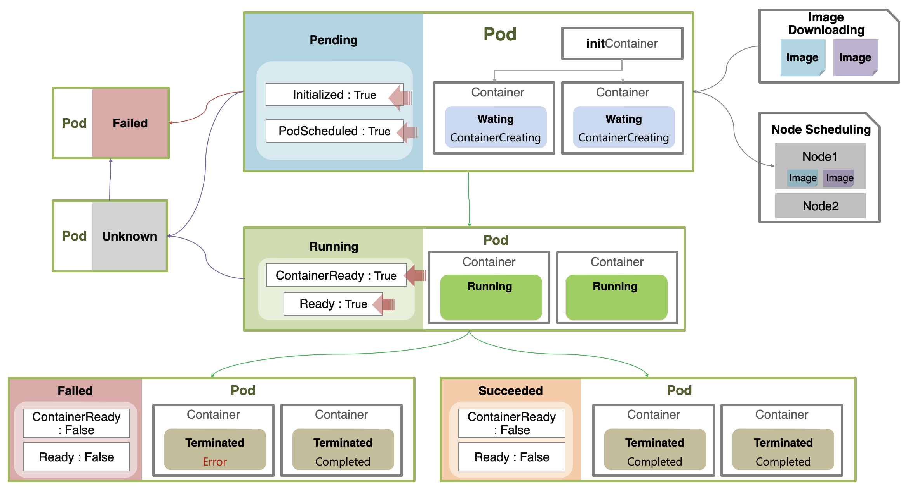

# Pod Lifecycle

## 파드의 상태 정보

파드의 상세 정보에는 파드의 현재 라이프사이클 상태 정보를 알려주는 값들이 포함되어 있다.

먼저 **phase** 값의 `Pending`, `Running`, `Succeeded`, `Failed`, `Unknown` 으로 해당 파드의 라이프사이클 상 단계를 확인할 수 있다.

또한 **conditions**에 포함된 각각의 상태 정보들을 통해 세부 상태를 알 수 있다.  
conditions에는 `Initialized`, `PodScheduled`, `ContainerReady`, `Ready` 가 존재하며, 각각의 조건의 status가 True / False로 표시된다.
**reason**에는 해당 상태의 원인이 적혀있다. (ex. `ContainersNotReady`, `PodCompleted`)

또한 파드 내에 생성된 컨테이너의 상태값도 존재하며, **state**(`Waiting`, `Running`, `Terminated`)와 **reason**(`ContainerCreating`, `CrashLoopBackOff`, `Error`, `Completed`) 값으로 구성되어 있다.

## 파드의 라이프사이클 흐름

### 노드 스케줄링, InitContainer

파드가 생성될 때 Phase 값은 Pending이다.  
먼저 노드 스케줄링에 따라서 파드가 노드에 할당되고, 노드 스케줄링이 끝나면 `PodScheduled` 값이 True가 된다.

그 다음 컨테이너를 생성해야 하는데, 그 전에 먼저 InitContainer 항목에 지정한 커맨드를 실행하게 된다.  
보통 컨테이너 생성 전에 볼륨 마운트, 보안 작업 등이 필요할 때 InitContainer에 실행할 커맨드를 지정한다.  
InitContainer 커맨드 실행까지 성공적으로 마쳤을 경우 `Initialized`가 True가 된다.

### 컨테이너 생성

지금까지의 단계에서 컨테이너의 status는 Waiting, reason은 ContainerCreating으로 지정되어 있다.

이제 컨테이너 생성을 시작하기 위해 이미지를 다운로드한다.  
이미지를 이용하여 파드 내에 컨테이너가 정상적으로 실행이 되면 컨테이너들의 상태가 `Running`이 되고, `ContainerReady`와 `Ready` 값이 True가 된다.  
만약 컨테이너 실행 과정에서 문제가 발생하면 컨테이너의 상태가 `Waiting`이 되고, reason이 `CrashLoopBackOff`로 표시된다.

이 때 주의할 점은 **컨테이너 실행이 실패해도 파드의 phase는 여전히 Running이라는 점**이다.  
컨테이너 실행에 실패하면 파드의 `ContainerReady`와 `Ready`의 상태 값이 False가 되므로, 해당 값을 참조하여 서비스의 정상 동작 여부를 확인해야 한다.

### 컨테이너 종료 (Job에 의해 생성된 경우)

Job에 의해 생성된 경우에는 작업의 성공 여부에 대한 상태를 관리해야 한다.  
Pod가 실행 종료되면 ContainerReady와 Ready가 False가 된다.  
컨테이너가 종료되면서 컨테이너 상태가 `Terminated`로 바뀌는데, 이 때 reason이 `Completed`이면 정상 실행된 것이고 `Error`이면 실행에 실패한 것이다.

만약 파드 내에 실행한 컨테이너 중 하나라도 Error로 종료되면 파드의 상태가 `Failed`가 된다.  
모든 컨테이너가 Completed로 종료되어야 파드의 상태가 `Succeeded`가 된다.

출처: [인프런 대세는 쿠버네티스 [초급 ~ 중급]](https://inf.run/yW34)
