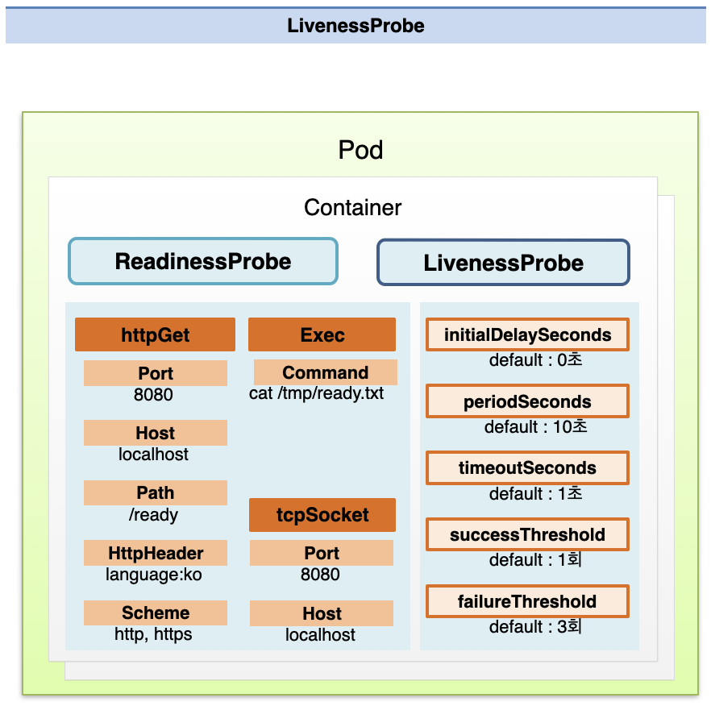
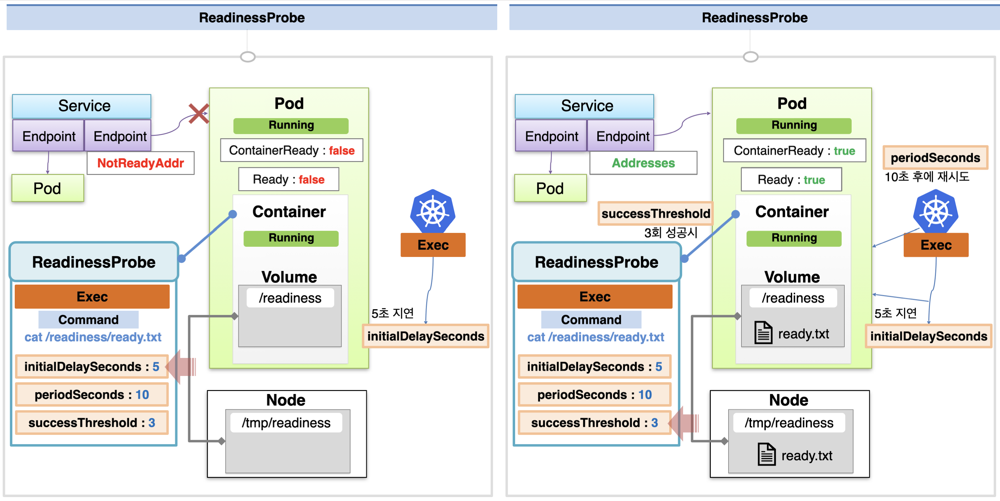
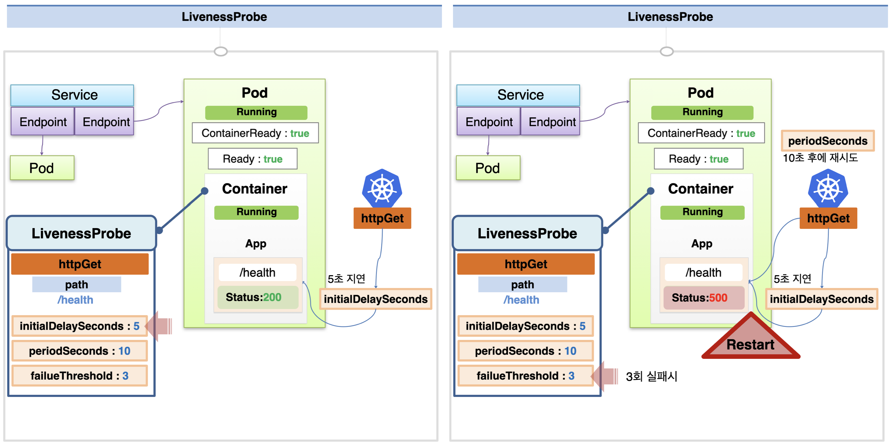

# Pod - ReadinessProbe, LivenessProbe

## 사용 목적

**ReadinessProbe**와 **LivenessProbe**는 파드 내에 구동되는 앱의 상태를 확인하고, 이를 파드의 상태값(ContainerReady, Ready)에 반영하여 안정적인 서비스 운영이 가능하게 한다.  
ReadinessProbe는 파드 생성 시점에서 앱의 정상 구동 전까지 트래픽 전달을 막아주고, LivenessProbe는 파드 실행 중에 서비스 장애 감지 시 트래픽 전달을 막는다.

## ReadinessProbe 개념

서로 다른 노드에 파드를 띄우고, 이들을 서비스에 연결해서 트래픽을 두 파드에 분산하여 서비스 중이라고 하자.  
이 때 한 노드가 비정상 종료 되어 그 안의 파드가 함께 종료되면, auto healing 기능에 따라 새로운 노드에 파드가 생성된다.

만약 재생성된 파드가 그 즉시 서비스에 연결되면, 해당 파드도 그 시점부터 바로 트래픽을 받게 된다.  
하지만 아직 파드 내의 앱이 완전히 구동되지 않았기 때문에 사용자는 에러 페이지를 보게 된다.

ReadinessProbe는 이러한 문제를 예방하는데 쓰인다.  
ReadinessProbe는 파드 생성 시점에 파드 내의 앱이 정상적으로 실행되었는지 테스트해서, 앱의 정상 구동 전까지는 해당 파드에 트래픽이 전달되지 않도록 파드의 상태값을 설정해준다.

## LivenessProbe 개념

또한 파드의 상태는 Running 이지만 그 안의 서비스가 장애 상황인 경우가 있다.  
예를 들어 컨테이너의 톰캣 자체는 제대로 돌고 있으나 그 위에 띄워진 프로세스에 문제가 생겨서, 서비스에 접근하면 에러가 발생하는 경우이다.

이러한 문제에 대응하기 위해 LivenessProbe를 사용한다.  
LivenessProbe는 주기적으로 파드 내의 앱이 정상인지를 테스트하여, 오류 상태인 경우 해당 파드에 트래픽이 전달되지 않도록 파드의 상태값을 설정해준다.

## 설정 가능한 옵션

ReadinessProbe와 LivenessProbe는 설정 가능한 옵션이 비슷하다.

**HttpGet**은 http 요청을 통해 서비스의 상태를 확인할 경우 사용하는 옵션으로, 테스트 시 사용할 port, host, path, httpHeader, schema 정보를 설정한다.  
**Exec**은 커맨드 라인 실행으로 테스트할 때 사용하고, 실행할 커맨드를 command에 입력한다.  
**tcpSocket**은 socket 요청을 통해 테스트할 때 사용하고, port와 host 정보를 입력한다.

또한 이 외에 다양한 설정을 할 수 있는데, **initialDelaySeconds**(0), **periodSeconds**(10), **timeoutSeconds**(1), **successThreshold**(1), **failureThreshold**(3)를 설정할 수 있다.  
(값을 설정하지 않으면 괄호 안의 기본 값으로 적용이 된다.)

**initialDelaySeconds** 만큼 지연이 있은 후 테스트가 시작되며, **periodSeconds** 주기마다 테스트를 수행한다.  
결과를 확인하는데 **timeoutSeconds**를 넘어가면 실패로 간주되고, 성공 횟수가 **successThreshold**를 넘어가면 성공, 실패 횟수가 **failureThreshold**를 넘어가면 실패가 된다.

## ReadinessProbe 사용 예시

### 설정 옵션

/readiness 경로로 hostPath 볼륨을 연결해 두고, 해당 경로에 ready.txt 파일이 존재하는지 확인하는 ReadinessProbe를 적용하여 파드를 생성한다고 하자.  
이 때 `exec command`에는 파일 내용을 확인하는 커맨드인 `cat /readiness/ready.txt` 를 등록하면 된다.  
옵션은 `initialDelaySeconds: 5`, `periodSeconds: 10`, `successThreshold: 3` 으로 설정한다.

### 초기 상태

ReadinessProbe가 연결된 경우 **파드가 최초 생성될 때 파드의 상태는 Running**이지만 **containerReady, Ready 값은 False** 이다.  
이 때 Service는 해당 파드에 연결된 Endpoint가 NotReadyAddr 인 것으로 판단해서 트래픽을 전달하지 않는다.

### 앱 실행 테스트

`initialDelaySeconds: 5` 이므로 테스트는 최초 지연 5초 후에 시작된다.  
10초 간격으로 테스트가 이루어지는데, 최초에 해당 path에 파일이 없는 상황이므로 실패하게 된다.

이 때 path에 필요한 파일을 생성 완료하면 그 이후의 테스트는 성공하게 되며, 3번의 성공을 하면 해당 probe 전체를 성공으로 간주한다.  
이제 연결된 파드의 **containerReady, Ready 값이 True로 설정**되고, **서비스에서는 해당 파드에 연결된 Endpoint도 Address로 간주**되면서 정상적으로 트래픽이 전달된다.

## LivenessProbe 사용 예시

### 설정 옵션

이번엔 /health 경로로 http get 요청을 보내서 앱의 상태를 체크한다고 가정하자.  
이 때 `httpGet: path` 값을 `/health` 로 설정하면 된다.  
각 옵션의 경우 `initialDelaySeconds: 5`, `periodSeconds: 10`, `failureThreshold: 3` 으로 설정한다.

### 앱 실행 테스트

해당 파드가 구동되기 시작하면, 쿠버네티스에서는 5초의 지연 시간 후 매 10초마다 해당 서비스에 `/health` 경로로 http 요청을 보내서 테스트를 한다.
정상 실행 중일 때에는 200 응답을 받게 되어, 서비스가 정상 작동한다고 판단한다.

만약 중간에 앱에 문제가 생겨서 `/health` 경로로 http 요청 시 500 응답을 받게 되었다고 하자.  
**총 3번의 실패 응답을 받은 후에는 해당 파드에 문제가 있다고 판단하고, 파드를 재시작**하게 된다.

출처: [인프런 대세는 쿠버네티스 [초급 ~ 중급]](https://inf.run/yW34)
