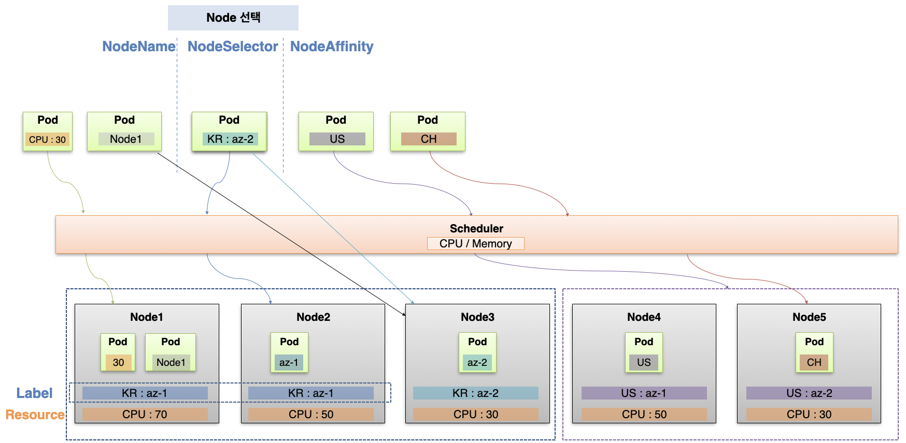
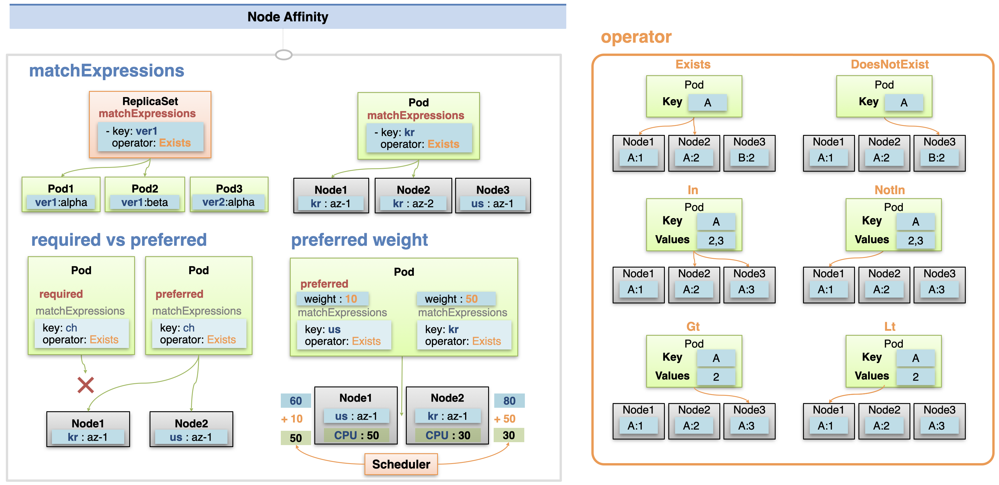
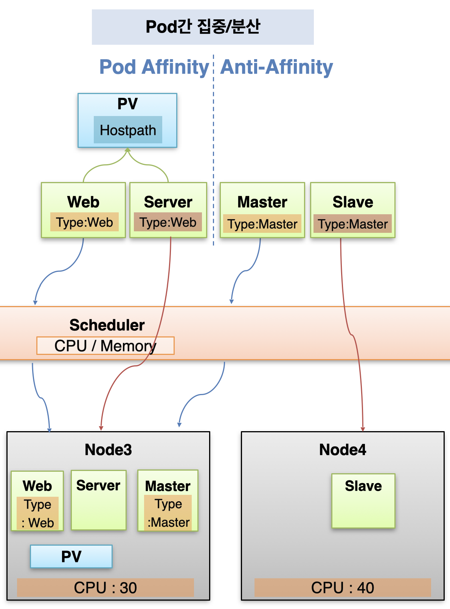
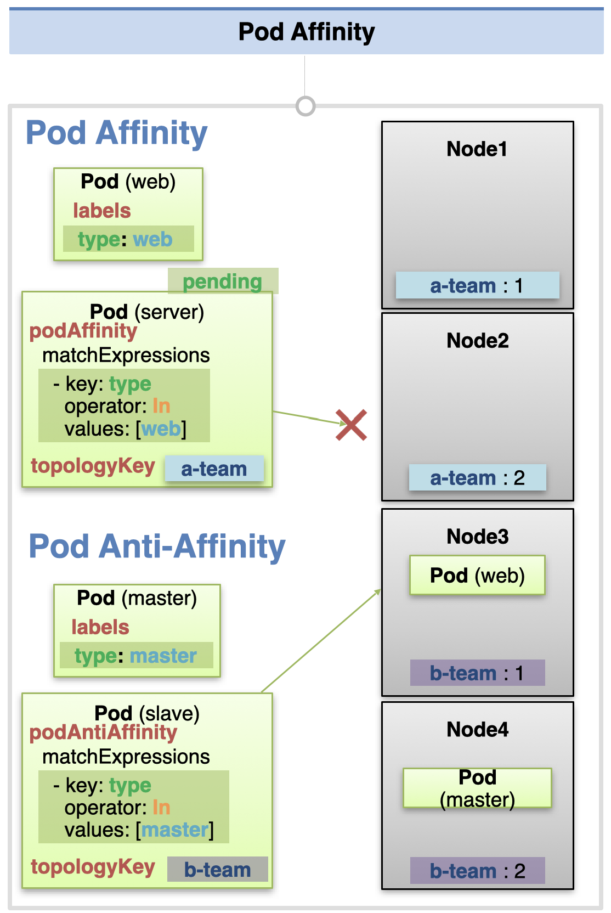
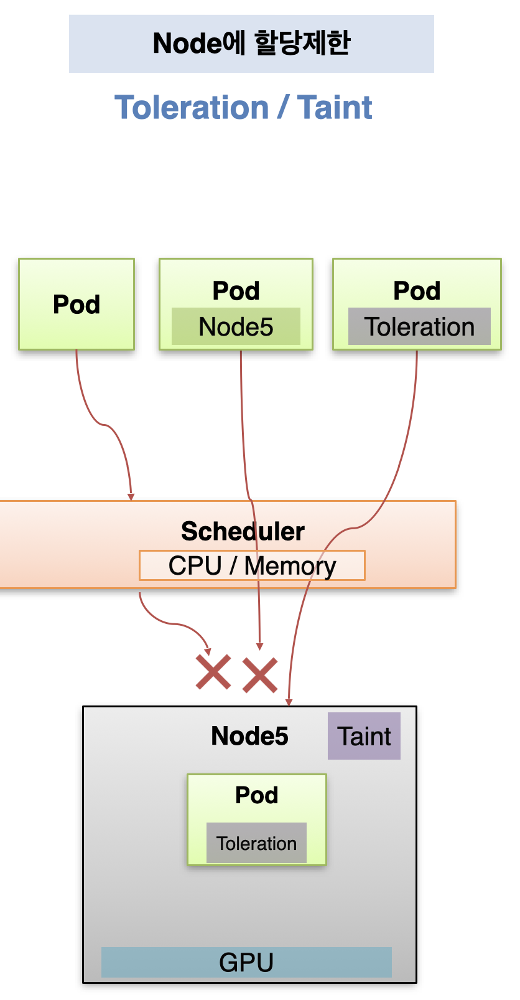

# Node Scheduling

파드는 생성 시 노드에 스케줄링 되는데, 파드를 할당할 노드를 지정하거나 할당하지 않을 노드를 지정하는 것이 가능하다.

## 노드를 선택하는 속성 - NodeName, NodeSelector, NodeAffinity

`NodeName`, `NodeSelector`, `NodeAffinity`는 어떤 노드에 파드를 할당할지 선택하는 속성들이다.

`NodeName`은 직접적으로 노드 이름을 명시해서 해당 노드에 파드를 할당한다.  
다만 노드는 지속적으로 다시 뜰 수 있고 이름도 변경될 수 있기 때문에 NodeName은 잘 사용하지 않는다.

`NodeSelector`의 경우 지정한 라벨에 맞는 노드에 파드를 할당시킨다.  
해당 라벨을 가진 노드가 여러개이면 그 중 자원이 많은 노드를 선택해서 할당하고, 만약 라벨을 가진 노드가 없다면 파드가 어디에도 할당되지 않아서 에러가 발생한다.

`NodeAffinity`는 NodeSelector 보다 좀 더 유연하게 작동한다.  
라벨의 key/value가 matchExpressions에 지정한 조건식에 맞는 노드들을 고르고, 그 중에서 자원이 많은 노드에 파드를 할당한다.  
이 때 preferred 옵션을 사용하면 조건을 만족하는 노드가 없을 경우 다른 노드에라도 파드를 할당시키도록 설정할 수 있다.



### NodeAffinity 설명

NodeAffinity에는 matchExpressions 속성을 통해 라벨의 key나 value를 이용한 스케줄링 조건을 지정할 수 있다.  
특정 키의 존재 여부를 확인하는 `exists` / `doesNotExists`, 값이 특정 후보에 포함되는지를 확인하는 `in` / `notIn`, 값을 범위로 필터링하는 `gt` / `lt` 조건을 사용할 수 있다.

이 때 matchExpressions 와 함께 `required` 조건을 달게 되면 반드시 해당 조건을 반드시 충족하는 노드에 파드를 할당한다.  
만약 조건을 충족하는 노드가 없으면 할당을 하지 못하게 되고, 파드는 pending 상태가 된다.
이와 달리 preferred 조건을 달면 matchExpressions가 우선 순위로만 역할을 하게 되어, 조건을 충족하는 노드가 없더라도 파드가 할당될 수 있다.

추가적으로, matchExpressions를 여러개 지정하고, 각 조건에 가중치를 부여하는 것도 가능하다.
preferred: weight로 가중치 값을 부여하면, 스케줄러가 cpu, memory 등의 자원 상황과 가중치 값을 함께 고려하여 할당할 노드를 선택한다.



## 파드를 노드에 집중시키거나 분산시키는 속성 - PodAffinity, PodAntiAffinity

다음으로 파드를 특정 노드에만 생성되게 하거나, 겹치는 노드 없이 분산시키는 옵션이 있다.  
`PodAffinity`는 파드를 특정 노드에만 파드를 할당시키는 옵션으로, 예를 들어 hostPath 볼륨을 공유해서 사용해야 하는 등 모든 파드가 동일한 노드에 할당되어야 할 때 사용한다.

먼저 하나의 파드가 다른 노드에 할당되어 pv가 만들어진 상태라고 하자.  
새로운 파드를 생성할 때 PodAffinity 속성을 주고 기존 파드와 동일한 라벨을 삽입해서 생성하면 동일한 노드에 파드가 할당되어, hostPath 볼륨을 함께 사용할 수 있다.

이와 달리 `AntiAffinity` 속성을 주면 반드시 기존 파드와 다른 노드에 파드가 생성된다.  
보통 Master - Slave 관계에서 하나를 백업 파드로 사용해야 할 때, 다른 노드에 백업 파드를 위치시키기 위해 사용한다.



### 자세한 설정 방법

podAffinity는 파드의 라벨을 이용해서 스케줄링 조건을 지정한다.
matchExpressions를 통해 파드 선택 조건을 지정해서, 해당 파드가 할당된 노드를 선택한다. (required, preferred 옵션 사용 가능)  
이 때 topologyKey의 키를 가지고 있는 노드들에서 파드를 검색하기 때문에, 만약 해당 topologyKey를 가지고 있지 않은 노드에 이전 파드가 할당되어 있다면 파드가 할당되지 못한다.

podAntiAffinity에도 마찬가지로 matchExpressions를 지정하고, 이 때에는 선택된 파드가 속하지 않은 노드로 파드가 할당된다.
topologyKey는 podAntiAffinity에도 동일하게 사용된다.



## 노드에 파드 할당을 금지/허용하는 속성 - Taint & Toleration

`Taint`는 특정 노드에 아무 파드나 할당되지 않도록 노드에 주는 속성이다.  
Taint 속성을 부여한 노드는 일반작인 스케줄링으로는 할당이 되지 않는다. (nodeName으로 직접 할당해도 미찬가지)  
파드에 `Toleration` 속성이 부여된 경우에만 해당 파드에 할당될 수 있다.  
고사양 작업을 수행하기 위해 노드에 GPU가 설치되어 있는 등 특정 파드만 해당 노드에 할당할 필요가 있을 때 사용한다.



### Taint의 effect - NoSchedule, PreferNoSchedule, NoExecute

노드에 Taint 속성을 적용할 때에는 effect의 종류를 지정해야 한다.

effect에 `NoSchedule`을 지정하면 일반적인 파드는 해당 노드에 스케줄 될 수 없다.  
매칭되는 key, value, effect 값을 가진 Toleration이 파드에 적용되어 있어야 할당될 수 있다.  
(단, 매칭되는 Toleration이 적용되어 있다고 해서 해당 노드에 할당 되는 것이 보장되지는 않는다.
해당 노드에 할당시키기 위해서는 nodeSelector 등으로 노드를 선택해야 한다)  
Toleration의 operation에는 equal, exists 중 하나를 적용할 수 있다.

effect에는 `preferNoSchedule`을 적용할 수도 있다.
이 때에는 Toleration 적용이 안 된 파드는 가능한 해당 노드에 할당이 되지 않지만, 다른 노드가 사용 불가능인 상황에서는 할당이 될 수도 있다.

또한 `NoExecute`를 적용하는 것도 가능하다.
다른 effect의 경우 노드에 Taint를 적용한다고 해서 노드의 기존에 실행중인 파드에는 영향이 가지 않는다.  
이와 달리 NoExecute는 기존에 존재하는 파드들 중 기준에 맞지 않는 파드들은 강제 종료시킨다.  
이 때 매칭되는 파드의 Toleration에 `tolerationSeconds`를 적용할 수 있는데, 해당 파드는 노드에 할당된 뒤 해당 초 만큼은 실행되다가 이후 종료된다.

### Taint 사용 예시

Taint는 쿠버네티스에서 기본적으로 많이 사용되는 속성이다.

예를 들어 Master 노드에는 NoSchedule Taint가 적용되어 있어서 파드를 할당 받을 수 없게 설정되어 있다.

또한 특정 노드에 문제가 발생했다는 것이 감지되면, 해당 노드에 할당된 파드의 정상 실행을 보장할 수 없기 때문에 노드에 NoExecute Taint가 적용된다.  
해당 노드에 파드를 실행 중이었던 ReplicaSet은 다른 노드에 파드를 다시 생성해서 서비스를 정상적으로 유지할 수 있다.

## NodeAffinity - MatchExpressions 실습

먼저 다음의 커맨드를 통해 노드1에 kr=az-1, 노드2에 us=az-1 라벨을 각각 적용한다.

```bash
kubectl label nodes k8s-node1 kr=az-1
kubectl label nodes k8s-node2 us=az-1
```

### 1. required

그 다음 NodeAffinity가 적용된 파드를 다음과 같이 생성한다.

```yaml
apiVersion: v1
kind: Pod
metadata:
  name: pod-match-expressions1
spec:
  affinity:
    nodeAffinity:
      requiredDuringSchedulingIgnoredDuringExecution:
        nodeSelectorTerms:
          - matchExpressions:
              - { key: kr, operator: Exists }
  containers:
    - name: container
      image: kubetm/app
  terminationGracePeriodSeconds: 0
```

affinity에 nodeAffinity를 지정하고, required로 표현식을 적용하기 위해 `requiredDuringSchedulingIgnoredDuringExecution` 속성을 적용한다.  
그 하위의 nodeSelectorTerms: matchExpressions에 적용하고자 하는 표현식을 정의한다.

위 파드는 kr 키를 가진 노드를 선택하기 때문에, 노드1에 파드가 할당된다.  
해당 구성 파일로 수차례 파드를 생성해도 동일하게 노드1에 할당이 되는 것을 확인할 수 있다.

### 2. preferred

다음으로 preferred를 확인하기 위해, 모든 노드에 매칭되지 않는 matchExpressions를 조건식에 적용한다.

```yaml
apiVersion: v1
kind: Pod
metadata:
  name: pod-preferred
spec:
  affinity:
    nodeAffinity:
      preferredDuringSchedulingIgnoredDuringExecution:
        - weight: 1
          preference:
            matchExpressions:
              - { key: ch, operator: Exists }
  containers:
    - name: container
      image: kubetm/app
  terminationGracePeriodSeconds: 0
```

`preferredDuringSchedulingIgnoredDuringExecution` 속성을 적용하고, preference: matchExpressions에 원하는 조건식을 작성했다.  
현재 ch 키를 가진 노드는 존재하지 않기 때문에 만약 required로 만들었다면 파드가 pending 상태에 머물게 된다.  
위 경우에는 preferred로 만들었기 때문에 조건을 만족하지 않는 노드들에도 할당이 가능하고, 위 상태에서는 현재 파드가 없는 노드2에 파드가 할당된다.

## PodAffinity / PodAntiAffinity 실습

### PodAffinity

PodAffinity 파드를 확인해보기 위해, 먼저 특정 노드에 파드를 생성한다.  
다음의 커맨드를 통해 node1에 a-team=1, node2에 a-team=2 라벨을 붙인다.

```bash
kubectl label nodes k8s-node1 a-team=1
kubectl label nodes k8s-node2 a-team=2
```

이제 다음의 구성 파일로 a-team=1 라벨을 가진 노드1에 파드를 생성한다.

```yaml
apiVersion: v1
kind: Pod
metadata:
  name: web1
  labels:
    type: web1
spec:
  nodeSelector:
    a-team: "1"
  containers:
    - name: container
      image: kubetm/app
  terminationGracePeriodSeconds: 0
```

이제 위에서 생성한 파드와 동일한 노드에 파드를 생성하기 위해, podAffinity가 적용된 파드를 다음과 같이 생성한다.

```yaml
apiVersion: v1
kind: Pod
metadata:
  name: server1
spec:
  affinity:
    podAffinity:
      requiredDuringSchedulingIgnoredDuringExecution:
        - topologyKey: a-team
          labelSelector:
            matchExpressions:
              - { key: type, operator: In, values: [web1] }
  containers:
    - name: container
      image: kubetm/app
  terminationGracePeriodSeconds: 0
```

`labelSelector: matchExpressions` 에 지정된 표현식에 따라 `type: web1` 라벨이 적용된 파드가 위치한 노드를 찾게 된다.  
이 때 topologyKey에 지정한 값에 따라 key가 a-team인 라벨이 적용된 노드 중에서 찾게 된다.  
최종적으로 방금 생성한 파드와 동일한 노드에 스케줄링된다.

만약 podAffinity에 적용한 조건에 맞는 파드가 기존에 존재하지 않는다면, 해당 파드는 pending 상태에 머물게 된다.  
이 때 조건에 맞는 파드를 추후에 생성하면, pending이 걸렸던 파드도 함께 동일한 노드에 생성된다.

### PodAntiAffinity

다음으로 PodAntiAffinity에 대한 실습이다.  
먼저 다음의 구성 파일로 master 파드를 노드1에 생성한다.  
`type: master` 라벨이 적용되어 있고, `nodeSelector: a-team: '1'` 을 통해 node1을 선택하여 파드를 생성하고 있다.

```yaml
apiVersion: v1
kind: Pod
metadata:
  name: master
  labels:
    type: master
spec:
  nodeSelector:
    a-team: "1"
  containers:
    - name: container
      image: kubetm/app
  terminationGracePeriodSeconds: 0
```

이제 podAntiAffinity 속성을 통해 slave 파드를 master 파드와 다른 노드에 생성한다.

```yaml
apiVersion: v1
kind: Pod
metadata:
  name: slave
spec:
  affinity:
    podAntiAffinity:
      requiredDuringSchedulingIgnoredDuringExecution:
        - topologyKey: a-team
          labelSelector:
            matchExpressions:
              - { key: type, operator: In, values: [master] }
  containers:
    - name: container
      image: kubetm/app
  terminationGracePeriodSeconds: 0
```

matchExpressions 의 표현식을 통해 마스터 파드의 라벨을 특정해서, 다른 노드에 슬레이브 파드가 생성되도록 구성했다.

## Taint & Toleration 실습

### NoSchedule

먼저 다음의 커맨드로 node1에 라벨을 달고, Taint를 적용시킨다.

```bash
kubectl label nodes k8s-node1 gpu=no1
kubectl taint nodes k8s-node1 hw=gpu:NoSchedule
```

taint를 적용하는 커맨드에는 해당 taint의 key, value를 지정하고, 그 옆에 effect를 지정한다.  
이제부터는 toleration이 지정되지 않은 상태에서 node1에 파드를 할당하려고 하면 pending이 걸리게 된다.  
다음과 같이 파드 구성 파일에 매칭되는 toleration 설정이 적용되어야 정상적으로 파드가 생성된다.

```yaml
apiVersion: v1
kind: Pod
metadata:
  name: pod-with-toleration
spec:
  nodeSelector:
    gpu: no1
  tolerations:
    - effect: NoSchedule
      key: hw
      operator: Equal
      value: gpu
  containers:
    - name: container
      image: kubetm/app
  terminationGracePeriodSeconds: 0
```

Taint 적용시 지정한 key, value 와 effect가 동일하게 적용되어 있기 때문에, 정상적으로 node1에 파드가 생성된다.

### NoExecute

이번엔 NoExecute effect를 적용해 볼 것이다.  
먼저 다음의 구성 파일로 toleration이 적용되어 있는 파드를 node2에 생성한다.

```yaml
apiVersion: v1
kind: Pod
metadata:
  name: pod1-with-no-execute
spec:
  tolerations:
    - effect: NoExecute
      key: out-of-disk
      operator: Exists
      tolerationSeconds: 30
  containers:
    - name: container
      image: kubetm/app
  terminationGracePeriodSeconds: 0
```

이 상태에서 다음의 커맨드로 노드2에 NoExecute Taint를 적용한다.

```bash
kubectl taint nodes k8s-node2 out-of-disk=True:NoExecute
```

이제 노드2에 할당되어 있던 일반 파드들이 모두 종료된다.  
위 파드는 `tolerationSeconds: 30` 으로 지정했기 때문에, 30초의 지연시간 후에 파드가 삭제 된다.  
(tolerationSeconds를 지정한 파드는 해당 초만큼 지연시간 후에 삭제 되고, 그냥 Toleration만 지정한 파드는 계속 노드에 남아 있게 된다.)

출처: [인프런 대세는 쿠버네티스 [초급 ~ 중급]](https://inf.run/yW34)
