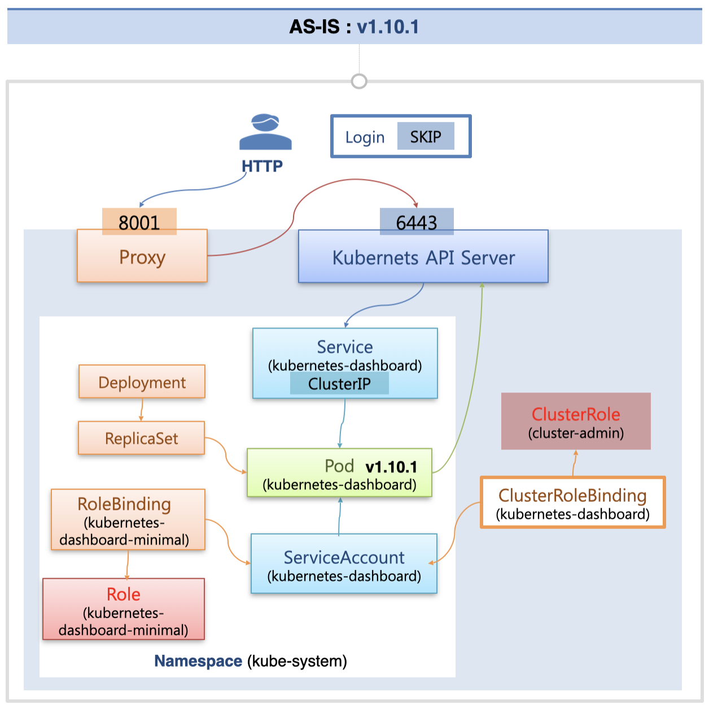
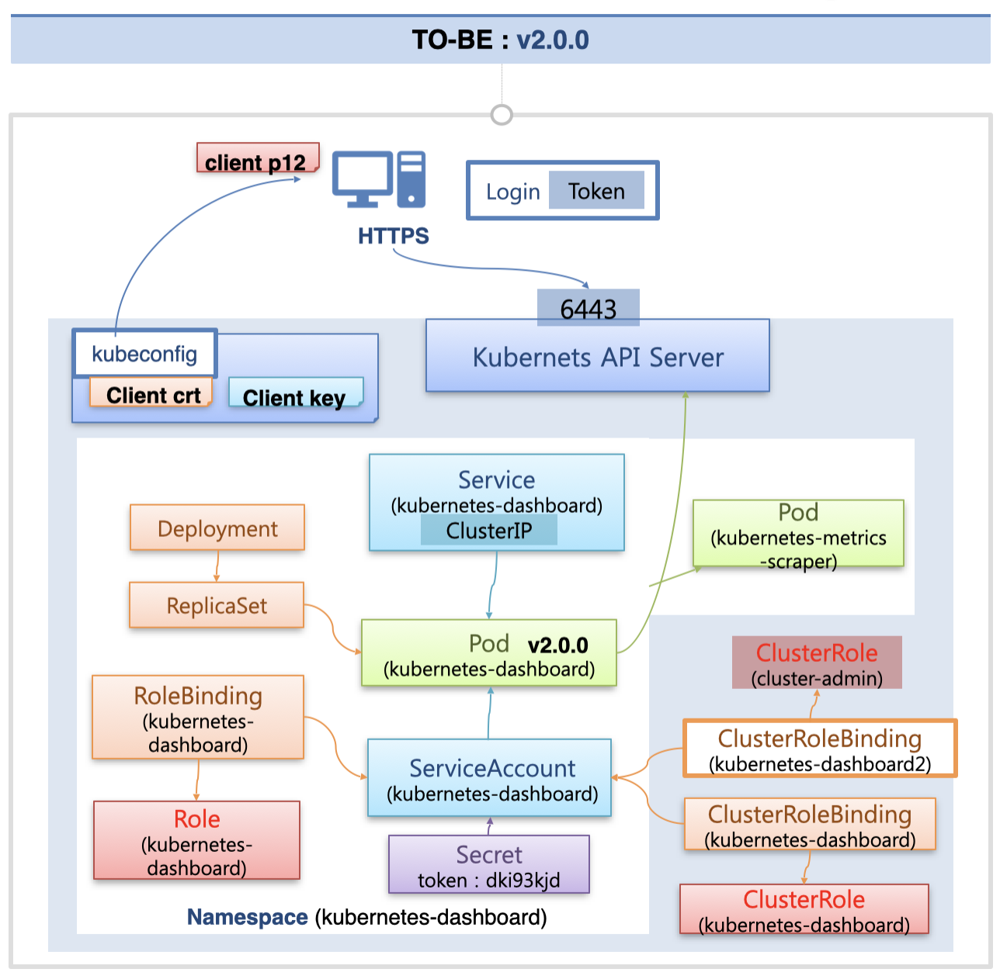

# Kubernetes Dashboard

## v1.10.1 Dashboard, Proxy 사용

지금까지는 v1.10.1 버전의 쿠버네티스 대시보드를 사용했다.

쿠버네티스 대시보드를 설치하면 deployment 객체가 하나 생성되고, 이를 통해 kubernetes-dashboard 라는 이름의 파드가 생성된다.  
이 때 해당 파드에 연결할 서비스 객체도 생성이 되는데, 지금까지는 프록시 서버를 띄워서 쿠버네티스 API Server에 연결해서 서비스 객체에 접속했다.  
이 때문에 프록시 서버의 IP와 Port 번호만 알면 접근이 가능했고, 로그인을 스킵한 상태로 대시보드를 이용할 수 있었기 때문에 보안적으로는 적절하지 않은 상태였다.

해당 대시보드를 통해 클러스터 내의 모든 자원에 접근할 수 있었던 것은, 해당 파드가 클러스터 자원에 대한 권한을 부여 받았기 때문이었다.  
해당 파드는 kubernetes-dashboard라는 이름의 Service Account에 연결되어 있고, 여기에는 기본적으로 kubernetes-dashboard-minimal이라는 이름의 Role이 바인딩 되어 있다.  
해당 Role을 통해 네임스페이스 내의 자원들에 대한 접근 권한을 부여받았다.

또한 클러스터 단의 자원에 대해서도 접근할 수 있도록 하기 위해, 기본 생성되어 있는 cluster-admin ClusterRole을 바인딩하고 있다.  
이를 통해 클러스터 내의 모든 자원에 대한 접근이 가능했다.

## v2.0, 인증서 사용

지금부터는 프록시를 사용하지 않고, 인증서를 사용해서 접근하는 식으로 보안적인 부분을 개선할 것이다.

### 인증된 접근 방법

먼저 kubeconfig에 담겨 있는 Client crt/key를 가져와서 하나의 파일로 만들고, 이를 이용하여 인증서를 등록할 것이다.  
인증서를 등록하면 쿠버네티스 API Server에 https로 접근이 가능해지고, 쿠버네티스 대시보드에도 접근이 가능해진다.  
또한 대시보드를 사용하기 위해서는 추가적으로 로그인이 필요한데, Service Account의 Secret에 저장된 토큰 값을 이용해서 로그인해야 한다.  
이 구성에서는 인증서가 등록이 되어야 대시보드에 접근이 가능하고, 토큰으로 로그인까지 해야 사용이 가능하기 때문에 보안적으로 안전하다.

### dashboard v2.0.0

이번에는 2.0.0 버전의 쿠버네티스 대시보드를 설치해서, 이전과 동일하게 파드를 생성하고, Role을 바인딩한다.

이 때 새로운 버전에서는 kubermetes-metrics-scraper 파드가 추가로 생성되는데, 노드나 파드의 상태 정보를 그래프 등으로 표시해주는 파드이다.  
해당 작업을 위해 노드, 파드에 대한 권한을 받아야 하기 때문에, 이를 위한 ClusterRole(kubernetes-dashboard)이 생성되어 바인딩된다.

여기에 추가적으로 cluster-admin ClusterRole도 바인딩하면 대시보드를 통해 모든 자원에 대한 제어를 할 수 있다.

