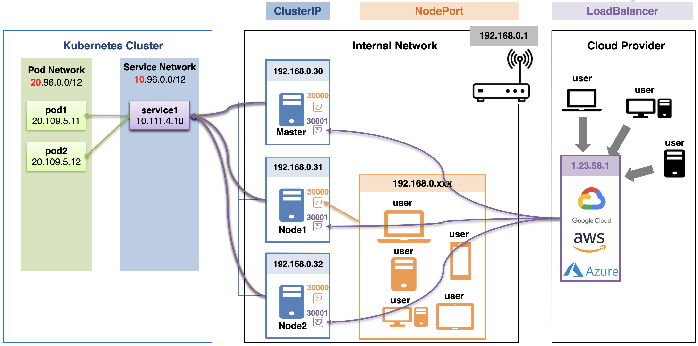
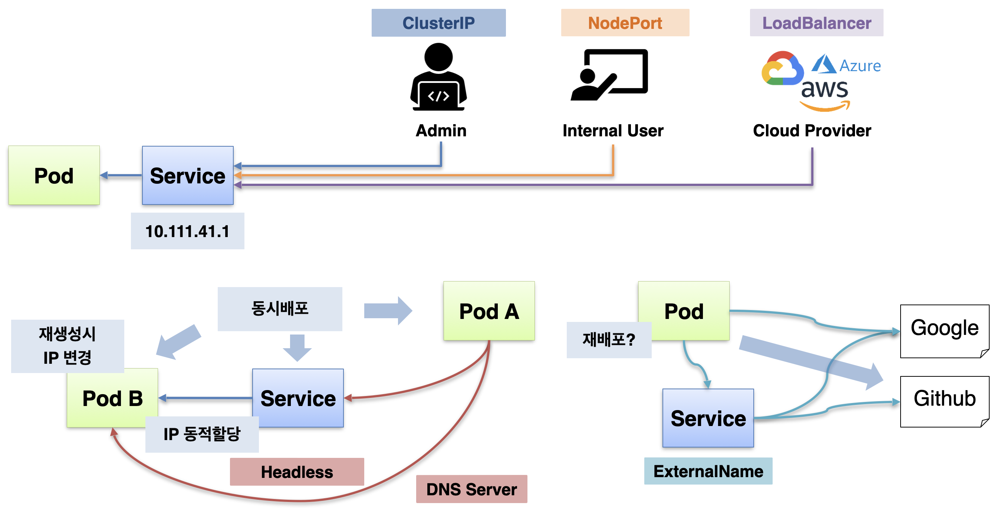
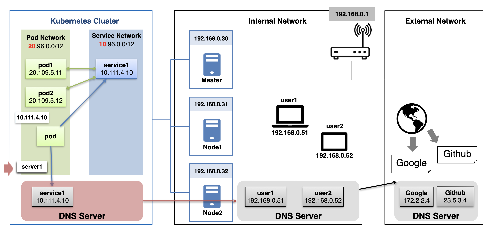
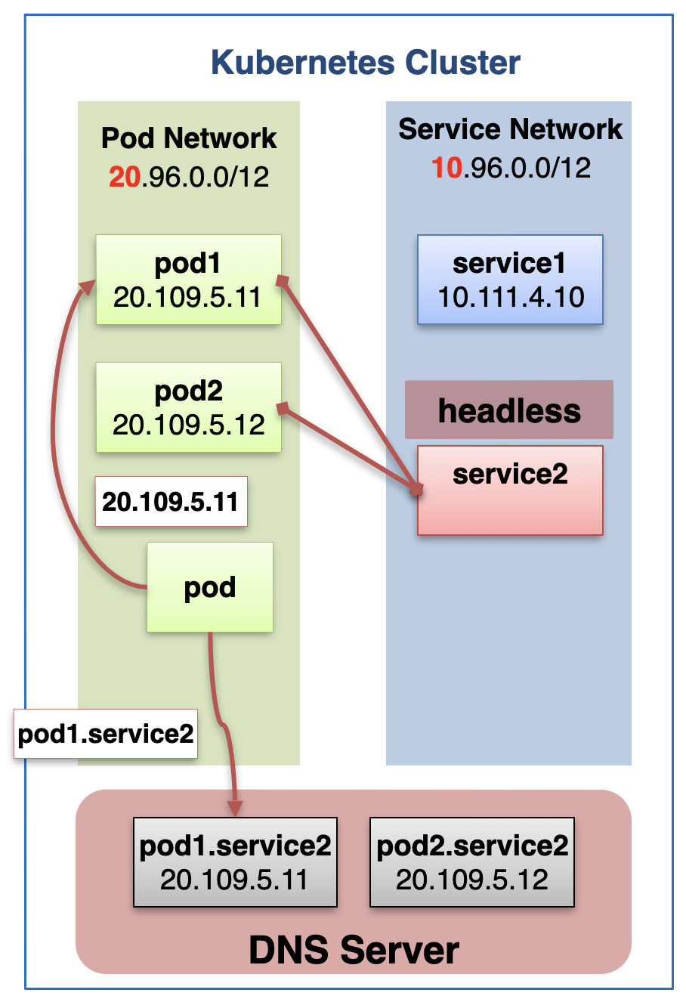
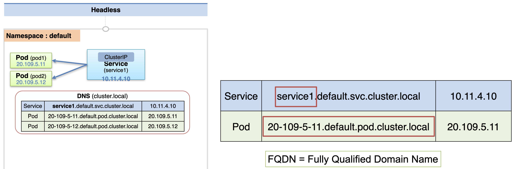
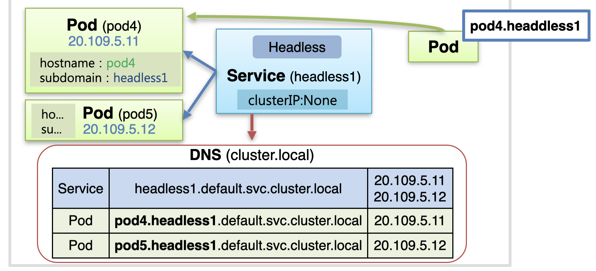
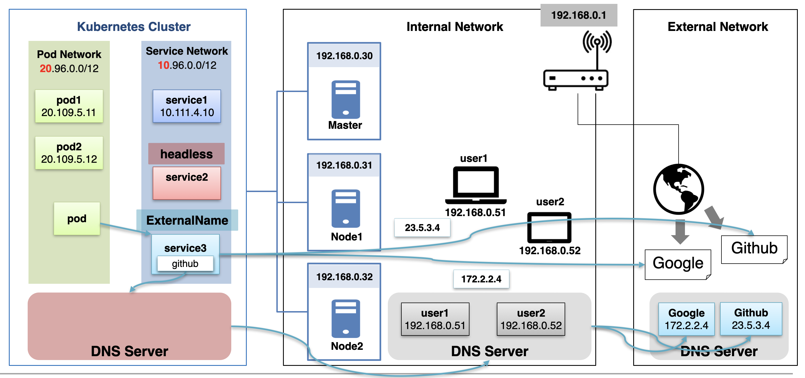
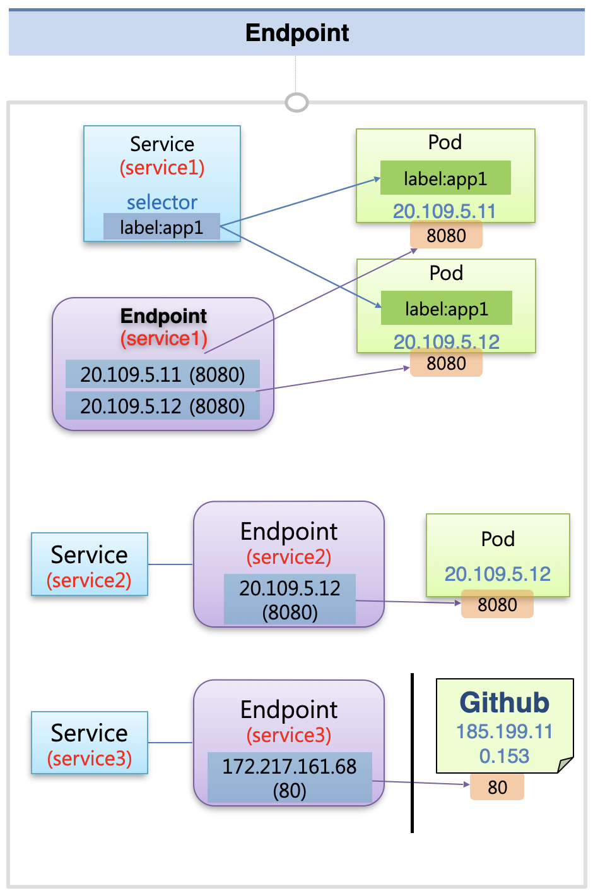
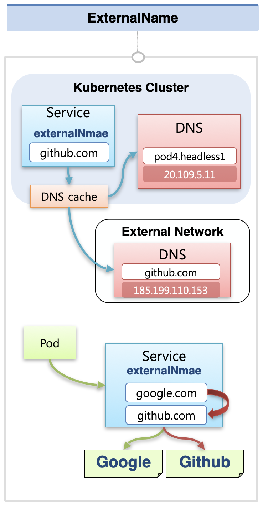

# Service - Headless, Endpoint, ExternalName

## Service 개요(초급편까지의 내용)

192.168번대의 IP로 내부망이 설정되어 있다고 가정하자.  
그 안에 총 세 대의 서버가 존재하고, 각각이 쿠버네티스 노드로 작동해서 클러스터를 이루고 있는 상황이다. (한 대는 마스터 노드)  
이 때 쿠버네티스 클러스터는 Pod를 위한 IP대역(10.\*)과 서비스를 위한 IP대역(20.\*)이 구분되어 존재한다.  
이러한 환경에서는 파드가 생성되면 10.\* 형태의 IP를 받게 되고, 서비스가 생성되면 20.\* 형태의 IP를 받게 된다.  
이 상황에서 파드를 2개 생성하고, 이를 서비스에 연결한 상태라고 하자.

### ClusterIP

만약 ClusterIP 타입으로 서비스를 생성했다면, 쿠버네티스를 구성하고 있는 서버에서만 해당 서비스에 접근하는 것이 가능하다.  
따라서 서버에 직접 접근할 수 있는 내부 관리자만 해당 서비스가 할당 받은 IP를 통해 서비스에 접근할 수 있다.

### NodePort

내부망 IP(192.168.\*)를 할당받은 기기가 서비스에 접근할 수 있게 하기 위해서는 서비스를 NodePort 타입으로 생성해야 한다.  
서비스를 NodePort 타입으로 생성하면 모든 노드들에서 30000번대의 포트 번호 중 하나를 서비스가 할당받게 된다.  
세 대의 서버 중 하나의 IP와 할당받은 NodePort를 이용하면 내부망에서 서비스에 접근하는 것이 가능하다.

### LoadBalancer

Cloud Provider 등을 이용해서 외부에 서비스를 노출 시키는 상황이라면, LoadBalancer 타입으로 서비스를 구성해야 한다.  
LoadBalancer 타입으로 서비스를 생성하면 모든 노드들에서의 포트 번호가 할당되고, 이 NodePort에 LoadBalancer가 연결되어 외부의 사용자가 LoadBalancer의 외부 노출 IP를 통해 서비스에 접근할 수 있게 된다.

## 중급편 개요

중급편에서 **한 파드에서 다른 파드/서비스와 통신하는 방법**과, **파드에서 외부 서비스와 통신하는 방법**을 다룰 것이다.

### 다른 파드/서비스와 통신하는 방법

쿠버네티스를 이용하여 배포를 진행하는 경우에는 동시에 서비스들이 배포되는 경우가 많다.

이 때 한 파드에서 다른 파드에 요청을 보내서 정보를 가져와야 한다고 하자.  
배포가 완료되기 전에는 파드에 IP가 할당되지 않으므로 미리 주소를 지정할 수 없다.  
또한 파드의 IP를 미리 알더라도 파드를 중간에 재생성할 경우 IP가 동적으로 변하기 때문에 지속적으로 사용하는 것이 불가능하다.

이 때 **Headless** 서비스를 이용하면 동시 배포된 파드에 접근하는 것이 가능하다.

### 외부 서비스에 연결하는 방법

파드에서 외부의 서비스에 요청을 보내고 있다고 하자.  
이 때 요청을 보내는 주소를 변경해야 할 때, **ExternalName** 서비스를 사용하면 재배포하지 않고도 요청 주소를 변경할 수 있다.

## DNS Server의 기본 원리

쿠버네티스 클러스터 내에는 DNS Server가 존재한다.  
DNS Server에는 각 서비스 객체의 이름과 IP가 매칭되어 저장되어 있고, 서비스의 이름으로 질의를 하면 해당 서비스의 IP를 얻을 수 있다.  

이 때 각 파드들은 쿠버네티스 클러스터 외부에 있는 domain name에 대해서도 질의를 할 수 있다.  
예를 들어 내부망(192.168.\*)에 존재하는 서버의 도메인 이름으로 질의를 하게 되면, DNS Server의 위계 구조에 따라 클러스터 내의 DNS Server에 먼저 질의하게 된다.  
클러스터 내의 DNS에서 찾을 수 없음을 확인한 후, 상위에 있는 내부망의 DNS Server에 최종적으로 질의해서 IP 정보를 얻어 오게 된다.  
같은 원리로 외부 DNS Server에 등록된 서비스 이름으로 질의하는 것도 가능한데, 이 경우 `클러스터 내 DNS -> 내부망 DNS -> 외부 DNS` 순서로 확인해서 최종적으로 IP를 얻어온다.

## headless 서비스

이 때 headless 서비스를 이용하면, 클러스터 내의 DNS 서버를 통해 파드의 IP를 질의하는 것이 가능하다.  
headless 서비스에 파드를 연결하면, `pod이름.service이름` 형식으로 파드의 IP를 질의할 수 있다.

### 일반 서비스를 사용한 경우의 domain name (FQDN)

일반적인 상황에서 ClusterIP 타입의 서비스를 만들고, 파드를 여기에 연결했다고 하자.  
이 때 서비스와 파드들은 각각의 이름이 존재하고, 각자 IP를 할당받는다.

클러스터 내부의 DNS Server(cluster.local)에는 이러한 각각의 IP의 매핑을 저장한다.
이 때 FQDN(Fully Qualified Domain Name) 형태로 도메인 이름을 저장하는데, 서비스의 경우 `[Service이름].[Namespace].svc.[DNS이름]` 형태로 저장되고, 파드의 경우 `[PodIP].[Namespace].pod.[DNS이름]` 형태로 저장된다.  
서비스의 경우 서비스 이름만으로 질의를 할 수 있기 때문에, 서비스의 이름을 파드에서 사용하면 간편하게 서비스의 데이터를 받아올 수 있다.
이와 달리 파드의 경우 전체 이름으로 질의를 해야 하는데, 파드 IP가 포함된 형태이다 보니 활용하기가 어렵다.

### headless 서비스를 사용한 경우의 domain name

headless 서비스를 만들기 위해서는 서비스를 생성할 때 clusterIP에 None을 넣어주면 된다.  
그리고 파드를 생성할 때 hostname에 원하는 이름, subdomain에 headless 서비스의 이름을 지정하면 서비스에 파드를 연결할 수 있다.  
이 때 DNS Server에는 `[Pod hostname].[Service 이름].[Namespace].svc.[DNS 이름]` 형태로 domain name이 저장된다.  
해당 domain name으로 질의를 하여 IP를 받아오면 파드에 직접 연결하는 것이 가능하다.  
이 때 `[Pod hostname].[Service 이름]` 형태로 질의하는 것도 가능하기 때문에, 간편하게 사용할 수 있다.
(headless 서비스의 domain name으로 질의하면, 등록되어 있는 파드들의 IP 주소 목록이 반환된다.)

## externerName

또한 ExternerName 타입의 서비스를 만들고 그 안에 외부 서비스 주소를 넣으면, 파드는 해당 서비스를 통해 외부 서비스에 요청을 보낼 수 있다.  
이 때 외부 서비스의 주소를 변경해야 한다면 간단하게 서비스의 주소 값만 변경하는 것으로 대처가 가능하다.

### Endpoint

Endpoint를 먼저 알고 나면 ExternalName을 이해하는게 더 수월하다.  
서비스의 이름과 동일한 이름으로 Endpoint를 만들고, 그 안에 연결할 파드의 IP 정보를 삽입하면 서비스에 파드가 연결된다.  
지금까지 파드를 서비스에 연결할 때 label을 통해서 연결해왔는데, 내부적으로는 Endpoint라는 객체를 만들어서 연결하게 된다.
직접 Endpoint 객체를 만들어도 동일한 식으로 연결할 수 있고, 외부 서비스의 IP를 Endpoint에 저장해서 외부 서비스에 연결하는 것도 가능하다.

### externalName을 사용하는 이유

위에서 설명한 것처럼 Endpoint를 통해서 외부 서비스에 연결하는 것도 가능하다.  
다만 서비스의 IP는 언제든 변경될 수 있기 때문에, Domain Name으로 외부 서비스에 대한 연결을 관리할 필요가 있다.

서비스의 externalName 속성에 외부 서비스의 domain name을 지정하면, DNS cache를 통해 DNS Server에 질의를 해서 IP를 받아온다.  
파드에서는 해당 서비스에 요청을 보내면 외부 서비스에 요청을 보낼 수 있고, 요청을 보내는 주소를 변경하고자 할 때에도 서비스의 externalName 속성 값만 변경하면 된다.

