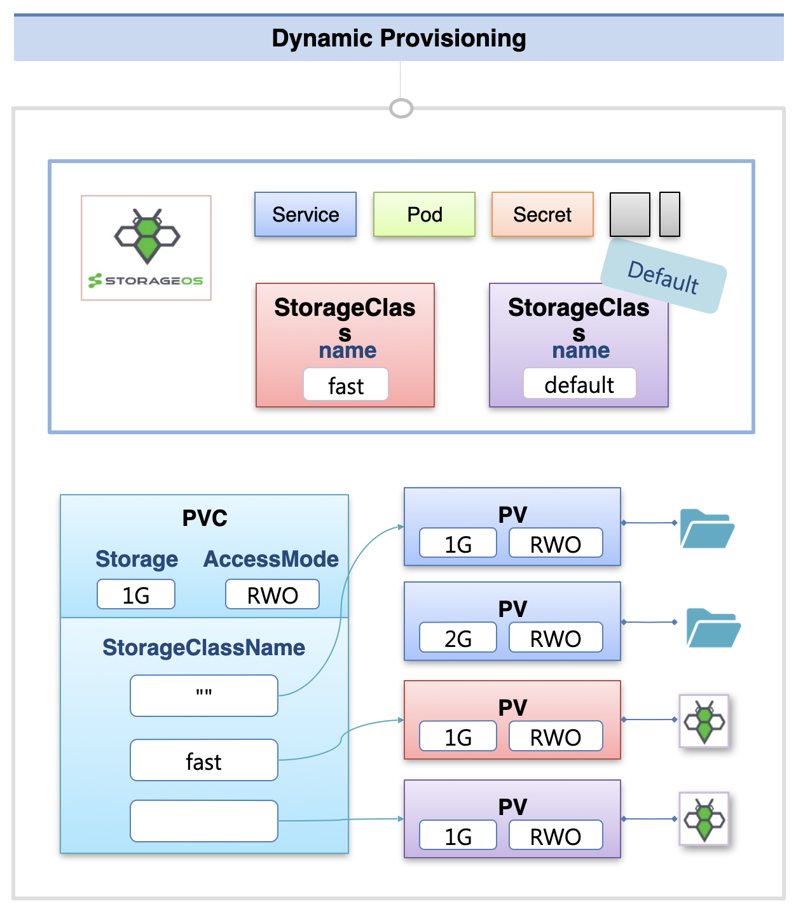

# Volume - Dynamic Provisioning, StorageClass, Status, ReclaimPolicy

## 클러스터 외부에 존재하는 Volume

Volume은 쿠버네티스 클러스터에서 재배포 등이 발생하더라도 데이터를 안정적으로 유지하기 위해 사용한다.  
이를 위해 클러스터에서 분리된 환경에서 Volume을 관리하는데, 내부망에 저장하는 방법과 외부망에 저장하는 방법이 있다.

내부망을 사용하는 경우 hostPath나 local 볼륨을 사용하면 쿠버네티스 클러스터를 구성하는 노드의 물리적 공간을 할당 받아서 사용하게 된다.  

또한 On-Premise 솔루션을 이용해서 할당받는 방법도 있는데, storage-os, ceph, GlusterFS 등을 사용할 수 있다.  
이 솔루션들을 사용하면 알아서 노드 자원을 이용해서 볼륨을 관리해준다.  

이 밖에도 NFS를 이용해서 내부망의 다른 서버를 볼륨 자원으로 사용하는 것도 가능하다.  

외부망을 사용하는 경우 AWS, Azure와 같은 클라우드 서비스의 스토리지를 클러스터에 연결해서 사용할 수 있다.

## 클러스터에서 외부의 Volume에 연결하는 방법

클러스터 내에서 외부의 Volume을 사용하기 위해서는 해당 볼륨을 연결한 PV를 만들어야 한다.  
PV에는 Storage 크기와 AccessMode를 지정해서 연결하게 되고, 실제 Pod 단에서 사용할 때에는 PVC를 따로 생성해서 연결하게 된다.  
PVC에 사용할 Storage 크기와 AccessMode를 지정하면, 존재하는 PV 중 선택하여 적절한 PV가 할당된다.

이 때 문제가 되는 점은 파드를 볼륨에 연결하기에 앞서 번거로운 작업들을 해야한다는 점이다.  
각각의 볼륨마다 지원하는 AccessMode나 Storage가 다르기 떄문에 PV에는 연결하는 볼륨에 맞춰서 이를 잘 작성해줘야 하고, 사용하는 Pod 쪽에서도 PVC에 적절하게 맞춰서 적어야 원하는 볼륨에 연결할 수 있다.

이러한 번거로움을 덜기 위해 쿠버네티스에는 **Dynamic Provisioning**이라는 기술이 존재한다.  
이를 사용하면 사용자가 원하는 PVC를 만들 경우, 적절한 PV를 생성해서 실제 볼륨에 연결하는 작업까지 자동으로 수행한다.

또한 PV에는 PVC와 정상 연결되었는지에 대한 Status 정보가 저장되고, PVC와 연결이 끊어졌을 때의 Policy 등을 지정하는 것이 가능하다.  
이를 통해 PV를 보다 세밀하게 관리할 수 있다.

## Dynamic Provisioning

Dynamic Provisioning 을 사용하기 위해서는 먼저 이를 지원하는 On-Premise 솔루션을 설치해야 한다.  
솔루션을 설치하면 Service, Pod 등의 다른 오브젝트들과 함께 StorageClass 객체가 생성되는데, 이 StorageClass 객체를 이용해서 동적으로 PV를 생성할 수 있다.

PVC를 생성할 때 storageClassName을 지정하게 되는데, 이전 강의에서는 빈 문자열을 넣어서 StorageClass를 지정하지 않은 PV 중 조건에 맞는 PV가 선택되게 했다.  
storageClassName에 On-Premise 솔루션 설치시 생성된 StorageClass의 이름을 지정하면, 해당 솔루션의 Volume을 연결한 PV가 생성된다.  
StorageClass는 추가로 생성하는 것도 가능하고, 만약 해당 객체를 default로 설정해두면 pvc에 storageClassName을 생략한 경우에 모두 해당 StorageClass에 연결된다.  
- storageClassName에 빈 문자열("") -> StorageClass 지정하지 않은 PV에서 찾음  
- storageClassName 생략 -> default로 지정한 StorageClass에 연결

## PV의 Status, ReclaimPolicy

### PV의 여러 Status

PV를 새롭게 생성하면 Status 값이 Available이 된다.  
이 떄 PVC를 연동하면 Bound 상태가 되고, 파드가 PVC를 사용해서 구동되기 시작하면 Volume이 실제로 생성된다.  
이 상황에서 연결된 파드가 삭제되더라도, PVC와 PV는 그대로 유지되기 때문에 그대로 Bound 상태가 유지된다.  

만약 PVC를 삭제하여 PVC와 PV 간 연결이 끊어지면 PV의 상태가 Released로 변하게 된다.  
또한 PV와 PVC 간 연결에 예기치 못한 문제가 생기면 Failed 상태로 변한다.

### PV의 ReclaimPolicy

PVC를 삭제하여 PV와의 연결이 끊어진 경우, ReclaimPolicy에 지정한 내용에 따라서 PV가 다른 식으로 변경된다.

Retain은 기본으로 지정되는 ReclaimPolicy로, PVC 삭제 시 PV의 상태가 Released가 된다.  
Released 상태가 되면 그 안의 데이터는 그대로 유지되지만, 해당 PV를 다른 PVC에서 재사용 하는 것은 불가능한 상태가 된다.

Delete는 StorageClass를 이용해서 PV를 생성한 경우에 기본으로 지정되는 ReclaimPolicy로, PVC 삭제 시 연결된 PV가 함께 삭제된다.  
볼륨의 종류에 따라서 실제 데이터가 삭제될 수도 있다.

Recycle이라는 ReclaimPolicy도 있지만 현재는 Deprecated 되었다.  
Recycle로 지정한 경우 연결된 데이터는 삭제되고, PV를 재활용할 수 있다.

