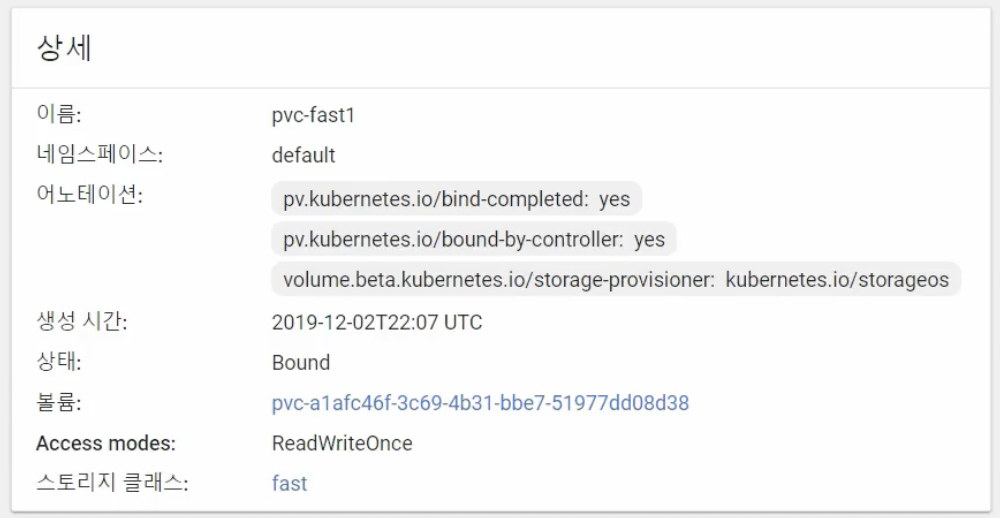
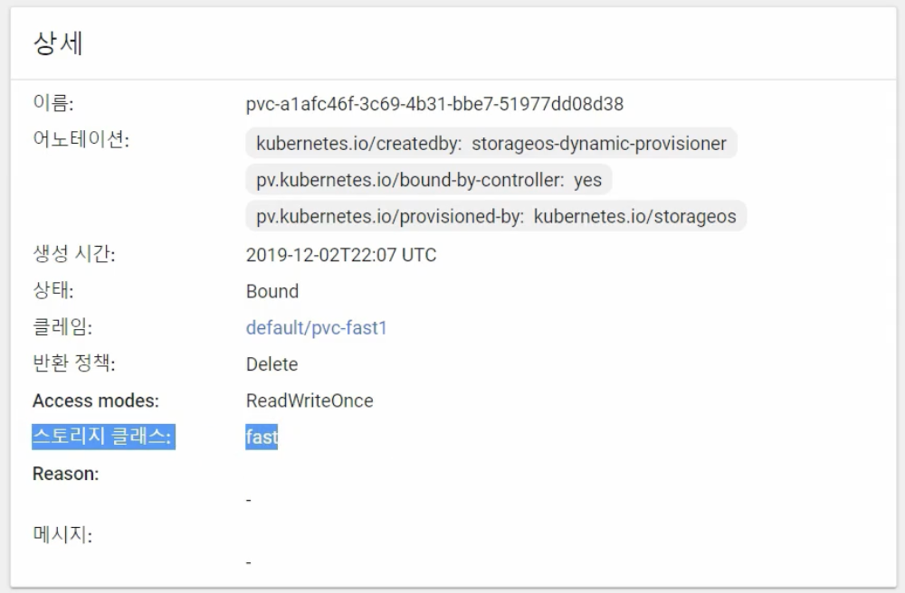
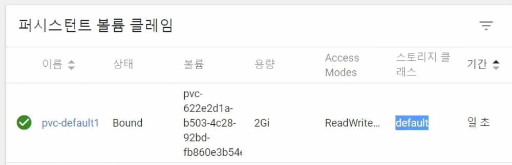
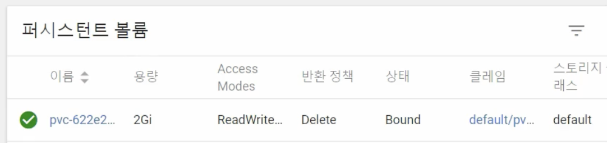
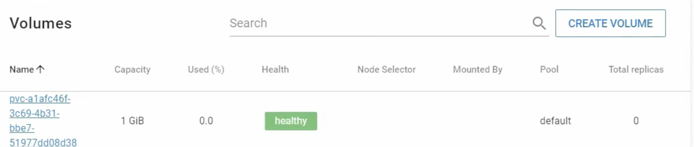
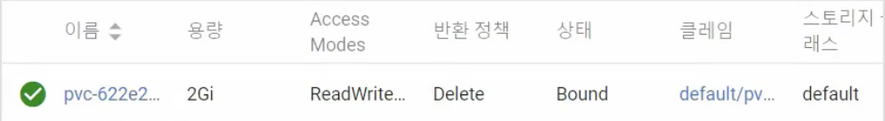

# Volume - Dynamic Provisioning, StorageClass, Status, ReclaimPolicy 실습

## Longhorn 설치하기

먼저 Dynamic Provisioning을 실습해보기 위해, On-Premise 솔루션 중 하나인 Longhorn을 설치한다.  
먼저 모든 마스터/워커 노드에 iscsi를 설치하고, Longhorn을 설치한다.

```bash
$ yum install -y iscsi-initiator-utils
$ kubectl apply -f https://raw.githubusercontent.com/kubetm/kubetm.github.io/master/yamls/longhorn/longhorn-1.3.3.yaml
```

설치가 완료되면 longhorn-system 이라는 namespace에 Pod, Service, Deployment, ReplicaSet이 생성된다.
(아래는 storageos를 설치했을 때의 예시)

```bash
$ kubectl get pods -n longhorn-system

NAME                                              READY     STATUS    RESTARTS    AGE
pod/storageos-cluster-operator-76f59454b6-4jswx   1/1       Running   0           14s

NAME                                   TYPE         CLUSTER-IP       EXTERNAL-IP    PORT(S)    AGE
service/storageos-scheduler-webhook    ClusterIP    10.104.151.84    <none>         443/TCP    12s

NAME                                         READY    UP-TO-DATE    AVAILABLE    AGE
deployment.apps/storageos-cluster-operator   1/1      1             1            14s

NAME                                                     DESIRED    CURRENT    READY    AGE
replicaset.apps/storageos-cluster-operator-76f59454b6    1          1          1        14s
```

이제 다음의 커맨드를 통해서 longhorn을 사용하기 위한 Fast StorageClass를 추가한다.

```yaml
kubectl apply -f - <<END
apiVersion: storage.k8s.io/v1
kind: StorageClass
metadata:
  name: fast
provisioner: driver.longhorn.io
parameters:
  dataLocality: disabled
  fromBackup: ""
  fsType: ext4
  numberOfReplicas: "3"
  staleReplicaTimeout: "30"
END
```

이 외에도 직접 StorageClass를 생성한다면 다음의 구성 파일을 사용할 수 있다.

만약 직접 StorageClass를 생성한다면 다음의 구성파일을 사용할 수 있다.

```yaml
apiVersion: storage.k8s.io/v1
kind: StorageClass
metadata:
  name: default
  annotations:
    # Default StorageClass로 선택
    storageclass.kubernetes.io/is-default-class: "true"
# 동적으로 PV생성시 PersistentVolumeReclaimPolicy 선택 (Default:Delete)
reclaimPolicy: Retain, Delete, Recycle
provisioner: driver.longhorn.io
# provisioner 종류에 따라 parameters의 하위 내용 다름
parameters:
```

이제 Dynamic Provisioning을 사용하기 위한 longhorn 설치가 끝났다.  
다음의 커맨드로 StorageClass를 조회하면 default storage class와 fast storage class가 생성된 것을 확인할 수 있다.

```bash
$ kubectl get storageclasses.storage.k8s.io
NAME                 PROVISIONER             RECLAIMPOLICY   VOLUMEBINDINGMODE      ALLOWVOLUMEEXPANSION   AGE
fast                 driver.longhorn.io      Delete          Immediate              false                  16s
longhorn (default)   driver.longhorn.io      Delete          Immediate              true                   85m
```

이제 longhorn 대쉬보드에 편하게 접속하기 위해서 longhorn-frontend 서비스의 타입을 변경한다.

```bash
kubectl edit svc -n longhorn-system longhorn-frontend

  ports:
  - name: http
    port: 80
    protocol: TCP
    targetPort: http
    nodePort: 30705  # port 번호 추가
  type: NodePort     # type 변경
```

이제 각 Node의 IP의 30705번 포트로 longhorn 대시보드에 접속할 수 있다.  
`http://192.168.56.30:30705`

## Dynamic Provisioning

### storageClassName: "" (hostPath 볼륨)

먼저 기본적인 PV - PVC 연결을 테스트한다.  
다음의 구성파일로 hostPath PV를 생성한다.

```yaml
apiVersion: v1
kind: PersistentVolume
metadata:
  name: pv-hostpath1
spec:
  capacity:
    storage: 1G
  accessModes:
    - ReadWriteOnce
  hostPath:
    path: /mnt/hostpath
    type: DirectoryOrCreate
```

이제 다음과 같이 `storageClassName: ""` 으로 지정한 PVC를 생성하면, storage와 accessMode를 기준으로 선택하여 방금 생성한 PV에 연결된다.

```yaml
apiVersion: v1
kind: PersistentVolumeClaim
metadata:
  name: pvc-hostpath1
spec:
  accessModes:
    - ReadWriteOnce
  resources:
    requests:
      storage: 1G
  storageClassName: ""
```

### storageClassName: "fast"

이제 동적으로 PV를 생성해볼 차례이다.
다음의 구성파일로 `storageClassName: "fast"` 로 지정한 PVC를 생성한다.

```yaml
apiVersion: v1
kind: PersistentVolumeClaim
metadata:
  name: pvc-fast1
spec:
  accessModes:
    - ReadWriteOnce
  resources:
    requests:
      storage: 1G
  storageClassName: "fast"
```

이렇게 PVC를 생성하면 바로 PV가 생성이 되고, 연결이 된 것을 확인할 수 있다.




### storageClassName 이 없는 경우 (default)

이번에는 storageClassName을 지정하지 않고 PVC를 생성한다.

```yaml
apiVersion: v1
kind: PersistentVolumeClaim
metadata:
  name: pvc-default1
spec:
  accessModes:
    - ReadWriteOnce
  resources:
    requests:
      storage: 2G
```

이번에는 `storageClasName: default`로 자동으로 지정되어 PVC가 생성되고, 이에 맞게 PV가 함께 생성되어 연결된 것을 확인할 수 있다.




Longhorm 대시보드에서 확인해보면 볼륨이 생성된 현황을 확인할 수 있다.



### `직접 PV 생성` vs `Dynamic Provisioning` 차이점

직접 PV를 생성하고 PVC를 연결하면, 바로 볼륨이 만들어지지는 않는다.  
위에서도 /mnt/hostpath 경로에 대한 PV를 생성하고 PVC에 연결을 하긴 했으나, 실제로 노드에 들어가서 /mnt 경로를 확인해보면 hostpath 폴더가 존재하지 않는 것으로 확인된다.  
이 경우에는 파드가 실행되고 PVC가 연결될 때 비로소 PV가 생성된다.

이와 달리, Dynamic Provisioning으로 PV를 생성했을 경우에는 그 즉시 볼륨이 함께 생성이 된다는 차이점이 있다.

## Volume의 Status, ReclaimPolicy

### Status - Available, Bound

PV가 생성된 채로 PVC에 연결되지 않으면 PV는 Available 상태가 된다.  


이 상태에서 PVC에 연결이 완료되면 Bound 상태로 변경된다.


그리고 Pod가 생성이 될 때 비로소 Volume이 생성된다.  
다음의 구성파일로 아까 hostPath로 생성했던 pvc-hostpath1 PVC를 연결한 파드를 생성한다.

```yaml
apiVersion: v1
kind: Pod
metadata:
  name: pod-hostpath1
spec:
  nodeSelector:
    kubernetes.io/hostname: k8s-node1
  terminationGracePeriodSeconds: 0
  containers:
    - name: container
      image: kubetm/init
      volumeMounts:
        - name: hostpath
          mountPath: /mount1
  volumes:
    - name: hostpath
      persistentVolumeClaim:
        claimName: pvc-hostpath1
```

해당 파드는 k8s-node1 노드에 만들어졌기 때문에, Volume도 해당 노드에 만들어진다.

### ReclaimPolicy: Retain, Status: Released

hostPath로 생성한 PV의 경우, ReclaimPolicy에 아무 값도 지정하지 않았기 때문에 기본 정책인 Retain으로 생성이 되었다.  
따라서 연결된 PVC를 삭제하면 PV의 상태값이 Released가 된다.


따라서 이 경우 데이터를 삭제하기 위해서는 직접 PV를 삭제하고, Volume도 직접 삭제해줘야 한다.  
(hostPath에 지정한 경로의 데이터를 직접 삭제해야 함)

### ReclaimPolicy: Delete

Dynamic Provisioning으로 생성된 PV의 경우 ReclaimPolicy가 기본적으로 Delete로 지정된다.



이 경우 연결된 PVC를 삭제하면 PV가 바로 함께 삭제되어 버린다.
실제로 Longhorn 대시보드에서 확인해봐도 볼륨이 삭제된 것을 확인할 수 있다.

> pvc, pv 등이 정상적으로 삭제가 안 되는 경우 다음의 커맨드로 force delete 해야 한다.

```bash
$ kubectl delete persistentvolumeclaims pvc-fast1 --namespace=default --grace-period 0 --force
$ kubectl delete persistentvolume pvc-b53fd802-3919-4fb0-8c1f-02221a3e4bc0 --grace-period 0 --force
```

### ReclaimPolicy: Recycle

이번엔 다음의 구성파일로 ReclaimPolicy 가 Recycle 인 PV를 하나 생성한다.

> ReclaimPolicy 가 Recycle인 경우, /tmp 하위 경로에만 볼륨을 생성할 수 있다.

```yaml
apiVersion: v1
kind: PersistentVolume
metadata:
  name: pv-recycle1
spec:
  persistentVolumeReclaimPolicy: Recycle
  capacity:
    storage: 3G
  accessModes:
    - ReadWriteOnce
  hostPath:
    path: /tmp/recycle
    type: DirectoryOrCreate
```

이제 해당 PV를 연결한 PVC를 생성하고, 이를 이용해서 Pod를 생성한다.

```yaml
apiVersion: v1
kind: PersistentVolumeClaim
metadata:
  name: pvc-recycle1
spec:
  accessModes:
    - ReadWriteOnce
  resources:
    requests:
      storage: 3G
  storageClassName: ""
```

```yaml
apiVersion: v1
kind: Pod
metadata:
  name: pod-recycle1
spec:
  nodeSelector:
    kubernetes.io/hostname: k8s-node1
  terminationGracePeriodSeconds: 0
  containers:
    - name: container
      image: kubetm/init
      volumeMounts:
        - name: hostpath
          mountPath: /mount1
  volumes:
    - name: hostpath
      persistentVolumeClaim:
        claimName: pvc-recycle1
```

파드의 /mount1 경로에 볼륨이 마운트되었다.  
파드에서 해당 경로에 파일을 추가한 후 파드와 PVC를 삭제해보면, PV는 순간적으로 Released 상태가 되었다가 다시 Avaliable 상태로 돌아온다.  
그리고 노드에서 연결된 path(/tmp/recycle)에서 확인해보면 추가했던 파일이 삭제된 것을 확인할 수 있다.
