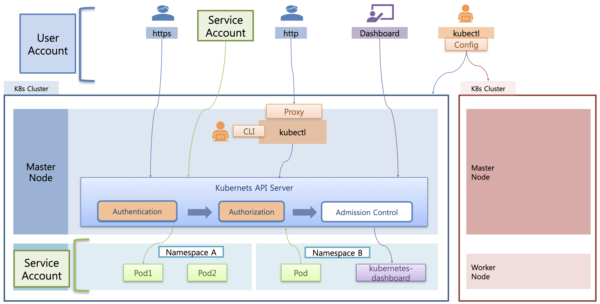

# Accessing API - Overview

마스터 노드에는 쿠버네티스의 API Server가 존재하고, 이 API 서버를 통해서만 자원을 만들거나 조회하는 것이 가능하다.  
kubectl CLI를 이용해서 자원을 다루는 것도 모두 내부적으로는 이 API 서버를 사용한다.

## Authentication

쿠버네티스 API에 접근하는 정책을 Authentication으로 다룬다.

외부에서 쿠버네티스 API 서버에 접근하기 위해서는 원래 ssl 인증이 적용된 https 형태로 접근해야 한다.  
하지만 만약 내부 관리자가 kubectl을 통해 프록시를 열어두었다면 외부 사용자도 http로 접근하는 것이 가능하다.  
또한 외부의 사용자가 kubectl을 설치하고 Config 기능을 이용해서 클러스터에 연결을 맺어서 클러스터의 리소스에 접근하는 것이 가능하다.  
이렇게 외부의 사용자가 쿠버네티스 API에 접근하는 방법을 정의한 것을 **User Account** 라고 한다.

이 외에도 파드에서 쿠버네티스 API에 접근하는 경우도 관리가 필요하다.   
만약 파드에서 쿠버네티스 API에 제한 없이 접근하는게 가능하다면, 파드에 접근할 수 있는 모든 사용자가 API에 접근하는게 가능해지기 때문에 보안 상 문제가 있다.  
이 문제와 관련하여 쿠버네티스는 파드에서 API에 접근하는 방법을 **Service Account**로 정의해서 관리한다.

## Authorization

또한 API를 호출 가능한 권한이더라도 접근할 수 있는 자원에는 제한이 있을 수 있는데, 이를 정의하는 것이 **Authorization**이다.  
예를 들어 특정 Namespace에 있는 파드를 통해 Service Account로 접근한 유저가 다른 Namespace에 존재하는 자원에는 접근하지 못하도록 막아야 할 수 있는데, 이 때 Authorization을 정의한다.

## Admission Control
또한 **Admission Control**도 존재하는데, 1GB가 넘는 용량을 사용하려고 하면 관리자 단에서 파드 생성 등을 막는 식으로 작동한다.  
(이 강의에서는 Admission Control은 다루지 않는다.)

## Kubernetes Dashboard

또한 위 설명을 다 한 후에는 쿠버네티스 대시 보드를 살펴볼 것이다.  
지금까지는 마스터 노드에 뚫려있는 프록시를 이용하여 로그인 없이 대시보드에 접근했는데, 이는 보안적으로 적절하지 않은 방식이다.  
인증서를 통해 API를 이용하여 쿠버네티스 대시 보드에 접속하는 방법을 알아볼 것이다.

