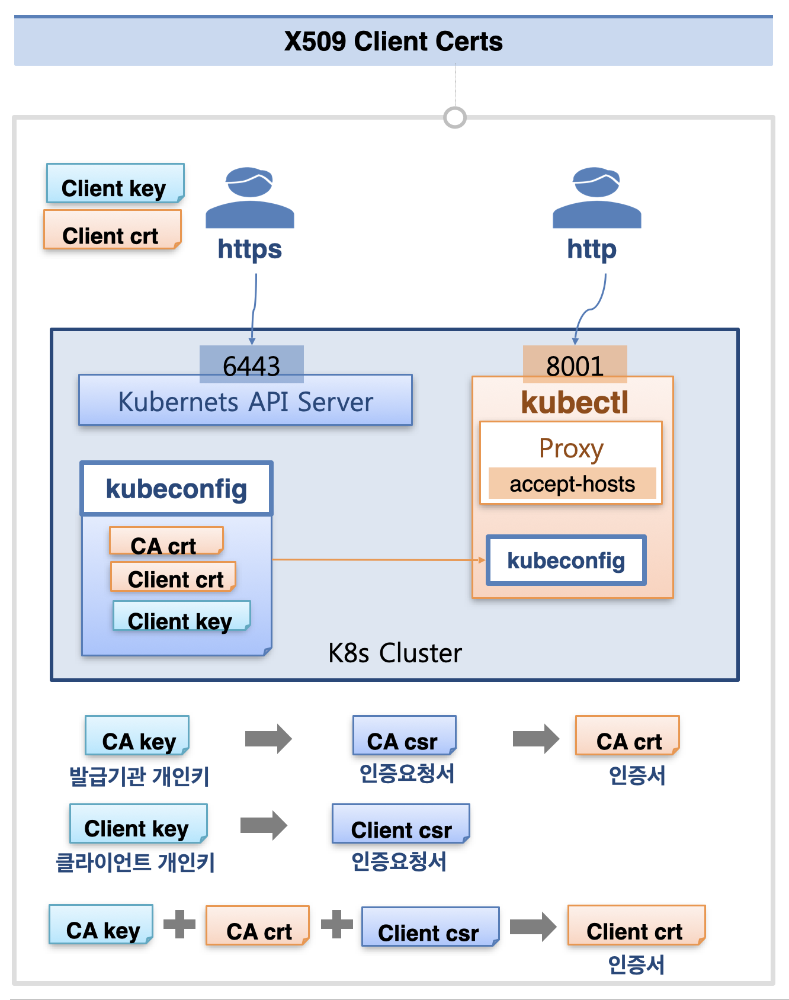
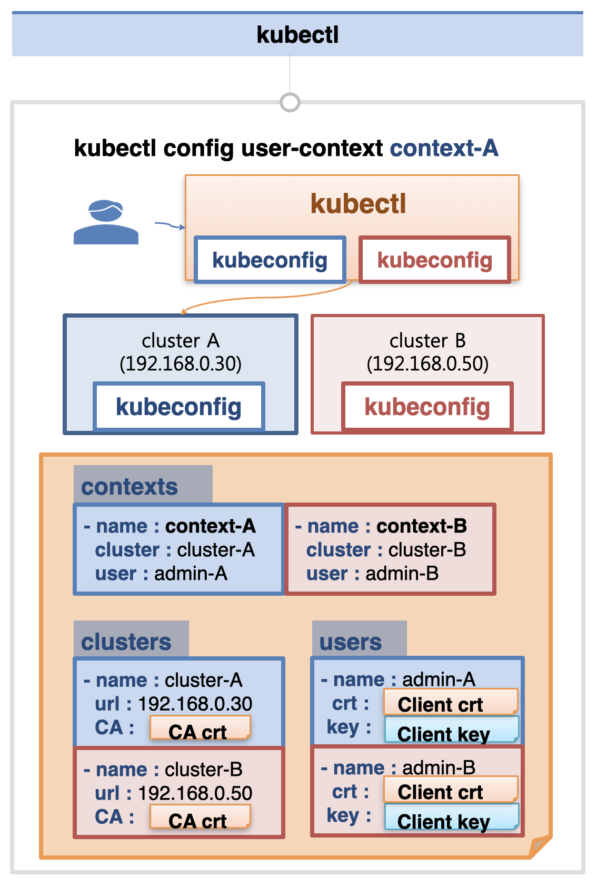
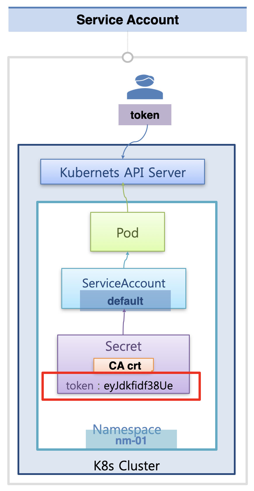

# Authentication

쿠버네티스 API 서버에 접근하는 3가지 방법을 살펴볼 것이다

## Client Certs

먼저 인증서를 이용해서 쿠버네티스 API 서버에 접근할 수 있다.  
쿠버네티스 클러스터가 생성되면 6443 포트로 API Server에 접근할 수 있다.  
사용자가 해당 포트에 https로 접근을 하기 위해서는 인증서를 이용해야 한다.  
이 인증서는 클러스터 생성 시에 함께 만들어지는 kubeconfig에 존재하는데, 이 곳에 존재하는 client key와 client crt(인증서)를 복사해와서 인증된 접근을 할 수 있다.

이 파일들 간 관계를 설명하자면, 먼저 발급기관(CA)의 개인키와 클라이언트 개인키를 생성한다.  
이 각각의 키를 이용해서 CA/Client 인증 요청서(csr)를 만들게 되고, CA의 경우 CA csr을 이용해서 바로 인증서(CA crt)를 만든다.  
최종적으로 클라이언트 인증서(Client crt)를 만들게 되는데, 이 떄에는 CA key, CA crt, Client csr을 모두 사용해서 만든다.

이렇게 생성된 CA crt, Client crt, Client key가 kubeconfig 안에 위치하게 되고, API Server 접근을 위한 클라이언트는 이를 복사해와서 사용한다.

지금까지 kubectl을 이용해서 API Server에 접근할 수 있었던 것은 kubectl 자체에 인증서가 적용되어 있었기 때문이다.  
쿠버네티스가 설치될 때 kubectl이 함께 설치가 되는데, 이 때 kubeconfig에 있는 내용을 복사해와서 설정하도록 되어있다.  
따라서 마스터 노드에 있는 kubectl을 사용하면 자동으로 인증이 적용된 상태로 API 서버에 접근할 수 있다.  
또한 accept-hosts 옵션을 통해서 8001번 포트로 프록시를 열어 두면, 외부에서 http로 해당 포트에 접근할 수 있어서 인증 없이 API Server에 접근이 가능하다.  
지금까지는 해당 프록시를 이용해서 Kubernetes Dashboard를 열고, 리소스를 조회/수정 해왔다.



## kubectl

kubectl을 통해 쿠버네티스 클러스터에 접근하기 위해서는, 해당 클러스터의 kubeconfig 내용이 kubectl에도 존재해야 한다.  
또한 kubectl에서는 여러 개의 클러스터에 접근할 수 있는 설정 방법도 제공하고 있다.

먼저 clusters에는 접근하고자 하는 cluster의 url과 CA 인증서를 입력한다.

```
- name : cluster-A
  url : 192.168.0.30
  CA : <CA crt>
```

다음으로 users에는 해당 클러스터에 접근할 때 사용할 Client crt와 Client key를 입력한다.

```
- name : admin-A
  crt : <Client crt>
  key : <Client key>
```

이제 contexts에는 접속할 cluster name과 user name을 지정하면 된다.

```
- name : context-A
  cluster : cluster-A
  user : admin-A
```

`kubectl config` 명령을 통해 특정 context를 이용하여 해당 클러스터에 접근하는 것이 가능하다.

```bash
$ kubectl config user-context context-A
```

이러한 형식으로 여러개의 clusters / users / contexts를 등록해 두고, 원하는 context로 kubectl config 해서 사용하면 해당 클러스터의 쿠버네티스 자원에 접근할 수 있다.



## Service Account

쿠버네티스 클러스터 내에서 namespace를 만들면, 기본적으로 default라는 이름의 Service Account가 만들어진다.  
이 Service Account에는 Secret이 하나 달려있는데, 이 Secret에는 CA crt와 token 정보가 저장되어 있다.  
이 때 해당 네임스페이스에 파드를 생성하면 파드가 Service Account에 연결되고, 파드에서는 Secret에 저장된 token 값을 이용해서 쿠버네티스 API Server에 접근할 수 있게 된다.  
이 토큰 값을 이용하면 외부의 사용자도 API Server에 접근할 수 있다.


