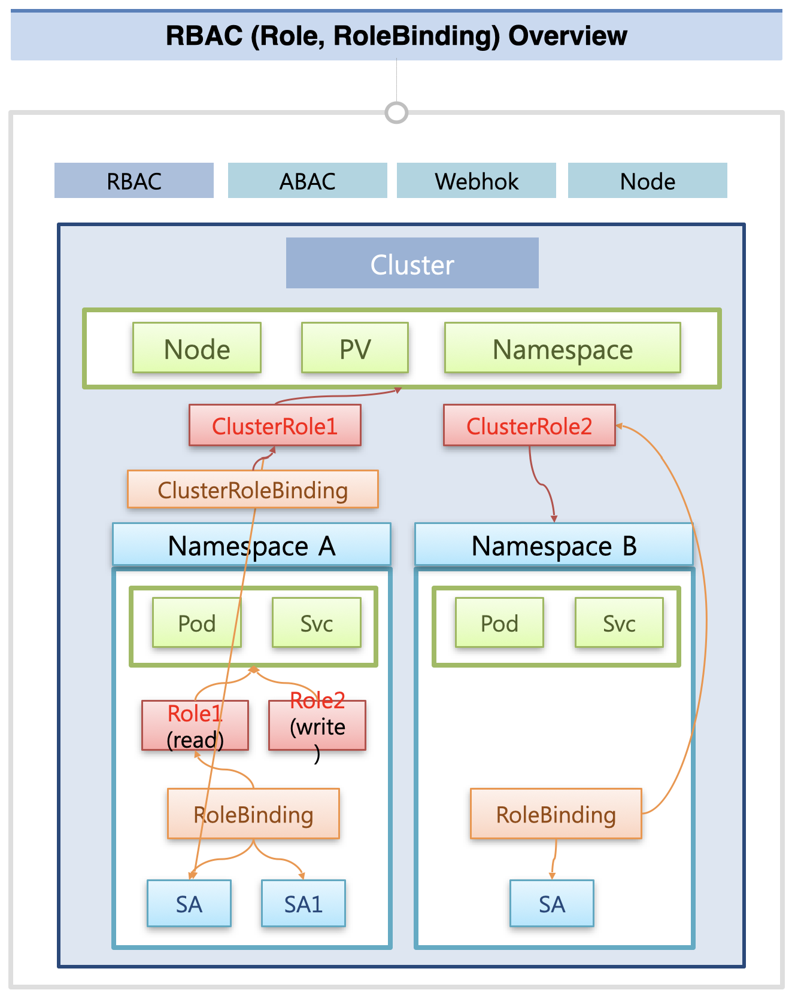
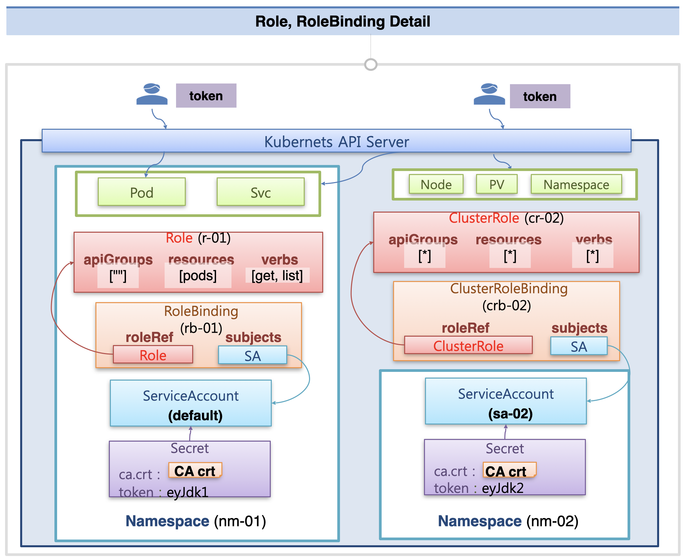

# Authorization

쿠버네티스에서 자원에 대한 권한을 부여하는 방법은 여러 가지가 있지만, 이 중에서 가장 많이 쓰이는 RBAC에 대해서 알아본다.

## RBAC 사용 케이스

쿠버네티스에는 Node, PV, Namespace와 같이 Cluster 단에서 관리되는 자원이 있고, Pod, Service와 같이 Namespace 단에서 관리되는 자원이 있다.  
그리고 Namespace 생성 시 Service Account가 함께 생성되고, 여기에 추가적으로 여러 개의 Service Account를 생성할 수 있는데, 여기에 어떤 Role을 바인딩하는지에 따라서 접근할 수 있는 자원의 범위가 달라진다.  
네임스페이스 내의 자원에만 접근 가능하게 할 수도 있고, 클러스터 단의 자원에도 접근할 수 있게 만들 수도 있다.

### Role - RoleBinding: 네임스페이스 내의 권한 관리

먼저 네임스페이스 내의 자원에 대한 접근을 관리하고 싶을 때에는, 네임스페이스 내에 Role 객체를 생성해야 한다.  
Role에는 네임스페이스 내의 자원에 대한 Read / Write 등에 대한 권한을 세부적으로 부여할 수 있다.  
각각의 Service Account에는 하나의 Role만 바인딩할 수 있는데, 이 때 Role과 Pod 중간에 RoleBinding 객체를 통해서 연결을 하게 된다.  
하나의 Role이 여러개의 Service Account에 연결되는 것은 가능하지만, 하나의 Service Account에 여러개의 Role이 연결되는 것은 불가능하다.

### ClusterRole - ClusterRoleBinding: 클러스터 자원의 권한 관리

만약 클러스터 단의 자원에 대한 접근을 관리할 때에는 ClusterRole 객체를 생성해야 한다.  
ClusterRole에는 클러스터 단의 자원에 대한 권한을 설정할 수 있고, 이를 ClusterRoleBinding을 통해 특정 Service Account에 바인딩할 수 있다.
이를 통해 Service Account에 클러스터 단의 자원에 대한 권한을 부여할 수 있다.

### ClusterRole - RoleBinding: 여러 네임스페이스의 SA에 공통 적용

ClusterRole에는 Namespace 내의 객체에 대한 권한을 정의할 수도 있고, 이를 Namespace 내의 RoleBinding 객체에 연결해서 Service Account에 바인딩할 수 있다.  
이 방식은 여러 Namespace에 존재하는 ServiceAccount에 동일한 내용의 규칙을 적용하고 싶을 때 사용한다.  
이 경우 여러 namespace의 Service Account에 대해서 일괄적으로 권한을 변경하고 싶을 때에도, 바인딩한 ClusterRole 내용 하나만 변경하면 되기 때문에 권한 관리가 더 수월하다.

## RoleBinding의 구체적 방법

### namespace 내의 자원에 대한 권한 제어

한 네임스페이스 내에 파드, 서비스 객체가 존재하고 있다고 하자.  
네임스페이스 내의 Service Account의 파드에 대한 접근 권한을 정의해야 하는 상황이다.

Role에는 resources에 접근을 제어할 자원 타입, verbs에 부여할 권한을 입력한다.
apiGroups에는 사용하는 리소스에 맞는 정보를 넣어줘야 하는데, Pod는 코어 API이기 때문에 빈 문자열을 넣어준다.

그 다음 RoleBinding을 생성하는데, roleRef에는 방금 생성한 Role 객체에 대한 참조를 넣고 subjects에는 Service Account를 넣는다.  
이를 통해 해당 Service Account에 대한 Role Binding이 완료된다.

외부의 사용자는 Service Account에 연결된 Secret에 담겨있는 토큰을 이용하여 API 서버에 요청을 보낼 수 있다.  
이 때 Role Binding된 내용에 따라서 파드에만 접근이 가능하다.

### cluster 자원에 대한 권한 제어

이번에는 특정 namespace의 Service Account에 클러스터 내의 모든 자원에 대한 접근 권한을 허용해야 하는 상황이다.  
이 경우에는 모든 권한을 허용한다는 의미로 \* 를 apiGroups, resources, verbs에 입력한 ClusterRole을 생성한다.  
그리고 roleRef에 해당 ClusterRole을, subjects에 연결할 Service Account를 입력하여 ClusterRoleBinding을 생성한다.

이제 해당 Service Account에 연결된 token 값을 이용해 요청하면, 해당 클러스터의 모든 자원에 대해서 접근하고 수정할 수 있다.

