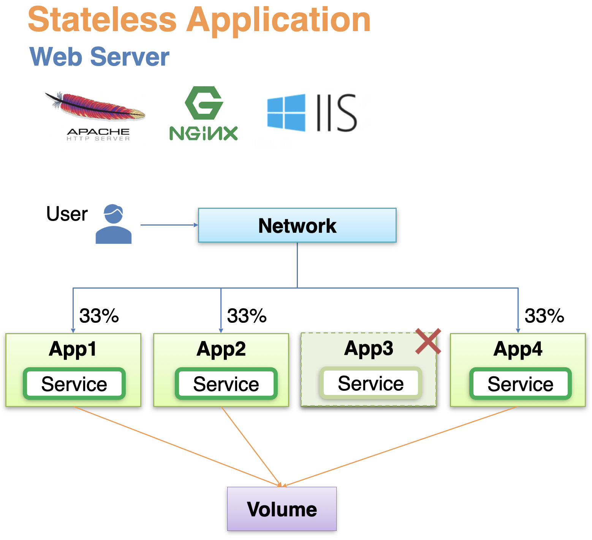
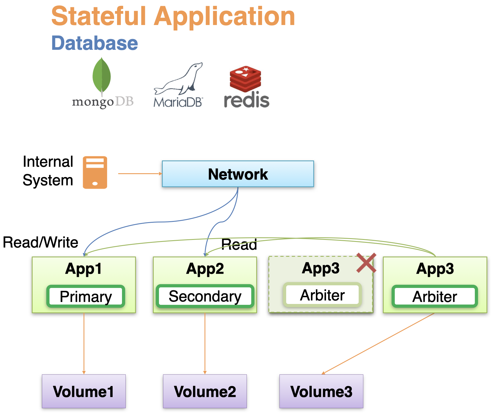

# StatefulSet

어플리케이션은 크게 Stateless Application과 Stateful Application으로 나뉜다.

## Stateless Application

Stateless Application의 대표적인 예시는 아파치, nginx, IIS 와 같은 웹서버이다.  
이 경우에는 여러 개의 앱이 띄워졌을 때 서로 완전히 동일한 역할을 한다.  
만약 앱 중 하나가 죽었을 때에는 동일한 앱을 하나 더 띄우는 식으로만 대응하면 된다.  
또한 Stateless Application은 볼륨도 기본적으로는 불필요하고, 만약 로그 등을 남기고자 한다면 하나의 볼륨을 여러 앱들에서 공유해서 사용해도 무방하다.  
트래픽의 경우 보통 일반 사용자들의 트래픽을 받게 되고, 트래픽 분산 시 모든 앱들에게 동일하게 트래픽을 분산하게 된다.

## Stateful Application

Stateful Application의 대표적인 예시는 MongoDB, MariaDB와 같은 데이터베이스이다.

Stateful Application은 여러 개의 앱이 띄워지면 보통 각 앱이 서로 다른 역할을 한다.  
예를 들어 MongoDB의 경우 Primary, Secondary, Arbiter 세 개의 앱을 사용하는데, Primary가 사용 불가능 상태가 되면 Arbiter가 이를 감지해서 Secondary로 대체하는 식으로 작동한다.  
각 앱들이 각자 역할을 가지고 있기 때문에, 어느 하나가 죽으면 동일한 역할을 하는 앱을 다시 띄워야 한다.

또한 보통 Stateful Application은 데이터 영속화가 필요하므로 볼륨을 사용해야 하는데, 각 앱들이 서로 다른 역할을 수행하기 때문에 볼륨도 따로 관리해야 한다.  
이를 통해 한 앱이 정지되더라도, 동일한 역할의 앱을 새로 띄우고 해당 볼륨에 연결해서 기존에 하던 역할을 이어 나가게 할 수 있다.

Stateful Application은 보통 데이터를 저장하고자 하는 내부 시스템의 트래픽을 받게 되고, 각 앱의 역할에 맞게 트래픽이 전달된다.  
예를 들어 MongoDB의 경우 Primary는 read/write, Secondary는 read만 가능하기 때문에 처리가 가능한 요청만 분산해서 보내야 한다.  
Arbiter는 Primary와 Secondary를 모니터링 하기 위해 이들에게 요청을 보낼 수 있어야 한다.

## ReplicaSet vs StatefulSet

이와 같이 Stateless Application은 단순 분산만 수행하면 되는 연결이고, Stateful Application은 역할에 따라 의도가 있는 연결이다.

쿠버네티스에서는 각 앱의 특징에 따라서 다른 종류의 Controller를 사용하도록 제공한다.  
Stateless Application은 ReplicaSet을 사용하고, Stateful Application은 StatefulSet을 사용한다.  
또한 StatefulSet은 역할에 따라 트래픽을 관리하기 위해 headless service를 이용한다.

### replicas에 따른 동작 방식

StatefulSet은 컨트롤러이고, ReplicaSet과 동일하게 replicas를 지정하여 복수개의 파드를 관리한다.

이 때 ReplicaSet의 경우에는 각 파드의 이름에 random string이 붙지만(Pod-df739), StatefulSet은 index가 붙어서 하나씩 값이 커지게 된다(Pod-0).  
replicas 값이 늘어나서 파드를 추가 생성하는 경우 ReplicaSet은 필요한 개수만큼 동시에 파드를 생성하지만, StatefulSet은 순차적으로 하나씩 파드를 생성한다(Pod-0, Pod-1, Pod-2...).

또한 만약 하나의 파드가 종료되면 ReplicaSet은 새로운 random string을 가진 파드를 새롭게 띄우지만, StatefulSet은 동일한 이름을 가진 동일한 역할의 파드를 새롭게 띄우게 된다.

replicas를 0으로 지정하는 경우에는, ReplicaSet은 연결된 파드들이 동시에 종료되지만, StatefulSet은 인덱스가 큰 나중에 생긴 파드부터 순차적으로 삭제한다.

### PVC 관리 방법

ReplicaSet을 볼륨에 연결하기 위해서는 직접 PVC를 생성하고, template의 persistentVolumeClaim을 통해 연결해야 한다.  
또한 Access Mode가 RWO인 PVC 생성 시 파드와 동일한 노드에 생성된다는 보장이 없기 때문에 nodeSelector로 노드를 지정을 해야 한다.  
이와 달리 StatefulSet에서는 volumeClaimTemplates에 지정한 내용을 바탕으로 자동으로 PVC가 생성이 되어 파드에 연결된다.  
이 때 파드와 PVC는 자동으로 동일한 노드에 생성된다.

또한 replicas를 늘려서 여러 개의 파드가 생성되는 경우에도 다르게 동작한다.  
ReplicaSet은 모두 동일한 내용의 template을 기반으로 파드들이 생성되기 때문에 동일한 PVC에 연결이 되지만, StatefulSet은 각 파드마다 volumeClaimTemplates 정보를 바탕으로 새롭게 PVC가 생성되어 각각 연결된다.  
따라서 각 파드가 서로 다른 볼륨을 사용할 수 있기 때문에 각자 다른 내용의 데이터를 저장하는 것이 가능하다.

또한 StatefulSet에서는 파드가 종료되더라도 PVC는 함께 삭제되지 않는다.  
예를 들어 한 파드가 종료되면 동일한 이름의 파드가 재생성되고, 기존의 PVC가 연결되어 이전에 하던 역할을 그대로 수행한다.  
replicas를 0으로 지정한 경우에도 파드만 순차적으로 모두 삭제되고 PVC는 삭제되지 않는다.

### StatefulSet에 headless Service 연결

추가적으로 StatefulSet에는 serviceName을 지정하는 것이 가능한데, 해당 이름으로 headless Service를 생성하면 예측 가능한 도메인 이름으로 각 파드에 접근하는 것이 가능하다.  
StatefulSet의 각 파드는 index 값을 이용한 이름을 사용하고, 각 역할 별로 index가 부여되기 때문에 사전에 도메인 이름을 예측할 수 있다.
