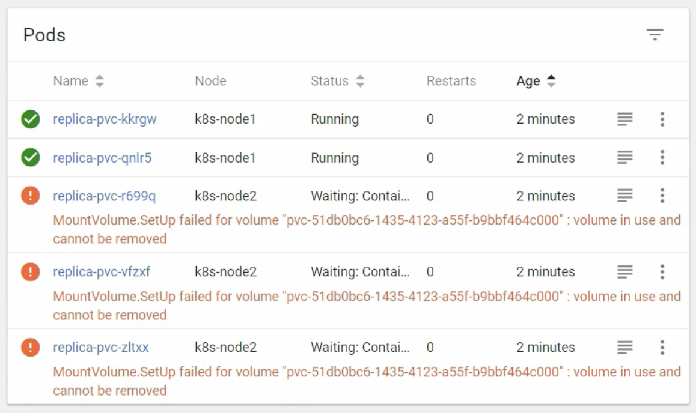

# StatefulSet 실습

## ReplicaSet, StatefulSet 기본 동작 실습

### ReplicaSet, StatefulSet 생성

ReplicaSet 과 StatefulSet을 둘 다 생성해서 비교를 하면서 각 특징들을 확인해보자.  
먼저 다음의 구성 파일로 ReplicaSet과 StatefulSet을 생성한다.

```yaml
apiVersion: apps/v1
kind: ReplicaSet
metadata:
  name: replica-web
spec:
  replicas: 1
  selector:
    matchLabels:
      type: web
  template:
    metadata:
      labels:
        type: web
    spec:
      containers:
        - name: container
          image: kubetm/app
      terminationGracePeriodSeconds: 10
```

```yaml
apiVersion: apps/v1
kind: StatefulSet
metadata:
  name: stateful-db
spec:
  replicas: 1
  selector:
    matchLabels:
      type: db
  serviceName: "stateful-headless"
  template:
    metadata:
      labels:
        type: db
    spec:
      containers:
        - name: container
          image: kubetm/app
      terminationGracePeriodSeconds: 10
```

ReplicaSet과 StatefulSet 모두 replicas가 1로 설정되어 있으므로 파드는 각각 하나씩 생성된다.  
이 때, ReplicaSet에 의해 생성된 파드의 이름은 `replica-web-<hash>` 형태로 생성되고, StatefulSet에 의해 생성된 파드의 이름은 `stateful-db-<index>` 형태로 생성된다.

```bash
kubectl get po

NAME                READY   STATUS    RESTARTS   AGE
replica-web-qsh5t   1/1     Running   0          68s
stateful-db-0       1/1     Running   0          2m29s
```

### ReplicaSet, StatefulSet의 replicas 증가

이번에는 replicas의 개수를 각각 3으로 증가시켜보자.  
이 때 ReplicaSet의 경우 동시에 2개의 파드가 추가 생성되고, StatefulSet의 경우 순차적으로 2개의 파드가 생성된다.

```bash
$ kubectl apply -f replicaset.yaml
$ kubectl get po
NAME                READY   STATUS              RESTARTS   AGE
replica-web-h7hzb   0/1     ContainerCreating   0          1s
replica-web-qsh5t   1/1     Running             0          2m13s
replica-web-zrn2w   0/1     ContainerCreating   0          1s
```

```bash
$ kubectl apply -f statefulset.yaml
$ kubectl get po
NAME                READY   STATUS              RESTARTS   AGE
stateful-db-0       1/1     Running             0          5m7s
stateful-db-1       0/1     ContainerCreating   0          1s

$ kubectl get po
NAME                READY   STATUS              RESTARTS   AGE
stateful-db-0       1/1     Running             0          5m12s
stateful-db-1       1/1     Running             0          6s
stateful-db-2       0/1     ContainerCreating   0          3s
```

### 파드 삭제

이번에는 파드를 하나 삭제해보자.
ReplicaSet의 경우 파드 삭제를 시도하면, ReplicaSet의 replicas 개수를 유지하기 위해 파드를 즉시 하나 더 생성한다.  
이 때 새롭게 생성되는 파드는 새로운 hash 값으로 구성된 이름을 가지게 된다.

```bash
$ kubectl delete po replica-web-zrn2w
$ kubectl get po
NAME                READY   STATUS              RESTARTS   AGE
replica-web-h7hzb   1/1     Running             0          6m5s
replica-web-qsh5t   1/1     Running             0          6m5s
replica-web-q2ldv   0/1     ContainerCreating   0          3s
replica-web-zrn2w   1/1     Terminating         0          6m19s
```

이와 달리 StatefulSet의 경우 파드 삭제를 시도하면, 파드 삭제가 완료된 후에 동일한 이름으로 파드를 재생성한다.

```bash
$ kubectl delete po stateful-db-0
$ kubectl get po
NAME                READY   STATUS              RESTARTS   AGE
stateful-db-0       1/1     Terminating         0          4m12s
stateful-db-1       1/1     Running             0          5m15s
stateful-db-2       1/1     Running             0          5m17s

$ kubectl get po
NAME                READY   STATUS              RESTARTS   AGE
stateful-db-0       0/1     ContainerCreating   0          0s
stateful-db-1       1/1     Running             0          5m15s
stateful-db-2       1/1     Running             0          5m17s
```

### replicas를 0으로 수정

replicas를 0으로 수정하면, ReplicaSet의 경우 즉시 모든 파드를 동시에 삭제한다.

```bash
kubectl apply -f replicaset.yaml
kubectl get po

NAME                READY   STATUS        RESTARTS   AGE
replica-web-4prd5   1/1     Terminating   0          59s
replica-web-h8qjb   1/1     Terminating   0          59s
replica-web-q2ldv   1/1     Terminating   0          10m
```

이와 달리 StatefulSet의 경우 파드를 `stateful-db-2` 부터 `stateful-db-0` 까지 순차적으로 파드를 삭제한다.

```bash
kubectl apply -f statefulset.yaml

kubectl get po
NAME            READY   STATUS        RESTARTS   AGE
stateful-db-0   1/1     Running       0          9m30s
stateful-db-1   1/1     Running       0          88s
stateful-db-2   1/1     Terminating   0          84s

kubectl get po
NAME            READY   STATUS        RESTARTS   AGE
stateful-db-0   1/1     Running       0          9m54s
stateful-db-1   1/1     Terminating   0          112s

kubectl get po
NAME            READY   STATUS        RESTARTS   AGE
stateful-db-0   1/1     Terminating   0          10m14s
```

## PVC를 이용한 실습

StatefulSet과 ReplicaSet은 PVC를 관리하는 방식에 있어서도 차이가 있다.

### ReplicaSet의 PVC 관리

먼저 다음의 구성 파일로 PVC를 생성한다.  
이 때 fast StorageClass를 사용하여 Dynamic Provisioning을 통해 동적으로 PV를 생성하도록 구성한다.

```yaml
apiVersion: v1
kind: PersistentVolumeClaim
metadata:
  name: replica-pvc1
spec:
  accessModes:
    - ReadWriteOnce
  resources:
    requests:
      storage: 1G
  storageClassName: "fast"
```

그리고 다음의 구성 파일로 template에 PVC를 연결한 ReplicaSet을 생성한다.  
/applog path에 volume을 마운트하도록 구성했다.

```yaml
apiVersion: apps/v1
kind: ReplicaSet
metadata:
  name: replica-pvc
spec:
  replicas: 1
  selector:
    matchLabels:
      type: web2
  template:
    metadata:
      labels:
        type: web2
    spec:
      nodeSelector:
        kubernetes.io/hostname: k8s-node1
      containers:
        - name: container
          image: kubetm/init
          volumeMounts:
            - name: storageos
              mountPath: /applog
      volumes:
        - name: storageos
          persistentVolumeClaim:
            claimName: replica-pvc1
      terminationGracePeriodSeconds: 10
```

이 때 nodeSelector로 Pod가 생성될 노드를 지정했다.  
만약 이를 지정하지 않고 생성하게 되면 오류가 발생하는데, 이는 모든 파드가 동일한 볼륨을 바라보고 있기 때문이다.  
storageos에 의해 생성되는 PV가 기본적으로 RWO(RWOnce) AccessMode를 가지기 때문에, 하나의 노드에만 마운트되어야 한다.  
처음에 생성된 Pod가 k8s-node1에 생성되면 PVC와 PV도 이에 맞게 k8s-node1에 생성되는데, 이후에 생성된 Pod가 k8s-node2에 생성되면 오류가 발생하는 것이다.



결국 nodeSelector를 지정해야 정상적으로 Pod가 생성된다.  
이 때 ReplicaSet에 의해 생성되는 파드들은 동일한 볼륨을 공유하기 때문에, 하나의 파드에서 파일을 생성하면 다른 파드에서도 동일한 파일을 확인할 수 있다.  
replicas를 증가해서 파드 개수를 늘리면, 새롭게 생성한 파드에서도 동일한 파일이 확인된다.

### StatefulSet의 PVC 관리

이번에는 StatefulSet을 생성해보자.  
이 때 별도로 PVC를 생성하는 것이 아니라, StatefulSet의 volumeClaimTemplates에서 생성할 PVC 정보를 지정하게 된다.

```yaml
apiVersion: apps/v1
kind: StatefulSet
metadata:
  name: stateful-pvc
spec:
  replicas: 1
  selector:
    matchLabels:
      type: db2
  serviceName: "stateful-headless"
  template:
    metadata:
      labels:
        type: db2
    spec:
      containers:
        - name: container
          image: kubetm/app
          volumeMounts:
            - name: volume
              mountPath: /applog
      terminationGracePeriodSeconds: 10
  volumeClaimTemplates:
    - metadata:
        name: volume
      spec:
        accessModes:
          - ReadWriteOnce
        resources:
          requests:
            storage: 1G
        storageClassName: "fast"
```

이 때 templates에서 지정한 volumeMounts name과 volumeClaimTemplates에서 지정한 name이 동일해야 정상적으로 볼륨이 연결된다.  
각 PVC의 이름은 volumeClaimTemplates의 name에 지정한 값에 파드의 이름이 붙은 형식으로 결정된다.  
ex) `volume-stateful-pvc-0`

이 때 replicas의 개수를 늘려서 스케일링하면, 새롭게 생성된 파드마다 각각 별도의 PVC/PV가 생성되기 때문에 각 파드의 특성에 맞게 데이터를 관리할 수 있다.  
또한 각 파드의 노드에 PVC가 함께 생성되기 때문에, 파드들이 서로 다른 노드에 생성되어도 무방하다.

파드를 삭제하면 해당 파드에 연결되었던 PVC/PV는 삭제되지 않고 남게 된다.  
이 때 동일한 이름으로 새롭게 파드가 생성되면 기존의 PVC/PV가 그대로 연결되기 때문에, 이전에 볼륨에 저장해둔 파일을 새로운 파드에서도 동일하게 확인할 수 있다.

## Headless Service를 이용한 실습

StatefulSet의 파드들은 정해진 인덱스에 따라서 이름이 정해지기 때문에, Headless Service를 이용하면 파드들에 대해 예측 가능한 domain name으로 접근하는 것이 가능하다.

`clusterIP: None` 으로 지정해서 headless service로 생성한다.
위에서 StatefulSet을 생성할 때 `serviceName: stateful-headless`로 지정했기 때문에, Headless Service도 같은 이름으로 생성해야 한다.  
또한 template에서 `type: db2` label을 지정했기 때문에, selector도 이에 맞게 지정해야 한다.

```yaml
apiVersion: v1
kind: Service
metadata:
  name: stateful-headless
spec:
  selector:
    type: db2
  ports:
    - port: 80
      targetPort: 8080
  clusterIP: None
```

이제 임의로 파드를 하나 만들어서 kubectl exec 으로 접속한 후, stateful-headless 라는 이름의 DNS로 검색하면, 해당 서비스에 연결된 파드들의 IP 주소를 확인할 수 있다.

```bash
$ nslookup stateful-headless

Server: 10.96.0.10
Address: 10.96.0.10#53

Name: stateful-headless.default.svc.cluster.local
Address: 20.111.156.91
Name: stateful-headless.default.svc.cluster.local
Address: 20.109.131.34
Name: stateful-headless.default.svc.cluster.local
Address: 20.109.131.33
```

headless-service의 이름과 pod 이름을 조합한 형태의 도메인으로 파드에 손쉽게 접근할 수 있다.

```bash
$ curl stateful-db-0.stateful-headless:8080/health
stateful-db-0 is Running

$ curl stateful-db-1.stateful-headless:8080/health
stateful-db-1 is Running

$ curl stateful-db-2.stateful-headless:8080/health
stateful-db-2 is Running
```
