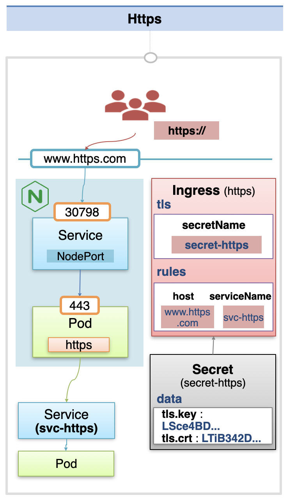

# Ingress

Ingress 객체를 사용하면 `Service Loadbalancing`과 `Canary Upgrade`를 손쉽게 구성할 수 있다.

## Service Loadbalancing 개요

쇼핑 페이지, 고객 센터, 주문 페이지를 별도의 앱으로 분리하여 각각 파드로 관리하고 있다고 하자.  
이렇게 구성할 경우 서비스 중 하나가 문제가 생겨도, 나머지 서비스는 문제 없이 동작한다는 장점이 있다.

고객이 접속할 수 있도록 파드들에 Service를 각각 달아 두고, 고객이 접속하는 path에 따라서 다른 서비스에 접속할 수 있도록 구성해야 하는 상황이라고 하자.  
예를 들어 `www.mall.com` 도메인으로 접속하면 기본적으로 쇼핑 페이지로 접근하고, `www.mall.com/customer` path로 접속하면 고객 센터로 접속되고, `www.mall.com/order` path로 접속하면 주문 페이지로 접속되어야 한다.

각각의 path에 맞게 서비스를 연결하기 위해서 일반적으로 L3, L7 스위치를 연결해야 하지만, 쿠버네티스에서는 Ingress 객체가 이러한 역할을 수행한다.  
Ingress 객체의 각 path에 매칭되는 서비스를 연결하면, 사용자의 요청이 매칭되는 파드에 전달된다.  
위 예시에서는 / 는 쇼핑 페이지 서비스의 파드로, /customer 는 고객 센터 서비스의 파드로, /order 는 주문 페이지 서비스의 파드로 요청을 전달한다.

이와 같이 ingress를 사용할 경우 자체적으로 ip 로드 밸런싱을 수행하기 때문에 별도의 ip 로드밸런서를 붙이지 않아도 된다.

## Canary Upgrade 개요

Ingress 객체를 사용하면 손쉽게 Canary Upgrade를 수행할 수 있다.

예를 들어 기존의 v1 파드를 운영하면서, 일부의 트래픽은 새로운 v2 파드에 분산해서 테스트하고 싶다고 하자.  
이를 위해 먼저 Ingress 객체에 v1 파드 서비스와 v2 파드 서비스를 함께 연결하고, 기존 서비스에 90%, 새로운 서비스에 10%의 트래픽이 전달되도록 설정할 수 있다.  
이를 통해 일부의 트래픽을 대상으로 새로운 버전의 서비스에 대한 테스트를 수행할 수 있다.

또한 헤더의 값을 기준으로 트래픽을 분산하는 것도 가능하다.  
예를 들어 사용자의 언어를 헤더에서 추출해서, 특정 언어의 트래픽만 v2 파드에 전달하는 식으로 구성할 수 있다.  
이 외에도 nginx의 다양한 어노테이션을 이용해서 Ingress를 구성할 수 있다.

## Ingress 구성 방법

Ingress 는 Host와 Path를 기준으로 서비스를 연결한다.  
Host에 연결한 도메인을 지정하고, Path에서 하위 경로에 따라 원하는 서비스에 연결하도록 구성하면 된다.

하지만 Ingress를 생성했다고 해서 바로 사용할 수 있는 것은 아니다.  
구현체를 별도로 만들어야 사용이 가능한데, 이를 위해서는 플러그인을 설치해야 한다.  
Ingress를 위한 플러그인들을 Ingress Controller 라고 하고, `Nginx`, `Kong` 등의 플러그인이 있다.

Ingress Controller를 설치하면 Namespace가 하나 만들어지고, 그 안에 Deployment 객체가 생성된다.  
Deployment에 의해 ReplicaSet이 생성되고, ReplicaSet에 의해 nginx 구현체 파드가 생성된다.  
해당 nginx 파드에서는 Ingress 객체에 지정한 Rule에 따라서 서비스를 연결한다.

이제 Ingress Pod에 접근하기 위해 Service를 생성하고 연결한다.  
직접 쿠버네티스를 설치했다면 NodePort 타입으로 생성할 수 있고, 클라우드 서비스를 사용한다면 LoadBalancer 타입으로 생성해서 외부에 연결할 수 있다.

사용자들이 지정한 도메인으로 접근하게 되면 먼저 Nginx Pod에 접속하게 되고, 지정된 Rule에 따라서 서비스에 연결된다.
Ingress를 추가로 생성할 수도 있고, Path에 규칙을 지정하지 않고 단일한 서비스를 연결할 수도 있다.  
이 때 Ingress가 생성되면, Nginx Pod에서 이를 감지해서 Rule에 따라 서비스를 추가로 연결한다.

## Service Loadbalancing 구성 방법

이제 본격적으로 각 기능을 구현해보자.  
먼저 Ingess Controller를 설치해서, Nginx Pod와 NodePort Service를 생성한다.  
실습 예제에서는 노드 IP의 31431 포트로 접속을 하면 해당 NodePort Service를 통해 Nginx Pod의 80 포트로 연결이 되게 구성되어 있다.

이 상태에서 각 Path에 연결할 Pod, Service 객체를 생성한다.  
그리고 Ingress 객체를 생성해서 각 Path에 서비스를 매칭시켜두면, Nginx Pod에서 해당 Rule에 맞게 요청을 전달하게 된다.  
별도의 Host는 지정하지 않았기 때문에 `[Node IP]:31431/`로 접근하면 기본 상품 페이지로, `[Node IP]:31431/customer`로 접근하면 고객 센터 페이지로, `[Node IP]:31431/order`로 접근하면 주문 페이지로 연결된다.

## Canary Upgrade 구성 방법

Canary Upgrade 시에는 기본 구성은 유사하게 두고, www.app.com으로 접근하면 svc-v1 파드로 접속되는 식으로 구성해 둘 것이다.  
이를 위해 Ingress 객체는 host를 www.app.com으로 지정하고, serviceName을 svc-v1으로 지정한다.  
이 상태에서 테스트할 svc-v2 파드와 서비스를 새롭게 띄우고, 이를 연결할 Ingress 객체를 생성한다.  
동일하게 host를 www.app.com으로 지정하고, serviceName은 svc-v2로 지정한다.

이러면 Nginx Pod에서는 www.app.com 으로 접근하는 요청을 svc-v1과 svc-v2로 분산해서 전달하게 된다.  
이 때 v2 Ingress에 `@weight: 10%` 를 지정하여, 트래픽의 10%만 svc-v2로 전달되도록 설정할 수 있다.
또한 `@header` 어노테이션을 이용하면 특정 언어의 사용자는 100% svc-v2로 전달되도록 설정할 수도 있다.  
이 밖에도 다양한 어노테이션을 사용해서 Nginx의 여러 기능을 사용해서 트래픽을 분산시킬 수 있다.

## HTTPS 연결 방법

또한 파드 단에서 인증서를 관리하기 어려운 경우에는, ingress 객체에서 인증서를 관리하도록 구성하여 https 연결을 제공할 수도 있다.

이 경우에는 Nginx Pod 단에서 https 요청을 받기 위해 443번 포트로 요청을 받도록 설정한다.  
그리고 ingress 객체를 만들 때 도메인 host 와 연결할 serviceName을 지정하고, tls 옵션을 사용하여 secretName으로 Secret 객체를 연결한다.  
이 때 Secret 객체에는 데이터 값으로 인증서가 저장되어 있어야 한다.

이를 통해 사용자들이 https로 서비스에 접속할 수 있게 된다.

