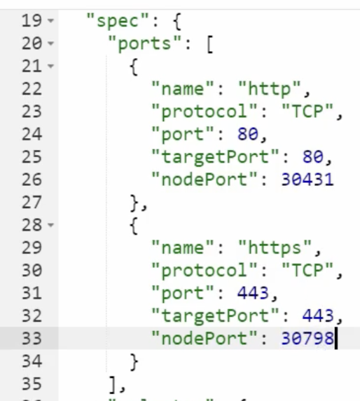

# Ingress 실습

## Ingress 기본 세팅

먼저 다음의 명령어로 Nginx Ingress Controller를 설치한다.

```bash
$ kubectl apply -f https://raw.githubusercontent.com/kubernetes/ingress-nginx/controller-v1.0.0/deploy/static/provider/baremetal/deploy.yaml
```

위 명령어를 통해 ingress-nginx 네임스페이스가 생성되고, Deployment, ReplicaSet이 생성되어 Nginx Pod가 생성된다.  
v1.22에서는 Nginx Pod에 접근할 수 있도록 Service도 함께 생성된다.  
예제에 맞춰서 Service의 http nodePort를 30431로 변경하고, https의 nodePort도 30798로 변경한다.



## Service Loadbalancing 실습

이제 Ingress를 이용해서 Service Loadbalancing을 구성해보자.  
먼저 원하는 서비스에 맞게 각각의 Pod와 Service 객체를 생성한다.  
각 파드와 서비스는 default 네임스페이스에 생성한다.

```yaml
apiVersion: v1
kind: Pod
metadata:
  name: pod-shopping
  labels:
    category: shopping
spec:
  containers:
    - name: container
      image: kubetm/shopping
---
apiVersion: v1
kind: Service
metadata:
  name: svc-shopping
spec:
  selector:
    category: shopping
  ports:
    - port: 8080
```

```yaml
apiVersion: v1
kind: Pod
metadata:
  name: pod-customer
  labels:
    category: customer
spec:
  containers:
    - name: container
      image: kubetm/customer
---
apiVersion: v1
kind: Service
metadata:
  name: svc-customer
spec:
  selector:
    category: customer
  ports:
    - port: 8080
```

```yaml
apiVersion: v1
kind: Pod
metadata:
  name: pod-order
  labels:
    category: order
spec:
  containers:
    - name: container
      image: kubetm/order
---
apiVersion: v1
kind: Service
metadata:
  name: svc-order
spec:
  selector:
    category: order
  ports:
    - port: 8080
```

이제 각 서비스에 트래픽 분산을 하기 위해 Ingress 객체를 생성하고, rules에 각 path에 대해 service를 매칭시킨다.

```yaml
apiVersion: networking.k8s.io/v1
kind: Ingress
metadata:
  name: service-loadbalancing
spec:
  ingressClassName: nginx
  rules:
    - http:
        paths:
          - path: /
            pathType: Prefix
            backend:
              service:
                name: svc-shopping
                port:
                  number: 8080
          - path: /customer
            pathType: Prefix
            backend:
              service:
                name: svc-customer
                port:
                  number: 8080
          - path: /order
            pathType: Prefix
            backend:
              service:
                name: svc-order
                port:
                  number: 8080
```

이제 master node의 IP의 연결된 Port로 각각의 path에 접근해보면, 각각의 서비스로 연결되는 것을 확인할 수 있다.

```bash
$ curl 192.168.0.30:30431/
Shopping Page.
$ curl 192.168.0.30:30431/order
Order Service.
$ curl 192.168.0.30:30431/customer
Customer Center.
```

## Canary Upgrade 실습

이번에는 Canary Upgrade를 실습해보자.
먼저 v1 Pod, Service를 생성하고, 이를 Ingress에 연결한다.  
이번에는 Host로 www.app.com을 지정하고, Path는 지정하지 않은 채로 service만 연결한다.

```yaml
apiVersion: v1
kind: Pod
metadata:
  name: pod-v1
  labels:
    app: v1
spec:
  containers:
    - name: container
      image: kubetm/app:v1
---
apiVersion: v1
kind: Service
metadata:
  name: svc-v1
spec:
  selector:
    app: v1
  ports:
    - port: 8080
```

```yaml
apiVersion: networking.k8s.io/v1
kind: Ingress
metadata:
  name: app
spec:
  ingressClassName: nginx
  rules:
    - host: www.app.com
      http:
        paths:
          - path: /
            pathType: Prefix
            backend:
              service:
                name: svc-v1
                port:
                  number: 8080
```

다만 `www.app.com`은 Public DNS에 등록된 domain name은 아니기 때문에, Ingress를 생성한다고 해서 바로 해당하는 서비스에 접속할 수 있는 것은 아니다.  
먼저 다음의 커맨드를 통해 `/etc/hosts`에 www.app.com에 대한 IP를 등록해야 한다.

```bash
cat << EOF >> /etc/hosts
192.168.56.30 www.app.com
EOF
```

이제 www.app.com 경로를 통해 해당하는 Nginx Pod로 접속이 가능하다.

```bash
$ curl www.app.com:30431/version
Version: v1
```

이번에는 Canary Test를 수행할 새로운 버전의 v2 Pod 및 Service를 생성하고, 이를 Ingress에 연결한다.  
Ingress 생성 시에는 canary-weight 어노테이션을 달아서 트래픽의 10%만 v2 Pod로 전달되도록 설정한다.

```yaml
apiVersion: v1
kind: Pod
metadata:
  name: pod-v2
  labels:
    app: v2
spec:
  containers:
    - name: container
      image: kubetm/app:v2
---
apiVersion: v1
kind: Service
metadata:
  name: svc-v2
spec:
  selector:
    app: v2
  ports:
    - port: 8080
```

```yaml
apiVersion: networking.k8s.io/v1
kind: Ingress
metadata:
  name: canary-v2
  annotations:
    nginx.ingress.kubernetes.io/canary: "true"
    nginx.ingress.kubernetes.io/canary-weight: "10"
spec:
  ingressClassName: nginx
  rules:
    - host: www.app.com
      http:
        paths:
          - path: /
            pathType: Prefix
            backend:
              service:
                name: svc-v2
                port:
                  number: 8080
```

이제 다음의 명령어로 1초에 한 번씩 요청을 보내본다.  
설정한 weight에 따라서 10%의 요청만 새로운 버전의 파드에 전달되는 것을 확인할 수 있다.

```bash
$ while true; do curl www.app.com:30431/version; sleep 1; done

Version: v1
Version: v2
Version: v1
Version: v1
Version: v1
Version: v1
```

이번엔 `canary-by-header` 어노테이션을 달아서 특정 헤더를 가지고 있는 요청만 v2 Pod로 전달되도록 설정해보자.  
`canary-by-header`에는 헤더 key를, `canary-by-header-value`에는 헤더 value를 지정한다.

```yaml
apiVersion: networking.k8s.io/v1
kind: Ingress
metadata:
  name: canary-kr
  annotations:
    nginx.ingress.kubernetes.io/canary: "true"
    nginx.ingress.kubernetes.io/canary-by-header: "Accept-Language"
    nginx.ingress.kubernetes.io/canary-by-header-value: "kr"
spec:
  ingressClassName: nginx
  rules:
    - host: www.app.com
      http:
        paths:
          - path: /
            pathType: Prefix
            backend:
              service:
                name: svc-v2
                port:
                  number: 8080
```

이제 다음의 커맨드로 적절한 Header를 삽입하여 요청을 보내면 해당하는 파드에 요청이 닿는 것을 확인할 수 있다.

```bash
$ curl -H "Accept-Language: kr" www.app.com:30431/version
Version: v2
```

## HTTPS 설정 실습

이번엔 Ingress를 통해 HTTPS 연결을 구성해보자.  
먼저 Ingress에 연결할 Pod/Service를 생성한다.

```yaml
apiVersion: v1
kind: Pod
metadata:
  name: pod-https
  labels:
    app: https
spec:
  containers:
    - name: container
      image: kubetm/app
---
apiVersion: v1
kind: Service
metadata:
  name: svc-https
spec:
  selector:
    app: https
  ports:
    - port: 8080
```

이제 다음의 구성 파일로 tls 옵션을 적용한 Ingress를 생성한다.  
tls에는 인증서를 적용할 domain과 인증서를 담고 있는 secretName을 지정하면 된다.

```yaml
apiVersion: networking.k8s.io/v1
kind: Ingress
metadata:
  name: https
spec:
  ingressClassName: nginx
  tls:
    - hosts:
        - www.https.com
      secretName: secret-https
  rules:
    - host: www.https.com
      http:
        paths:
          - path: /
            pathType: Prefix
            backend:
              service:
                name: svc-https
                port:
                  number: 8080
```

이제 인증서를 생성하고, 이를 담고 있는 Secret 객체를 생성한다.
먼저 다음의 커맨드로 인증서를 생성해서, tls.key와 tls.crt 파일을 생성한다.

```bash
$ openssl req -x509 -nodes -days 365 -newkey rsa:2048 -keyout tls.key -out tls.crt -subj "/CN=www.https.com/O=www.https.com"
```

이제 다음의 명령어로 인증서를 담고 있는 Secret 객체를 생성한다.  
tls 타입으로 secret-https 라는 이름의 Secret 객체를 생성하고, 방금 생성한 tls.key와 tls.crt 파일을 등록한다.

```bash
# Secret 생성
$ kubectl create secret tls secret-https --key tls.key --cert tls.crt
```

이제 해당 도메인으로 https 접근을 해보자.  
먼저 /etc/hosts에 다음의 내용을 추가해서 www.https.com 도메인을 등록한다. `192.168.56.30 www.https.com`

이제 브라우저를 통해 다음의 도메인으로 접근하면, https 연결이 정상적으로 이루어지는 것을 확인할 수 있다.  
(사설 인증서이기 때문에 warning message가 표시될 수 있다.)
`https://www.https.com:30798/hostname`
