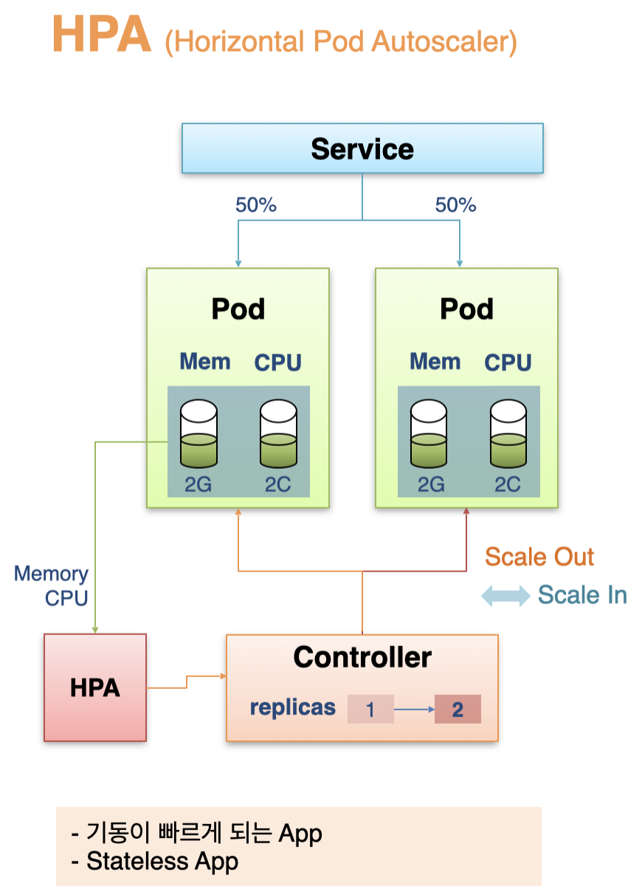
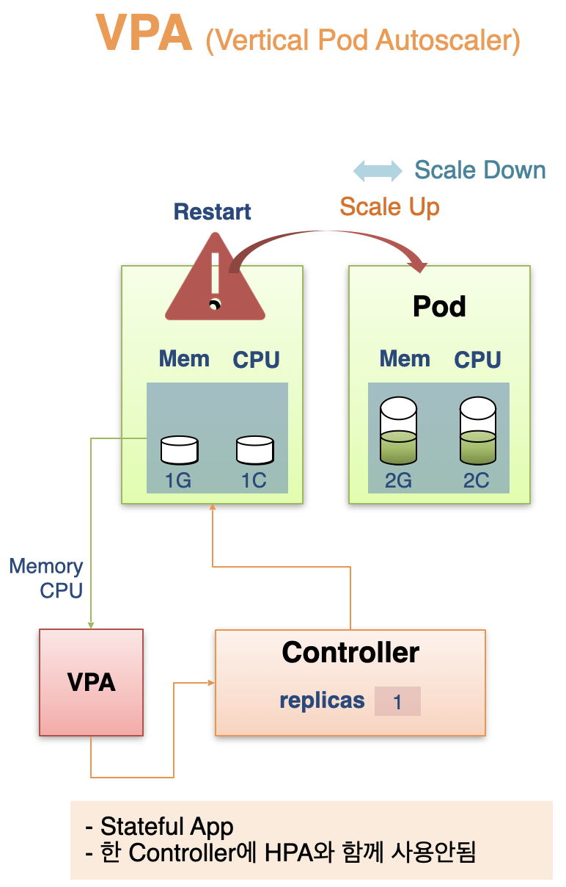
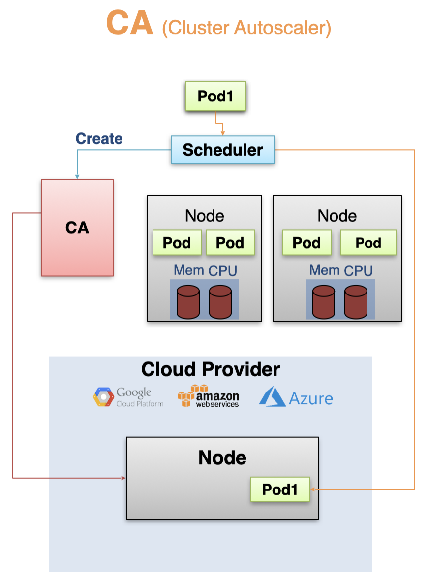
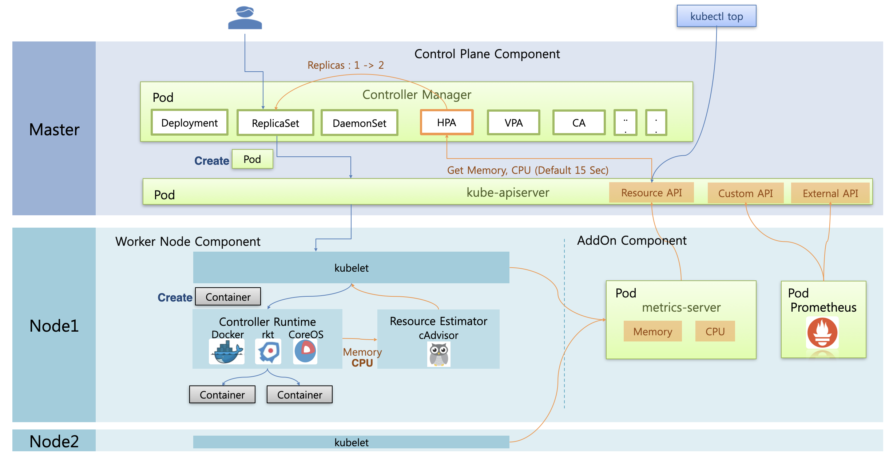

# Autoscaler

쿠버네티스의 Autoscaler에는 크게 세 종류가 있다.  
HPA는 파드의 개수를 늘리고, VPA는 파드의 리소스를 늘리고, CA는 노드의 개수를 늘리는 식으로 스케일링을 한다.

## HPA(Horizontal Pod Autoscaler) 개요

컨트롤러에 의해서 파드가 관리되고 있다고 하자.  
replicas를 1로 지정하여 하나의 파드를 생성했고, 서비스에 해당 파드 하나만 연결되어 모든 트래픽이 몰리고 있는 상황이다.  
여기서 트래픽이 몰려서 파드의 CPU와 메모리 자원을 모두 소진하면 파드가 다운될 수 있다.

이 때 사전에 HPA를 만들고 컨트롤러에 연결해두면, HPA가 파드의 리소스 상황을 감지해서, 리소스를 거의 사용한 경우 replicas를 늘려서 파드를 추가로 생성한다.  
이를 통해 트래픽을 분산하여 파드가 다운되는 것을 방지할 수 있다.

이 방식은 파드를 수평적으로 증가시키기 때문에 Horizontal Pod Autoscaler라고 부른다.  
파드가 추가되면 Scale out 된 것이고, 파드가 삭제되면 Scale in 된 것이다.

HPA는 개념적으로 간단하고 쉽게 구성할 수 있다는 장점이 있다.  
다만 일부의 조건이 충족되었을 때 사용이 권장된다.
먼저, 빠른 구동이 가능한 앱에 대해서 사용하는 것을 권장한다.  
HPA는 장애 발생에 대비하는 것이기 때문에 빠르게 스케일링이 가능해야 하기 때문이다.  
또한 Stateless 앱에 사용하길 권장한다.  
Stateful 앱의 경우에는 각 파드마다 역할이 존재하는데, HPA는 어떤 파드를 추가해야 하는지 판단하기 어렵다.  
Stateless 앱의 경우에는 단순히 양적인 증가/감소를 수행하면 되기 때문에 효과적으로 사용할 수 있다.

## VPA(Vertical Pod Autoscaler) 개요

Stateful App은 보통 VPA Autoscaler를 사용한다.  
VPA를 컨트롤러에 연결하면, 파드의 리소스 상황을 감지해서 리소스를 거의 사용한 경우 파드의 리소스를 늘려서 재생성한다.  
이 때 파드의 리소스양이 수직적으로 증가하기 때문에 Vertical Pod Autoscaler 라고 부른다.  
파드의 리소스 양을 늘리는 것을 Scale up, 줄이는 것을 Scale down 이라고 한다.

주의해야 할 점은 VPA와 HPA를 함께 사용할 경우 정상 동작하지 않을 수 있다는 것이다.

## CA(Cluster Autoscaler) 개요

CA의 경우 클러스터 내의 모든 노드에 자원이 부족한 경우에 워커 노드를 추가하는 식으로 동작한다.  
보통 파드 생성을 요청하게 되면, 스케줄러에서 각 노드의 리소스 상황을 확인하고 생성이 가능한 노드에 파드를 스케줄링한다.  
이 때 CA가 등록된 상태에서 스케줄러가 더 이상 할당할 수 있는 노드가 없음을 감지하면, CA에 노드 추가를 요청한다.  
만약 CA가 Cloud Provider와 연결되어 있다면, Cloud Provider에 노드 추가를 요청해서 새로운 파드를 새로운 노드에 할당한다.

이렇게 운영되다가 기존의 파드가 삭제되어 로컬 노드의 자원이 넉넉해지면, CA는 Cloud Provider에 노드 삭제를 요청해서 노드를 삭제한다.  
기존에 Cloud Provider 노드에 위치해 있던 파드는 로컬 노드에 재배치된다.

## HPA Architecture

HPA를 이해하기 위해서는 kubernetes의 아키텍쳐를 이해하는 것이 도움이 된다.

### Control Plane Component

쿠버네티스의 마스터 노드에는 쿠버네티스의 핵심 기능을 수행하는 Control Plane Component들이 파드로 띄워져서 실행된다.  
그 중 Controller Manager 파드에서는 Deployment, ReplicaSet, DaemonSet, HPA, VPA, CA 등의 기능들이 쓰레드로 실행된다.  
kube-apiserver 파드는 노드 통신의 길목 역할을 수행한다.  
사용자가 쿠버네티스에 접근할 때 뿐만 아니라 쿠버네티스 내부 컴포넌트 간 통신에서도 kube-apiserver를 통하게 된다.

### Worker Node Component

또한 각각의 노드에는 Worker Node Component 들이 설치된다.  
`kublet`은 각 노드의 Agent 역할을 수행하여 자신의 노드에 있는 파드를 관리하는 역할을 수행한다.  
컨테이너를 직접 생성하고 삭제하는 역할은 `Container Runtime` 구현체가 담당하는데, Docker, rkt CoreOS 등의 다양한 구현체가 있다.

### 사용자가 ReplicaSet을 생성하는 플로우

지금까지 설명한 컴포넌트들을 바탕으로 사용자가 ReplicaSet을 생성하는 플로우를 살펴보자.  
사용자가 ReplicaSet을 생성하면 먼저 Controller Manager의 ReplicaSet을 담당하는 쓰레드에서 이를 감지하고, replicas에 지정한 개수만큼 kube-apiserver에 컨테이너 생성을 요청하게 된다.  
kube-apiserver는 적절한 노드의 kublet에 컨테이너 생성을 요청하게 되고, kublet은 Container Runtime을 통해서 컨테이너를 생성하게 된다.  
Container Runtime에서 파드에 필요한 컨테이너를 생성하여 최종적으로 파드가 생성된다.

### HPA의 동작 플로우

이 상황에서 HPA는 파드의 리소스 정보를 알아야 한다.  
워커 노드에는 cAdvisor와 같은 Resource Estimater가 Docker로부터 CPU/Memory 성능 정보를 측정하고 이를 kubelet에 전달한다.  
그리고 metrics-server 에서는 각 노드의 kubelet으로부터 컨테이너의 CPU/Memory 성능 정보를 수집해서 저장한다.  
(metrics-server는 AddOn Component로 따로 설치해야 한다.)  
각 컨테이너의 성능 정보는 kube-apiserver에 Resource API로 등록되어 다른 컴포넌트에서도 사용할 수 있다.

위 과정을 거쳐서 kube-apiserver에 등록된 컨테이너의 CPU/Memory 성능 정보를 이용해서 HPA가 스케일링을 수행하게 된다.  
HPA는 15초마다 해당 정보를 확인해서, 리소스 사용량이 높아졌을 때 ReplicaSet의 replicas를 증가시킨다.  
또한 `kubectl top` 명령어를 사용하면 Resource API를 통해 파드나 노드의 리소스 상태를 조회할 수 있다.

추가적으로, Prometheus 등을 설치하면 단순 메모리/CPU 외에도 다양한 메트릭 정보를 수집할 수 있다.  
파드로 들어오는 패킷 수나 ingress로 들어오는 request 양 등을 수집할 수 있고, HPA에서 이러한 정보를 트리거로 replicas를 관리할 수도 있다.

## HPA 구성 방법

이제 본격적으로 HPA를 구성하는 방법을 살펴보자.  
replicas를 2로 지정한 Deployment에 의해서 ReplicaSet이 생성되고, 이를 통해 2개의 파드가 생성되어 있다.  
이 때 파드의 limits cpu가 500m, requests cpu가 200m으로 설정되어 있다고 하자.

이를 Scale In/Out 하는 HPA를 생성해보자.  
먼저 target에 대상이 되는 Deployment를 매칭시키고, 스케일링을 통해 증감되는 최대/최소 replicas 값을 maxReplicas, minReplicas에 지정한다.  
예시에서는 maxReplicas를 10으로, minReplicas를 2로 지정했다.

이제 metrics에 스케일링의 기준이 되는 값들을 지정한다.  
type에 Resource를 지정하고, name에 cpu / memory 등으로 지정한다.  
그리고 target에 어떤 기준으로 증감시킬지를 지정해야 하는데, `type: Utilization`으로 지정하고 averageUtilization에 기준이 되는 평균 사용률을 지정한다.  
이 외에도 `type: AverageValue`로 지정하고 averageValue에 기준이 되는 평균 사용량을 지정하거나, `type: Value`로 지정하고 value에 기준이 되는 절대 사용량을 지정할 수도 있다.  
예제에서는 `type: Utilization`으로 지정했고, averageUtilization을 50으로 지정했다.  
파드의 평균 requests cpu가 200m 이기 때문에, 컨테이너의 CPU 사용량이 100m를 넘게 되면 HPA는 replicas를 증가시킨다.

이 상황에서 cpu 평균 사용량이 300m가 되었다고 하자.  
`(current replicas) * (average) / (target)` 으로 증가시킬 replicas를 계산하게 된다.  
현재 상황에서는, `2 * 300m / 100m = 6` 이므로 replicas를 6으로 증가시키게 된다.

이 때 cpu 평균 사용량이 50m로 줄었다고 하자.  
다시 공식에 따라 계산을 하게 되어 `6 * 50m / 100m = 3` 이므로 replicas를 3으로 줄이게 된다.  
그리고 15초 뒤에 다시 cpu 평균 사용량을 측정하게 되고, 이 때도 50m임이 확인 되면 다시 계산을 해서 `3 * 50m / 100m = 1.5`가 되는데, minReplicas를 2로 지정했으므로 2개까지만 줄어들게 된다.

HPA의 metrics에서는 커스텀 API를 사용하는 것도 가능하다.  
파드에 Service가 연결되고 Ingress가 연결되어 있다고 하면, 파드에 들어오는 네트워크 패킷을 기준으로 replicas를 증감시킬 수 있다.  
이렇게 파드와 관련된 정보로 판단을 할 경우에는 `metrics: type: Pods`로 지정한다.  
만약 파드와 관련이 없는 정보로 판단을 할 경우에는 `metrics: type: Object`로 지정한다.  
(ex. Ingress에 들어오는 requests 양)
