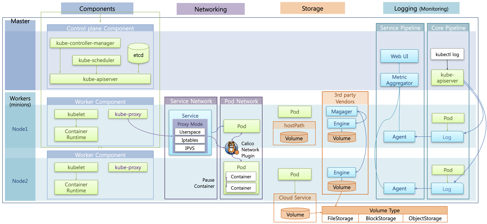

# Arcitecture Overview

지금부터는 쿠버네티스 아키텍처에 대해 알아보자.  
범위는 크게 Component, Networking, Storage, Logging으로 나뉜다.

## Component

쿠버네티스 클러스터는 하나의 마스터 노드와 여러 개의 워커 노드로 구성된다.  
이 때 마스터 노드에는 쿠버네티스의 핵심 기능들을 담당하는 Control Plane Component가 설치되고, 각 워커노드에는 각 노드에 띄워진 컨테이너를 관리하는 Worker Component가 설치된다.

## Networking

쿠버네티스에는 크게 Pod Network와 Service Network가 존재한다.  
Pod Network는 파드 간 통신을 담당하는데, 강의에서는 Calico 플러그인이 파드간 통신을 처리하는 방법을 확인한다.  
Service Network는 서비스를 통한 파드 통신을 담당한다.  
Service를 통해 파드에 접근히는 과정에서 설정 모드에 따라서 어떤 식으로 동작 방식에 차이가 있는지 확인한다. 

## Storage

Storage는 파드에서 데이터를 안정적으로 저장하는 것과 관련된 내용을 다룬다.  
크게 hostPath를 사용하는 방법, 외부 클라우드 서비스의 스토리지를 사용하는 방법, 그리고 서드 파티에서 제공하는 스토리지 솔루션을 설치하는 방법으로 나뉜다.  
또한 volume에 존재하는 FileStorage, BlockStorage, ObjectStorage라는 3가지 종류의 특징을 확인한다.

## Logging

Logging은 쿠버네티스에서 실행되는 앱에서 떨어지는 로그를 어떻게 관리하는지에 대한 내용을 다룬다.  
크게 Core Pipelin과 Service Pipeline으로 나뉘는데, 각 파이프라인의 특징을 확인한다.  
Core Pipeline 에서는 파드에서 생성되는 로그가 어떤 구조로 쌓이는지, 어떤 식으로 확인할 수 있는지를 봐야 한다.  
Service Pipeline은 별도의 플러그인을 설치하여 모니터링과 관련된 파드들을 생성한다.   
해당 파드들은 각 노드에서 로그를 가져와서 수집 서버에 모으고, 이를 UI를 통해 사용자에게 제공하는 과정을 확인한다. 

