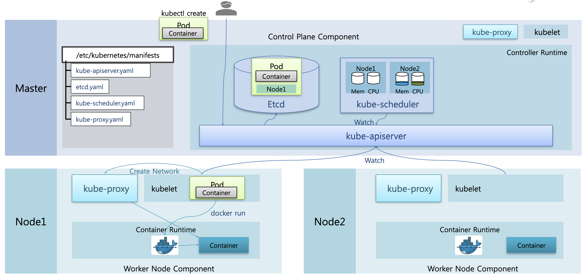
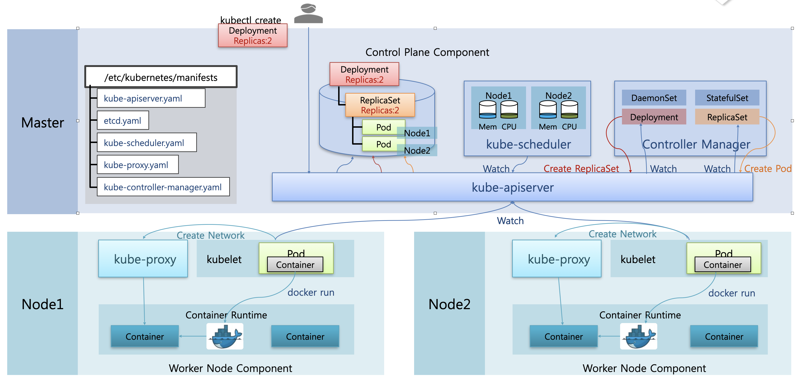

# Component : kube-apiserver, etcd, kube-scheduler, kube-proxy, kube-controller-manager

## Pod 생성 플로우

먼저 쿠버네티스에서 파드가 생성되는 과정을 보면서 각 Component의 역할을 확인해보자.

### 마스터 노드의 Component : kube-apiserver, Etcd, kube-scheduler

쿠버네티스의 마스터노드에는 기본적으로 kube-apiserver, Etcd, kube-scheduler가 파드 형태로 띄어져서 실행된다.  
`/etc/kubernetes/manifests` 디렉토리에 각 컴포넌트의 yaml 파일이 존재하는데, 쿠버네티스 구동 시 해당 파일들을 이용해 파드가 static으로 생성된다.  
또한 각각의 워커 노드에는 kublet과 container runtime인 Docker가 구동된다.

### 1. kube-apiserver에 파드 생성 요청 전달, Etcd에 파드 정보 저장

이러한 구성에서 사용자가 파드 생성 명령을 하면, 해당 명령이 `kube-apiserver`로 전달된다.  
Etcd는 쿠버네티스의 여러 데이터를 저장하는 DB의 역할을 하는데, 파드 생성 시 Etcd에 파드의 구성 정보를 저장한다.

### 2. kube-scheduler에서 노드 자원 상황 체크, Etcd의 파드 정보에 노드 지정

`kube-scheduler`는 수시로 노드의 자원 상황을 체크하면서, 동시에 Watch 기능을 통해 kube-apiserver로부터 `Etcd`에 파드 생성 요청이 들어왔는지 모니터링한다.  
파드 생성 요청이 왔다는 것을 확인하면 노드의 자원 현황을 기준으로 노드를 선택해서, Etcd의 파드 정보에 선택된 노드를 저장한다.

### 3. kublet에서 파드 생성 요청 확인, Docker에 컨테이너 생성 요청

각 워커 노드에 있는 `kublet`도 마찬가지로 Watch 기능을 활용해서, Etcd에 저장된 파드 정보에 자신의 노드가 적혀있는지를 수시로 체크한다.  
그리고 노드에 파드가 할당되었음을 감지하면 파드 정보를 가져와서 생성하기 시작한다.  
먼저 도커에 컨테이너 생성을 요청해서 컨테이너가 생성되게 한다.

### 4. kublet에서 kube-proxy에 네트워크 생성 요청

그리고 /etc/kubernetes/manifests 에는 `kube-proxy`라는 DaemonSet이 포함되어 있어서 각 노드에 기본으로 생성된다.  
파드 생성 시 kubelet은 kube-proxy에 네트워크 생성을 요청하고, kube-proxy는 파드의 통신이 가능하도록 네트워크를 생성한다.

## Deployment 생성 플로우

이번엔 Deployment 생성 플로우를 살펴보자.  
`/etc/kubernetes/manifests` 에는 마스터 노드 상에 kube-controller-manager가 설치되도록 파일이 포함되어 있다.   
kube-controller-manager에는 컨트롤러를 관리하는 쓰레드가 실행되고 있다.

### 1. kube-apiserver에 Deployment 생성 요청 전달, Etcd에 Deployment 정보 저장

사용자가 `replicas: 2` 로 지정한 Deployment 생성을 명령했다고 하자.  
해당 명령은 `kube-apiserver`에 전달되고, Deployment 정보가 `Etcd`에 저장된다.

### 2. kube-controller-manager의 Deployment 쓰레드에서 생성 요청 감지, ReplicaSet 생성 요청

Controller Manager의 Deployment 쓰레드는 kube-apiserver에 watch를 걸어두어서 Deployment 생성 요청이 들어왔는지를 체크한다.  
Deployment 쓰레드가 생성 요청을 감지하면, Etcd에 저장된 정보를 바탕으로 kube-apiserver에 ReplicaSet 생성을 요청한다.

### 2. kube-controller-manager의 ReplicaSet 쓰레드에서 생성 요청 감지, Pod 생성 요청 -> Etcd에 Pod 정보 저장

그러면 Controller Manager의 ReplicaSet 쓰레드가 해당 요청을 마찬가지로 감지해서, template에 지정된 파드를 replicas 만큼 생성하도록 kube-apiserver에 요청한다.  
이에 따라 kube-apiserver는 Etcd에 생성할 파드의 구성 정보를 저장한다.

### 3. kube-scheduler에서 노드 자원 상황 체크, Etcd의 파드 정보에 노드 지정

kube-scheduler에서는 Etcd에 노드를 지정하지 않은 파드 정보가 존재함을 감지하고, 노드의 자원 상황을 체크해서 할당할 노드를 지정한다.

### 4. kublet에서 파드 생성 요청 확인, Docker에 컨테이너 생성 요청

워커 노드의 kublet은 자신의 노드에 파드가 할당되었음을 감지해서, Docker에 컨테이너 생성을 요청한다.

### 5. kublet에서 kube-proxy에 네트워크 생성 요청

이제 또 마찬가지로 kublet에서 kube-proxy에 파드의 네트워크 생성을 요청해서, 파드의 통신이 가능하도록 한다.

