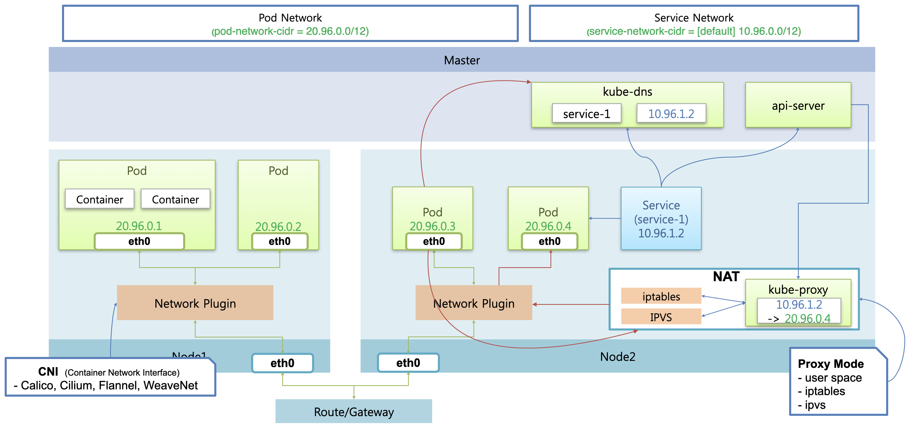

# Networking 개요

네트워킹 분야에는 매우 다양한 기술이 있고, 모든 기술들의 작동방식을 이해하는 것은 쉽지 않다.  
따라서 본 강의에서는 전반적인 흐름과 아키텍쳐만 설명하고, 세부적인 기술을 다루지는 않는다.

## Pod Network 개요

먼저 다룰 것은 Pod Network 영역으로, pod-network-cidr 네트워크 대역에서 관리되는 네트워킹이다. (20.96.0.0/12)

### Pod Network에 의해 관리되는 네트워킹

먼저 Pod 내의 컨테이너간 네트워킹을 하는 부분이 있다.  
파드가 생성이 되면 pod-network-cidr의 대역 내에서 고유 IP를 가지고 있는 인터페이스가 생성된다. (ex - 20.96.0.1)  
이를 통해서 파드 내의 컨테이너들은 서로 통신할 수 있다.

그리고 파드 간 네트워킹을 하는 부분도 있다.  
각 파드마다 IP가 존재하는데, 노드에는 Network Plugin이 설치되어 있어서 이를 통해 Pod 간의 통신이 가능해진다.  
Network Plugin은 노드 위의 파드들 간의 통신 뿐만 아니라, 외부 네트워크를 통한 타 노드의 파드와의 통신도 담당한다.

### 다양한 Network Plugin

쿠버네티스가 기본으로 제공하는 Network Plugin에 kubenet이 있는데 기능에 제한이 있는 편이다.  
보통은 CNI(Containter Network Interface)를 통해 다양한 오픈 소스 플러그인을 설치해서 사용한다.  
각 네트워크 플러그인마다 네트워크를 제공하는 방법과 기능이 다르기 때문에 스펙을 잘 살펴보고 사용해야 한다.

강의에서는 모든 기능을 전반적으로 제공하는 Calico를 사용한다.

## Service Network 개요

Service Network는 service-network-cidr 네트워크 대역에서 관리되는 네트워킹이다. (default: 10.96.0.0/12)

### Service 생성 시 동작 - kube-proxy, NAT

서비스가 생성되어 파드에 붙게 되면, 서비스에도 고유의 IP가 생성된다.  
이와 동시에 마스터 노드의 kube-dns에는 서비스의 이름과 IP에 대한 도메인이 저장된다.

kube-apiserver는 각 워커 노드의 kube-proxy에 각 서비스가 어느 IP에 연결되어 있는지를 알려준다.  
이제 kube-proxy 에서는 Service의 IP를 Pod의 IP로 변경해주는 NAT 기능을 수행해야 하는데, 이 때 kube-proxy가 iptables와 IPVS를 어떻게 다루는지에 따라서 세가지의 Proxy Mode로 나뉘게 된다.(user space, iptables, ipvs)

### Service 이름 호출 시 플로우

이 상태에서 서비스의 이름을 호출하면 kube-dns를 통해 서비스의 IP를 알게 되고, 이를 이용해 NAT 영역을 호출하게 된다.  
NAT에는 각 서비스의 파드 매핑 정보가 저장되어 있기 때문에, 이를 이용하여 Network Plugin을 통해 파드에 연결하게 된다.  
결국 Service 객체의 동작은 NAT 영역의 기능에 달려있게 된다.

### Service 삭제 시

Service 객체가 삭제되는 경우에는 kube-apiserver가 이를 감지하고 kube-proxy에게 관련된 설정을 삭제할 것을 요청한다.

