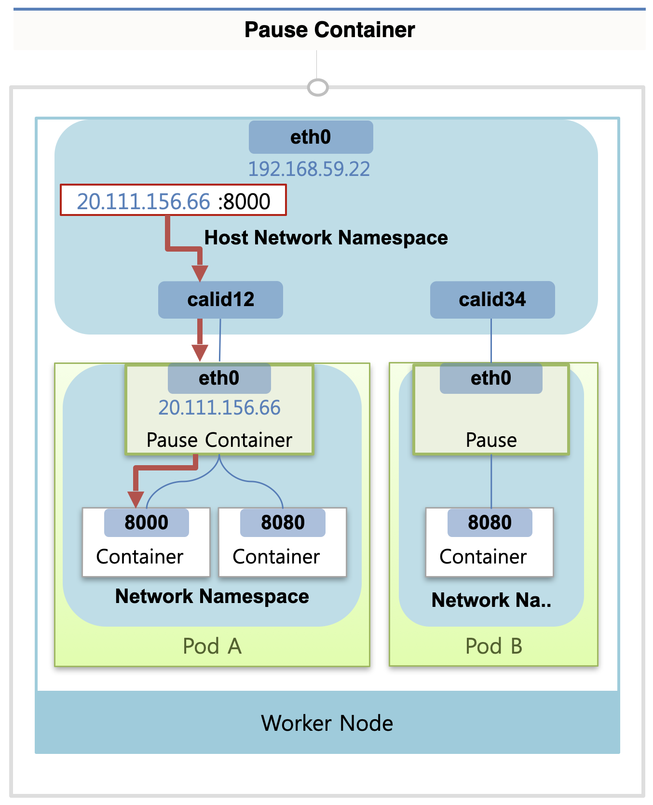

# Networking

## Pod Network (with Calico)

### Pause Container

파드가 생성되면 그 안에 네트워킹을 담당하는 Pause Container가 생성된다.  
Pause Container 에는 interface가 달려 있어서 ip를 할당 받는데, 해당 파드 내의 컨테이너들은 모두 Pause Container의 네트워크 인터페이스를 사용하게 된다.  
따라서 파드 내의 컨테이너들은 동일한 IP를 공유하게 되고, 각 컨테이너들은 포트 번호를 기준으로 분리되어 통신을 받는다.   

한편 Worker Node에는 `Host Network Namespace`가 존재하고, 여기에 `Host IP Interface`가 붙어있다.  
Pause Container가 생성되면, Host Network Namespace에 가상 인터페이스가 하나 생겨서 Pause Container의 인터페이스에 연결된다.  
파드를 만들 때마다 Pause Container가 생성되기 때문에, 각 파드마다 가상 인터페이스가 1:1로 매칭되어 생성된다.

최종적으로 워커 노드 내에서 Pause Container의 IP에 특정 컨테이너의 포트로 요청을 보내면(20.111.156.66:8000), 트래픽이 가상 인터페이스를 거쳐서 Pause Container의 인터페이스로 간 다음, 포트 번호에 따라 특정 컨테이너에 전달된다.  
이와 같이 외부에서 들어오는 트래픽을 특정 파드의 특정 컨테이너로 전달하는 것은 Pause Container의 기능을 통해 가능했다.

### Network Plugin

다음으로 Network Plugin을 사용하는 것과 관련된 부분을 설명하겠다.

#### kubenet

먼저 쿠버네티스에서 기본으로 제공하는 kubenet을 사용할 때에 대한 설명이다.

Host Network Namespace에 가상 인터페이스가 등록된 상태에서, kubenet은 cbr0라는 `컨테이너 Bridge`에 가상 인터페이스들을 포함시킨다.  
Bridge의 네트워크 대역은 파드의 네트워크 대역보다 한 단계 낮은 대역으로 설정된다.  
(Ex - 파드 네트워크 대역: 20.96.0.0, 브릿지 네트워크 대역: 20.96.1.0)  
Bridge에서 생성되는 파드 IP의 경우 해당 Bridge CIDR 범위 내에서 할당된다 (20.96.1.0 ~ 20.96.1.255)  
총 256개의 파드 IP만 할당이 가능한 것인데, 이 점이 kubenet을 사용했을 때 한계점이기도 하다.

또한 Network Plugin은 NAT를 통해 Router 역할을 수행하기도 한다.  
요청된 IP가 Pod IP 대역(브릿지의 네트워크 대역)이면 이는 Bridge 쪽으로 전달하고, 그 외의 IP는 워커 노드 단의 네트워크 인터페이스로 올려주는 식으로 작동한다.

#### Calico

이번엔 Calico를 사용했을 때의 설명이다.  
Calico 플러그인은 Host Network Namespace에 등록된 가상 인터페이스가 Router에 바로 연결되는 구조를 채택하고 있어서, 파드 간 통신은 라우터가 직접 담당하게 된다.  
이 때 Router의 CIDR은 Pod Network CIDR과 무관하게 정해지기 때문에, kubenet에서 Bridge를 사용했을 때에 비해 더 넓은 범위의 IP를 파드에 할당할 수 있다.  
(ex 20.109.0.0 ~ 20.109.255.255)

또한 Calico에서는 보안적인 기능을 추가적으로 제공해서, 라우터와 파드 사이에서 firewall을 두는 것도 가능하다.

그리고 Router 윗단에는 Overlay Network를 제공해주는 층이 있는데, IPIP, VXLAN 방식 중 선택해서 사용할 수 있다.  
Overlay Network는 다른 노드에 있는 파드들 간 통신을 가능하게 한다.

Calico를 사용했을 때 각각의 워커 노드에 있는 파드들이 Overlay Network를 통해 어떻게 통신하는지 예시 상황을 통해 확인해보자.
노드 2에 있는 Pod D에서, 노드 1에 있는 Pod B로 요청을 보내는 상황이다.  
Pod B의 Ip인 20.111.156.7을 호출하면, 먼저 노드 2의 라우터의 가상 interface에서 IP를 찾게 되는데, 해당하는 IP가 라우터에 없기 때문에 Overlay Network 층으로 올라간다.  
Calico에서는 요청한 IP의 대역이 어느 노드의 Router Network 대역인지 확인해서, 패킷을 해당 노드에 대한 IP(192.168.59.22)로 변경하고 원래의 Pod IP는 안에 숨겨둔다.  
이를 Pod의 IP가 incapsulation 되었다고 말한다.

이제 지정된 IP에 따라 노드1의 Host Interface로 패킷이 전달되고, 노드1의 Overlay Network 층에서 패킷이 decapsulation 되어 IP가 다시 Pod IP로 변경된다.  
이제 패킷은 자신의 IP가 속한 라우터로 전달되고, 최종적으로 라우터에서 IP에 맞는 가상 interface를 거쳐서 적절한 Pod에 전달된다.

## Service Network (with Calico)

### Proxy Mode

파드가 정상적으로 기동되어 Service를 붙이게 되면, Entpoint라는 객체가 중간에 생성되어서 실질적인 연결 상태를 담당하게 된다.  
이 때 Service IP가 Service Network CIDR 범위 내에서 생성된다.  
api-server에서는 Endpoint가 생성되었음을 감지하면, 각 노드에 실행되고 있는 DaemonSet인 kube-proxy에게 해당 Service IP가 특정 Pod IP로 포워딩 된다는 정보를 전달한다.

쿠버네티스가 제공하는 Service Network의 Proxy Mode에는 3가지 종류가 있는데, 각 경우에 다르게 동작한다.

#### Userspace Mode

각각의 Worker Node에는 기본적으로 iptables가 설치되어 있는데, iptables에 Service CIDR로 들어오는 트래픽은 모두 kube-proxy에 전달하도록 설정되어 있다.  
특정 파드에서 서비스의 IP를 호출하면, 해당 트래픽은 iptables를 거쳐서 kube-proxy로 전달되고, kube-proxy에서 자신이 가지고 있는 Service IP - Pod IP 매핑 정보를 확인해서 트래픽의 target IP를 Pod IP로 변경한다.  
이렇게 변경된 후에는 Pod Network에 의해서 목표 Pod에 트래픽이 전달된다.

Userspace Mode의 문제점은 모든 트래픽이 kube-proxy를 거쳐야 한다는 점이다.  
kube-proxy 자체는 모든 트래픽을 감당할 만큼 성능이나 안정성이 좋지 않기 때문에 잘 쓰이지 않는 방식이다.

#### Iptables/IPVS Mode

Iptables Mode에서는 kube-proxy에서 받은 Service IP - Pod IP 매핑 정보가 iptables에 등록된다.  
이에 따라서 Service IP에 보내는 트래픽들은 모두 iptables에서 Pod IP로 변환된다.
이는 쿠버네티스를 설치했을 때 기본으로 설정되는 방식이고, 성능이나 안정성 측면에서 Userspace Mode 보다 훨씬 좋다.

IPVS Mode에서는 리눅스에서 제공하는 IPVS라는 L4 로드 밸런서를 사용한다.  
해당 모드에서는 iptables가 했던 일들을 IPVS가 대신하게 된다.  
낮은 트래픽에서는 Iptables Mode와 IPVS Mode의 성능이 비슷하지만, 부하가 커질수록 IPVS Mode의 성능이 좋은 것으로 알려져 있다.

### Service Type (ClusterIP)

서비스의 타입(ClusterIp, NodeIp)마다 트래픽의 흐름에 차이가 있다.
먼저 ClusterIp의 경우를 살펴보자.

각 노드의 Router는 Service IP를 Pod IP로 바꿔주는 NAT 역할을 할 수 있다.  
이 때 노드 2에 있는 Pod D에서 노드 1에 있는 Pod B로 요청을 보내는 상황을 예시로 들어보자.  
Pod B에는 ClusterIp 타입의 서비스 객체가 붙어있는 상황이다.

Pod D에서 Pod B에 연결된 Service IP로 요청을 보내면, Router 단에서 해당 Service IP에 매칭되는 Pod IP로 변경되고, 이것이 Overlay Network를 지나서 노드 1의 IP로 캡슐화된다.  
여기부터는 Pod Network를 통해서 통신이 이루어진다.

### Service Type (NodePort)

여기서는 동일한 상황에서 Pod B가 NodePort 타입의 서비스에 연결되어 있다고 하자.
이 경우에는 모든 노드의 kube-proxy가 자신의 노드에 해당 NodePort를 열어준다.
이 때 외부에서 해당 NodePort로 트래픽이 들어오면, iptables에서 해당 트래픽을 Calico Network Plugin(Router)로 보내준다.  
이를 통해 트래픽이 Router로 전달되고, Router의 NAT 기능을 통해 Pod IP로 변환되면서 동일하게 Pod Network 영역으로 넘어가게 된다.

