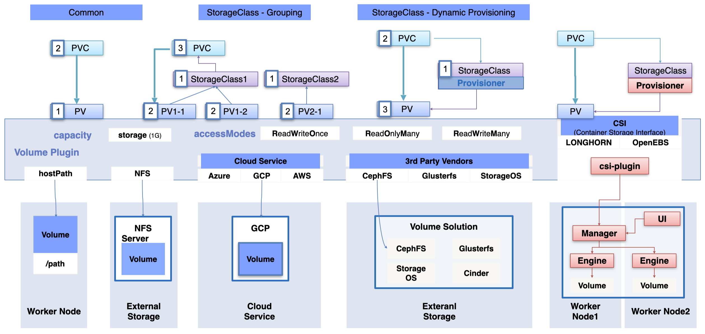
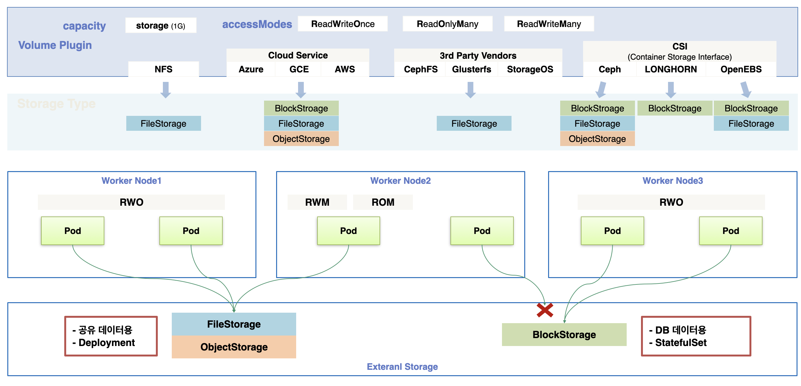
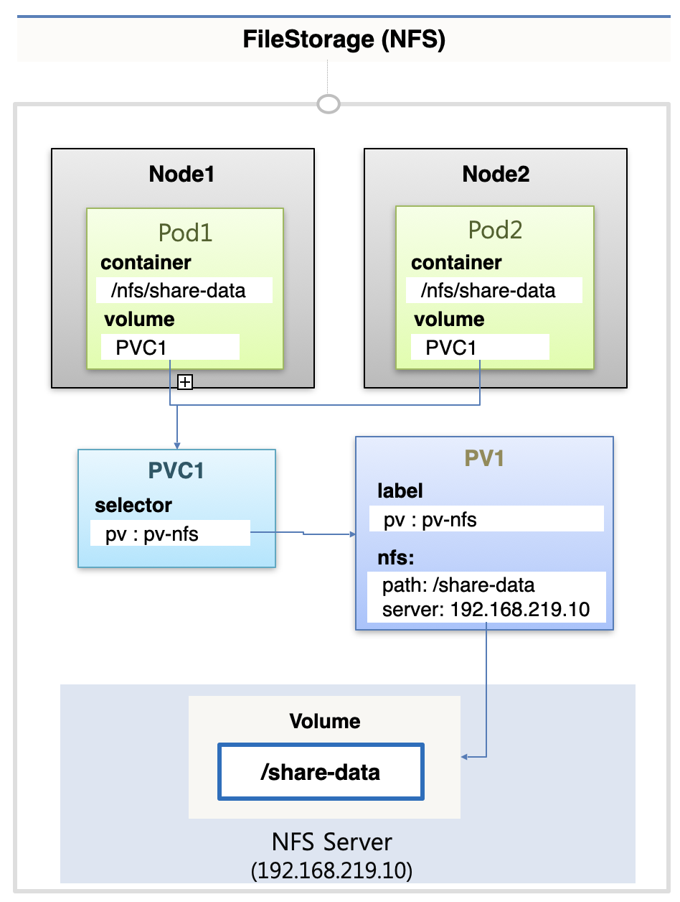
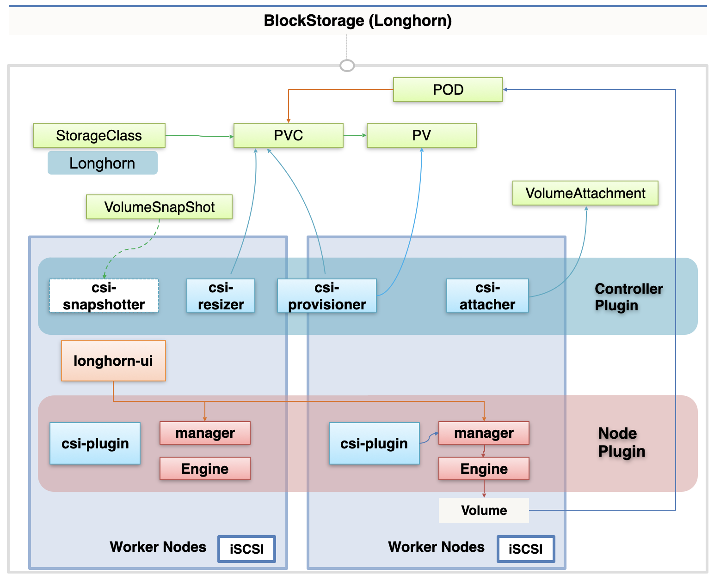

# Storage

## Storage를 만드는 여러가지 방법

Storage 볼륨을 만드는 방법에는 여러 가지가 있다.

### 개별 PV 생성

먼저 PV를 개별적으로 만들고 PVC를 만들어서 붙이는 방법이 있다.

### StorageClass를 이용한 그룹핑

또한 StorageClass를 그룹의 개념으로 사용해서, 각 PV를 만들 때 StorageClass에 붙여서 그룹핑을 할 수 있다.  
PVC는 srorageClassName을 지정해서 특정 StorageClass에 속한 PV 중 자원 상황에 맞는 PV를 할당받을 수 있다.

### Dynamic Provisioning

다음으로 StorageClass에 PV를 생성해줄 Provisioner를 지정해서 동적으로 PV를 생성하는 방법도 있다.  
PVC에 해당 StorageClass를 지정하면 Provisioner가 생성한 PV가 연결된다.

## PV에 적용 가능한 옵션들

PV에는 기본적으로 용량인 `capacity`와 접근 모드인 `accessModes`를 지정한다.

또한 `Volume Plugin`을 통해 PV가 실질적으로 어떻게 동작할지를 지정하게 된다.

### hostPath

Volume Plugin을 `hostPath`로 구성하게 되면 워커 노드의 지정된 경로를 volume으로 사용하게 된다.

### NFS

Volume Plugin을 `NFS`로 구성하고 외부 스토리지의 NFS 서버를 이용하여 볼륨을 연결하는 방법도 있다.  
이 때에는 PV가 NFS Client의 역할을 하게 되는 것인데, 쿠버네티스에서 OS에 설치된 NFS Client를 이용하여 해당 기능이 동작하게 된다.  
만약 OS에 NFS Client가 설치되어 있지 않다면 NFS Volume Plugin을 사용할 수 없다.

### Cloud Provider

만약 외부 클라우드 서비스의 스토리지를 이용한다면, 각 서비스에 맞는 Volume Plugin을 사용해서 연결해야 한다.

### 3rd Party

또한 자신들의 Volume Solution을 제공하는 회사들을 이용할 수도 있는데, PV를 통해 해당 솔루션에 바로 연결할 수 있다.  
각 회사들이 자신들의 볼륨에 연결할 수 있는 솔루션을 오픈 소스로 공개해두었기 때문에, 이를 이용해서 연결할 수 있다. (CaphFS, Glusterfs, StorageOs)  
솔루션에서 Provisioner를 제공하는 경우에는 dynamic provisioning을 통해 동적으로 PV를 생성할 수도 있는데, 이를 지원하는지 여부는 공식 문서에서 확인해야 한다.

### CSI(ContainerStorageInterface)

마지막으로 CSI를 사용할 수도 있다.

CSI는 쿠버네티스 상에 미리 스토리지 솔루션을 설치하지 않은 상태이거나, 최신 버전의 볼륨을 지원하는 플러그인을 사용하고자 할 때 사용할 수 있다.  
기업들은 CSI 규약에 맞춰 csi-plugin이나 provisioner를 제공하고 있고, 이를 이용하면 클러스터에 쉽게 해당 플러그인을 반영할 수 있다.

이 때 기존의 볼륨 솔루션에 연결하는게 아니라, 컨테이너로 볼륨 시스템을 띄우는 식으로 제공하는 기업도 많다.  
이 경우에는 사전 세팅 없이 플러그인과 솔루션을 구성하고, 이를 PV/PVC에 간단하게 연결할 수 있다.

## Storage Type과 AccessMode

### 각 Volume Plugin 별 Storage Type

각 볼륨 플러그인 별로 Storage Type이 다르다.

먼저 `NFS`의 경우 FileStorage를 사용한다.

`Cloud Service`에서는 BlockStorage, FileStorage, ObjectStorage를 모두 지원한다.

그리고 쿠버네티스에서 `3rd party vendor`를 제공하는 기업들은 대체로 FileStorage를 지원하고 있다.

`CSI`의 경우 각 기업마다 다른데, Ceph의 경우 컨테이너로 볼륨을 띄울 경우 BlockStorage, FileStorage, ObjectStorage를 모두 사용 가능하다.  
다른 기업들은 자신의 솔루션에 맞는 볼륨 타입을 제공한다. (Longhorn - BlockStorage, OpenE8S - Block/FileStorage)

자신이 사용하는 스토리지의 타입을 인지하고, 여기서 어떤 accessMode가 지원되는지를 알고 활용해야 한다.

### 각 Storage Type의 동작 방식

이때 FileStorage, ObjectStorage 와 BlockStorage가 기술적으로 다르게 동작하는 부분이 있다.

FileStorage, ObjectStorage는 RWO 모드를 지원하기 떄문에 한 노드 위의 여러 파드들이 연결하는 것이 가능하다.  
또한 RWM과 ROM 모드를 지원하기 때문에 여러 노드 위의 파드들이 연결하는 것도 가능하다.

이와 달리 BlockStorage는 노드 위에 스토리지를 마운팅하는 개념이기 때문에, 자신이 마운팅된 노드 위의 파드들만 연결할 수 있다.  
그렇기 때문에 파드가 다른 노드로 이동하면 기존에 사용하던 볼륨을 사용할 수 없게 된다.
그렇기 때문에 BlockStorage는 RWO 모드만 지원 가능하다.

FileStorage, ObjectStorage는 파드가 어느 노드에 있건 스토리지를 공유할 수 있기 때문에, 공유 데이터용으로 사용한다.  
주로 Deployment에 PV를 붙일 때 사용하게 되고, ObjectStorage는 특히 백업용이나 이미지 저장용으로 많이 사용한다.

이와 달리 BlockStorage는 주로 DB 데이터를 저장하는 용도로 사용한다.  
특정 노드에 마운팅된다는 점으로 인해 Read/Write가 빠르다는 장점이 있다.  
StatefulSet은 Pod 생성 시마다 PVC를 만들기 때문에, 파드와 PVC 및 PV가 동일한 노드에 생성된다.  
이 점으로 인해 RWO만 지원하는 BlockStorage와도 잘 호환된다.  
실제로 대부분의 DB Solution은 BlockStorage를 사용한 StatefulSet으로 구성하는 경우가 많다.

## 각 Storage 실습 방법

### FileStorage(NFS) 실습

FileStorage를 지원하는 NFS를 통해 실습해본다.  
먼저 NFS를 직접 구축해보고, 이를 PV로 연결한 다음, label - selector를 이용해 PVC와 연결할 것이다.  
이제 서로 다른 노드에 각각 파드를 만들어서 PVC를 마운팅한 후, FileStorage를 통한 파일 공유가 잘 이루어지는지 확인해볼 것이다.

### BlockStorage(Longhorn) 실습

BlockStorage를 실습하기 위해, 먼저 Volume Solution(Longhorn)과 CSI를 설치한다.  
이러면 노드 위에 다양한 파드들이 생성되는데, 크게 Control Plugin과 Node Plugin이 있다.
Control Plugin의 파드들은 주로 Deployment를 통해서 만들어지고, CSI의 주요 역할들을 담당한다.
Node Plugin의 파드들은 DaemonSet을 통해서 각 노드 위에 만들어지는데, 각 노드에서 솔루션의 기능을 수행하여 실질적으로 볼륨을 생성하는 역할을 한다.

#### 볼륨이 생성되는 흐름

초기에 Longhorn이라는 이름의 StorageClass가 만들어져 있다.  
이를 이용하여 PVC를 만들면 csi-provisioner가 이를 감시하고 있다가, PVC 생성이 완료되면 이에 맞는 PV를 생성해주고, 결국 PV가 PVC에 연결된다.
또한 csi-resizer도 PVC의 볼륨 사이즈가 변하는지를 모니터링하다가, 사용자가 볼륨의 크기를 변경하면 관련된 처리를 해주는 역할을 한다.  
csi-snapshotter는 VolumeSnapshot을 이용해서 볼륨에 대한 스냅샷을 저장한다.

PV가 노드에 생성이 되면 해당 노드의 csi-plugin은 해당 노드에 있는 volume solution manager에 볼륨 생성을 요청하고, 해당 요청은 최종적으로 Engine에 전달되어 Engine이 Volume을 생성한다.
이 떄 Pod를 PVC에 붙이면 VolumeAttachment라는 객체가 생기는데, csi-attatcher는 VolumeAttachment 생성을 감지하면 볼륨을 파드에 마운트하는 역할을 한다.

그리고 솔루션 자체적으로 제공하는 ui가 있는데(longhorn-ui), 이는 각 노드의 manager에 붙어 있어서 볼륨에 대한 모니터링과 제어가 가능하다.

