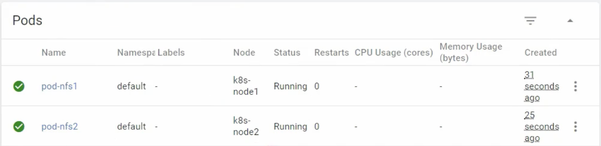
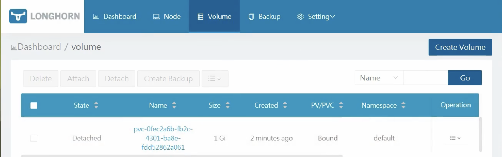
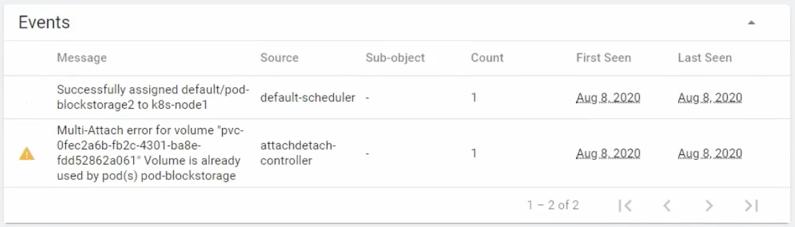

# Storage 실습

이번에는 Storage Architecture에 대해서 실습해보자.

## FileStorage - NFS

### NFS 설치 및 실행

먼저 다음의 커맨드로 패키지를 설치하고 다운을 받아야 한다.

```bash
yum -y install nfs-utils rpcbind
```

이제 다음의 커맨드로 NFS 서버를 띄울 수 있다.

```bash
systemctl start rpcbind
systemctl start nfs-server
systemctl start rpc-statd
systemctl enable rpcbind
systemctl enable nfs-server
```

다음의 커맨드로 NFS서버의 작동을 확인한다.

```bash
$ systemctl status nfs-server

nfs-server.service - NFS server and services
  Loaded: loaded (/usr/lib/systemd/system/nfs.server.service; enabled; vendor preset: disabled)
  Active: active (exited) since .  2023-08-08 15:30:03 KST; 18s ago
Main PID: 6046 (code exited, status=0/SUCCESS)
  CGroup: /system.slice/nfs.server.service
```

이제 다음의 커맨드로 공유 폴더를 만들고, 해당 폴더에 대한 권힌을 허용한다.

```bash
mkdir /share-data
chmod 777 /share-data
```

이제 exports 파일을 설정해야 힌다(vi /etc/exports)  
모든 ip에서 read/write 권한으로 접근 가능하고, root권한으로 접근이 가능하도록 설정되어 있다.

```bash
/share-data *(rw,sync,no_root_squash)
```

다음 커맨드로 exports 파일의 내용을 반영시킨다.

```bash
exportfs -r
```

또한 방화벽을 끈 상태에서 nfs서버를 재시작한다.

```bash
systemctl stop firewalld && systemctl disable firewalld
systemctl stop NetworkManager && systemctl disable NetworkManager
systemctl restart nfs-server
```

이제 NFS 서버를 파일 서버로 사용하기 위한 모든 준비를 마쳤다.

### NFS 서버의 스토리지를 PV로 연결

이제 본격적으로 NFS 서버를 이용한 PV를 구성해보자.

다음의 구성 파일로 NFS VolumePlugin을 이용한 PV를 생성한다.  
path에 공유할 디렉토리 경로, server에 연결할 NFS 서버의 IP를 입력한다.

```yaml
apiVersion: v1
kind: PersistentVolume
metadata:
  name: pv-nfs
  labels:
    pv: pv-nfs
spec:
  capacity:
    storage: 2G
  accessModes:
    - ReadWriteMany
  nfs:
    path: /share-data
    server: 192.168.219.10
```

이제 PV를 연결할 PVC를 생성한다.
accessModes와 resources 정보를 맞추고, pv: pv-nfs 라벨을 이용해서 PV를 선택하여 연결한다.

```yaml
apiVersion: v1
kind: PersistentVolumeClaim
metadata:
  name: pvc-nfs
spec:
  accessModes:
    - ReadWriteMany
  resources:
    requests:
      storage: 2G
  storageClassName: ""
  selector:
    matchLabels:
      pv: pv-nfs
```

이제 해당 PVC를 연결한 파드를 생성한다.  
volume-nfs PVC를 선택해서 /nfs/share-data 경로에 연결한다.

```yaml
apiVersion: v1
kind: Pod
metadata:
  name: pod-nfs
spec:
  containers:
    - name: container
      image: kubetm/init
      volumeMounts:
        - name: volume-nfs
          mountPath: /nfs/share-data
  volumes:
    - name: volume-nfs
      persistentVolumeClaim:
        claimName: pvc-nfs
```

해당 구성 파일을 이용하여 2개의 파드를 서로 다른 노드에 생성한다.



이렇게 하면 두 파드가 동일한 PV를 공유하게 된다.  
하나의 파드에서 /nfs/share-data 경로에 파일을 생성하면, 다른 파드에서도 해당 파일을 확인할 수 있다.  
또한 nfs-server의 /share-data 경로에도 파일이 생성되어 있는 것을 확인할 수 있다.

## Block Storage - Longhorn

### Longhorn 설치

이번에는 Longhorn을 이용해서 BlockStorage를 구성해보자.  
먼저 Longhorn은 iscsi 라는 통신 인터페이스를 사용하기 때문에, 모든 노드에 `iscsi-initiator-utils` 라이브러리를 설치해야 통신이 가능하다.

```bash
yum install -y iscsi-initiator-utils
```

이제 다음의 커맨드로 Longhorn을 설치한다.

```bash
kubectl apply -f https://raw.githubusercontent.com/longhorn/longhorn/master/deploy/longhorn.yaml
```

다음의 커맨드로 설치된 오브젝트들을 확인할 수 있다.

```bash
kubectl get pods -n longhorn-system

NAME                                      READY STATUS  RESTARTS AGE
csi-attacher-5b4745c5f7-7g8hr             1/1   Running 0        54s
csi-attacher-5b4745c5f7-9rg2d             1/1   Running 0        54s
csi-attacher-5b4745c5f7-kjhz7             1/1   Running 0        54s
csi-provisioner-57d6dbf5f4-54rbk          1/1   Running 0        53s
csi-provisioner-57d6dbf5f4-jnsr6          1/1   Running 0        53s
csi-provisioner-57d6dbf5f4-kd9xx          1/1   Running 0        53s
csi-resizer-75ff56bc48-7t7b6              1/1   Running 0        52s
csi-resizer-75ff56bc48-jhj5l              1/1   Running 0        52s
csi-resizer-75ff56bc48-n5hbl              1/1   Running 0        52s
engine-image-ei-3bdi6bdf-jqpww            1/1   Running 0        92s
engine-image-ei-3bd16bdf-n84gk            1/1   Running 0        92s
instance-manager-e-31b86b93               1/1   Running 0        73s
instance-manager-e-60faadd4               1/1   Running 0        91s
instance-manager-r-a374db37               1/1   Running 0        90s
instance-manager-r-c97794c9               1/1   Running 0        72s
longhorn-csi-plugin-rq5g5                 2/2   Running 0        52s
longhorn-csi-plugin-xtpqt                 2/2   Running 0        52s
longhorn-driver-deployer-6fd7b78f55-jb4sc 1/1   Running 0        118s
longhorn-manager-8k61z                    1/1   Running 0        2m
longhorn-manager-cwz7g                    1/1   Running 0        2m
longhorn-ui-787bd98565-fwnjm              1/1   Running 0        119s
```

다음의 커맨드로 Longhorn StorageClass를 조회할 수 있다.

```bash
kubectl get storageclasses.storage.k8s.io -n longhorn-system longhorn

Name:                 longhorn
IsDefaultClass:       No
Annotations:          kubectl.kubernetes.io/last-applied-configuration={"allowVolumeExpansion":true,"apiVersion":"storage.k8s.io/v1","kind":"StorageC lass","metadata":{"annotations":{},"name":"longhorn"},"parameters":{"fromBackup":"","numberOfReplicas":"3","staleReplicaTimeout":"2880"},"provis ioner":"driver.longhorn.io"
Provisioner:          driver.longhorn.io
Parameters:           fromBackup=,numberOfReplicas=3, staleReplicaTimeout=2880
AllowVolumeExpansion: True
MountOptions:         <none>
ReclaimPolicy:        Delete
VolumeBindingMode:    Immediate
Events:               <none>
```

이 때 Parameters를 확인해보면 `numberOfReplicas=3`으로 설정되어 있다.  
StorageClass는 각 노드에 하나씩 만들어지는데, 기본 설정으로는 3개의 노드에 각각 하나씩 생성되어 총 3개의 복제본이 만들어진다.  
현재 테스트 환경에서는 노드를 2개만 구성해둔 상태이기 때문에, 2개의 복제본만 생성하도록 설정을 변경해야 한다.  
기존의 Longhorn StorageClass를 삭제하고, 다음의 설정 파일로 StorageClass를 생성한다.

```bash
kubectl delete storageclasses.storage.k8s.io -n longhorn-system longhorn
```

```yaml
kind: StorageClass
apiVersion: storage.k8s.io/v1
metadata:
  name: longhorn
provisioner: driver.longhorn.io
allowVolumeExpansion: true
parameters:
  numberOfReplicas: "2"
  staleReplicaTimeout: "2880"
  fromBackup: ""
```

또한 Dashboard를 외부에서 접속 가능하게 하기 위해 연결된 Service 타입을 NodePort로 변경한다.

```bash
kubectl edit svc -n longhorn-system longhorn-frontend
# spec: type: NodePort로 변경
# spec: ports의 http NodePort를 30001로 삽입
```

### BlockStorage 생성

먼저 다음의 구성파일로 PVC를 생성한다.  
`storageClassName: longhorn` 으로 지정하여 Longhorn BlockStorage에 연결된 PV가 자동 생성되도록 구성한다.

```yaml
apiVersion: v1
kind: PersistentVolumeClaim
metadata:
  name: longhorn-pvc
spec:
  accessModes:
    - ReadWriteOnce
  storageClassName: longhorn
  resources:
    requests:
      storage: 1Gi
```

이제 localhost:30001을 통해 Longhorn 대시보드에 접속하면 Detached 된 상태로 PV가 생성된 것을 확인할 수 있다.



이제 PVC를 연결한 파드를 생성한다.

```yaml
apiVersion: v1
kind: Pod
metadata:
  name: pod-blockstorage
spec:
  containers:
    - name: container
      image: kubetm/init
      volumeMounts:
        - name: volume-blockstorage
          mountPath: /longhorn/data
  volumes:
    - name: volume-blockstorage
      persistentVolumeClaim:
        claimName: longhorn-pvc
```

이제 볼륨이 파드에 마운트되어 상태가 Detached에서 Healthy로 바뀐다.


 
다음의 커맨드로 volumeattachment가 생성된 것을 확인할 수 있다.

```bash
kubectl get -n longhorn-system volumeattachments.storage.k8s.io

NAME                                                                 ATTACHER          PV                                       NODE      ATTACHED AGE
csi-6a7648a66296f4dad1945bd47baccca2e4e203876a8ae105fe7715105322df20 driver.longhorn.io pvc-Ofec2a6b-fb2c-4301-ba8e-fdd52862a061 k8s-node2 true     80s
```

BlockStorage는 RWO 모드로 생성되기 때문에, 다른 노드의 파드에서는 마운트가 불가능하다.  
만약 다른 노드의 파드를 생성하면 다음과 같이 에러가 발생한다.


