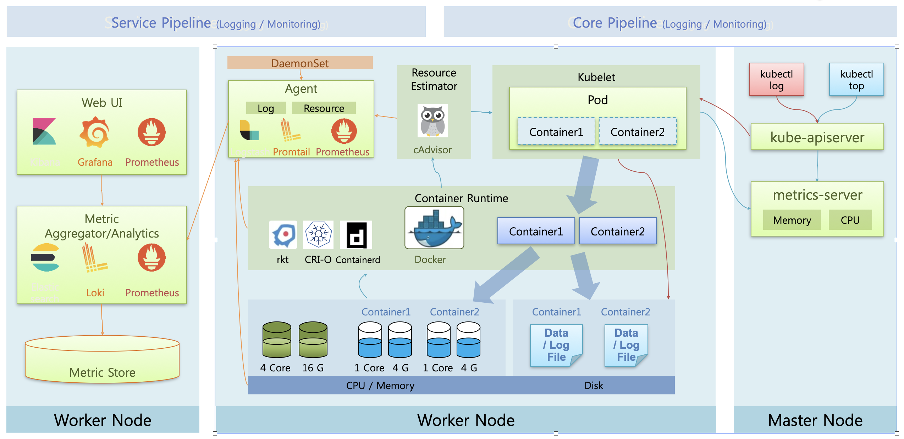
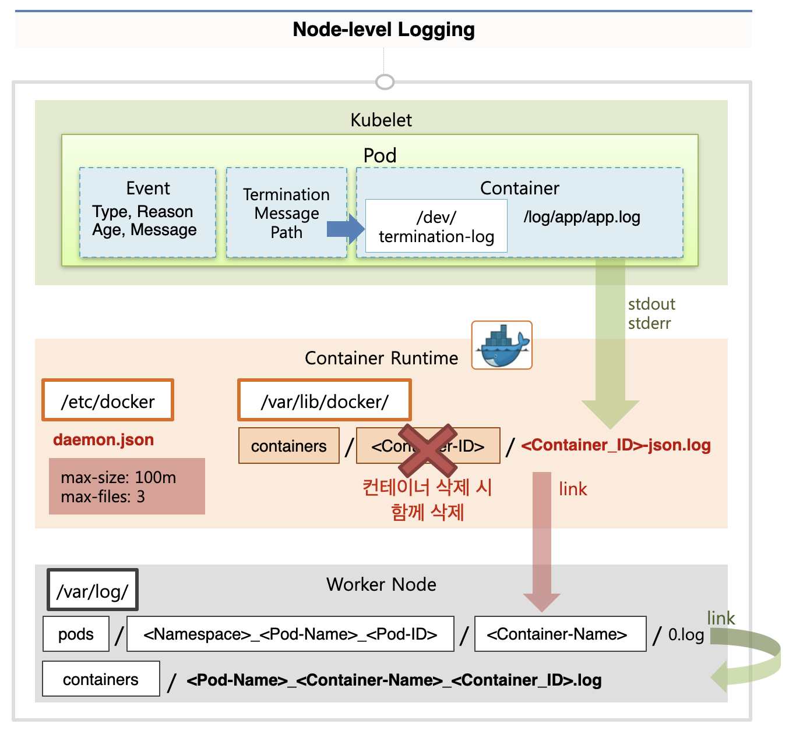
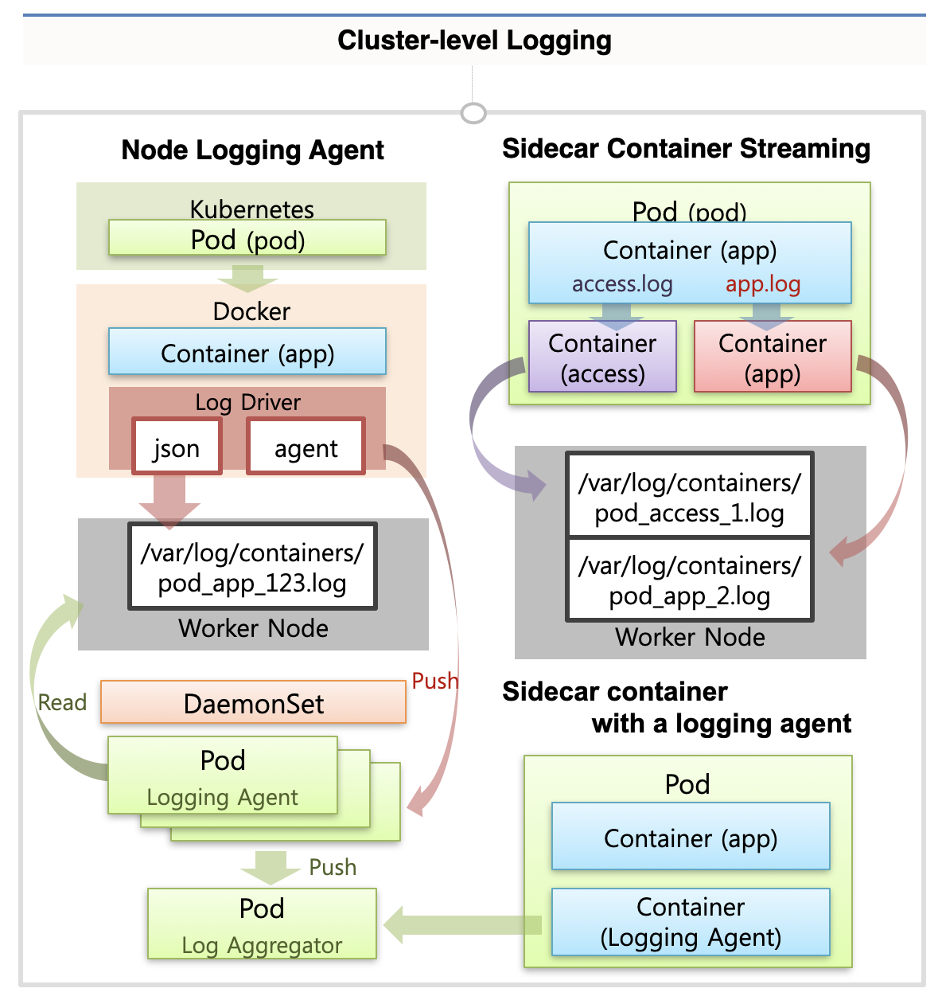
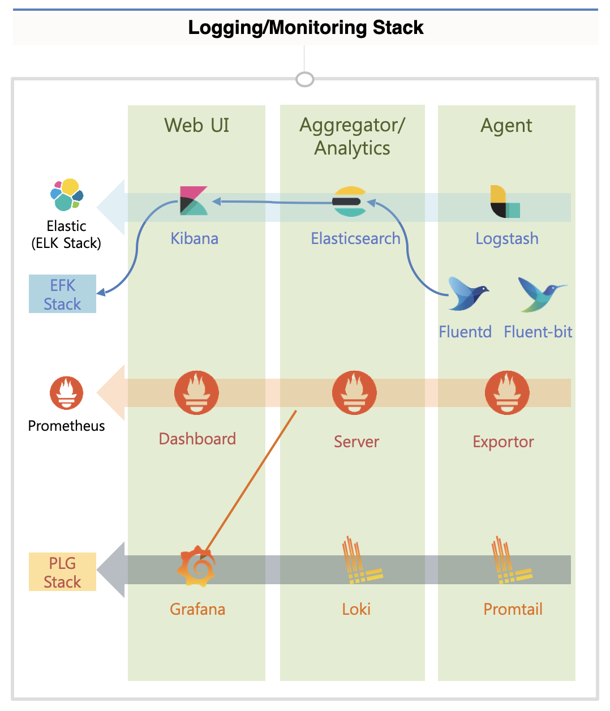
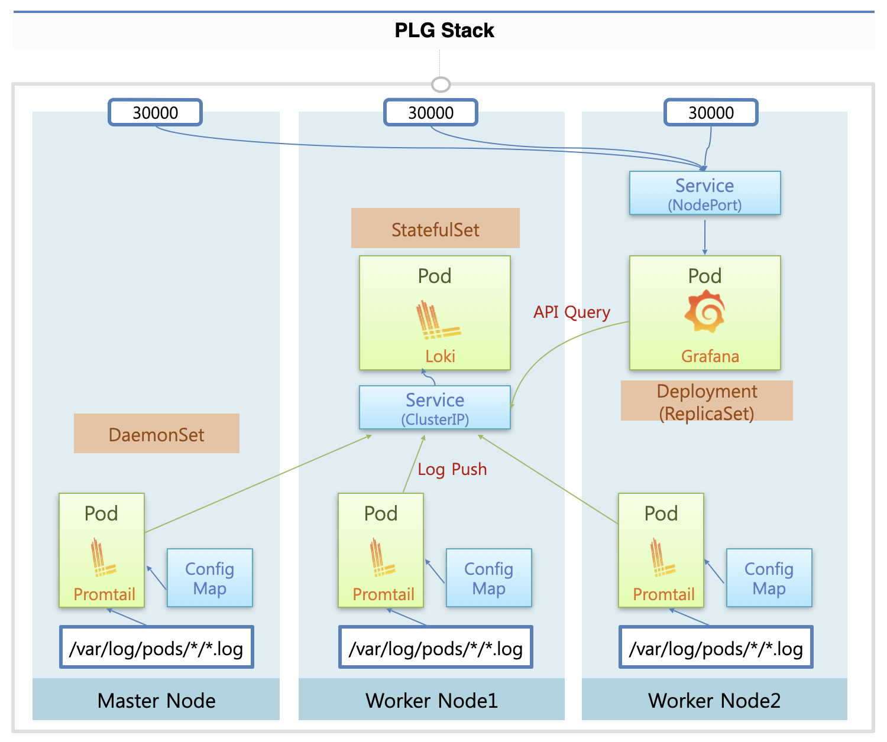

# Logging & Monitoring

쿠버네티스에서 Logging은 앱의 로그 데이터를 다루고, Monitoring은 엡의 cpu, memory 사용을 다룬다.

## Core Plugin vs Service Plugin

이 때 쿠버네티스가 기본으로 제공하는 Core Pipeline이 있고, 추가적인 플러그인을 설치한 Service Plugin이 있다.

### Core Plugin

#### 워커 노드의 기본 컴포넌트

각 워커노드에는 Kublet과 Container Runtime이 있고, 실질적인 노드 상의 자원인 CPU/Memory 와 데이터를 저장하는 공간인 Disk가 있다.  
kublet이 파드 생성 요청을 받으면 Container Runtime에 파드의 컨테이너 생성을 요청한다 (보통 Docker를 사용)  
Docker에서는 컨테이너를 구동하면서 CPU/Memory 자원을 사용하는 동시에, 데이터를 쓰거나 로그를 저장하면서 Disk를 사용한다.

#### Core Plugin을 통한 모니터링/로깅

이러한 기반 위에서 Core Pipeline을 통한 모니터링/로깅을 설명하겠다.

각 노드에 있는 kublet은 노드별로 설치된 Resource Estimater인 cAdviser를 통해 도커로부터 CPU/Memory 정보를 얻어올 수 있다.  
이 때 각 노드의 메트릭 정보는 마스터 노드의 metrics-server에 모아진다.  
이렇게 모아진 정보를 kubectl top 명령어로 kube-apiserver를 통해 조회할 수 있다.

또한 kubectl log 명령어로 컨테이너의 로그 정보를 조회할 수 있는데, 그러면 kublet을 통해 해당 컨테이너의 로그 파일을 확인하게 된다.

### Service Plugin

Service Plugin은 별도의 플러그인을 설치해서 사용한다.

먼저 각 워커 노드에 설치되어 데이터를 가져오기 위해 DaemonSet으로 Agent 영역을 설치한다.  
해당 Agent 영역에서 Container Runtime이나 cAdviser, 워커 노드를 통해 로그와 리소스 정보를 수집한다.

그리고 별도의 워커 노드에 metrics-server처럼 각 노드의 자원 정보를 수집하는 서버 영역이 있다.  
이 서버에는 많은 데이터가 저장되기 때문에 별도의 저장소를 구성하는 것이 권장된다.

이제 마지막으로 WebUI가 수집 서버로 쿼리를 해서 필요한 정보를 보여주게 된다.

Service Plugin의 대표적인 제품으로 Elastic, Loki, Prometheus 등이 있다.

## Logging Architecture

이제 본격적으로 로깅의 아키텍쳐에 대해서 살펴보자.

로깅에는 크게 Node-level Logging과 Cluster-level Logging이 있다.  
Node-level Logging은 단일한 노드에 대해서 이루어지는 로깅이고, Cluster-level Logging은 클러스터 내의 모든 노드들을 포괄하는 로깅이다.

### Node-level Logging

먼저 Node-level Logging이 생성되는 구조를 살펴보자.

파드의 컨테이너 내의 특정 위치(`/log/app/app.log`)에 로그 파일이 위치한다고 하자.  
컨테이너는 도커에 의해 실행되므로 Docker의 Logging Driver에 의해 로그가 생성되는데, 관련된 설정이 `/etc/docker/daemonset.json`에 위치해 있다.  
컨테이너당 최대 로그 파일 개수(max-files)는 3으로, 파일의 최대 크기(max-size)는 100m로 기본 설정되어 있다.

이제 앱에서 stdout이나 stderr로 로그를 쌓게 되면 로그가 저장된다.  
`/var/lib/docker/containers/<containerId>` 폴더 하위에 `<containerId>.json.log`로 로그 파일이 쌓인다.  
이러한 과정을 통해 컨테이너에서 생성된 로그가 워커 노드에 저장된다.

쿠버네티스에서는 `/var/log/pods` 폴더 하위에 `<namespace>_<podName>_<podId>/<containerName>` 네이밍 규칙으로 폴더를 만들고, 그 하위에 도커에서 만든 로그 파일을 link로 걸어둔다.  
또한 이 링크된 파일을 다시 링크를 걸어서 /var/log/containers 폴더 하위에 `<podName>_<containerName>_<containerId>.log` 이름으로 로그 파일이 연결된다.

만약 파드가 삭제되어 컨테이너가 삭제된다면, `/var/log/pods` 하위에서 파드에 매칭되는 로그 폴더가 삭제된다.  
이에 따라 로그 파일이 삭제되고, link를 맺은 파일들도 모두 삭제되어 확인이 불가능해진다.  
따라서 Node-level Logging 은 파드가 실행 중에만 유지되는 로그이다.  
파드가 떠 있는 동안에만 kubectl logs 명령어를 통해 로그 확인이 가능하다.

또한 파드에는 기본으로 Termination Message Path가 `/dev/termination-log`로 설정되어 있다.  
앱이 비정상 종료 되거나 LivenessProbe에 의해 파드가 재시작 되는 등의 상황에서 파드가 종료될 수 있는데, 이 때 종료 원인 등이 해당 로그 파일에 저장된다.  
그러면 쿠버네티에서 해당 파일을 읽어서 파드의 상세 status 등에 저장해두기 때문에, pod detail 명령으로 재시작의 원인을 쉽게 확인 가능하다.

또한 파드가 재시작 되거나 scale out된 내역을 Event에서 확인하는 것도 가능하다.

### Cluster-level Logging

만약 파드가 종료되는 경우에도 로그를 유지하고 싶다면 Cluster-level Logging이 필요하다.  
쿠버네티스에서는 관련한 아키텍쳐만 제시하고 있고, 많은 모니터링 플러그인이 해당 아키텍쳐에 맞게 구현되어 있다.  
크게 Node Logging Agent 방식과 Sidecar Container Streaming 방식이 있다.

#### Node Logging Agent

먼저 Node Logging Agent 방식에서는 각 노드에 DaemonSet으로 Logging Agent를 두게 된다.  
해당 에이전트는 워커 노드의 `/var/log/containers` 경로에 쌓이는 로그 파일들을 읽어올 수 있고, 또는 Docker의 Logging Drive를 수정헤서 바로 에이전트에 로그를 쏘도록 할 수도 있다.

이렇게 읽어온 로그를 로그 수집 서버인 Log Aggregater에 쏘게 된다.

#### Sidecar Container Streaming

다음으로 Sidecar Container Streaming 방식이 존재한다.

예를 들어 컨테이너에서 access.log, app.log라는 두 종류의 로그를 쌓는다고 할 때, 이를 standard out으로 쌓게 되면 두 종류의 로그가 섞이게 된다.

이 때 각각의 로그 파일을 읽는 컨테이너를 별도로 띄워서, 해당 컨테이너에서 standard out 으로 쓰게 하면 서로 다른 종류의 로그를 별도로 쌓을 수 있다.

#### Sidecar Container with Logging Agent

마지막으로 Logging Agent를 Sidecar Container로 파드에 삽입하는 방식도 존재한다.  
이렇게 하면 app container에서 stdout으로 출력하지 않아도 agent container가 직접 파드의 로그 파일을 참조하야 로그를 수집할 수 있다.  
이렇게 수집한 로그를 수집 서버로 바로 보내게 된다.

## 대표적인 플러그인

다음으로 대표적인 플러그인들을 설명하겠다.

대부분의 플러그인들이 Web UI + Aggregater/Analytics + Agent로 구성된다.

먼저 Elastic에서 제공하는 솔루션이 있는데, Kibana + ElasticSearch + Logtash를 사용하는 구성으로 ELK 스택이라고 줄여서 말한다.  
그런데 Agent로는 Fluentd, Fluent-bit(kube용)가 더 널리 쓰이기 때문에 EFK 스택으로 구성하는 경우도 많다.

또한 모니터링 시스템으로 유명한 Prometheus가 있는데, 이 경우에도 Grafana라는 UI가 더 유명하기 때문에 조합해서 사용하는 경우가 많다.

그리고 Loki를 사용해서 PLG 스택을 구성하기도 한다.  
실습에서는 구성하기에 가장 간단한 PLG 스택을 사용한다

### PLG Stack

PLG 스택에 대해서 좀 더 자세히 알아보자

각 마스터 노드, 워커 노드에는 파드에 의해 로그가 쌓이고 있을 것이다.(/var/log/pods)  
이 때 각 노드에는 DaemonSet으로 Promptail이 설치되어 있고, ConfigMap의 설정을 통해 해당 경로의 로그를 읽어온다.

그리고 한 노드에는 StatefulSet으로 Loki가 설치 되는데, 각 노드의 Promptail에서는 Loki에 연결된 서비스로 로그 파일을 push한다.

이제 Deployment로 Grafana가 설치되는데, NodePort로 구성해서 외부의 사용자가 접근하게 구성할 것이다.  
이제 사용자가 노드의 특정 포트로 요청을 보내면 Grafana에서 Loki로 Api Query요청을 보내서 로그 정보를 불러온다.

