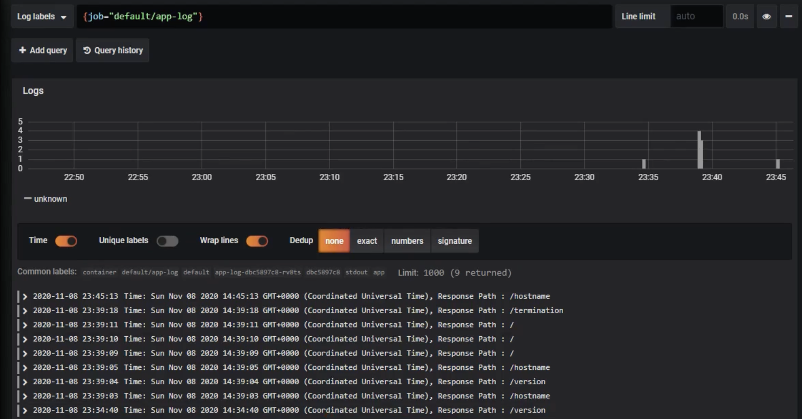

# Logging 실습

먼저 로그를 찍을 파드를 생성하기 위해 다음의 구성 파일로 Deployment를 생성한다

```yaml
apiVersion: apps/v1
kind: Deployment
metadata:
  name: app-log
spec:
  selector:
    matchLabels:
      type: app
  template:
    metadata:
      labels:
        type: app
    spec:
      nodeSelector:
        kubernetes.io/hostname: k8s-node1
      containers:
        - name: container
          image: kubetm/app
```

이제 간단하게 파드의 api를 호출하여 로그를 남기게 한다.

```bash
curl <pod-ip>:8080/hostname
curl <pod-ip>:8080/version
```

먼저 파드에 직접 들어가서 로그 파일이 생성되었는지를 확인한다.  
app.log에 로그가 남고 있다.

```bash
kubectl exec <pod-name> -it -- /bin/sh
cat app.log # 파드 내에서 실행

Time: Sat Nov 07 2023 22:58:48 GMT+0000 (Coordinated Universal Time) Response Path : /version
Time: Sat Nov 07 2023 22:58:48 GMT+0000 (Coordinated Universal Time) Response Path : /hostname
```

해당 앱에서는 stdout으로도 로그를 남기고 있기 때문에 kubectl logs 명령어로 로그를 확인하는것이 가능하다.

```bash
kubectl logs <pod-name>
# 로그를 실시간으로 확인
kubectl logs <pod-name> --tail 10 --follow
```

이번에는 로그를 관리하는 도커 드라이브 설정이 어떻게 되어있는지 확인해보자.  
/etc/docker/daemon.json 에 도커 로그 드라이브 설정을 확인할 수 있다.  
json file 형태로 로그를 저장하고, 최대 100m로 파일을 저장하도록 설정되어 있다.

```bash
cat /etc/docker/daemon.json

{
  "exec-opts": ["native.cgroupdriver-systend"],
  "log-driver": "json-file",
  "log-opts": {
    "max-size": "100m"
  },
  "storage-driver": "overlay2",
  "storage-opts": [
    "overlay2.override_kernel_check-true"
  ]
}
```

이제 도커 드라이버 상에서 저장한 로그 파일을 확인해보자.  
/var/lib/docker/containers경로에 파일이 위치해있다.

```bash
cd  /var/lib/docker/containers
ls
0804463d2b0da71a5644b980657895920da97e79163966339434803bae5831e
8c3069f161352524ee2ca086475249ff6a41572a5b20e38130a09310c10780cf
```

각각의 폴더는 container id가 포함된 uid 형태로 되어 있다.  
docker ps를 통해 원하는 칸테이너의 id를 확인하고, 해당하는 폴더에 들어가면 [uid]-json.log 파일을 확인할 수 있다

이번엔 해당 워커 노드에 링크된 로그 파일을 확인해보자

```bash
cd /var/log/pods
cd <Namespace>_<pod-name>_<pod-id>
cd container
ls -al

0.log -> /var/lib/docker/containers/[uid]-json.log
```

해당하는 폴더의 0.log 파일이 도커에서 저장한 파일에 링크되어 있는 것을 확인할 수 있다.  
/var/log/containers 폴더 하위에도 같은 방식으로 파일들이 링크되어 있다.

이번에는 Termination Log를 확인해보자.  
앱에는 /termination 경로로 요청을 보내면 로그를 남기고 앱이 종료되게 구현되어 있다.

```js
if (path.includes("termination")) {
  try {
    throw new Error("user called process.exit()");
  } catch (e) {
    log_ter.write(e.message);
    process.exit();
  }
}
```

위와 같이 종료된 후에 다음의 커맨드로 pod의 상세 정보를 조회하면 종료 시 찍은 로그가 Message에 남아있다.

```bash
kubectl describe pods <pod-name>

Last State: Terminated
  Reason: Completed
  Message: User called process.exit()
  Exit Code: 0
  Started: Sun, 08 Nov 2023 07:58:14 +0900
  Finished: Sun, 08 Nov 2023 08:27:27 +0900

```

## Loki

이번엔 Loki를 사용해서 로깅을 구성해볼 것이다.  
이 떄 Helm을 이용해서 오브젝트를 설치해야 한다.  
Helm은 여러 쿠버네티스 플러그인들을 묶어서 패키지로 만들 수 있다.  
이를 이용하면 이전에 구성해놓은 쿠버네티스 구성을 손쉽게 설치할 수 있다.

먼저 다음의 커맨드로 Helm을 설치한다.

```bash
# 파일 다운로드
curl -O https://get.helm.sh/helm-v3.3.4-linux-amd64.tar.gz
# 압축 해제
tar -xf helm-v3.3.4-linux-amd64.tar.gz
# 실행 파일 복사
cp ~/linux-amd64/helm /usr/local/bin/
```

위 과정을 마치면 helm 명령어를 사용할 수 있다.

Helm을 이용해서 Loki Stack을 설치하기 위한 패키지를 다운로드 받자.

```bash
# 다운로드 받을 Loki 레포지토리 경로 추가
helm repo add loki https://grafana.github.io/loki/charts
# 패키지 다운로드
helm fetch loki/loki-stack --version 0.41.2

# 패키지 압축 해제
tar -xf loki -stack-0.41.2.tgz
cd loki-stack/

# values.yaml: 어떤 시스템을 설치할지 설정하는 파일
# Grafana를 Enable 설정해야 함
vi values.yaml
```

이제 패키지를 설치할 차례이다.

```bash
# loki-stack 네임스페이스 생성
kubectl create ns loki-stack

# loki-stack 네임스페이스에 패키지 설치
helm install loki-stack -f values.yaml . -n loki-stack

# 패키지 삭제를 원할 경우 커맨드
helm uninstall loki-stack -n loki-stack
```

또한 Grafana를 접근하기 위해서 서비스 타입을 NodePort로 변경해야 한다.

```bash
kubectl edit -n loki-stack svc loki-stack-grafana
----
 type: NodePort
nodePort : 30000
----
```

이제 브라우저에서 http://<node-ip>:30000 로 접속하면 Grafana에 접속할 수 있다.  
admin 사용자의 비밀번호를 확인하기 위해 다음 커맨드를 실행한다.

```bash
kubectl get secret --namespace loki-stack loki-stack-grafana -o jsonpath="{.data.admin-password}" | base64 --decode ; echo
```

이제 Grafana Dashboard를 이용하여 손쉽게 로그를 확인할 수 있다.  
replica가 여러 개의 노드에 분산해서 생성되더라도, 각 노드에 위치한 Promptail이 로그를 수집하여 Loki에 전달하기 때문에, 대시보드에서 손쉽게 모아볼 수 있다.



Promptail의 ConfigMap을 확인하면 /var/log/pods 경로에 위치한 파일들로부터 로그를 읽어오는 설정을 확인할 수 있다.

```yaml
- replacement: /var/log/pods/*$1/*.log
  separator: /
  source_labels:
    - __meta_kubernetes_pod_uid
    - __meta_kubernetes_pod_container_name
  target_label: __path__
```

또한 Promptail의 상세정보에서 loki-stack에 로그를 전달하는 설정을 확인할 수 있다.

```yaml
containers:
  - name: promtail
    image: "grafana/promtail:1.6.0"
    args:
      - "-config.fileqetc/promtail/promtail.yaml"
      - "-client.url=http://loki-stack:3100/loki/api/v1/push"
```
